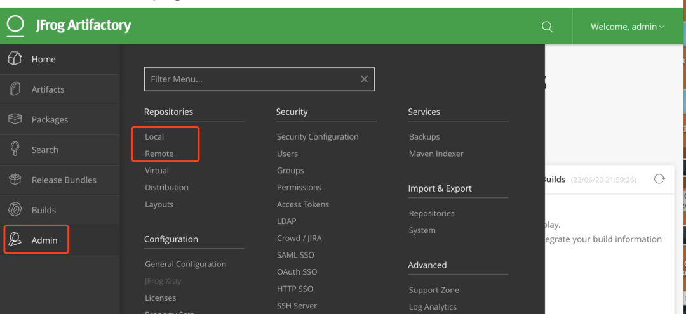
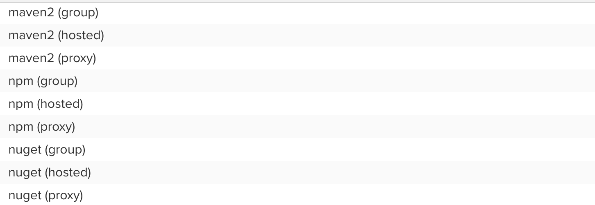
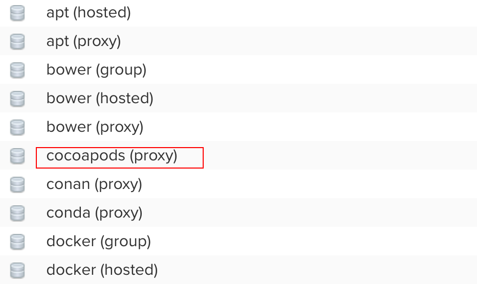
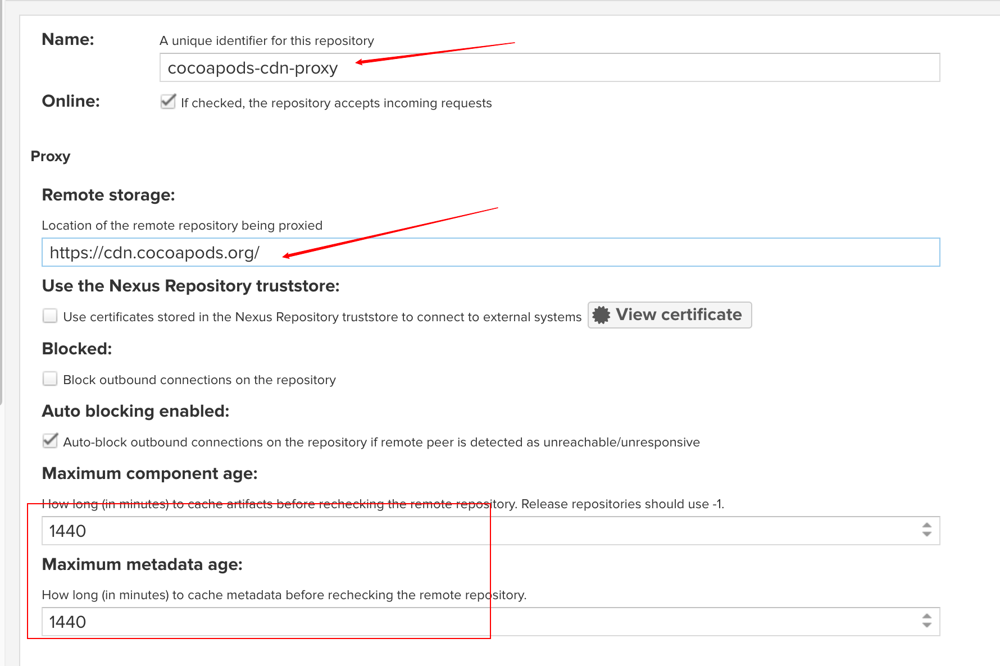
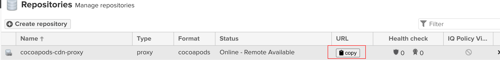
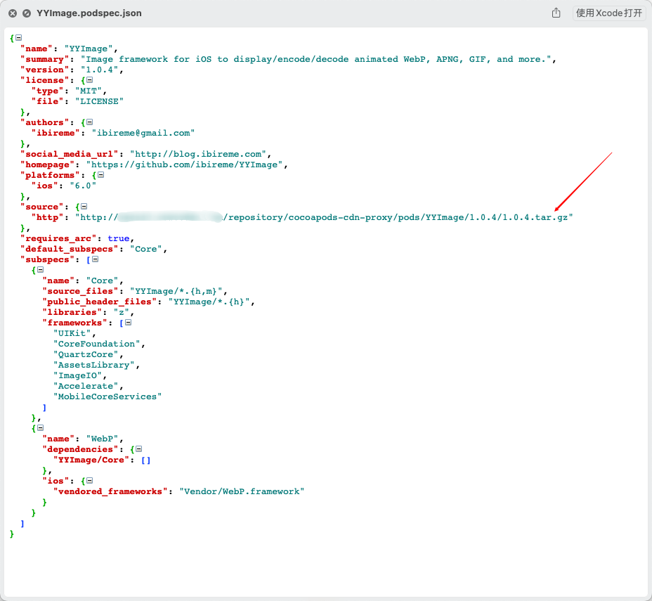
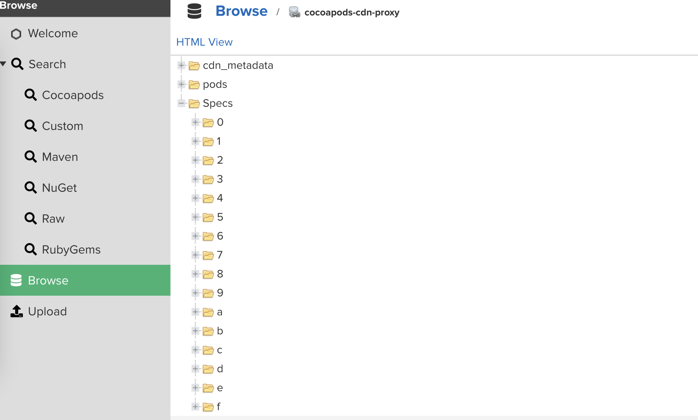
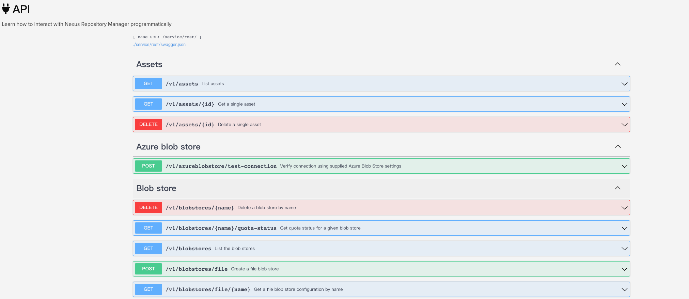

## 前言

Hi Coder，我是 CoderStar！

好久没有输出文章了，好多朋友都开始私信或在群里问我是不是后面不继续更新了。😂，其实不是哈，主要是最近这段时间比较忙，确实没有太多的精力往外输出了。

今天给大家总结一下前段时间关于 CocoaPods 的一些工程实践。

## 包管理器

关于包管理系统，每个语言都会有自己的包管理系统，比如 java 系的 maven、gradle，rust 的 cargo，nodejs 的 npm...

可以说，一个好用的包管理器对一个语言而言是至关重要的，但是说起 iOS 相关语言的包管理器，真是一言难尽，将包完全托管到 Github 上这个方案虽然从节省成本角度而言不乏是个好主意，但是确实也会大幅降低开发者的开发体验，在国内尤甚。

> 吐槽的话就不说太多了，大家都懂的

关于 iOS 相关语言的包管理器，也有好几种

- CocoaPods

使用占比最高，库支持多，但是对项目的侵入性比较强；

- Carthage

库支持较少，侵入性较弱；

- SPM

官方支持，虽然现在还不是很好用，但是随着 Swift 的持续推进，SPM 也是会成为未来的趋势；

目前市面上用的最多的还是 CocoaPods，今天我们也主要谈谈该种方式，另外几种方式，我们后面有机会再继续。

大家都知道，CocoaPods 的远程存储是由一个中心索引库 + 离散化的制品库（git 源，OSS 等等）组成的，最开始中心索引库是一个 Github Repo，但随着库的增多，仓库大小也持续增加。后续 CocoaPods 为了解决这部分的问题，将中心索引库迁移到了 CDN，使中心索引库根据依赖的库进行按需下载。

但是这样也只是解决了中心索引库的下载问题，但是对于索引库依赖的制品库却没有丝毫的帮助，对于绝大部分三方库，我们还是需要从 Github 进行下载，那对于这种问题如何解决呢？

市面上也会有一些方案，比如：

利用 Gitee 进行导入。该种方式会受到 Gitee 平台的限制，还需要配套研发对应的工具去做自动化。从公司的角度去考虑，这种受外部平台限制很大的方案一般都很难去落地。

其他各种加快 Github 访问的方案；

那还有没有更好的方案呢？那就是我接下来要介绍的 Nexus 以及 JFrog 。

## Nexus&JFrog

> 制品库都是 Nexus 和 JFrog 的产品之一，除此之外，还会有其他产品。

- [JFrog](https://jfrog.com/)
- [Nexus](https://www.sonatype.com/products/repository-oss-download)

Nexus 和 JFrog 都是非常优秀的 DevOps 平台。

Nexus 历史较早，我第一次接触 Nexus 的时候我还在写 Java，对于这个平台，相信每一个写 Java 的同学都不会陌生。当时 Nexus 的版本还是 `2.x`，支持的 `format` 也比较少，只支持 `Maven`、`Npm` 等几种常见的 `format`。

JFrog 起步较晚，但有点后来者居上的趋势，功能也比较强大；

总体角度来对比一下：

- JFrog 支持功能更多，需要付费；
- Nexus 有免费的社区版，但支持功能更少一些；

再从 CocoaPods 的实践角度对比下两套平台：

#### JFrog

JFrog 每一个 Repository 默认都会有 Local 以及 Remote 两种类型，CocoaPods 也不例外。

- Local 一般是用来管理我们的二方库；
- Remote 一般是代理其他的制品源，目前 CocoaPods 代理的源只能是 CocoaPods 的 git 源，也就是 [https://github.com/CocoaPods/Specs](https://github.com/CocoaPods/Specs)。

同时 JFrog 也为 CocoaPods 提供了对应的插件 -- [cocoapods-art](https://github.com/jfrog/cocoapods-art)，方便我们在项目中使用；

根据我的试用来看，JFrog 目前的 Remote 代理方式有个比较严重的问题，JFrog 本质上会将 CocoaPods git 索引库以压缩包的方式缓存到其服务器上，我们如果需要对索引库更新，我们需要每次都下载一个全量的压缩包，虽然压缩包尺寸不是特别大，但是后续的解压时间会特别长，根据我的测试，将近半个小时。

也就是说，JFrog 的 Remote 方案还是需要开发者在电脑上维护一个巨大的索引库，同时索引库的更新比默认的 Git 方式更麻烦，效率更低了。

#### Nexus

Nexus 是从 3.x 之后才开始支持 CocoaPods 这种 format，这也是我虽然很久之前就接触过 Nexus，但却没想到用它来当 iOS 制品库的原因。

Nexus Repository 分为三种类型：

- proxy：提供代理其它仓库，类比 JFrog 的 Remote ；
- hosted：本地存储，类比 JFrog 的 Local；
- group：组类型，能够组合多个仓库为一个地址提供服务， 一般是将 proxy 和 hosted 组合，统一对外提供服务，这样使用方就可以只使用一个服务即可；

> Nexus 关于 CocoaPods 的文档可以在 [CocoaPods Repositories](https://help.sonatype.com/repomanager3/nexus-repository-administration/formats/cocoapods-repositories) 查阅。

目前 Nexus 对于 CocoaPods 这种 format 类型，只提供 proxy 类型，同时代理的源只能是 CocoaPods 的 CDN 源，即 [https://cdn.cocoapods.org/](https://cdn.cocoapods.org/) 。

根据对上述两款产品的试用，我们最终选用了 Nexus。

## Nexus Proxy 使用

首先你得有台服务器用来部署 Nexus，至于如何下载，部署这里就不多加赘述了。

部署完毕之后，进去管理页面，然后创建对应的Repository。

两个箭头是要求的必填项，至于方框内部的两个参数分别是组件最大缓存时间以及组件元数据缓存时间。

> 后面这两个参数这里特意标注下，后面还会再提到。

创建成功之后我们就能看到如下列表，点击 Copy 按钮我们就能获得我们这个Repository 对应的地址 URL；

然后将这个 URL 作为 Source 源放到 Podfile 里即可。

OK，就是这么 easy！

## 原理

下面我再来大致讲讲这个 proxy 背后大致的原理。

> 关于 CocoaPods 官方 CDN Source 的原理这里就不赘述了，如果有兴趣可以去看冬瓜的这篇文章 [PodSpec 管理策略](https://mp.weixin.qq.com/s?__biz=MzA5MTM1NTc2Ng==&mid=2458324802&idx=1&sn=dea6f4317864efade0fdfaee4e8c35ab&chksm=870e005bb079894d8b650976ce745798f56b661039ed68527e0415545bf28a72484411dd47f1&scene=178&cur_album_id=1477103239887142918#rd)

我们这个 proxy url 其实本质上也是一个 CDN Source，当我们去访问这个 Source 时，Nexus 会去访问代理的 Source，同时解析访问到的 podspec 文件，提取里面的 source 字段指向的 url，一般就是 github 链接，下载该 url 对应的资源，并将其以压缩包的形式存储到内部缓存中。

然后调整 podspec 的 source 字段，指向内部缓存的 URL，如下图。

> 大家也可以思考下为什么是 tar.gz 这个格式。

这样当我们需要依赖的三方库已经在 Nexus 上缓存之后，我们就可以完全不用去 Github 上下载了，如果没有缓存，Nexus 还需要去 github 上下载了。

> 如果进一步优化的话，我们可以给部署 Nexus 的机器进行 Github 加速，至于加速方案，懂的都懂。

Nexus 上的目录如下图。pods 文件夹下存储的就是各个版本的制品库。

## 注意事项

- 在 Podfile 里面添加了 proxy 源后，最好将官方的 git 以及 cdn 源从 podfile 中移除，即使不移除，也需要将 proxy 源放到官方源的上面，否则可能默认还是会走官方源，代理源就失去了作用；注意检查 Podfile.lock 文件里面，相关库走的 Source URL 是不是代理源；
- 注意不要为了减少下载的文件数量，将官方 CDN 也就是 trunk 源在本地的文件夹里面的文件拷贝到代理源所在文件夹中，上文也提到过两个 Source Spec 文件的 source 字段指向 url 不同，如果你使用这个操作，则会导致依赖的库还是从 Github 下载，达不到我们的期望；
- 因为 CDN Source 的索引管理会分为 all_pods_versions_X_Y_Z.txt 文件以及 X/Y/Z 对应目录下的 spec 文件，但偶尔出现 txt 文件与 spec 文件更新不同步的问题，导致 txt 文件里面有库的对应版本，但是缺没有对应版本的 spec 文件，这样就会导致 spec 找不到，进而相应 pod 操作执行不成功。对应这种情况，我暂时没有找到根治的方式，但可以通过调整上面那两个缓存时间参数来缓解这个问题。

> 这个地方不太清楚的，需要先看下 CDN Source 原理。

## 延伸

刚才上面提到过，JFrog 的 CocoaPods Repository是带有 Local 这种类型，但是 Nexus 的 CocoaPods format 却没有对应的 hosted 类型，也就是说我们无法用 Nexus 直接管理二方库。

虽然 CocoaPods format 没有 hosted 类型，但是 nexus 有一个更通用的 raw format，我们可以简单理解其就是单纯的文件存储 format。我们可以利用这个 format 来管理二方库。

Nexus 提供了丰富、细节的 public API，我们可以借助这些 API 做很多自定义的操作。但是，从便捷性来看，最好还是需要一个 CocoaPods 插件，这个插件我已经写完第一个版本，可以将 Nexus 作为索引库以及二进制库的制品库工具，这个插件在我完善之后也会很快和大家见面。

利用 Nexus 我们可以将不同语言的制品库统一管理，同时也可以解决 CocoaPods 的索引库和制品库统一存储，方便管理，也避免传统的私有索引库一定是一个 git 仓库，继而出现的问题。

同时，借助 Nexus 丰富的 API，我们可以在此基础上再做一些延伸，比如说组件管理平台等。

## 最后

过几天就要过年了，本篇文章也是年前最后一篇文章了，也给伙伴们提前拜早年，祝大家身体健康，升职加薪！！！

要更加努力呀！

Let's be CoderStar!

