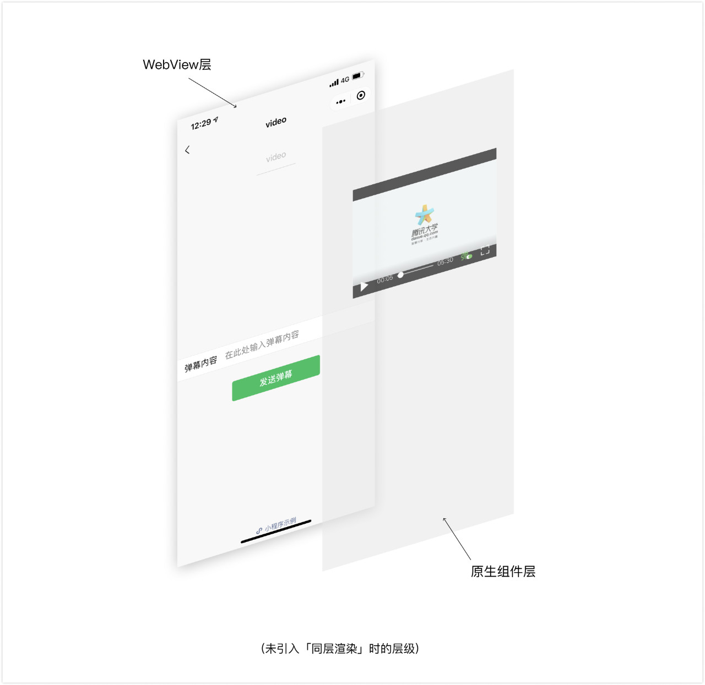
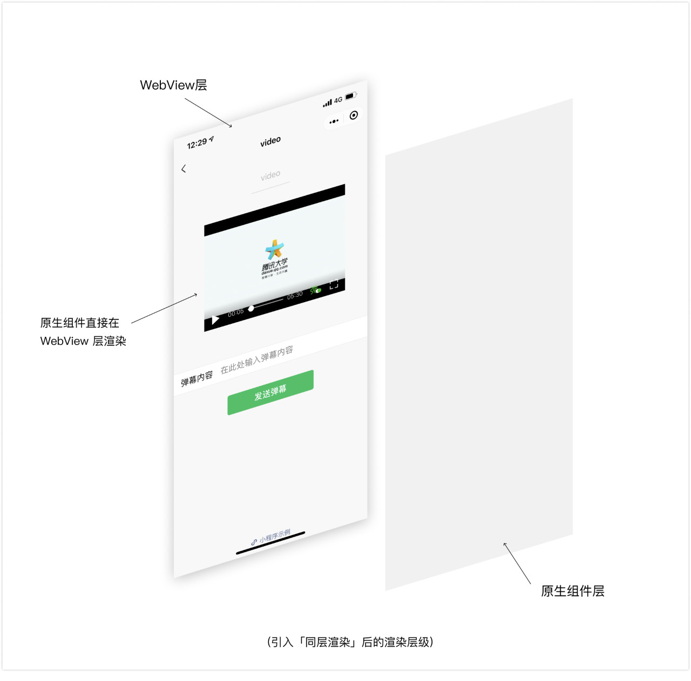
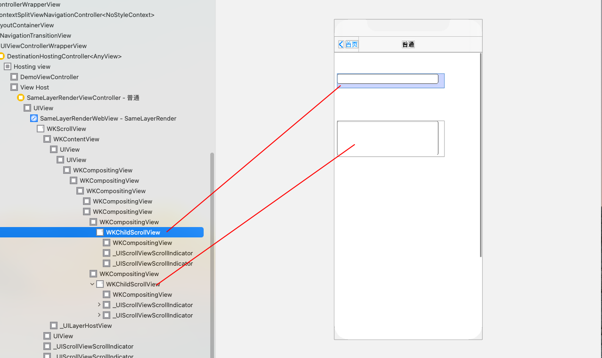
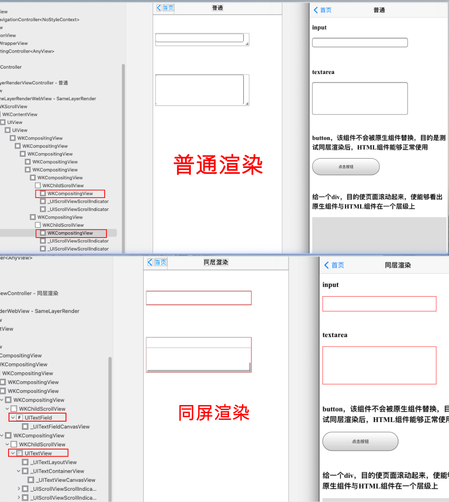

## 前言

可能作为 iOS 开发者，对**同层渲染**这个名词比较陌生，但是如果大家开发过小程序，应该对这个名词就不会陌生，因为小程序中有一类组件叫做原生组件（native-component），比如 `camera`、`video` 等，这类组件在渲染过程中最终会映射成下文提到的原生组件。

在正文开始之前，先给大家统一几个概念，方便后续的阅读。

- 原生组件：iOS、Android 等客户端 Native 组件，如 iOS 中的 `UITextField`、`UITextView`，Android 中的 `EditText`、`ListView` 等；
- H5 组件：是指 HTML5 语言编写的 web 组件，如 `<input/>`、 `<textarea></textarea>` 等；

相比于 H5 组件，原生组件不仅可以提供 H5 组件无法实现的一些功能，还能提升用户体验上的流畅度（特别是对于音视频播放器而言），又因为减少了客户端代码与 WebView 通信的流程，降低了通信开销，简单来说，原生组件功能全、速度快、开销少；

## 应用及概念

任何技术的产生都是伴随着需求或问题，那么同层渲染的产生到底是解决什么问题呢？

我们上文已经提到原生组件比 H5 组件性能更好，所以说对于一些 H5 组件，我们希望其在客户端渲染时被映射成原生组件，那么问题来了：作为客户端来讲，我们一般会采用 WebView 加载 HTML，原生组件脱离在 WebView 渲染流程外，如果把 WebView 看成单独的一层，那么原生组件则位于另一个更高的层级。那么这样的层级就带来了一些问题：
- 原生组件的层级是最高的：页面中的其他组件无论设置 z-index 为多少，都无法盖在原生组件上；
- 部分 CSS 样式无法应用于原生组件；
- 原生组件无法在 scroll-view 等可滚动的 H5 组件中使用：因为如果开发者在可滚动的 DOM 区域，插入原生组件作为其子节点，由于原生组件是直接插入到 WebView 外部的层级，与 DOM 之间没有关联，所以不会跟随移动也不会被裁减。

未同层渲染的层级图如下图所示：



那么为了解决这个问题，便出来了**同层渲染**。其本质就是原生组件可以和 H5 组件可以在同一个层级上显示，使原生组件与 H5 组件可以随意叠加，去除层级限制。像使用 H5 组件一样去使用原生组件，设置组件的样式等等。

同层渲染的层级图如下图所示：


最后上一下淘系前端团队对于同层渲染的定义：

**同层渲染是允许将 Native 组件和 WebView DOM 元素混合在一起进行渲染的技术，能够保证 Native 组件和 DOM 元素体感一致，渲染层级、滚动感受、触摸事件等方面几乎没有区别。**

## 实现原理

本来只讨论 iOS 对于同层渲染的实现原理，对于 Android，大家可以参考相关链接中的《小程序同层渲染原理剖析》。

> WKWebView 在内部采用的是分层的方式进行渲染，它会将 WebKit 内核生成的 Compositing Layer（合成层）渲染成 iOS 上的一个 WKCompositingView，这是一个客户端原生的 View，不过可惜的是，内核一般会将多个 DOM 节点渲染到一个 Compositing Layer 上，因此**合成层与 DOM 节点之间不存在一对一的映射关系**。

> **但是当我们把一个 DOM 节点的 CSS 属性设置为 overflow: scroll （低版本需同时设置 -webkit-overflow-scrolling: touch）之后，并且该 DOM 下有一个高度超过该 DOM 节点高度的子节点，WKWebView 会为该 DOM 节点生成一个 `WKChildScrollView`，与 DOM 节点存在映射关系**。这是一个原生的 UIScrollView 的子类，也就是说 WebView 里的滚动实际上是由真正的原生滚动组件来承载的，WKWebView 这么做是为了可以让 iOS 上的 WebView 滚动有更流畅的体验。

根据 WKWebView 的该特性，我们便可以建立 H5 组件与原生组件之间的映射关系，并且保证原生组件与 H5 组件在同一个层级上。大致流程如下：

1. 前端创建一个 DOM 节点，并设置其 CSS 属性为 `overflow: scroll;`，低版本上同时设置 `-webkit-overflow-scrolling: touch;`，为该 DOM 下插入一个高度超过该 DOM 节点高度的子节点，这一点很重要，否则不会生成；
2. 前端传递给客户端查找到该 DOM 节点对应的 `WKChildScrollView` 原生组件的必要信息；
3. 客户端根据前端传来的相关信息找到对应的原生组件，并将原生组件挂载到对应 `WKChildScrollView` 节点上作为其子 View。



## 代码示例

根据上面的流程估计大家基本上已经有了实现思路，下面咱们一步步的给出关键的代码。

### 1、创建一个可以生成 `WKChildScrollView` 原生组件的 DOM 节点

```html
<div class="native_render native_render_input" native-render-type="input">
   <input style="width: 90%; height: 50%;"/>
   <div class="child">Input区域</div>
</div>
<style>
    .native_render_input {
        height: 40px;
    }

    .native_render {
        overflow: scroll;
        /* 低版本需要 */
        -webkit-overflow-scrolling: touch;
        width: 300px;
    }

    .child {
        visibility: hidden;
        /* 使高度超过父Dom节点高度 */
        height: 200%;
    }
</style>
```

### 2、传递给客户端查找到该 DOM 节点对应的 `WKChildScrollView` 原生组件的必要信息

JS 与 Native 交互的方式有很多种，这里咱们选用 WKWebView 天然支持的 WKScriptMessageHandler 的方式。

```html
<script>
    // 获取需要转换成原生组件的H5组件
    // 并将H5组件的索引、类型、Frame相关信息通知给客户端。
    function insertNativeComponents() {
        var nativeRenderArr = document.getElementsByClassName("native_render");
        for (var i = 0; i < nativeRenderArr.length; i++) {
            var nativeRender = nativeRenderArr[i];
            var type = nativeRender.getAttribute("native-render-type");
            if (!type) continue;
            var frame = nativeRender.getBoundingClientRect();
            var args = {
                "frame": {
                    "top": frame.top,
                    "left": frame.left,
                    "width": frame.width,
                    "height": frame.height
                },
            };
            nativeInvoke(type, i, args);
        }
    }

    /**
     * 将相关信息发送给客户端
     *
     * type: 组件类型，客户端根据该字段生成对应原生组件
     * index：组件索引，客户端根据该字段获取对应的WkWebView
     * args：相关参数，目前携带H5组件的Frame信息
     */
    function nativeInvoke(type, index, args) {
        var platform = "ios";
        if (platform === "ios") {
            try {
                window.webkit.messageHandlers.nativeRender.postMessage({
                    "type": type,
                    "index": index,
                    "args": args
                });
            } catch (error) {
                console.log(error)
            }
        } else if (platform === "Android") {
            //TODO:
        }
    }

    setTimeout("insertNativeComponents()", 100);

</script>
```

### 3、客户端根据传来的信息找到对应的原生组件，并将原生组件挂载到该 `WKChildScrollView` 节点上

```swift

func userContentController(_ userContentController: WKUserContentController, didReceive message: WKScriptMessage) {
    guard let dic = message.body as? [String: Any], let index = dic["index"] as? Int, let type = dic["type"] as? String else {
            return
    }

    if nativeRenderViewArr.isEmpty {
        // 获取所有WKChildScrollView
        for item in webView.getAllSubViews() {
            if let typeClass = NSClassFromString("WKChildScrollView"), item.isKind(of: typeClass) {
                (item as? UIScrollView)?.isScrollEnabled = false
                nativeRenderViewArr.append(item)
            }
        }
    }

    if index >= nativeRenderViewArr.count {
      return
    }

    if message.name == messageHandlerHandler {
        switch type {
        case "input":
            nativeRenderViewArr[index].removeAllSubview()
            textField.frame = nativeRenderViewArr[index].bounds
            nativeRenderViewArr[index].addSubview(textField)
        case "textarea":
            nativeRenderViewArr[index].removeAllSubview()
            textView.frame = nativeRenderViewArr[index].frame
            nativeRenderViewArr[index].addSubview(textView)
        default:
            break
        }
     }
}
```

代码示例只是简单实现同屏渲染的流程，内部有很多需要优化的地方，希望大家多多指教，我自己先说几点吧。

- 替换的平滑过渡，不应出现痕迹；
- 目前 Dom 节点与 WKChildScrollView 的对应关系是通过该 DOM 节点在所在页面的索引值来对应的，这种方式是不合适的；
- 如何实现该组件在普通浏览器下显示成 H5 组件，在客户端有 SDK 支持下显示成原生组件，做到无缝切换；
- ...

具体 Demo 示例可见 [SameLayerRender](https://github.com/Coder-Star/SameLayerRender)

### 效果对比



## 最后

最后，祝大家周末愉快！

Let's be CoderStar!

相关链接
- [小程序同层渲染原理剖析](https://developers.weixin.qq.com/community/develop/article/doc/000c4e433707c072c1793e56f5c813)
- [【走进小程序原理】揭秘组件同层渲染](https://blog.csdn.net/Smartprogram/article/details/108124407)
- [亿级用户高稳定性视频播放器养成计划|618淘系前端技术分享](https://mp.weixin.qq.com/s/jgsG-XrAKV6AHSrUCRhKtQ)
