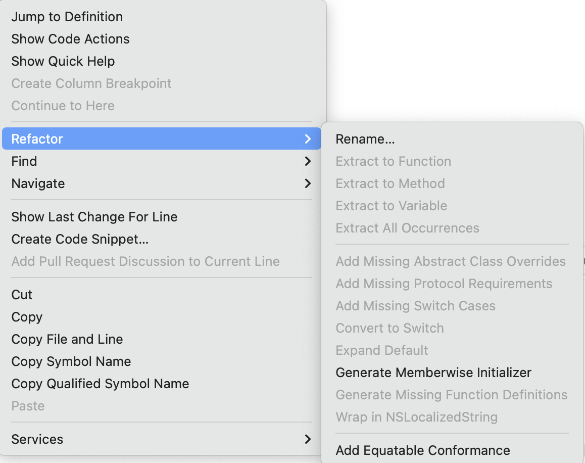
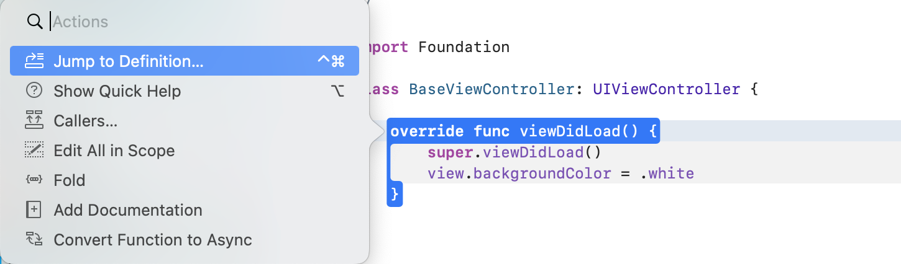
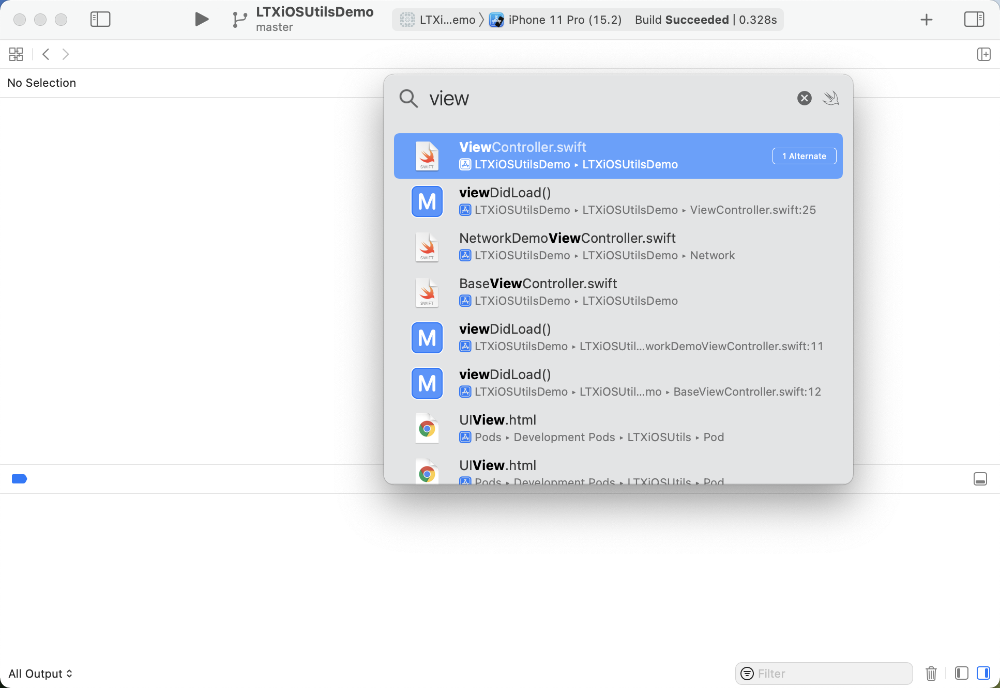
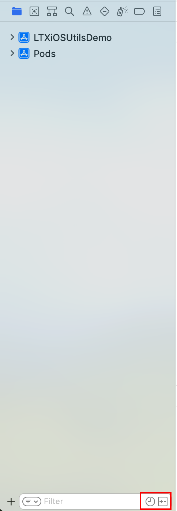
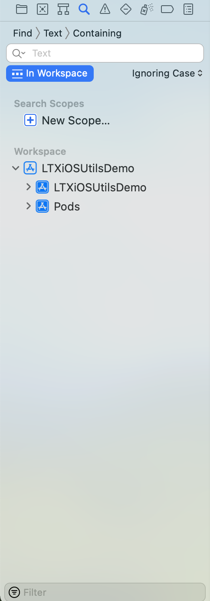
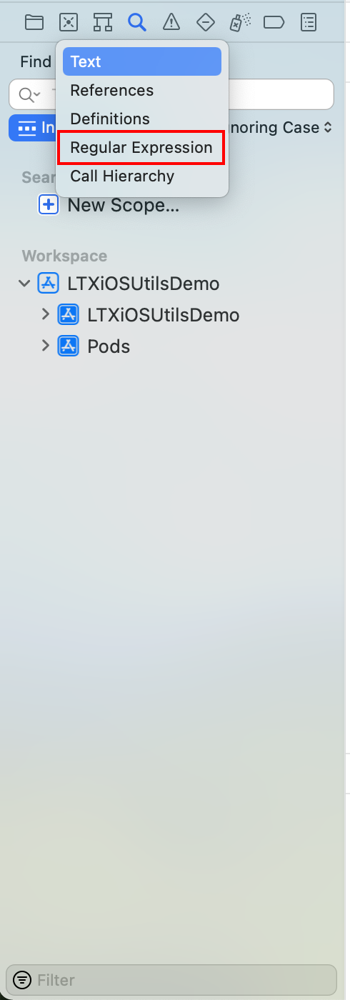

## 前言

Hi Coder，我是 CoderStar！

今天我们不聊技术原理，咱们聊点简单轻松的，也就是我们 `iOSer` 几乎每天都会用到的 `Xbug`。`Xcode` 虽然确实会有很多 `Bug`，一些设计也不如 `JB` 家做的好，但是还是有一些可取之处的，比如页面简洁...，嗯...，好像就这一个？

哈哈，简单开个玩笑，回到正题。虽然我们经常使用 `Xcode`，但是有些功能还是需要我们自己特意去发现一下。今天我们就来聊聊 `Xcode` 的一些 `Tips`。

> 本文涉及的 `Tips` 主要是一些相对通用的，还有一些相对专一点的，比如断点、`Instruments` 等后面再单独介绍。有些 `Tips` 可能对于老司机们已经习以为常了，还望不要嫌太低级，如果还有一些文中没有体现的 `Tips`，还望指教。

## 编辑相关

### `Refactor`

我们把光标放在类上或者方法上右键选中 `Refactor`，其会显示出对其光标处可以进行的自动补全的一些操作；如下图所示：

大家根据名字就能看出来支持的一些操作了，基本上都是些很常用的功能。比如说

- `Rename`：将光标选中处涉及到所有的统一进行改名；
- `Generate Memberwise Initialzer`：利用这功能，当我们利用非常多属性的类 / 结构体时，就可以使用这个快速生成构造函数了；
- `Add Missing Switch Cases`：填充缺失的 `case`，虽然说 `Xcode` 会自动提示 `Fix` 补全，但是在电脑提示较慢的时候还是很难受的；
- ...

### `Actions`

还是将光标放到类或者方法上，然后 `command` + `左键`，就会出现下列的 `Actions` 选项，看名字大家就知道大概支持哪些操作。

> 之前还有小伙伴在群里抱怨 `Xcode` 没有 `Callers` 的功能，这不是来了嘛...

其中 `Edit All in Scope` 快捷键为 `control` + `command` + `e`

使用 `option` + `左键` ，会显示相应的 `Quick Help`，也就是可以看到光标选中的相关提示，如果是系统相关的类或方法，还可以通过其进入到对应的 `Developer Documentation`。

使用 `control` + `command` + `左键`，会直接跳转到光标选中处的相关实现里面去。

### `Navigate to Related Items`

大家可以很少关注上图所示的按钮，其实这个地方能提供很多有用的功能。

- `Generated Interface`：该功能可以查看 OC 的 `.h` 文件生成对应的 `.swift` 文件是什么样子，在处理混编时候比较常用；
- `Preprocess`：对 OC 代码进行预编译；

快捷键：`control` + `1`

### `Check Spelling`

这项功能为 `Xcode` 的拼写检查，开启方式为

`Edit` > `Format` > `Spelling and Grammar` > `Check Spelling While Typing`。

当开启之后，我们在代码编辑过程中出现错误单词后，`Xcode` 会将该单词下面加上红色波浪线，点击邮件并出现推荐的单词以及一些操作。

> 红色波浪线错误单词为 `Infoo`。

### `Code Snippet`

这是我们一定要利用起来的东西，良好、丰富的代码块可以有效提高我们代码的编写速度。

其中我们在保存一些代码段的时候可以需要留下一些变量等到使用时再填写上，我们可以使用 `<#placeholder#>` 这样的方式来留下待填充值。

我们编写的代码段保存路径为：

`~/Library/Developer/Xcode/UserData/CodeSnippets`

主题路径

`~/Library/Developer/Xcode/UserData/FontAndColorThemes`

我们可以使用一些云同步方式对其进行同步，方便复用。

顺便提一下我们新建文件的模板文件路径为：

`/Applications/Xcode.app/Contents/Developer/Platforms/iPhoneOS.platform/Developer/Library/Xcode/Templates/File Templates/iOS/Source`

### `Fix All Issues`

程序出现多个错误时，可以选择 `Editor` —> `Fix All Issues` 修复多个错误。

快捷键为：`control` + `option` + `command` + `F`

### 其他

- 可以使用 `control` + `I` 快捷键盘来重新调整所选代码的缩进，但其能力有限，如果你使用的是 Swift 开发语言，建议使用 `SwiftFormat for Xcode`；
- 可以使用 `command` + `+`/`-` 来调整编辑区域代码的字体大小，在代码演示时比较常用；
- 可以使用 `command` + `option` + `[`/`]` 来向上或向下移动所选代码行，这个操作在操作 `SwiftUI` 描述符时非常常用；
- 可以使用 `command` + `option` + `/` 为方法添加注释，这也是我们通过 `Quick Help` 看到的内容。这个功能在 `Xcode` 13 以上略微有点小 bug；
- 可以使用 `shift` + `control` + `左键` 来实现多行光标，即同时在文件不同位置编写相同内容；
- 可以使用 `control` + `command` + `↑` 来实现 `.m` 文件与 `.h` 之间来回切换，避免繁琐的查找；
- 将选中的结构定义在辅助编辑器打开，选中结构，使用 `option` + `右键`，这样可以方便比对，避免回来切换；
- ...

## 导航

### `Open Quickly`

`command` + `Shift` + `O`，该快捷键会打开一个 `Open Quickly` 窗口，使我们能够搜索几乎所有内容，包括文件、类型、方法、函数和属性。

### `Reveal in Project Navigator`

`command` + `Shift` + `J`，该快捷键会将你当前打开的文件在左侧导航定位到，方便查到该文件所在位置。

### 搜索

`Xcode` 里面的搜索方式相对来说会比较多，不管是导航器底部的文件筛选还是全局筛选可调整的 `Scope`，或者是使用正则表达式的筛选方式。

| 导航筛选                         | 调整 `Scope`                   | 正则表达式                        |
| ---------------------------- | ---------------------------- | ---------------------------- |
|  |  |  |

> 有的时候我们全局搜索完成之后在看到一些搜索项不是我们想要的时候，可以直接删除键将搜索结果删除掉，避免影响我们，当然这个删除只是对搜索结果的删除而已，不会对文件或者内容产生什么影响。

## 其他

### 获取 Build Setting 对应的环境变量 Key

共有两种方式：

1. 选中该配置项，展开右部侧边栏，选中点击帮助按钮就能够看到这个配置的说明和对应的环境变量名称。
2. 选中该配置，按住 Option 键，双击该配置，会出现一个描述该选项的帮助卡片，这个内容与上面的帮助侧边栏内容一致。

## 模拟器相关

### Debug 操作

模拟器 `Debug` 下这三个功能比较常用，其中从上到下依次：

1. 将动画变慢，可以更好看清动画的动作；
2. 检测图层混合；
3. 检测离屏渲染；

### `Environment Overrides`

我们可以在 `Xcode` 里面通过设置 `Environment Overrides` 来调整模拟器的一些设置，如浅 / 深色模式、字体大小等，而不是再去模拟器进行设置。

## 参数配置

- 关闭 `Xcode`，打开终端输入 `defaults write com.apple.dt.Xcode ShowBuildOperationDuration YES`，然后项目 `Build` 的时候可以在 `Xcode` 顶部看到项目编译时间；
- 进入 `Product` > `Scheme` > `Edit Scheme...` > `Run` > `Arguments` > `Environment Variables`，然后设置 `OS_ACTIVITY_MODE` 值置为 `Disable`，该操作可以禁止控制台打印 `NSLog`，但不可以禁止 `print()`；

## 最后

其实不管是 `Xcode` 还是我们平时开发过程中用到的其他 `IDE`，我们应该去主动发掘其的一些隐藏功能，有可能一个小的发现就能帮我们解决过去很不方便的问题。

顺便列几个专门是说明 `Xcode` 的 `Tips` 的网站，特别是第一个，比较有意思。

- [xcode.tips](https://xcode.tips/)
- [xcode-tips](https://xcode-tips.github.io/)
- [xcodetips](http://xcodetips.com/)

要更加努力呀！

Let's be CoderStar!
