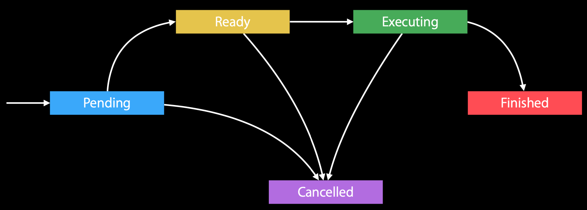

## 前言

Hi Coder，我是 CoderStar！

我们之前已经讲过 [iOS多线程-Thread](../iOS多线程-Thread) 以及 [iOS多线程-GCD](../iOS多线程-GCD)，我们今天来聊一聊iOS多线程中最后一种比较常用的方式--`Operation`。

## 概览

对于 Operation 而言，其相关的类比 GCD 要少的多。`Operation`本身是一个`抽象类`，不能直接进行使用，其定义了相关的方法及属性，需要靠子类进行相应的实现，系统已经实现了一个 --`BlockOperation`。（在 OC 中，还有一个是`NSInvocationOperation`，但在 Swift 中，该子类已经在 Swift4 里去掉，想必去掉的原因大家也很容易理解，因为 Swift 语言本身就不推荐 `selector` 这种形式）。

`Operation` 底层建立在`GCD`之上，是更高一级的抽象，使我们可以面向对象（Cocoa 对象）的方式进行多线程编程。

> 其实 `NSOpertion` 是先于`GCD`引进的，在当时，`NSOperationQueue` 接收 `NSOperation` 对象并创建一个线程，然后在该线程上运行 `main`方法 ，运行完成之后再杀死该线程。这种方式相对于后面出现的`GCD`底层的线程池而言，效率就很低，所以在 Mac OS 10.5 以及 iOS 2 开始便对`NSOpertion`底层在基于`GCD`的基础上进行完全重写，利用`GCD`的相关特性提高性能并提供了一些新功能。如果想简单佐证下，可以看到`OperationQueue`拥有一个`unowned(unsafe) open var underlyingQueue: DispatchQueue?`属性。

如果大家对Operation底层实现比较有兴趣，可以在开源的Foundtion框架中查看[Operation.swift](https://github.com/apple/swift-corelibs-foundation/blob/main/Sources/Foundation/Operation.swift)。

## 基本原理

先罗列一下`Operation`及`OperationQueue`主要的属性及方法。

> 注释会有相应说明。

### Operation

``` swift
// Operation

// MARK: - 属性

/// 下列几个属性为Operation的状态，只读属性

open var isReady: Bool { get }
open var isExecuting: Bool { get }
open var isCancelled: Bool { get }
open var isFinished: Bool { get }


/// 该属性已经被下列isAsynchronous属性替代
open var isConcurrent: Bool { get }

/// 用来标识当前操作是否为异步
/// 需要注意该属性是当直接调用start方法时才会生效，但添加Operation到OperationQueue，队列将忽略该属性的值
/// 默认值为false
@available(iOS 7.0, *)
open var isAsynchronous: Bool { get }


/// 操作优先级
/// 当队列中operation很多时，我们可以通过设置该属性来调整Operation在 同一队列中 的优先级，同时这个前提是Operation都是处于readey状态ati
open var queuePriority: Operation.QueuePriority

/// 该属性与Thread所拥有的服务质量等级属性一致
/// 主要用来描述任务在进程中整体的优先级
@available(iOS 8.0, *)
open var qualityOfService: QualityOfService

/// 任务完成后的回调方法
/// 当isFinished属性设置为YES时才会执行该回调
@available(iOS 4.0, *)
open var completionBlock: (() -> Void)?

// MARK: - 方法

/// 启动
/// 并发Operation时需要重写该方法
/// 可以不把operation加入到队列中，手动触发执行，与调用普通方法一样
open func start()

/// 非并发Operation需要重写该方法
open func main()

/// 取消操作
open func cancel()

/// 添加依赖
open func addDependency(_ op: Operation)

/// 移除依赖
open func removeDependency(_ op: Operation)
```

对`Operation`几个属性、方法再进行详细的说明：

`cancel`方法
如果这个操作正在执行，调用 `cancel()` 只会将状态 `isCanceled` 置为 `true`，但不会影响操作的继续执行。
如果操作还没执行，调用 `cancel()` 会将状态 `isCanceled` 和 `isReady` 置为 `true`, 如果执行取消后的操作，会直接将状态 `isFinished` 置为 `true` 而不会执行操作。也会触发`completionBlock`方法。
所以当我们子类化`Operation`的时候在处理耗时以及启动等相关操作时，应先检查`isCanceled`状态。

`addDependency`方法
- 需要注意在设置时不要设置成循环依赖，比如 A 依赖 B、B 又依赖 A，这样会形成死锁，导致谁也不会执行。
- 可以跨操作队列设置依赖。
- 当给某个 `Operation` 添加依赖的 `Operation` 后，只有其所依赖的所有 `Operation` 都执行完毕，当前的 `Operation` 才能开始执行。不管依赖的 `Operation` 是执行成功了还是失败了，或者是取消了，都认为是执行完毕了。

**OperationQueue**

``` swift
// Operation

// MARK: - 属性

/// 最大并发操作数，也就是该队列中最多允许几个Operation在同时运行
open var maxConcurrentOperationCount: Int

// MARK: - 方法

/// 取消所有操作
open func cancelAllOperations()

/// 调用该方法会阻塞当前线程，等待所有任务完成之后才会执行后续逻辑
/// 和 DispatchGroup 一定条件下是类似的
open func waitUntilAllOperationsAreFinished()

/// 添加 Operation
open func addOperation(_ op: Operation)

/// 闭包形式添加 Operation
@available(iOS 4.0, *)
open func addOperation(_ block: @escaping () -> Void)

/// 类似 GCD 的栅栏函数
@available(iOS 13.0, *)
open func addBarrierBlock(_ barrier: @escaping () -> Void)
```

对`OperationQueue`几个属性、方法再进行详细的说明：

`maxConcurrentOperationCount`属性
- maxConcurrentOperationCount 如果不设置值时，默认值会取`defaultMaxConcurrentOperationCount`，也就是 -1，此时默认最大操作数由 `OperationQueue` 对象根据当前系统条件（系统内存与 CPU）动态确定。
- `maxConcurrentOperationCount` 为 0 时，队列中的 Operation 不会执行。
- `maxConcurrentOperationCount` 为 1 时，队列串行执行。
- `maxConcurrentOperationCount` 大于 1 时，队列并发执行，当然这个值不应超过系统限制，即使自己设置一个很大的值，系统也会自动调整为 min(自己设定的值，系统设定的默认最大值)，系统默认限制应该是 **64**。

> 需要注意，因为有`queuePriority`的存在，同一个 `Queue` 的 `Operation` 之间有优先级，所以先进入 Queue 的 `Operation` 不一定先运行，所以当`maxConcurrentOperationCount`设置为 1 时并不是一个真正意义上的串行队列，优先级较高后加入的 `Operation` 有可能会先执行。

> 64 这个值在 GCD 下应该也是默认最大线程数，但是可以调整目标队列的优先级进行调整。这里涉及到一个线程爆炸的概念，后面可能还会出一篇文章写这些东西。

从上面 `Operation` 的几个状态属性我们可以知道 `Operation` 在程序运行过程中状态会进行相应的流转，其状态图如下所示。

## 使用

对于一般的任务，我们可以直接使用`BlockOperation`。使用示例如下：

```swift
let operation = BlockOperation {
  // do something
}

// BlockOperation并不是只能执行一个Block，而是可以添加多个，内部会有一个数组进行存储。
operation.addExecutionBlock {
   // do something
}

let queue = OperationQueue()
queue.addOperation(operation)
```

但是很多时候，我们需要继承`Operation`进行一些自定义操作，如网络请求的依赖。这时，我们需要继承`Operation`重写对应的属性与方法来实现。

> 网络请求的依赖为何需要子类化 Operation：普通的`Operation`等待 `main` 方法执行完毕之后就会自动将`isFinished`置为`true`，继而执行下一个，但是对于网络请求这种场景，我们需要手动控制，等待网络请求回调之后再将`isFinished`置为`true`。

> 这部分内容，Apple的文档上有详细的介绍，[Operation文档链接](https://developer.apple.com/documentation/foundation/operation)

除了将`Operation`放入`OperationQueue`运行这种方式之外，还可以直接调用`start`方法进行运行。

对于第一种方式，`OperationQueue`会自动为`Operation`开辟线程，不需进行额外的处理，对于第二种方式，就需要我们手动进行控制，我们可以将操作设计为同步或者异步的，也就是所谓的非并发`Operation`以及并发`Operation`

> 当然，其实直接调用`start`方法这种方式在日常开发过程中用的比较少的，主要是使用`OperationQueue`这种方式。下列部分主要是给大家拓宽一下 `Operation` 的使用方式以及了解当子类化 `Operation` 时我们需要注意的地方。

`Operation` 内部本身是线程安全的，当我们子类化 `Operation` 时，不管是非并发 `Operation` 还是并发 `Operation`，我们也需要保证其线程安全，所以需要在一些地方加上互斥锁，如后续操作中的状态切换时。

### 非并发 `Operation`

对于非并发 `Operation`，因为 `Operation` 在默认情况直接调用`start`方法是一个同步操作，所以当我们继承 `Operation` 来实现一个非并发 `Operation` 时，我们只需要重写`main`方法。

```swift
class SyncOperation: Operation {
    override func main() {
        // do something
    }
}
```

### 并发 `Operation`

如果是并发 `Operation`，则至少需要重写以下属性及方法，并且运行状态更新时需要生成 KVO 通知。

- isAsynchronous
- isExecuting
- isFinished
- start()

具体代码如下，请注意阅读注释：

```swift
public class AsyncOperation: Operation {
    private var block: ((_ operation: AsyncOperation) -> Void)?

    private let queue = DispatchQueue(label: "async.operation.queue")
    private let lock = NSLock()

    private var _executing = false
    private var _finished = false

    /// 数据
    ///
    /// 为Operation绑定一下数据，方便被依赖的Operation获取该Operation处理后的一些数据
    public var data: Any?

    /// 是否执行
    ///
    /// 内部加锁保证线程安全
    public override var isExecuting: Bool {
        get {
            lock.lock()
            let wasExecuting = _executing
            lock.unlock()
            return wasExecuting
        }
        set {
            if isExecuting != newValue {
                willChangeValue(forKey: "isExecuting")
                lock.lock()
                _executing = newValue
                lock.unlock()
                didChangeValue(forKey: "isExecuting")
            }
        }
    }

    /// 是否结束
    ///
    /// 内部加锁保证线程安全
    /// 需要手动进行KVO，否则completionBlock不会被触发，被依赖的Operation也不会开始
    public override var isFinished: Bool {
        get {
            lock.lock()
            let wasFinished = _finished
            lock.unlock()
            return wasFinished
        }
        set {
            if isFinished != newValue {
                willChangeValue(forKey: "isFinished")
                lock.lock()
                _finished = newValue
                lock.unlock()
                didChangeValue(forKey: "isFinished")
            }
        }
    }

    /// 标识该Operation是否以异步形式运行
    public override var isAsynchronous: Bool {
        return true
    }

    public override func start() {
        /// 启动之前先判断是否已取消，防止浪费操作
        if isCancelled {
            isFinished = true
            return
        }

        isExecuting = true

        queue.async { [weak self] in
            self?.main()
        }
    }

    public override func main() {
        if let block = block {
            block(self)
        } else {
            finish()
        }
    }
}

// MARK: - 公开方法

extension AsyncOperation {
    public convenience init(block: ((_ operation: AsyncOperation) -> Void)?) {
        self.init()
        self.block = block
    }

    /// 完成任务
    ///
    /// 完成一些异步操作后再手动调用完成 Operation
    public func finish() {
        isExecuting = false
        isFinished = true
    }
}
```

代码中几个地方需要特别说明一下：

1. 状态变量切换时，为保证线程安全，我们需要进行加锁；
2. 虽然官方文档说`main`方法不需要强制进行重写，但为了逻辑性，`start`方法主要负责任务的启动，`main`方法中进行任务的处理，所以重写的`main`方法。
3. 关于`isAsynchronous`属性，刚开始我以为其可以控制`Operation`是否自动开辟线程，但是根据实验以及查看源码之后，发现其应该只是一个标识当前`Operation`是否是异步操作的一个标志而已，当设置为 `true` 时，我们需要自己开辟线程进行任务的分发。当我们确定该`Operation`后续都是以`OperationQueue`的形式运行，我们也可以将`isAsynchronous`返回值改为 false，去除内部的队列。

关于 `Operation`的具体应用，大家可以去阅读`Alamofire`或者`SDWebImage`等开源库的源码，内部都有其应用。

## GCD VS Operation

使用 `GCD` 还是使用 `Operation` 这个问题其实在社区已经争论了很久，从斯坦福大学的 CS193p 课程推荐使用 `GCD`，到 WWDC 2012 时演讲者推荐使用`Operation`，也能看出开发者对该问题的看法不一致，该节我们主要来聊一聊两者各自优势以及差别。

> 目前网络上的很多文章都是基于没有`DispatchWorkItem`对象前提下对 GCD 和`Operation`做的对比，大家阅读时需要注意一下。

1、从两者所在层次来讲：GCD 底层是 C 语言的 API，而 Operation 是 GCD 基础上更高层次的抽象，那 GCD 相对 Operation 来说肯定是又快又轻的。（Operation 在使用 GCD API 的基础上还会加上一些锁用来保证线程安全）

但是反过来说因为 Operation 是更高层次的抽象，按照一般的经验法则来看，**我们应首先使用最高级别的 API，然后在根据需要完成内容进行降级**。从这一角度来看，使用 Operation 抽象度更高，更符合面向对象的思想，也有利于底层的无痕变更。

2、从两者提供的 API 来讲：其实 GCD 和 Operation 两者之间是很相似的，特别是当`DispatchWorkItem`对象（@available(macOS 10.10, iOS 8.0, *)）出来之后，从一定意义上讲，`DispatchWorkItem`可以类比到`Operation`对象，`DispatchQueue`可以类比到`OperationQueue`对象。比如`DispatchWorkItem`和`Operation`对象都可以进行`cancel`等操作，`DispatchQueue`、`OperationQueue`对象都可以添加任务或操作（对象以及闭包两种形式），栅栏函数，进行挂起以及恢复（前者是两个对应方法，后者是一个属性）等。但两者还是有一些区别的，比如：

- `OperationQueue`可以设置并发操作的最大数量`maxConcurrentOperationCount`。
  > 在一定条件下可以类比到 GCD 的信号量
- 在不同的任务之间建立依赖关系`addOperation`；
  > 在一定条件下可以类比到 GCD 的 `DispatchWorkItem`的`public func notify(queue: DispatchQueue, execute: DispatchWorkItem)` 方法
- `OperationQueue`可以取消队列中的所有操作。
- ...

3、相对 `GCD` 而言，`Operation`可以通过子类化的方式将一些操作内聚，更方便管理。

## 最后

要更加努力呀！

Let's be CoderStar!

推荐学习资料

- [NSOperation vs Grand Central Dispatch](https://stackoverflow.com/questions/10373331/nsoperation-vs-grand-central-dispatch/10375616#10375616)
- [guide-to-blocks-grand-central-dispatch](https://cocoasamurai.blogspot.com/2009/09/guide-to-blocks-grand-central-dispatch.html)
- [When to use NSOperation vs. GCD](http://eschatologist.net/blog/?p=232)
- [Operation and OperationQueue Tutorial in Swift](https://www.raywenderlich.com/5293-operation-and-operationqueue-tutorial-in-swift)
- [Advanced NSOperations](https://developer.apple.com/videos/play/wwdc2015/226/)
