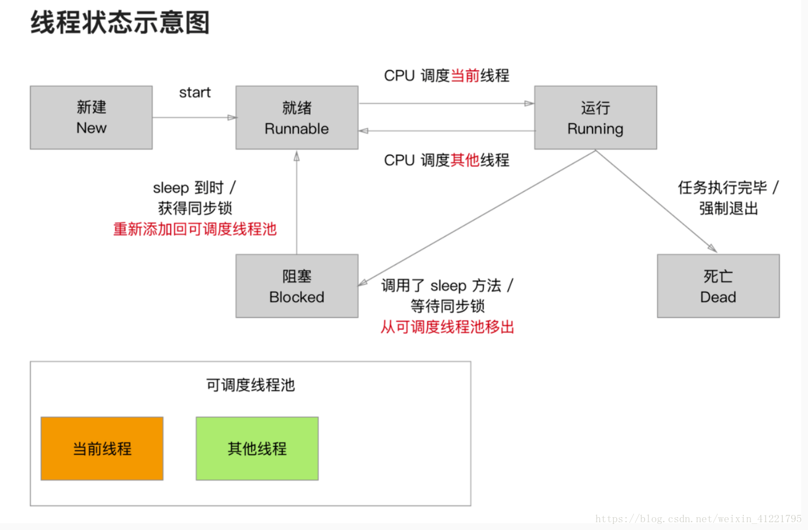

## 前言

Hi Coder，我是 CoderStar！

多线程是 iOS 中一个重要的知识点，常见的技术包含

- Thread
- GCD
- Operation
- Pthreads

其中前三种方式我们比较常用，其中 GCD、Operation 使用的最频繁。Pthreads 是基于 C 语言的框架，可以跨平台使用，我们平时使用比较少。

作为多线程系列的开篇，今天我们先来讲讲 Thread，虽然它用的比较少也比较简单，但还是需要我们掌握了解的。

Thread 相对 GCD、Operation 而言使用起来比较轻量级。其管理的基本单位就是线程，每一个 Thread 都对应一个线程。
需要自己管理线程的生命周期、线程同步、加锁、睡眠以及唤醒等。

## Thread 的创建方式

Thread 的创建有多种方式。

### 类方法

```swift
@available(iOS 10.0, *)
open class func detachNewThread(_ block: @escaping () -> Void)

open class func detachNewThreadSelector(_ selector: Selector, toTarget target: Any, with argument: Any?)
```

类方法创建的线程自动运行，通过这种方式我们无法对 Thread 属性进行一些自定义的设置，如 `name`、`threadPriority` 等。

### 实例方法

```swift
@available(iOS 2.0, *)
public init()

@available(iOS 2.0, *)
public convenience init(target: Any, selector: Selector, object argument: Any?)

@available(iOS 10.0, *)
public convenience init(block: @escaping () -> Void)
```

实例方法创建的线程需要手动调用 start 方法才能运行，在 start 之前我们可以给 Thread 属性进行一些设置。

### 使用 NSObject 的拓展方法

这也是使用 Thread 进行线程切换的系列方法。

```swift
extension NSObject {
  open func performSelector(onMainThread aSelector: Selector, with arg: Any?, waitUntilDone wait: Bool, modes array: [String]?)

  open func performSelector(onMainThread aSelector: Selector, with arg: Any?, waitUntilDone wait: Bool)

  @available(iOS 2.0, *)
  open func perform(_ aSelector: Selector, on thr: Thread, with arg: Any?, waitUntilDone wait: Bool, modes array: [String]?)

  @available(iOS 2.0, *)
  open func perform(_ aSelector: Selector, on thr: Thread, with arg: Any?, waitUntilDone wait: Bool)

  @available(iOS 2.0, *)
  open func performSelector(inBackground aSelector: Selector, with arg: Any?)
}
```

### 继承 Thread

Thread 可以进行继承，重写 main 方法，同时不需在 main 方法中调用父类 main 方法。

```swift
MyThread().start()

class MyThread: Thread {
    override func main() {
        // do something
    }
}

```

## 线程生命周期

线程的生命周期分为下列几种：

- 创建：实例化一个线程对象。
- 就绪：将线程对象添加到可调度线程池，等待 CPU 调用；
- 运行：CPU 从可调度线程池中选中线程进行调用，当前选中的线程为运行状态，未选中的重新变为就绪状态，此步程序员无法控制，由系统来处理；
- 堵塞：线程休眠处理。线程 sleep、加了同步锁的对象正在被其他线程操作时，线程也会进入休眠；
- 死亡：当线程需要执行的代码块执行完，或者线程强制退出，线程结束。



类比到 Thread，会有相应的方法与之对应。

方法 | 类型 | 作用
---------|----------|----------
start | 实例方法| 启动
cancel| 实例方法| 暂停
exit | 类方法 | 取消
sleep| 类方法 | 阻塞

补充说明：

**start**

thread 调用 start 方法后，其实并不是马上就开始运行了。实质上是放进了可调度线程池，等待被 CPU 调用。线程执行结束之前，状态可能会在就绪状态 和 运行状态 之间来回的切换。就绪状态 和 运行状态 之间的状态切换由 CPU 来完成, 程序员无法干涉。

**cancel**

并没有真正的取消线程，只是打了一个标志（通过 isCancelled 方法可以获取到）。一般我们需要在进行大量操作前判断一下标志，避免线程已经被取消了，还运行一些计算的现象产生。

**exit**

- 不要在主线程中进行调用，否则会出现 `Terminating app due to uncaught exception 'NSInternalInconsistencyException', reason: 'Call must be made on main thread'`。
- 其会终止通过 current 方法获取到的线程。同时，苹果建议应避免调用此方法，因为它不会让您的线程有机会清理它在执行期间分配的任何资源。
- 调用这个方法之前，一定要注意释放之前由 C 语言创建的对象，不然会造成内存泄漏等问题。

**sleep**

目前只能控制其休眠多长时间或休眠到什么时间，外部无法手动唤醒。如果想实现手动唤醒的效果，可以考虑使用 `NSCondition`，后面也会对其单独介绍。

## Thread 的常用属性 / 方法

介绍几个属性 / 方法

- name：给线程命名，方便查找
- stackSize：栈区大小，看看线程在栈区占了多大空间
- isMainThread：是否是主线程，比较常用
- threadPriority：线程的优先级，由 0.0 到 1.0 之间的浮点数指定，其中 1.0 是最高优先级，因为语义不够清晰，已经即将被弃用了，跟有注释 `// To be deprecated; use qualityOfService below`，但是 Swift 源码没有相应注释，只有 OC 中有。
- qualityOfService：服务质量，一个枚举类型（`QualityOfService`），iOS8.0 推出，为了取代优先级，在 GCD 中也有类型属性
- current：当前线程，比较常用
- callStackSymbols：线程调用堆栈，在异步捕获场景下常用
- NSThreadWillExit：线程终止通知

## 最后

要更加努力呀！

Let's be CoderStar!

参考资料

- [Swift多线程：使用Thread进行多线程间通讯，协调子线程任务](https://www.jianshu.com/p/840ddd5deb97)
- [iOS NSThread/(Swift Thread)讲解](https://blog.csdn.net/weixin_41221795/article/details/80978766)
