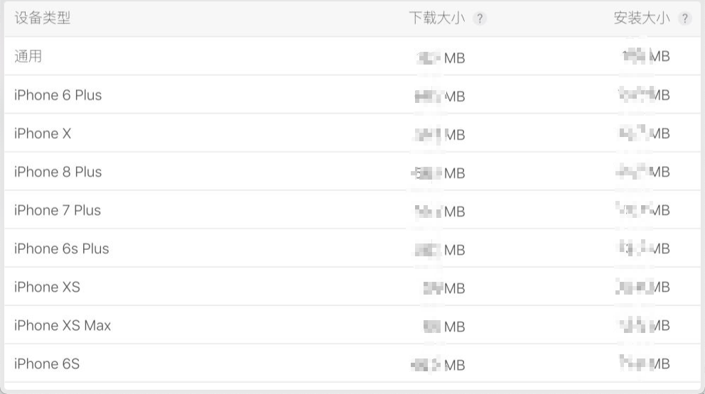
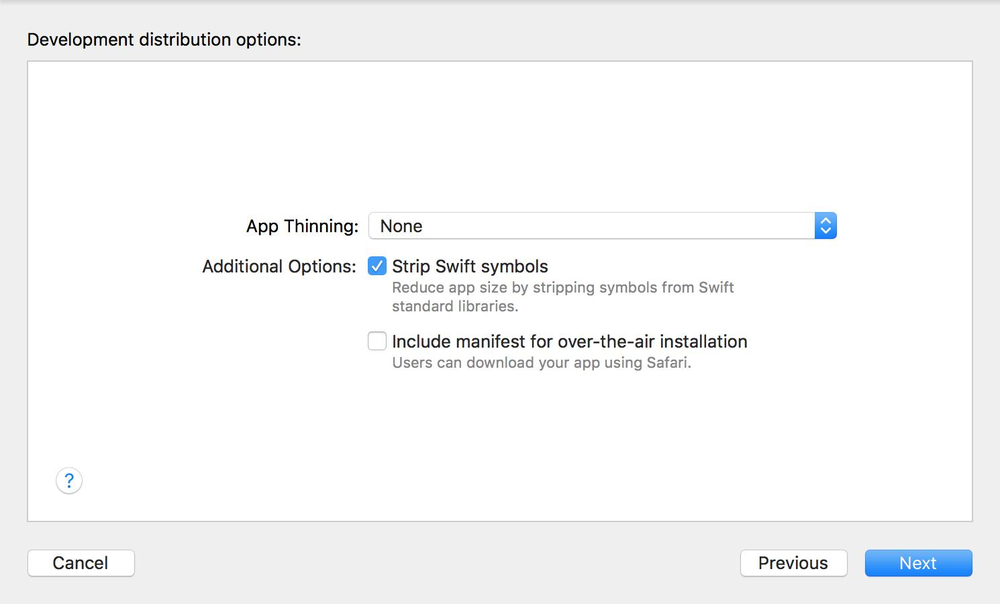
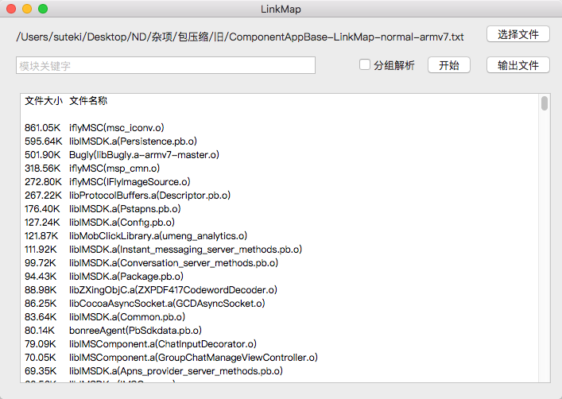

## 前言

Hi Coder，我是 CoderStar！

iOS 优化将是一个专题，其中会包括包体积优化（瘦身）、启动时间优化、UI 优化等等。那么这个专题的开篇就从瘦身开始吧。

APP 的大小是分为 APP 下载大小和安装大小两个概念的。
* 下载大小是指 App 压缩包（也就是 .ipa 文件）所占的空间，用户在下载 App 时，下载的是压缩包，这样做可以节省流量；
* 当压缩包下载完成后，就会自动解压，解压过程也就是通常所说的安装过程；安装大小就是指压缩包解压后所占用的空间。

用户在商店看到的大小是安装大小。如果想看安装包在各机型上最准确的下载、安装大小可以在 App Store Connect 后台查看。



其实一般情况来讲，导出的 ipa 文件越小，其下载大小会越小，我们可以将 ipa 文件尺寸作为量化参数，但是更准确的数值还是需要看 App Store Connect 上的下载大小。

**App Store OTA 下载大小限制：**

虽然苹果历年都会调整 App 下载大小，由之前的 100M 到后来的 150M 再到现在的 200M。如今，App 下载大小超出 200 MB 时 ，会出现两种情况：
* iOS 13 以下的用户，无法通过蜂窝数据下载 App；
* iOS 13 及以上的用户，需要手动设置才可以使用蜂窝网络下载 App。

**Apple __TEXT 段大小限制：**

* iOS 7 之前，二进制文件中所有的 __TEXT 段总和不得超过 80 MB；
* iOS 7.X 至 iOS 8.X，二进制文件中，每个特定架构中的 __TEXT 段不得超过 60 MB；
* iOS 9.0 之后，二进制文件中所有的 __TEXT 段总和不得超过 500 MB。

[官方描述](https://help.apple.com/app-store-connect/#/dev611e0a21f)

> 顺便给大家说下苹果将下载大小限制由 100M 调整到 150M 的原因是什么？主要原因就是 Uber 当年用 Swift 重构开发 APP 时，随着业务的增长，后期发现实在无法再将 APP 尺寸降到 100M 以下，只能联系苹果让其将下载大小提升到 150M，同时苹果的 Swift 团队还帮助添加了一些编译器选项 (-Osize)。

该文主要研究的是如何降低 APP 的**下载大小**的，因为文章篇幅较长，如果大家不想细读，可以直接跳过细节展开看每个小节的结论部分。

## 瘦身方向

将 ipa 安装包后缀名改为 zip，将其解压，显示.app 包内容后，就可以很直观的看到安装包的组成部分。一般会包括以下几个部分：

* Exectutable: Mach-O 可执行文件
* Resources：资源文件
  + 图片资源：Assets.car/bundle/png/jpg 等
  + 视频 / 音频资源：mp4/mp3 等
  + 静态网页资源：html/css/js 等
  + 视图资源：xib/storyboard 等
  + 国际化资源：xxx.lproj
  + 其他：文本 / 字体 / 证书 等
* Framework：项目中使用的动态库
  + SwiftSupport: libSwiftxxx 等一系列 Swift 库
  + 其他依赖库：Embeded Framework
* Pulgins：Application Extensions
  + appex：其组成大致与 ipa 包组成一致

其实核心组成部分便是**资源文件**与**Mach-O 可执行文件**两部分，这两个部分便是我们的主要瘦身方向。在瘦身过程中，应该尽量使用 ROI 最高的优化手段，付出更少的精力，得到更多的收益。

在介绍我们作为开发者的优化方向之前，我们先看一下苹果自身对于 APP 下载大小的优化有哪些吧，我们要充分利用 Apple 自身的优化机制。

## App Thinning(苹果自身优化)

App Thinning 是指 iOS9 以后引入的一项优化，Apple 会尽可能，自动降低分发到具体用户时所需要下载的 App 大小。其主要包含以下三项功能。

### Slicing(应用分割)

当向 App Store Connect 上传 .ipa 后，App Store Connect 构建过程中，会自动分割该 App，会专门针对不同的设备来选择只适用于当前设备的内容（主要是架构和资源）以供设备下载。其差异性主要是体现在架构（32 位还是 64 位）和资源（@1x、@2x 还是 @3x）等方面上。

其中架构方面开发者不需要去控制，但是对于资源来说要求图片在 **Asset Catalog** 管理，如果直接放在 Bundle 中，则不会被优化。

关于 Asset Catalog 相关知识点及优化结论可见下文 Assets Catalog 章节。

**总结：尽量将图片等资源交给`Asset Catalog`管理。**

### Bitcode（中间码）

Bitcode 是一个编译好的程序的中间表示形式（IR）。上传到 App Store Connect 中的包含 Bitcode 的 App 将会在 App store 中进行链接和编译。苹果会对包含 Bitcode 的二进制 app 进行二次优化，而不需要提交一个新的 app 版本到 app store 中。属于 Apple 内部的优化，但需要注意；

* 全部都要支持。我们所依赖的静态库、动态库、Cocoapods 管理的第三方库，都需要开启 Bitcode。否则打包会编译失败，具体错误会在 Xcode 中指出；
* Crash 定位。开启 Bitcode 后最终生成的可执行文件是 Apple 自动生成的，同时会产生新的符号表文件，所以我们无法使用自己包生成的 DYSM 符号化文件来进行符号化，而是使用使用 Apple 生成的 DYSM 符号化文件；
* Flutter 不支持 Bitcode，如果项目是包含 Flutter 框架的，就无法使用这种方式；
* BitCode 在 iOS 开发中是可选的，在 watchOS 开发中是必须要选择的， Mac OS 是不支持 BitCode 的。

开启方式： `Build Settings -> Enable Bitcode -> 设置为 YES` 。

如果想对Bitcode了解更深入一些，可以看下我之前的一篇博文--[iOS编译简析](../iOS编译简析)。

**结论：可根据项目实际情况决定是否开启，如果项目混编了 Flutter、依赖的部分库不支持 Bitcode 以及不想处理一遍 DYSM 符号化，就不要进行开启，否则可以选择开启。**

### On-Demand Resources(随需应变资源)

On-Demand Resource 即一部分图片可以被放置在苹果的服务器上，不随着 App 的下载而下载，直到用户真正进入到某个页面时才下载这些资源文件。

应用场景：相机应用的贴纸或者滤镜、关卡游戏等。

开启方式： `Build Settings -> Enable On Demand Resources -> 设置为 YES`（默认开启）。

设置资源的 Tag 类型，种类包括：
* Initial install tags：资源和 App 同时下载。在 App Store 中，App 的大小计算已经包含了这部分资源。当没有 NSBundleResourceRequest 对象访问它们时，它们将会从设备上清除。
* Prefetch tag order： 在 App 安装后开始下载，按照预加载列表中的顺序依次下载。
* Dowloaded only on demand： 只有在 App 中发出请求时才会下载。

如果项目中有 Demand Resources，则最后生成的安装包结构大致层级为：

* 项目名.app
* OnDemandResources 文件夹

具体使用方法这里就不展开讲了。

我们在下载安装包时，不会下载 `OnDemandResources` 文件夹中的资源，起到减小下载安装包尺寸的目的。

**结论：该方式与下文提到的资源远程化本质一样，只不过一个是放在自己服务器，一个是放在苹果服务器，可根据自己项目实际情况选择是否使用。**

## 资源文件瘦身

资源文件优化方向比较多，相对优化 Mach-O 可执行文件来讲，风险也比较小。

### 去除无用 / 重复的资源

业务的迭代开发，出现无用的图片资源是比较正常的，我们可以借助工具找出哪些图片资源没有被使用过。推荐下面两款工具：

* [LSUnusedResources](https://github.com/tinymind/LSUnusedResources)：可视化客户端工具；
* [FengNiao](https://github.com/onevcat/FengNiao.git)：命令行工具，可嵌入到Run Script中或者在CI系统中使用，支持的模式匹配更加强大。

因为这类工具的原理都是在相关文件（.m、.swift 等等）中利用正则表达式检测是否有图片名称的字符，所以存在以下问题。
问题点：
* 如果代码中使用的图标名称是拼接而成的，就会误以为相关图片是废弃图片；
* 如果 Assets.xcassets 文件中直接修改了图片的名字，也会认为相关图片可能是废弃图片；

可以利用[Duplicate Photos](https://www.duplicatephotocleaner.com/)从内容上检测重复/相似图片。

引申一下：
> 之所以要使用自动化工具来检测重复资源的原因是因为资源是弱类型，我们在项目迭代过程中手动去维护是相当麻烦的一个过程。转换一下思维，如果资源变成强类型了，那我们维护起来就相当容易了。目前就有这样一个工具 [R.swift](https://github.com/mac-cain13/R.swift)一定意义上将资源变成强类型，类似于 Android 开发中的 R 文件。

可利用[fdupes](https://github.com/adrianlopezroche/fdupes)查找项目中的重复文件。其原理是对比不同文件的签名，签名相同的文件就会判定为重复资源。

mac 上可直接通过 `brew install fdupes` 进行安装，可以使用 `fdupes -Sr 文件夹名称` 来查看所有涉及到的目录和子目录中的重复文件的大小，其余相关指令可自行查阅，不建议使用 fdupes 相关命令直接删除搜索出来的重复资源，风险比较高。

**结论：考虑到工具的不准确性，可以利用工具粗检测一下哪些资源没有被使用，然后经人工确认后才统一进行删除。对于工具无法检测出来的资源，就只能人工进行筛查了，可每人分配几个模块，提高效率。**

### 资源压缩

> 请注意：这里的资源不包括 Assets Catalog 管理的资源。

**PNG 资源**

这一部分涉及前因后果比较多，为保证大家能看懂，会先铺垫一些原理性知识，请耐心阅读。

Xcode 的 `Build Setting` 提供的给我们两个编译选项来帮助压缩 PNG 资源。

`Remove Text Medadata From PNG Files`（默认开启）：能帮助我们移除 PNG 资源的文本字符，比如图像名称、作者、版权、创作时间、注释等信息。
`Compress PNG Files`（默认开启）：当设置为 YES 后，打包的时候会利用 `pngcrush` 工具自动对项目中**所有 PNG 图片**进行无损压缩以及修改文件格式，该工具是开源的--[pngcrush地址](https://github.com/Kjuly/pngcrush)。

`Compress PNG Files` 设置为 YES 后，XCode 会调用该路径的脚本
 `/Applications/Xcode.app/Contents/Developer/Platforms/iPhoneOS.platform/Developer/usr/bin/iphoneos-optimize`。

`pngcrush` 工具在其同级目录存放，iphoneos-optimize 脚本中关于 PNG 压缩的内容如下：

```c
sub optimizePNGs {
    my $name = $File::Find::name;
    if ( -f $name && $name =~ /^(.*)\.png$/i) {
        my $crushedname = "$1-pngcrush.png";
        // $PNGCRUSH便是pngcrush工具路径
        my @args = ( $PNGCRUSH, "-q", "-iphone", "-f", "0" );
        if ( $stripPNGText ) {
             push ( @args, "-rem", "text" );
        }
        push ( @args, $name, $crushedname );

        if (system(@args) != 0) {
            print STDERR "$SCRIPT_NAME: Unable to convert $name to an optimized png!\n";
            return;
        }
        unlink $name or die "Unable to delete original file: $name";
        rename($crushedname, $name) or die "Unable to rename $crushedname to $name";
        print "$SCRIPT_NAME: Optimized PNG: $name\n";
    }
}
```

从内容上来看，脚本是通过**png 后缀名**来判断是否为 png 图片，如果图片改变后缀名，则该图片则不会被 `pngcrush` 工具进行处理。

我们可以通过下面命令手动使用 `pngcrush` 工具。

```shell
# image.png 经编码后 生成 image1.png
xcrun -sdk iphoneos pngcrush -iphone -f 0 image.png image1.png

# image.png 经解码后 还原成 image1.png
# 即使还原回去与原图片也不会完全一致，这里就不展开描述了
xcrun -sdk iphoneos pngcrush -revert-iphone-optimizations image.png image1.png
```

`pngcrush` 工具编码结果主要变化内容如下：
* 在 IHDR 块之前插入了 CgBI 块来表示这种格式
* 修改 IDAT 块中的数据，去除 zlib 压缩头和 Adler-32 校验和；
* **八位真彩色图像按 BGR/BGRA 顺序存储，而不是按 IHDR 块中指示的 RGB 和 RGBA 顺序存储**；
* 图像像素使用预乘 alpha；
* 修改后的文件使用。png 为有效图像定义的文件扩展名以及内部文件结构，但符合 PNG 的查看和编辑软件不再能够处理它们；
* 增加了一个 iDot 数据块，是 Apple 自定义的数据块，暂时不知其作用；

**其本质是使正常的 png 图片变成了一个优化后的 CgBI 格式的 png**。可以利用[pngcheck](http://www.libpng.org/pub/png/apps/pngcheck.html)查看处理前的图片信息，利用[pngdefry](http://www.jongware.com/pngdefry.html)查看处理后的图片信息（其还可以将 CgBI 格式的 png还原回去，这个功能跟pngcrush工具解码功能类似）。

从上述变化内容来看， `pngcrush` 工具编码过程并不是简单的压缩数据，更重要的是对文件格式做了修改。**因为 iPhone 中，图像是以 BGRA 格式在内存中处理的，所以修改后的格式变成了 iPhone 能更方便处理的格式，加快处理速度。**

根据我自己测试的压缩效果来看，对于 Bundle 中放置的 png 图片，经过 `pngcrush` 的处理，大小不降反增，目前暂时没有找到哪些具体因素影响其压缩效果。

其还有一个GUI工具 [pngcrush](https://pmt.sourceforge.io/pngcrush/)，但好像只支持windows系统。


png

**结论：Compress PNG Files 虽然是压缩 PNG，但其最主要的目的并不是为了压缩图片大小， 而是将 PNG 转换成 iOS 更容易处理、更快速度的去识别的格式，可以根据项目在开启、关闭两种情况下的打包大小，自行取舍。**

**非 PNG 资源**

非 PNG 资源压缩包含两种方式：

* 直接通过一些压缩工具将资源进行压缩，格式保持不变，如一些图片资源、音视频资源等，图片压缩工具下文会有介绍。
* 还有一些文本资源，如 json 文件、html 文件等，无法使用上述的方式压缩，可以采用压缩成 zip 等压缩格式的方式，可分为三步：
  1. 压缩阶段：在 Build Phase 中添加脚本，构建期间对白名单内的文本文件做 zip 压缩；
  2. 解压阶段：在 App 启动阶段，在异步线程中进行解压操作，将解压产物存放到沙盒中；
  3. 读取阶段：在 App 运行时，hook 读取这些文件的方法，将读取路径从 Bundle 改为沙盒中的对应路径；

**结论：可选用合适的压缩工具对音视频、非 Assets Catalog 管理的图片资源进行压缩。对于一些比较大的文本文件可选用第二种运行时解压读取的方式，如 Lottie 动画的 json 文件。**

### Assets Catalog

Assets Catalog 涉及的技术点比较多，后续可能会单独开一篇博文专门讲这一部分内容。

#### 去除 @1x 图片

@1x 图是 iPhone 3Gs 用的，iPhone 4 开始使用 @2x 图了，iPhone 6p 开始使用 3x 图。

**结论：可以删除 Assets 中所有 @1x 的图片资源。**

### 图片压缩

Assets.car 文件是工程中 Asset Catalog 的构建产物。Xcode 构建过程中，在 `compile asset catalog` 节点时， 构建 Asset Catalog 的工具 `actool` 会首先对 Asset Catalog 中的 png 图片进行解码，得到 Bitmap 数据，然后再运用 `actool` 的编码压缩算法进行编码压缩处理。

> 如果你开发时放入到 Assets 中的是 jpg 格式文件，在最终生成的 Assets.car 文件中也会成为 png 图片。

`xcrun assetutil --info Assets.car` 。可使用该命令检查 Assets.car 中每张图片使用的编码压缩算法。

目前 `actool` 会使用的压缩算法包括 `lzfse` 、 `palette_img` 、 `deepmap2` 、 `deepmap_lzfse` 、 `zip` ，影响其使用何种算法的因素包括 **iOS 系统版本**、**ASSETCATALOG_COMPILER_OPTIMIZATION 设置**（位于 Build Setting 中）等；

* iOS 11.x 版本：对应的压缩算法为 lzfse、zip；
* iOS 12.0.x - iOS 12.4.x: 对应的压缩算法为 deepmap_lzfse、palette_img；
* iOS 13.x: 对应的压缩算法为 deepmap2 ；

**按照压缩比来讲 lzfse < palette_img ~= deepmap_lzfse < deepmap2**

如果设置了 `ASSETCATALOG_COMPILER_OPTIMIZATION` 为 `space` 那么在低版本 iOS 系统上，使用 `lzfse` 压缩算法的图片会变成 `zip` 的算法，可减少 iOS 11.x 及以下的 iOS 设备图片的占用大小。其他 iOS 版本的压缩算法不受这个配置的影响。

* 无损压缩通过变换图片的编码压缩算法减少大小，但是不会改变 Bitmap 数据，对于 `actool` 来说，它接收的输入（Bitmap 数据）没有改变，**所以无损压缩无法优化 Assets.car 的大小，但是可以用来优化非 Asset Catalog 管理的图片**。

* 使用有损压缩方式并采用合适的压缩方法是可以减小 Assets.car 的大小。可以对图片采用`RGB with palette`（调色板算法）编码方式来达到图标压缩的效果，这种编码方式进行压缩特别适合内部颜色相对接近的图标。但是需要注意如果图片中有半透明效果，这种压缩方式可能会导致半透明的地方出现噪点，所以压缩之后请注意仔细检查一下。

> RGB with palette 编码的得到的字节流首先维护了一个颜色数组。颜色数组每个成员用 RGBA 四个分量维护一个颜色。图像中的每个像素点则存储颜色数组的下标代表该点的颜色。颜色数组维护的颜色种类和数量由图片决定，同时可以人为的限制颜色数组维护颜色的种类的上限，默认为最大值 256 种，具体原理详见底部相关链接 --【Palette Images】；

使用下文提到的 ImageOptim-CLI 工具，我们可以改变图片的编码方式为 `RGB with palette`，命令如下：

 `imageoptim -Q --no-imageoptim --imagealpha --number-of-colors 16 --quality 40-80 ./1.png`

> --number-of-colors：控制颜色数组维护颜色的数量；
> --quality：控制图片的质量变为原来的百分比；
> 命令中的数值可以在显著减少包大小的同时维持肉眼看不到的质量变化。

以图片资源举例，我们可以使用工具对其进行压缩，推荐几款工具如下：
* [TinyPng](https://tinypng.com/)：网页工具，有损压缩；
* [TinyPNG4Mac](https://github.com/kyleduo/TinyPNG4Mac/)：TinyPng的客户端工具，无需联网使用浏览器；
* [ImageOptim](https://github.com/ImageOptim/ImageOptim)： 客户端工具，支持无损压缩及有损压缩两种形式，可自定义设置压缩方式。
* [ImageOptim-CLI](https://github.com/JamieMason/ImageOptim-CLI)：Mac 可使用`brew install imageoptim-cli`安装，其会根据你的指定，选择性调用 `JPEGmini`、`ImageAlpha`、`ImageOptim` 等工具，实现中间过程自动化。

> 如果想将car文件中的png提取出来，可以使用[Asset Catalog Tinkerer](https://github.com/insidegui/AssetCatalogTinkerer)。

引申一下，好的工具是开发利器，之前整理了一些好用的Mac效率工具，可见[Mac效率软件](../../../../杂项/装机必备/Mac效率软件)

[[ WWDC2018 ] - 优化 App Assets Optimizing App Assets](https://www.jianshu.com/p/0c6fcf59ab82?utm_campaign=maleskine...&utm_content=note&utm_medium=seo_notes&utm_source=recommendation)

**结论：能用 Asset Catalogs 管理的资源，尽量使用 Asset Catalogs 来管理。使用 Asset Catalog 管理图片不要对图片进行无损压缩，最终起不到压缩效果，如果想要压缩，可以采用上面所提到的有损压缩方式，并检查压缩后的效果。**

### 图片资源使用 Webp 格式

谷歌开源的格式，Webp 压缩率比较高，同时支持有损和无损两种压缩模式，可以带来更小的图片体积，而且肉眼看不出差异。根据 Google 的测试，无损压缩后的 WebP 比 PNG 文件少了 26％的体积，有损压缩后的 WebP 图片相比于等效质量指标的 JPEG 图片减少了 25％~34% 的体积。

但是 WebP 与 JPG 以及 PNG 相对比，在编解码的 CPU 消耗以及解码时间上会差一些，因为编码是用户上传图片时的一次性操作，并且编码过程是在服务器后台进行，对用户的影响不大，对用户影响大的主要是解码过程，会导致图片加载速度慢一些。所以，我们需要根据项目的实际情况在性能和体积上做取舍。

> 如果从服务器带宽以及流量来看，因为图片的体积变小，所以会减小带宽，降低成本。

推荐二种转 WebP 格式的方法

* [iSpart](http://isparta.github.io/)：腾讯出品，GUI工具；
* [webp工具](https://developers.google.com/speed/webp/docs/using): 在Mac下，可以使用Homebrew安装WebP工具--`brew install webp`；

iOS 原生并不支持 WebP 格式加载，需要借助一些三方库的支持，或者进行自研；
* 如果使用的是`SDWebImage`，则可以使用引入`SDWebImageWebPCoder`；  SDWebImage/WebP
* 如果使用的是`Kingfisher`，则可以使用`KingfisherWebP`;

> 之前可以直接使用 `pod SDWebImage/WebP`的形式，但是`SDWebImage`版本升级之后，这种方式被替换了，而且使用这种形式会依赖 google 的`libwebp`库，在集成过程中会遇到一些问题，需要手动处理一下。

**结论：该方案适合整个大前端及后端统一调整，整体进行优化，如果是单一的客户端进行调整，可能达不到最优效果。**

### 资源动态化

除了上文提到的使用 `On-Demand Resources` 方式将部分资源放在苹果服务器之外，我们也可以将一些本地资源转移到自己的服务器上去。这样不仅降低了安装包大小，也将这些资源动态化了。适合放在服务器的资源应包含以下几个特性：

* 不影响首屏加载体验；
* 变化频率较高；
* 尺寸很大；

如一些 Banner 广告图、主题资源、音视频资源、H5 资源资源。

**结论：可尽量将满足上述特性的资源放置在服务器。**

### 图标优化

* 使用 tint color 精简单色图标；
* 使用图标字体（IconFont）替换单色图标；
* 将部分相似图标进行整合；

**结论：如果项目有相对的设计规范及标准图标样式，使用图标字体是一个很好的方案。剩余的优化点根据项目实际情况决定是否使用。**

## 编译选项改进

Xcode 支持编译器层面的一些优化选项，通过修改 `Build Setting` 的一些相关配置，可以让我们介于更快的编译速度和更小的二进制大小并且更快的执行速度之间自由选择想要进行的优化粒度，这些选项有的会影响资源文件，有的会影响可执行文件，因为内容比较多，所以起一个独立的章节描述。

**这种方式的性价比很高，改动一项配置，就可能会带来收益，但是可能具有一定的风险，需要谨慎。**

下文中提到的一些 Xcode 默认配置可能在低版本 Xcode 上不是默认配置，如果不是默认，可手动勾选。

### 去除无用架构

可以在 `Build Setting` - `Excluded Architectures` 项设置排除的架构。

先看一下几种架构的含义：

* 模拟器 32 位处理器测试需要 `i386` 架构；
* 模拟器 64 位处理器测试需要 `x86_64` 架构；
* 真机 32 位处理器需要 `armv7`, 或者 `armv7s` 架构；
* 真机 64 位处理器需要 `arm64` 架构。

| armv6                                                   | armv7                                                            | armv7s                       | arm64                 |
|---------------------------------------------------------|------------------------------------------------------------------|------------------------------|-----------------------|
| iPhone<br>iPhone2<br>iPhone3G<br>第一代和第二代 iPod Touch | iPhone4<br>iPhone4S<br>iPad1-iPad3，3、4 代 iPod Touch<br>iPad mini | iPhone5<br>iPhone5C<br>iPad4 | iPhone 5S 等剩余全部机型 |

> 顺便说下，如果将 iOS 最低版本调整到 iOS 11，则 xocde 自动保留架构只有 arm64。

**结论：理论上只保留 arm64 架构其实就够用了，可以去除 `armv6` 、 `armv7` 、 `armv7s` 三种架构。**

### 使用链接时优化 LTO(Link-Time Optimization)

> 可以在 `Build Setting` - `Link-Time Optimization` 项设置优化方式

其提供三种选项：
* `No` 不开启链接期优化；（默认项）
* `Monolithic` 生成单个 LTO 文件，每次链接重新生成，无缓存高内存消耗，参数 LLVM_LTO=YES；
* `Incremental` 生成多个 LTO 文件，增量生成，低内存消耗，参数 LLVM_LTO=YES_THIN；

LTO 能带来的优化有：
 - **将一些函数內联化**：不用进行调用函数前的压栈、调用函数后的出栈操作，提高运行效率与栈空间利用率；
 - **去除了一些无用代码**：如果一段代码分布在多个文件中，但是从来没有被使用，普通的 -O3 优化方法不能发现跨中间代码文件的多余代码，因此是一个局部优化。但是 `Link-Time Optimization` 技术可以在 link 时发现跨中间代码文件的多余代码；
 - **对程序有全局的优化作用**：这是一个相对广泛的概念。举个例子来说，如果一个 if 方法的某个分支永不可能执行，那么在最后生成的二进制文件中就不应该有这个分支的代码。

LTO 会降低编译链接的速度，所以建议在打正式包时开启；
开启了 LTO 之后，Link Map 的可读性明显降低，多出了很多数字开头的类（LTO 的全局优化导致的），所以如果需要阅读 Link Map，可以先关闭 LTO；

> LTO 虽然是链接期优化，但是仍然需要编译期参与，加入了 LTO 的编译出来的 .a 本质是 LLVM 的 BitCode，如果使用未开启 LTO 构建出来的的 .a 直接是机器码了。直接链接是无法完成 LTO 优化的。
>
> 开启 LTO 之后跨编译单元的重复代码会被链接器单独生成以 .lto.o 为后缀的目标文件进行链接。尤其是对于 Objc Runtime 需要的一些结构， **比如方法签名的 literal string、protocol 的结构等有比较大的优化**。同时开启 Oz 和 LTO 可以让外联函数都只存在一份能够最大限度的优化安装包体积（是全局的优化作用，将已经外联的函数去重）。如果项目中大量的使用了 Protocol 建议还是开启这个选项。

**结论：可将`Link-Time Optimization`选项由 `NO` 改为 `Incremental` 。**

### 语言编译优化

**OC**

OC 关于编译内联优化的参数位于 `Build Settings` -> `Apple Clang - Code Generation` -> `Optimization Level` ，选项如下：

* None[-O0]: 编译器不会优化代码，意味着更快的编译速度和更多的调试信息，默认在 **Debug** 模式下开启；
* Fast[-O, O1]: 编译器会优化代码性能并且最小限度影响编译时间，此选项在编译时会占用更多的内存；
* Faster[-O2]：编译器会开启不依赖空间 / 时间折衷所有优化选项。在此，编译器不会展开循环或者函数内联。此选项会增加编译时间并且提高代码执行效率；
* Fastest[-O3]：编译器会开启所有的优化选项来提升代码执行效率。此模式编译器会执行函数内联使得生成的可执行文件会变得更大。一般不推荐使用此模式；
* Fastest Smallest[-Os]：编译器会开启除了会明显增加包大小以外的所有优化选项，兼顾执行速度与体积。默认在 **Release** 模式下开启；
* Fastest, Aggressive Optimization[-Ofast]：启动 -O3 中的所有优化，可能会开启一些违反语言标准的一些优化选项。一般不推荐使用此模式。
* Smallest，Aggressive Size Optimization[-Oz]：Xcode 11之后才出现的编译优化选项，核心原理是对重复的连续机器指令外联成函数进行复用，因此开启Oz，能减少二进制的大小，但同时会带来执行效率的额外消耗。还可能会出现一些问题，见：[大家来找茬：记一起 clang 开启 -Oz 选项引发的血案](https://mp.weixin.qq.com/s/1RNsrmUKuxmQa0jPZozE9A)

本质上这个优化就是在体积和性能之间做权衡。

**结论：使用默认配置即可，无需修改。**

**Swift**

Swift 关于编译内联优化的参数位于 `Build Settings` -> `Swift Compiler - Code Generation` -> `Optimization Level` ，可选参数如下。

* No optimization[-Onone]：不进行优化，能保证较快的编译速度。默认在 **Debug** 模式开启；
* Optimize for Speed[-O]：编译器将会对代码的执行效率进行优化，一定程度上会增加包大小。默认在 **Release** 模式下开启；
* Optimize for Size[-Osize]：编译器会尽可能减少包的大小并且最小限度影响代码的执行效率。

`Optimize for Size` 的核心原理是对重复的连续机器指令外联成函数进行复用，和函数内联的原理正好相反。因此，将其开启，能减小二进制的大小，但同时理论上会带来执行效率的额外消耗，对性能（CPU）敏感的代码使用需要评估。

具体官方描述可见[Code Size Optimization Mode in Swift 4.1](https://swift.org/blog/osize/)

配合其使用的还有`Compliation Mode`设置，其含有两个选项
- Single File：单个文件优化，**可以减少增量编译的时间**，并且可以充分利用多核 CPU，并行优化多个文件，提高编译速度。但是对于交叉引用无能为力；
- Whole Module：模块优化，**最大限度优化整个模块**，能处理交叉引用。缺点不能利用多核 CPU 的优势，每次编译都会重新编译整个 Module；

在 Relese 模式下 `-Osize` 和 `Whole Module` 同时开启效果会发挥的最好，从现有的案例中可以看到它会减少 5%~30% 的可执行文件大小，并且对性能的影响也微乎其微（大约 5%）。

**结论：将 Release 默认下配置改为 `Optimize for Size[-Osize]`，`Compliation Mode`选项改为`Whole Module`**

### 死代码裁剪

> 可以在 `Build Setting` - `DEAD_CODE_STRIP` 项设置。

在构建完成之后如果是 C、C++ 等静态的语言的代码、一些常量定义，如果发现没有被使用到将会被标记为 Dead code。开启 `DEAD_CODE_STRIP = YES` 这些 Dead code 将不会被打包到安装包中。在 LinkMap 这些符号也会被标记为 `<<dead>>` 。

该项其实也属于在清除无用代码。

**结论：默认配置即为 YES，所以使用默认配置即可，无需修改。**

### 去除符号信息

可执行文件中的符号是指程序中的所有的变量、类、函数、枚举、变量和地址映射关系，以及一些在调试的时候使用到的用于定位代码在源码中的位置的调试符号，符号和断点定位以及堆栈符号化有很重要的关系。

#### Strip Style

`Strip Style` 表示的是我们需要去除的符号的类型的选项，其分为三个选择项：

* All Symbols: 去除所有符号，一般是在主工程中开启；
* Non-Global Symbols: 去除一些非全局的 Symbol（保留全局符号，Debug Symbols 同样会被去除），链接时会被重定向的那些符号不会被去除，此选项是动态库的建议选项；
* Debug Symbols: 去除调试符号，去除之后将无法断点调试。

> 当使用 Cocoapods 去管理项目时，对于各 pod 设置的`Strip Style`都为`Debug Symbols`，默认情况下，因为动态库是生成各个库的 Framework，会使用默认的`Debug Symbols`，如果是静态库，实际上是会使用主工程的`Strip Style`，也就是`All Symbols`。所以在 Swift 工程中使用动态库的方式打出的包会比静态库大一些。

**结论：主工程选择`All Symbols`，静、动态库选择`Non-Global Symbols`。**

#### Strip Linked Product

并不是所有的符号都是必须的，比如 `Debug Map`，所以 Xcode 提供给我们 `Strip Linked Product` 来去除不需要的符号信息 (**Strip Style 中选择的选项相应的符号**），去除了符号信息之后我们就只能使用 `dSYM` 来进行符号化了，所以需要将 `Debug Information Format` 修改为 `DWARF with dSYM file`。

> 需要注意`Strip Linked Product` 选项在 `Deployment Postprocessing` 设置为 YES 的时候才生效，而 Deployment Postprocessing 在 Archive 时不受手动设置的影响，会被强制设置成 YES。

**结论：将`Deployment Postprocessing`设置为 NO，将`Strip Linked Product`设置为`YES`，将`Release`模式的下的`Debug Information Format` 修改为 `DWARF with dSYM file`。**

#### Strip Debug Symbols During Copy

与 `Strip Linked Product` 类似，但是这个是将那些拷贝进项目包的三方库、资源或者 Extension 的  `Debug Symbol` 去除掉，同样也是使用的 strip 命令。这个选项不受`Deployment Postprocessing`的控制，所以我们只需要在 Release 模式下开启，不然就不能对三方库进行断点调试和符号化了。

> Cocoapods 管理的动态库 (use_framework!) 的情况就相对要特殊一点，Cocoapods 中的的动态库是使用自己实现的脚本 Pods-xxx-frameworks.sh 来实现拷贝的，所以并不会走 Xcode 的流程，当然也就不受 Strip Debug Symbols During Copy 的影响。当然 Cocoapods 是源码管理的，所以只需要将源码 Target 中的 Strip Linked Product 手动设置为 YES 即可。

**结论：`Strip Debug Symbols During Copy`在`Release` 模式下设置为`YES`，在`Debug`模式下设置为`false`。**

#### Strip Swift Symbols

开启 `Strip Swift Symbols` 能帮助我们移除相应 Target 中的所有的 Swift 符号，这个选项也是默认打开的。
这一选项是出现 Xcode 将 xcarchive 包导出成 ipa 文件过程中出现的，不是通过`Build Setting`设置的。



**结论：一般默认勾选，如果没勾选请手动勾选。**

#### 修正 Exported Symbols 配置

Xcode Build Settings 中的 EXPORTED_SYMBOLS_FILE 配置，控制着 Mach-O 中 __LINKEDIT 段中 Export Info 的信息。动态链接器 dyld 在做符号绑定时，会读取被绑定的动态库或可执行文件的 Export Info 信息，得到一个符号对应的实际调用地址。如果正在被绑定的符号，在目标动态库的 Export Info 中缺失，dyld 则会抛出异常，表现为 App 崩溃。

虽然从原理上看，Export Info 中的信息不可或缺。但是，对于一个 Mach-O 文件来说，并非所有的符号都是需要暴露给其他动态库或可执行文件的。理想情况下，私有的符号应该在编码时就应该以 __attribute__((visibility(hidden))) 修饰。但在历史代码难以逐个添加修饰符的情况下，Exported Symbols 配置给了工程一个维护公有符号白名单的机会。如果填写了有效的 EXPORTED_SYMBOLS_FILE 配置，动态库或者可执行文件会在静态链接时去掉白名单以外的符号，起到缩减包大小、增加逆向难度的作用。

### 选项设置方式优化

大部分项目都会使用 Cocoapods 工具进行管理，Cocoapods 的 project 文件在每次 `pod install` 或者 `pod update` 会重置，所以需要 `hook pod install` 来设置 Pods 中每个 Target 的编译选项。

```ruby
post_install do |installer|
    installer.pods_project.targets.each do |target|
        target.build_configurations.each do |config|
            config.build_settings['ENABLE_BITCODE'] = 'NO'
            config.build_settings['STRIP_INSTALLED_PRODUCT'] = 'YES'
            config.build_settings['SWIFT_COMPILATION_MODE'] = 'wholemodule'
            if config.name == 'Debug'
                config.build_settings['SWIFT_OPTIMIZATION_LEVEL'] = '-Onone'
                config.build_settings['GCC_OPTIMIZATION_LEVEL'] = '0'
            else
                config.build_settings['SWIFT_OPTIMIZATION_LEVEL'] = '-Osize'
                config.build_settings['GCC_OPTIMIZATION_LEVEL'] = 's'
            end
        end
    end
end
```

## Mach-O 可执行文件瘦身

在对 Mach-O 文件进行瘦身优化时，我们可以通过分析 Link Map 文件来给我们一定的数据参考，帮助我们分析 Mach-O 文件的构成。

Link Map 是编译链接时可以生成的一个 txt 文件，它生成目的就是帮助程序员分析包大小。Link Map 记录了每个方法在当前的二进制架构下占据的空间。通过分析 Link Map，我们可以了解每个类甚至每个方法占据了多少安装包空间。

开启 `Build setting` 中的 `Write Link Map File` 开关，Xcode 就会生成一份 Link Map 文件。其中生成的 Link Map 文件路径如下：
 `~/Developer/Xcode/DerivedData/项目/Build/Intermediates.noindex/项目.build/Debug-iphonesimulator/项目.build/项目-LinkMap-normal-x86_64.txt`

如果直接阅读 Link Map 文件，效率会比较低，也不直观，我们可以使用一些工具帮助我们分析。

[LinkMap工具地址](https://github.com/huanxsd/LinkMap)



### 清除无用代码

#### 通过 AppCode 查找无用代码

AppCode 提供了非常强大的代码静态检查工具，使用 Inspect Code，可以找到很多代码优化的地方；


但是需要注意的是，AppCode 的静态检查还存在很多问题，对一些使用的代码可能会判断成没有使用，所以使用 AppCode 检查出来的无用代码，还需要人工二次确认才能进行最后的删除。

> 项目大了之后 AppCode 索引速度很慢。

#### 基于源码扫描

一般都是对源码文件进行字符串匹配。例如将 A *a、[A xxx]、NSStringFromClass("A")、objc_getClass("A") 等归类为使用的类，@interface A : B 归类为定义的类，然后计算差集。

基于源码扫描 有个已经实现的工具 -- [fui](https://github.com/dblock/fui)，它的实现原理是查找所有 #import "A" 和所有的文件进行比对。

#### 手动去除

* 已经下线的陈旧代码，AB 试验已经下线的代码；
* 通过转 H5、Hybrid 或者 RN 实现的 Native 功能，可以定期清理；
* 将部分功能进行重构，以此去除一定的代码。

#### 分析 Macho 文件

[WBBlades](https://github.com/wuba/WBBlades)

> 通过对 Mach-O 文件的了解，可以知道 `__TEXT:，而`__DATA__objc_selrefs`中则包含了所有被使用的方法的引用，通过取两个集合的差集就可以得到所有未被使用的代码。
>
>

- `__objc_selrefs` 和 `__objc_classrefs` 存储了引用到的 `sel 和 `class`
- `__objc_classlist` 存储了所有的 `sel` 和 `class`

> `__objc_methname:` 中也包含了代码中的所有方法。

具体可看[objc_cover](https://github.com/nst/objc_cover)

二者做个差集就知道那些类 /sel 用不到，但 objc 支持运行时调用，删除之前还要在二次确认。

### 多个可执行文件中去除相同代码

这里的多个可执行文件一般是指 APP 宿主程序与 Extension 程序，如果 APP 宿主程序与 Extension 程序都依赖同一个静态库库时，就会导致两个可执行文件中都包含相同的代码；个人觉得有两种解决方案：
* 考虑到 Extension 程序相对宿主程序来说功能较小，可尽量使用原生功能，不接入三方库；
* 如果想要接入同一份库，可将该库以动态库的方式引入，最终两个可执行文件会动态链接同一份库，避免了重复代码；

**结论：根据项目实际情况选用解决方案。**

## 更多优化

### Pod

使用 `resource_bundles` 配合 xcassets 的方式来集成各个插件中的资源文件，因为 `resource_bundle` 中的资源在构建期能经过 Xcode 的优化，而 resource 中的资源则不能。并且这种形式可以将每个 pod 的资源放在自己的 Bundle 中，更方便管理。

**结论：自定义 Pod 如果含有资源，尽量使用 resource_bundle 的方式引用资源。**

### 编码素质

1. 代码复用，禁止无脑拷贝代码，共用代码下沉为底层组件；
2. 重复功能的框架使用一套；
3. 不要因为一个很小的功能就引入一个框架，或者有类似轻量级框架时转而选择一个功能强大但重量级框架；
4. 建立公共文档，开发的流程规范、项目使用第三方库的规范、设计规范、代码规范都列举出来，避免出现一人一套代码的现象；
5. ...

**结论：这一部分需要从提升个人编码素质、团队文化以及团队管理等方面入手。**

### 其他

还有一些优化方式，如二进制段压缩，__TEXT 段迁移等方式，大家可以去寻找相关的资料查看，这里只简单介绍相关的原理。
- 二进制段压缩：Mach-O 文件中并不是每个段 / 节在程序启动的第一时间都要被用到。可以在构建过程中将 Mach-O 文件中的这部分段 / 节压缩，然后只要在这些段被使用到之前将其解压到内存中，就能达到了减少包大小的效果，同时也能保证程序正常运行；
  > 是压缩 __TEXT,__gcc_except_tab 与 __TEXT,__objc_methtype 两个节是没问题的，然后在 _dyld_register_func_for_add_image 的回调中对它进行解压。
- __TEXT 段迁移：将可执行文件的 __TEXT 段中的部分节移动到其它的段，提高了可执行文件的压缩效率。具体可见相关链接中【今日头条优化实践：iOS 包大小二进制优化，一行代码减少 60 MB 下载大小】；
- ...

Apple 在 iOS13 + 去掉了对可执行文件的 __TEXT 段加密，使得 iOS13+ 的系统比低版本系统下载大小减小了 30%-40%。因为没有加密，所以启动时也不需要进行page in 解密了，可以提高启动速度。


iOS13 以下优化方案：可将可执行文件中一部分段从 __TEXT 段中移动到其他段来绕过加密，提高可执行文件的压缩效率，从而使下载大小减小。

iOS 更新日志：https://support.apple.com/zh-cn/HT210393#13

### 调整 Deployment Target

- 调整到 iOS 12，因为 assets 的压缩算法的优化，会大幅减小包体积；
- 调整到 iOS 12.2，因为 Swift runtime 的剔除，也会大幅降低包体积；
- 调整到 iOS 13，应用体积将会减小 50%，App 更新也会比过去少占 60% 的空间。
  > 应用打开速度会有 2 倍提升。

## 最后

本文主要归纳总结了一些常用的瘦身方法，当然不同的项目需求以及业务场景都会产生一些对应的瘦身方法，大家可以根据自己的业务特性去寻找一些更好更优的瘦身技巧。

最后，祝大家周末愉快！

Let's be CoderStar!

相关链接

* [我在 Uber 亲历的最严重的工程灾难](https://www.infoq.cn/article/asjhHAmupqtcx5oGrb4b)
* [iOS 安装包瘦身实践](https://xiaozhuanlan.com/topic/6147250839)
* [今日头条 iOS 安装包大小优化 - 新阶段，新实践](https://zhuanlan.zhihu.com/p/358002160)
* [干货|今日头条iOS端安装包大小优化—思路与实践](https://mp.weixin.qq.com/s/PufNDzf9VfrEZdJbNcpwNQ)
* [今日头条优化实践： iOS 包大小二进制优化，一行代码减少 60 MB 下载大小](https://mp.weixin.qq.com/s/TnqAqpmuXsGFfpcSUqZ9GQ)
* [今日头条 iOS 安装包大小优化 - 新阶段、新实践](https://mp.weixin.qq.com/s/oyqAa8wKdioI5ZDG5LjkfA)
* [探究WebP一些事儿](https://jelly.jd.com/article/6006b1035b6c6a01506c87a9)
* [Palette Images](http://www.manifold.net/doc/mfd9/palette_images.htm)
* [iOS PNG 使用指南](https://mp.weixin.qq.com/s/6KW-5ZaThLP_weIPnkR6CA)
* [iOS减包实战：Compress PNG Files作用分析](https://cloud.tencent.com/developer/article/1368027)
* [iOS App 瘦身减肥记](https://juejin.cn/post/6919751122760679437?utm_source=gold_browser_extension#heading-3)
* [iOS 安装包瘦身 （上篇）](https://sq.163yun.com/blog/article/200385709022117888)
* [iOS 安装包瘦身（下篇）](https://sq.163yun.com/blog/article/200384401846304768)
* [209M->102M，贝壳B端iOS包瘦身之路](https://mp.weixin.qq.com/s?__biz=MzIyMTg0OTExOQ==&mid=2247488331&idx=2&sn=5baff8fd8881a03d7458f06e7a7b7578&chksm=e837203bdf40a92dd9c1c661963cd3b246ac03814bc45eeb1bf49cc328fe9d067a877f2e86db&cur_album_id=1561892331979669505&scene=190#rd)
* [Alibaba.com瘦包40MB——业界最全的iOS包大小技术总结](https://mp.weixin.qq.com/s/I6DH5RvkMh_-bxGpkAKBPA)
