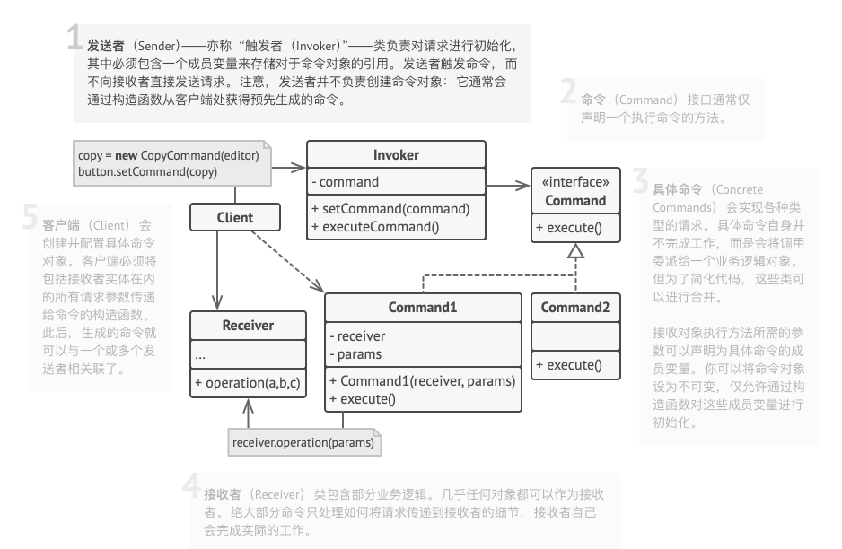
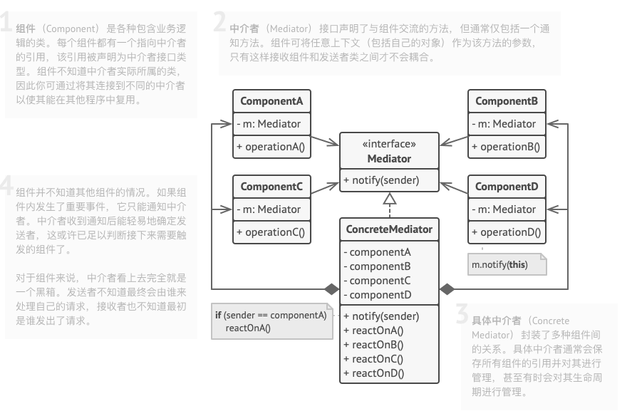
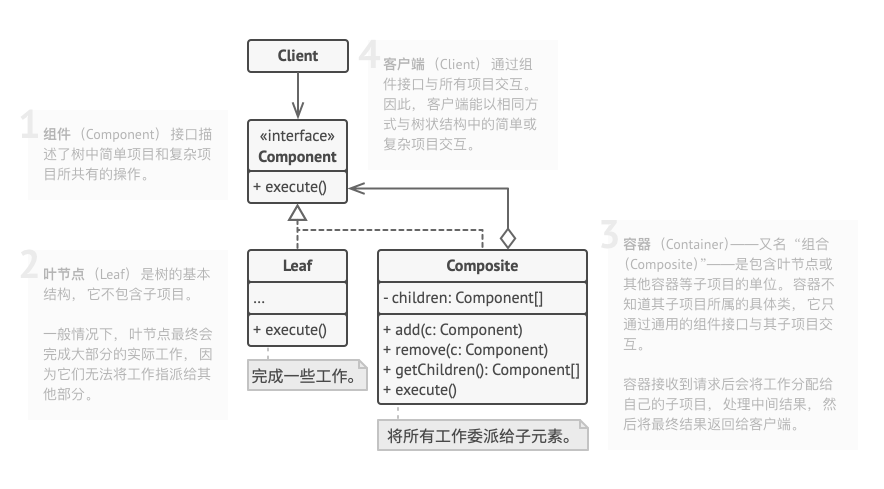

## 前言

Hi Coder，我是 CoderStar！

今天主要给大家分享的内容是三种设计模式 (**命令模式**、**中介者模式**以及**组合模式**) 及其它们在 `AppDelegate` 解耦场景下的应用，特别是组合模式，沉淀出相应的轮子分享给大家。

同时也给大家说下后面关于设计模式系列的文章计划，因为设计模式相关文章会结合我们开发中实际上会遇到的场景进行整理，所以发文可能不连续，希望大家理解，我会将大部分设计模式的代码示例全部整理到 [DesignPatternsDemo](https://github.com/Coder-Star/DesignPatternsDemo) 仓库中，形式为 `Playground`，所以代码示例中可能会有一些手动调用系统函数的情况出现。

> 同时给大家推荐一个学习设计模式的好网站 --[深入设计模式](https://refactoringguru.cn/design-patterns)，文章中涉及的部分 UML 图也来自该网站。

## 场景

`AppDelegate` 是应用程序的根对象，即唯一代理，可以认为是每个 iOS 项目的核心。

- 其提供应用程序生命周期事件的暴露；

- 其确保应用程序与系统以及其他应用程序正确的交互；

- 其通常承担很多职责，这使得很难进行更改，扩展和测试。

随着业务的迭代升级，不断增加新的功能和业务，`AppDelegate` 中的代码量也不断增长，致使其 `Massive`。`AppDelegate` 中常见的业务会包括：

- 生命周期中的事件处理及传播；

- 管理 UI 堆栈配置：选择初始视图控制器，执行根视图控制器转换；

- 管理后台任务；

- 管理通知；

- 三方库初始化；

- 管理设备方向；

- 设置 UIAppearance；

- ...

并且因为 `AppDelegate` 会影响整个 APP，所以在面对复杂的 `AppDelegate` 时，我们就会小心翼翼，生怕自己自己的改动影响到其他的功能。所以说 **`AppDelegate` 的简洁和清晰对于健康的 iOS 架构来说是至关重要的。**

下面我们利用上述三种设计模式实现对 `AppDelegate` 的解耦，使其优雅。

## 命令模式

**命令模式（Command）** 是一种 **行为设计模式**，它可将请求转换为一个包含与请求相关的所有信息的独立对象。该转换让你能根据不同的请求将方法参数化、延迟请求执行或将其放入队列中，且能实现可撤销操作。

### UML



### 实现方式

- 声明**仅有一个执行方法**的命令接口。

- 抽取请求并使之成为实现命令接口的具体命令类。每个类都必须有一组成员变量来保存请求参数和对于实际接收者对象的引用。所有这些变量的数值都必须通过命令构造函数进行初始化。

- 找到担任发送者职责的类。 在这些类中添加保存命令的成员变量。发送者只能通过命令接口与其命令进行交互。发送者自身通常并不创建命令对象，而是通过客户端代码获取。

- **修改发送者使其执行命令，而非直接将请求发送给接收者。**

- 客户端必须按照以下顺序来初始化对象：

- 创建接收者。

- 创建命令，如有需要可将其关联至接收者。

- 创建发送者并将其与特定命令关联。

### 代码示例

```swift
import UIKit

// MARK: - 命令接口
protocol AppDelegateDidFinishLaunchingCommand {
    func execute()
}

// MARK: - 初始化三方命令
struct InitializeThirdPartiesCommand: AppDelegateDidFinishLaunchingCommand {
    func execute() {
        print("InitializeThirdPartiesCommand 触发")
    }
}

// MARK: - 初始化rootViewController
struct InitialViewControllerCommand: AppDelegateDidFinishLaunchingCommand {
    let keyWindow: UIWindow

    func execute() {
        print("InitialViewControllerCommand 触发")
        keyWindow.rootViewController = UIViewController()
    }
}

// MARK: - 命令构造器
final class AppDelegateCommandsBuilder {
    private var window: UIWindow!

    func setKeyWindow(_ window: UIWindow) -> AppDelegateCommandsBuilder {
        self.window = window
        return self
    }

    func build() -> [AppDelegateDidFinishLaunchingCommand] {
        return [
            InitializeThirdPartiesCommand(),
            InitialViewControllerCommand(keyWindow: window),
        ]
    }
}

// MARK: - AppDelegate
/// 充当发送者、客户端的作用
class AppDelegate: UIResponder, UIApplicationDelegate {
    var window: UIWindow?

    func application(_ application: UIApplication, didFinishLaunchingWithOptions launchOptions: [UIApplication.LaunchOptionsKey: Any]?) -> Bool {

        window = UIWindow()

        AppDelegateCommandsBuilder()
            .setKeyWindow(window!)
            .build()
            .forEach { $0.execute() }
        return true
    }
}


// MARK: - 手动调用
AppDelegate().application(UIApplication.shared, didFinishLaunchingWithOptions: nil)
```

其实上述改造并不是完全严格遵循的命令模式，比如没有接收者角色，发送者和客户端实际上并没有完全分离开，同时 `AppDelegateCommandsBuilder` 实际上是一种建造者模式，这种模式其实也比较常用，后续也会对这种模式进行单独讲解。如果想看角色完整的命令模式代码示例，可见 [command代码示例](https://refactoringguru.cn/design-patterns/command/swift/example#example-0)。

使用命令模式改造 `AppDelegate` 后，当我们需要在回调中增加处理逻辑时，我们无需再修改 `AppDelegate`，而是直接增加相应的 `Command` 类，并且在 `AppDelegateCommandsBuilder` 添加上去即可。

那这种方式的弊端想必大家可以很明显的看出来，上述代码示例只是把 `didFinishLaunch` 方法进行了解耦，对其他方法并没有进行改造，如果对其他方法进行改造，也需要实现上述一套，会有些冗余。

## 中介者模式

**中介者模式（Mediator）** 是一种 **行为设计模式**，能让你减少对象之间混乱无序的依赖关系。该模式会限制对象之间的直接交互， 迫使它们通过一个中介者对象进行合作。

其实开发者对于中介者模式应该是非常熟悉，因为 MVC 模式中，C 就是一个典型的中介者，其限制了 M 与 V 之间的直接交互。

### UML



### 代码示例

```swift
import UIKit

// MARK: - 生命周期事件接口
protocol AppLifecycleListener {
    func onAppWillEnterForeground()
    func onAppDidEnterBackground()
    func onAppDidFinishLaunching()
}

// MARK: - 接口默认实现，使实现类可以对方法进行可选实现
extension AppLifecycleListener {
    func onAppWillEnterForeground() {}
    func onAppDidEnterBackground() {}
    func onAppDidFinishLaunching() {}
}

// MARK: - 实现类
class AppLifecycleListenerImp1: AppLifecycleListener {
    func onAppDidEnterBackground() {

    }
}

class AppLifecycleListenerImp2: AppLifecycleListener {
    func onAppDidEnterBackground() {

    }
}

// MARK: - 中介者
class AppLifecycleMediator: NSObject {
    private let listeners: [AppLifecycleListener]

    init(listeners: [AppLifecycleListener]) {
        self.listeners = listeners
        super.init()
        subscribe()
    }

    deinit {
        NotificationCenter.default.removeObserver(self)
    }

    /// 订阅生命周期事件
    private func subscribe() {
        NotificationCenter.default.addObserver(self, selector: #selector(onAppWillEnterForeground), name: UIApplication.willEnterForegroundNotification, object: nil)
        NotificationCenter.default.addObserver(self, selector: #selector(onAppDidEnterBackground), name: UIApplication.didEnterBackgroundNotification, object: nil)
        NotificationCenter.default.addObserver(self, selector: #selector(onAppDidFinishLaunching), name: UIApplication.didFinishLaunchingNotification, object: nil)
    }

    @objc private func onAppWillEnterForeground() {
        listeners.forEach { $0.onAppWillEnterForeground() }
    }

    @objc private func onAppDidEnterBackground() {
        listeners.forEach { $0.onAppDidEnterBackground() }
    }

    @objc private func onAppDidFinishLaunching() {
        listeners.forEach { $0.onAppDidFinishLaunching() }
    }

    // MARK: - 如需增加新的Listener，修改此处即可
    public static func makeDefaultMediator() -> AppLifecycleMediator {
        let listener1 = AppLifecycleListenerImp1()
        let listener2 = AppLifecycleListenerImp2()
        return AppLifecycleMediator(listeners: [listener1, listener2])
    }
}

class AppDelegate: UIResponder, UIApplicationDelegate {
    var window: UIWindow?

    /// 构建监听者，内部自动订阅生命周期通知
    let mediator = AppLifecycleMediator.makeDefaultMediator()

    func application(_ application: UIApplication, didFinishLaunchingWithOptions launchOptions: [UIApplication.LaunchOptionsKey: Any]?) -> Bool {
        return true
    }
}
```

可以看到上面 `AppLifecycleMediator` 很明显是一个中介者，生命周期事件通过其得以传播给具体的使用者。

其实中介者模式在组件化通信方案中也比较常用，后面有时间会给大家介绍一下，如果大家有兴趣也可以自己去了解一下，也就是我们常说的 `CTMediator` 方案。

## 组合模式

**组合模式** 是一种 **结构型设计模式**，你可以使用它将对象组合成树状结构，并且能像使用独立对象一样使用它们。

### UML



类比到 `AppDelegate` 场景下，`AppDelegate` 是一个根 `Composite` 角色，而各个业务便是 `Leaf` 角色，如果应用到组件化中，则各个组件便是 `Leaf` 角色或者 `Composite` 角色（组件内部可再分发到各个业务 `Leaf`）。

### 代码示例

```swift
// MARK: - 接口，直接继承UIApplicationDelegate, UNUserNotificationCenterDelegate两个协议。

/// 空协议，各组件模块去实现该协议
public protocol ApplicationService: UIApplicationDelegate, UNUserNotificationCenterDelegate {}

/// 方便组件内获取window
extension ApplicationService {
    /// window
    public var window: UIWindow? {
        // swiftlint:disable:next redundant_nil_coalescing
        return UIApplication.shared.delegate?.window ?? nil
    }
}


// MARK: - AppDelegate继承
open class ApplicationServiceManagerDelegate: UIResponder, UIApplicationDelegate {
    /// 子类需要在构造函数中对其进行赋值
    public var window: UIWindow?

    /// 交由子类去重写，返回含有各模块实现ApplicationService的类名称的plist文件地址
    /// plist文件需要是NSArray类型
    open var plistPath: String? { return nil }

    /// 交由子类去重写，返回各模块实现ApplicationService的类
    open var services: [ApplicationService] {
        guard let path = plistPath else {
            return []
        }
        guard let applicationServiceNameArr = NSArray(contentsOfFile: path) else {
            return []
        }
        var applicationServiceArr = [ApplicationService]()
        for applicationServiceName in applicationServiceNameArr {
            if let applicationServiceNameStr = applicationServiceName as? String, let applicationService = NSClassFromString(applicationServiceNameStr), let module = applicationService as? NSObject.Type {
                let service = module.init()
                if let result = service as? ApplicationService {
                    applicationServiceArr.append(result)
                }
            }
        }
        return applicationServiceArr
    }

    public func getService(by type: ApplicationService.Type) -> ApplicationService? {
        for service in applicationServices where service.isMember(of: type) {
            return service
        }
        return nil
    }

    /// 懒加载获取计算属性services，使其只计算一次
    private lazy var applicationServices: [ApplicationService] = {
        self.services
    }()
}

// MARK: - 协议默认实现，将事件分发到各Leaf
extension ApplicationServiceManagerDelegate {
    @available(iOS 3.0, *)
    open func application(_ application: UIApplication, didFinishLaunchingWithOptions launchOptions: [UIApplication.LaunchOptionsKey: Any]? = nil) -> Bool {
        var result = false
        for service in applicationServices {
            if service.application?(application, didFinishLaunchingWithOptions: launchOptions) ?? false {
                result = true
            }
        }
        return result
    }

    /**
    将协议方法一一实现，并将事件分发到各Leaf
    */
}

// MARK: - 使用方式

final class AppThemeApplicationService: NSObject, ApplicationService {
    func application(_ application: UIApplication, didFinishLaunchingWithOptions launchOptions: [UIApplication.LaunchOptionsKey: Any]? = nil) -> Bool {
        /// setup AppTheme
        return true
    }
}

final class AppConfigApplicationService: NSObject, ApplicationService {
    func application(_ application: UIApplication, didFinishLaunchingWithOptions launchOptions: [UIApplication.LaunchOptionsKey: Any]? = nil) -> Bool {
        /// setup AppConfig
        return true
    }
}

@UIApplicationMain
class AppDelegate: ApplicationServiceManagerDelegate {
     override var services: [ApplicationService] {
         return [
           AppConfigApplicationService(),
           AppThemeApplicationService(),
         ]
     }

     override init() {
         super.init()
         if window == nil {
             window = UIWindow()
         }
     }
}
```

从上述代码示例我们可以看出每个 `Leaf` 实现了 `ApplicationService` 协议，其可以拿到原本 `AppDelegate` 能拿到的所有回调。

对于 `AppDelegate` 而言，其内部不会再有任何业务上的逻辑，并且因为协议的默认实现，已经将任务默认分发到各个 `Leaf` 中，其剩余的任务仅仅就是提供 `Leaf` 列表，并且考虑到在组件化环境中的使用，不直接引用各 `Leaf`，提供了 `plist` 配置文件的形式。

对该套解耦方案进行完善，沉淀出的轮子地址为 [ApplicationServiceManager](https://github.com/Coder-Star/LTXiOSUtils/blob/master/LTXiOSUtils/Classes/Util/ApplicationServiceManager.swift)。功能比较轻量级，欢迎大家使用。

关于 `AppDelegate` 的解耦其实还有阿里的 [BeeHive](https://github.com/alibaba/BeeHive)，不过其是一个综合的组件化方案，`AppDelegate` 的事件分发只是其一部分。

## 最后

上述的三种设计模式可以根据各自项目的实际情况进行选用或者组合，比如说壳工程将事件分发到各组件内部可以选用组合模式，组件内部的事件分发可以选用命令或者中介者模式。

要更加努力呀！

Let's be CoderStar!

参考资料

- [Refactoring Massive App Delegate](https://www.vadimbulavin.com/refactoring-massive-app-delegate/)
