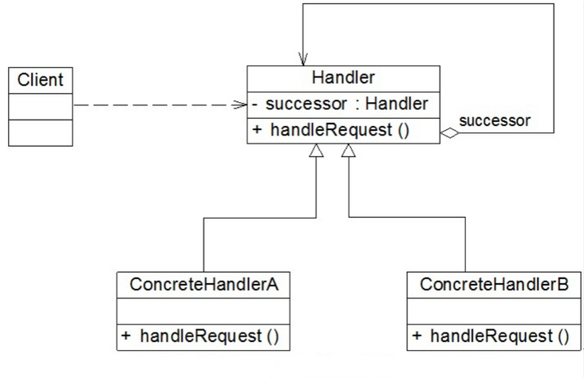
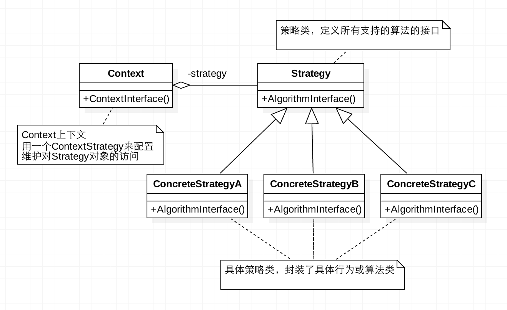

## 前言

Hi Coder，我是 CoderStar！

今天主要是给大家分享一下两种设计模式，即责任链模式以及策略模式。至于为什么想着给大家分享这两种设计模式呢，这源于我之前对扫码场景的相关代码优化，下面我将结合我遇到这个的场景给大家讲一下这两种设计模式。

顺便我也表达一点我对设计模式的看法，设计模式需要结合一定的使用场景才会体现才会它的妙处，大家在平时在开发时觉得哪些地方的代码不简洁优雅，都可以思考一下应用哪种设计模式可以对其进行优化、解耦，但也需要注意，不要对设计模式生搬硬套。

同时本篇文章也将是设计模式系列的开篇作了，后面也会慢慢给大家介绍其他的设计模式及其应用的场景。

## 场景及一般实现

有一个场景，想必大家都遇到过，就是扫描不同的二维码根据扫描结果跳转进入到不同的功能页面，如登录、加好友等等。我们拿到结果后需要对内容进行校验，是否是我们需要的信息，然后做一些特殊的处理。比如先判断是不是一个 url 链接，是则打开这个链接，不是的话进行下一种判断，比如是否是项目中的约定的跳转某个功能的信息... 依次下去。

> 因代码篇幅，后面代码示例也只体现登录、加好友两个 case。

普通的写法便是通过 `if-else` 或者 `switch-case` 对条件进行判断继而执行不同的分支。

```swift
func onScanResult(type: String) {
    switch type {
      case "login":
         // TODO 登录的相关逻辑
      case "addContacts"
         // TODO 添加联系人的相关逻辑

      // 此处省略99种分支判断
      ...

      default:
        break

    }
}
```

> 上述示例逻辑相对简单，可推理到业务，有可能登录、添加联系人内部逻辑都很复杂，并且还有可能分支判断不是简单的根据 type 来判断，而是根据很多条件综合来判断。

简单的示例如上所示，那这种方法不好的的地方也显而易见：

- 代码臃肿：当出现很多种情况需要处理时，会出现很多的 `if-else`，并且相关的逻辑可能会比较复杂，大量的代码堆积到一个文件中去；
- 每增加一种处理，就需要改动代码新增一个判断分支；
- 条件判断的顺序是写死的，如果想改变顺序，只能调整判断分支的前后顺序。

下面我们看一下利用责任链模式是如何优化这个场景下的代码设计的。

## 责任链模式

**责任链模式 (Chain Of Responsibility Pattern)**是**行为模式**中的一种，又称**职责链模式**，将请求沿着一条链传递，直到该链上的某个对象处理它为止，其 UML 图如下所示：



> - Handler（抽象处理者）： 定义一个处理请求的接口，提供对后续处理者的引用
> - ConcreteHandler（具体处理者）： 抽象处理者的子类，处理用户请求，可选将请求处理掉还是传给下家；在具体处理者中可以访问链中下一个对象，以便请求的转发。

### 代码示例

我们就以上面二维码扫描结果分发场景为例子，给出代码示例：

我们先定义 UML 图中的 `Handler`，其一般是一个抽象类或者接口，那在 swift 中的体现便是一个 `protocol` 了。

**抽象处理者 `Handler`**

```swift
protocol QRCodeScanHandler: AnyObject {
    var nextHandler: QRCodeScanHandler? { get set }

    @discardableResult
    func setNext(handler: QRCodeScanHandler) -> QRCodeScanHandler

    /// 这里返回值为bool值，用来标识请求是否被正确处理，供客户端等使用
    func handle(info: Any?) -> Bool?
}

// MARK: - 协议的默认实现
extension QRCodeScanHandler {
    // 默认设置下一个节点的实现
    func setNext(handler: QRCodeScanHandler) -> QRCodeScanHandler {
        nextHandler = handler
        return handler
    }
    // 节点处理的默认实现，默认不实现，直接交由下个节点
    func handle(info: Any?) -> Bool? {
        return nextHandler?.handle(info: info)
    }
}
```

**具体处理者 `ConcreteHandler`**

```swift
// MARK: - 登录处理者
class QRCodeScanLoginHandler: QRCodeScanHandler {
    var nextHandler: QRCodeScanHandler?

    func handle(info: Any?) -> Bool? {
        guard let dict = info as? [String: String], let type = dict["type"], type == "login" else {
            return nextHandler?.handle(info: info)
        }
        Log.d("登录码")
        return true
    }
}

// MARK: - 加好友处理者
class QRCodeScanBusinessCardHandler: QRCodeScanHandler {
    var nextHandler: QRCodeScanHandler?

    func handle(info: Any?) -> Bool? {
        guard let dict = info as? [String: String], let type = dict["type"], type == "businessCard" else {
            return nextHandler?.handle(info: info)
        }
        Log.d("名片码")
        return true
    }
}
```

**客户端 `Client`**

```swift
class QRCodeScanManager {
    public static func main() {
        let startHandler = QRCodeScanLoginHandler()
        startHandler
            .setNext(handler: QRCodeScanBusinessCardHandler())
            .setNext(handler: XXX)
            // 继续下一个节点
            ...

        //
        guard let result = startHandler.handle(info: ["type": "login", "message": "登录"]), result else {
            // TODO: - 每个节点都没有成功处理，执行相关逻辑
            return
        }
    }
}
```

> 当然，客户端去生成责任链的方式还有很多种，如数组遍历等，大家根据自己的情况自行选择。

### 总结

其实责任链模式也可以大致分为两种：

- **纯责任链模式**：一个请求必须被某一个处理者对象所接收。对于具体处理者，要么自己处理要么下发给下一个具体处理者；
- **不纯责任链模式**：一个请求被一个处理者处理了一部分，将剩下的交给下一个具体处理者；

比如上述扫码结果分发在开始需要对扫描的结果进行统一的校验或认证，那就需要增加一个节点并作为头节点，在处理后校验通过并进入到下一个节点，如果不通过则直接返回，这便是不纯责任链模式的体现。

那责任链模式还可以应用或已经应用在哪些场景下呢？

- 推送消息的页面跳转
- java 网络请求框架 OkHttp（典型的不纯责任链模式，每经过一层，都加点东西）
- ...

总结一下责任链模式的优缺点：

**优点**

- 降低耦合度，分离了请求与处理，无须知道是哪个对象处理其请求；
- 链中的节点对象可以灵活地拆分重组。增加或者删除一个节点，或者改变节点在链中的位置都是轻而易举的事情；我们可以根据业务处理的可能性高低设置节点的先后顺序；
- 可以手动指定起始节点，请求并不是非得从链中的第一个节点开始传递；
- 扩展容易，新增具体请求处理者，只需要在客户端重新建链即可，无需破坏原代码。

**缺点**

- 没有明确的处理者，请求可能最后都没有被处理。在这种情况下，我们一般需要在链尾增加一个保底的接受者节点来处理这种即将离开链尾的请求。
- 较长的职责链，请求的处理可能涉及到多个处理对象，系统性能将受到一定影响，而且在进行代码调试时不太方便；
- 靠客户端维护节点顺序，如果建链不当，可能会造成循环调用，将导致系统陷入死循环。

## 策略模式

在使用责任链模式对扫码结果分发这部分代码进行优化之后，我开始思考该场景下还有哪些设计模式比较适用？经过分析思考，觉得策略模式可能也是一剂良药（当然也不是单一的策略模式，还包含了简单工厂模式）。

**策略模式（Strategy**）也是一种行为型模式，其定义了一系列的算法，并将每一个算法封装起来，而且使它们还可以相互替换。策略模式让算法独立于使用它的客户而独立变化。

UML 图如下所示：



> - Context：用来操作策略的上下文环境；
> - Stragety：策略的抽象；
> - ConcreteStrategy 类：每种策略具体的实现方法。

对应到上面扫码场景，实际上我们支持的每一种跳转方式都是一种策略，我们拿到扫码结果后根据其内容选择合适的策略即可。

### 代码示例

直接看整段代码吧，细节看注释

```swift

// MARK: - 策略的抽象
protocol QRCodeScanStrategy {
     /// 处理抽象方法
    func deal(info: Any?)
}

// MARK: - 策略的具体实现
struct QRCodeScanLoginStrategy: QRCodeScanStrategy {
    func deal(info: Any?) {
       // TODO: - 登录相关逻辑
    }
}

struct QRCodeScanBusinessCardStrategy: QRCodeScanStrategy {
    func deal(info: Any?) {
        // TODO: - 加好友相关逻辑
    }
}

// MARK: - 用来操作策略的上下文环境
class QRCodeScanContext {
    private var strategy: QRCodeScanStrategy?

    init(strategy: QRCodeScanStrategy) {
        self.strategy = strategy
    }

    public func deal(info: Any?) {
        strategy?.deal(info: info)
    }
}

// MARK: - 调用策略
class QRCodeScanManager {
    public static func main() {
        switch type {
        case "login":
            QRCodeScanContext(strategy: QRCodeScanLoginStrategy()).deal(info: ["type": "login", "message": "登录"])
        case "addContacts"
             QRCodeScanContext(strategy: QRCodeScanBusinessCardStrategy()).deal(info: ["type": "addContacts", "message": "加好友"])
             default:
            break
        }
    }
}
```

看到上面的代码示例，可能就有读者说了，你这没解决问题啊，`if-else` 还在。

确实是这样，上述的策略模式只是解决了将每个判断分支里面的逻辑进行了整合，即使用策略模式实现目的一致，但行为不一致的场景，但选用何种策略模式需要额外的控制。

那接下来我们解决一下 `if-else` 的问题，我们主要是要修改一下 `QRCodeScanContext` 里面的代码。

```swift
class QRCodeScanContext {
    private var strategy: QRCodeScanStrategy?
    /// 根据条件选择合适的Strategy
    init(type: Sting) {
        switch type {
        case "login":
            strategy = QRCodeScanLoginStrategy()
        case "addContacts":
            strategy = QRCodeScanBusinessCardStrategy()
        default:
            /// 执行兜底逻辑
            break
        }
    }

    public func deal(info: Any?) {
        strategy?.deal(info: info)
    }
}

class QRCodeScanManager {
    public static func main() {
        let info = ["type": "login", "message": "登录"]
        if let type = info["type"] as? String {
            QRCodeScanContext(strategy: type).deal(info: info)
        }
    }
}
```

如上所示，我们其实是将判断移到了 `Context` 中去，其实这也算是简单工厂模式的一种体现，当然我们也可以专门新建一个工厂类，将判断逻辑移动到工厂类中去，关于简单工厂模式后面会单独讲，这里就不展开说了。

### 总结

**优点**

将具体的算法实现从业务逻辑中剥离出来，成为一系列独立算法类，使得它们可以相互替换，以避免使用多重条件判断语句（把采取哪一种算法或采取哪一种行为的逻辑与算法或行为的逻辑混合在一起）。

**缺点**

- 客户端必须知道所有的策略类，并自行决定使用哪一个策略类。这就意味着客户端必须理解这些算法的区别，以便适时选择恰当的算法类。**换言之，策略模式只适用于客户端知道所有的算法或行为的情况。**
- 由于策略模式将每个具体的算法都单独封装为一个策略类，如果可选的策略有很多的话，那对象的数量也会很多。

## 最后

我们结合扫码这个场景的实际情况再回顾一下这两个设计模式。

我们先看策略模式，我们其实还是需要去判断选用何种策略，那么当判断选用何种策略的逻辑相对复杂的时候实际上还是责任链模式比较适合一些，因为责任链模式可以将判断逻辑全部写在自己内部，每个节点之间相互独立，互不影响。

再看责任链模式，客户端的节点串联需要特别注意，不要出现环形，而且其节点先后顺序最好是按照扫描结果其处理的可能性从大到小，减少节点传递的性能损耗。

对于两种设计模式，我们肯定都需要提供兜底的跳转方式，如直接显示出扫描结果。

设计模式没有一个标准规定的写法，关键在于你怎么去融汇贯通，大家要结合自己的使用场景灵活使用设计模式。用着用着你就会发现自己在模块设计甚至系统设计都会再上一个层次。

之前收集了一些设计模式相关书籍的电子版，大家可以在公众号回复**设计模式**进行领取。

新的一周要更加努力呀！

Let's be CoderStar!
