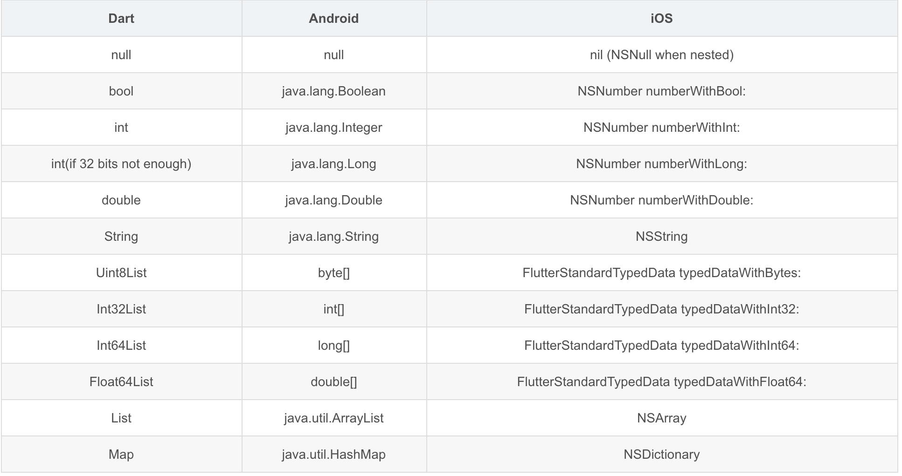

## Flutter 与 Native 通信方式

- BasicMessageChannel：用于传递字符串和半结构化的信息, 这个用的比较少，相互调用
- MethodChannel：用于传递方法调用（method invocation）通常用来调用 native 中某个方法，相互调用
- EventChannel: 用于数据流（event streams）的通信。有监听功能，比如电量变化之后直接推送数据给 flutter 端，**原生发送消息,flutter 接收**，单向通信。

Channel 提供标准的消息解码器来为我们在发送及接收数据自动进行序列化及序列化；

支持的数据类型

codec，MessageCodecx 协议

- JSONMessageCodec
  JSONMessageCodec 用于基础数据与二进制数据之间的编解码，其支持基础数据类型以及列表、字典。其在 iOS 端使用了 NSJSONSerialization 作为序列化的工具，而在 Android 端则使用了其自定义的 JSONUtil 与 StringCodec 作为序列化工具
- BinaryCodec
  BinaryCodec 是最为简单的一种 Codec，因为其返回值类型和入参的类型相同，均为二进制格式（Android 中为 ByteBuffer，iOS 中为 NSData）。实际上，BinaryCodec 在编解码过程中什么都没做，只是原封不动将二进制数据消息返回而已。或许你会因此觉得 BinaryCodec 没有意义，但是在某些情况下它非常有用，比如使用 BinaryCodec 可以使传递内存数据块时在编解码阶段免于内存拷贝。
- StringCodec
  StringCodec 用于字符串与二进制数据之间的编解码，其编码格式为 UTF-8。
- StandardMessageCodec
  是 BasicMessageChannel 的默认编解码器，其支持基础数据类型、二进制数据、列表、字典

### MethodChannel

## Bitcode

iOS工程与Flutter混编时 是可以允许Bitcode的

[Flutter-Bitcode](https://www.eyrefree.org/2020/11/17/Flutter-Bitcode/)