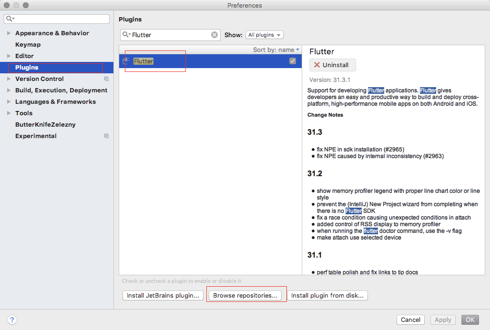

## 1、下载Flutter

```git
git clone -b master https://github.com/flutter/flutter.git
```

## 2、配置环境变量

```vim
vim ~/.bash_profile

//加入内容
export PATH=/你的flutter文件夹所在位置/flutter/bin:$PATH
export PUB_HOSTED_URL=https://pub.flutter-io.cn
export FLUTTER_STORAGE_BASE_URL=https://storage.flutter-io.cn

source ~/.bash_profile
flutter -h //显示相关帮助
```

## 3、检查环境

```flutter
flutter doctor
flutter doctor --android-licenses
```

## 4、Android Studio 安装Flutter插件

