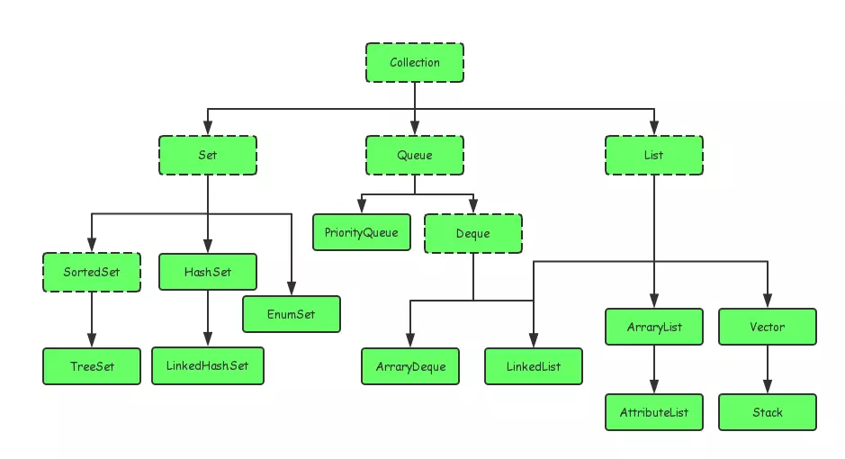
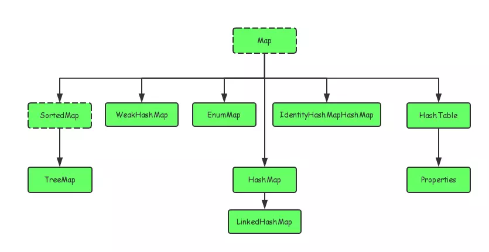

## 1、基本概念
### 1、JVM、JRE、以及JDK（以Windows为例）

* 1、JVM是JAVA虚拟机(java.exe)，是JAVA能够实现跨平台的关键部分；
* 2、JRE = JRE + rt.jar基础类库；
* 3、JDK是在JRE的基础上加上了一些程序开发所需要的程序及Jar包；如编译器（javac.exe）、开发工具（javadoc.exe、jar.exe、keytool.exe、jconsole.exe），Jar包包括dt.jar、tools.jar等
  
其中rt.jar包为所有核心Java 运行环境的已编译class文件的集合;tools.jar是系统用来编译一个类的时候用到的，即执行javac所需要用到的；dt.jar包是关于运行环境的类库，主要是swing包。

## 2、Java语法

### 1、集合

#### 1、接口

Java的集合类主要由两个接口派生而出：**Collection**和**Map**。

* Collection

* Map

#### 2、工具类

集合框架中的工具类，**Collections**与**Arrays**，这两个工具类中的方法都是静态的。

* Collections
用于操作集合。
* Arrays
用于操作数组。