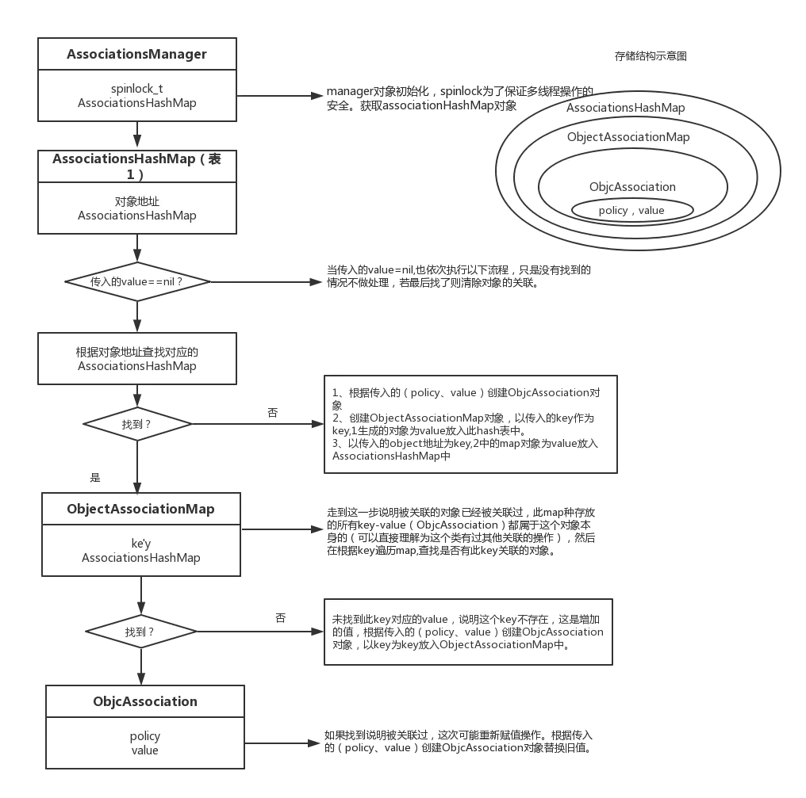
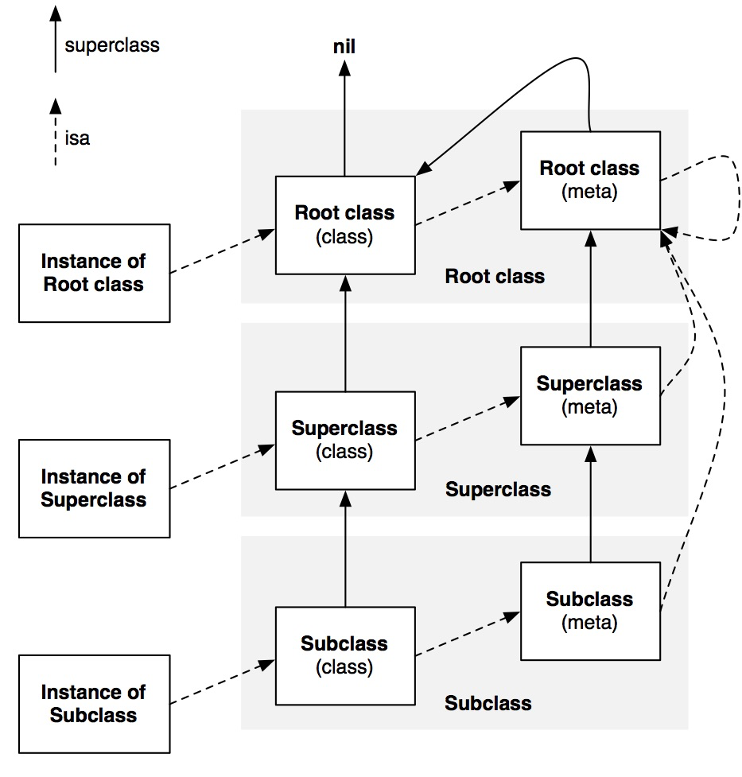

## 数据类型

因为 OC 是在 C 的基础上发展而来，所以天然会携带 C 的一些数据类型，如：

- int
- float
- double
- char
- bool

除了上图中基本类型之外，还有一些类型限定修饰词

short 短型，修饰 int、double；
long 长型，修饰 int、double；
signed 有符号型，修饰 int、char；
unsigned 无符号型，修饰 int、char；

> 这些限定词经常用来限定 int 型，在限定 int 类型时 int 可以省略；

## 修饰符

在.h 中使用`@property`声明的属性，必须在.m 中使用 @synthesize 或者 @dynamic 来实现，iOS6 以后可省略实现，默认自动合成；

- @property 自动生成属性 setter 和 getter 方法的声明，自动生成对应的实例变量 (下划线 + 属性名)，在`声明`中。
- @synthesize 生成实例变量（开发人员可设置）及属性 setter 和 getter 方法的声明，在实现中；
- @dynamic 实例变量，属性 setter 和 getter 方法由用户自己实现，不自动生成，在实现中；

当属性是只读属性，但是重写了 getter 方法，系统不会自动生成成员变量。当属性可读可写，同时重写了 setter/getter 方法，系统不会为你自动生成成员变量，但是如果只重写其中一个，系统还是会自动生成。

@property 有两个对应的词，一个是 @synthesize，一个是 @dynamic。如果 @synthesize 和 @dynamic 都没写，那么默认的就是 @syntheszie var = _var; （自动合成的）。正常情况下，我们都是使用自动合成的，一般用不上 @synthesize 及 @dynamic。

### @synthesize

什么情况下需要使用 @synthesize 呢？

- 实现了带有 property 属性的 protocol，实现类声明里面不需要再添加`@property`。
- 修改生成的成员变量名字；
- 重写了只读属性的 getter 时；
- 同时重写 setter 和 getter 时；

怎么用呢？

```objective-c
// .h文件
@property (nonatomic, readonly, unsafe_unretained) int i;

// .m文件
@synthesize i = __i; // __i为指定的实例变量，@synthesize i相当于 @synthesize i = i;
```

### @dynamic

其主要的作用就是用在 NSManageObject 对象的属性声明上，由于此类对象的属性一般是从 Core Data 的属性中生成的，Core Data 框架会在程序运行的时候为此类属性生成 getter 和 Setter 方法。

### @property 属性修饰符

**内存管理**

- retain 属性必须是 objc 对象，此时输入会增加对象的引用计数加 1，MRC 模式下使用

- strong 表示只要该属性一直指向某个对象，这个对象就不会被销毁，与 retain 效果一样，在 ARC 模式下使用
- copy 属性必须是 objc 对象，并遵守了 NSCopying 协议；在赋值时使用传入一份拷贝，拷贝工作由 copy 方法执行，将指向新的内存地址，常常用于 (NSArray,NSDictionary,NSString)，释放旧对象
- assign 简单直接赋值，不更改索引计数，适用简单数据类型（如 NSInteger,double,bool）。也可以修改对象，但是对象释放后，指针地址还存在没有置为 nil，造成野指针；
- weak 表示只是指向对象，不隐式发送 retain, 指向对象一旦被销毁就会自动 nil 化
- `__unsafe_unretained` 功能几乎等同于 weak, 但是对象被销毁不会自动 nil 化， 成了野指针

> 当修饰可变类型的属性时，如 NSMutableArray、NSMutableDictionary、NSMutableString，用 strong。
> 当修饰不可变类型的属性时，如 NSArray、NSDictionary、NSString，用 copy。

**setter、getter**

```objective-c
@property (nonatomic, readonly, getter=isFinalized) BOOL finalized;
@property (nonatomic, setter=setFinalized, getter=isFinalized) BOOL finalized;
```

**读写权限**

- readwrite 可读可写，会生成 getter 和 setter 方法
- readonly 是只能读取，只会生成 getter 方法，不会生成 setter 方法，在值不想被外界修改时使用

**原子性**

- nonatomic 非原子性，与 atomic 是相反的
- atomic 原子性，在多线程的环境下是有必要的，会在 setter 里加锁，保证线程安全, 效率降低，底层加锁的方式为 spinlock_t 自旋锁来实现的，在 iOS10 之后，底层换成了`os_unfair_lock`

> atomic 不是一定线程安全的，如果一个对象的改变不是直接调用 getter/setter 方法，而是直接对对象内部属性修改、字符串拼接、数组增加和移除元素等操作，就不能保证这个对象是线程安全的。

**允许为空，iOS9 新关键字，用于引用类型**

- nullable/\_Nullable/\_\_nullable 告诉编译器表示值可以空
- nonnull/\_\_nonnull/\_Nonnull 表示不可以为 nil，NULL， 不遵守规定编译器会警告
- null_resettable get 不能返回空, set 可以为空，如果使用，必须重写 set 或者 get 方法，处理传递值为空的情况
- \_Null_unspecified 不确定是否为空

```objective-c
// nonnull
@property (nonatomic, copy, nonnull) NSString *name;
@property (nonatomic, copy) NSString * _Nonnull name;
@property (nonatomic, copy) NSString * __nonnull name;
// 方法时使用
- (nonnull NSString *)test:(nonnull NSString *)name;
- (NSString * _Nonnull)test1:(NSString * _Nonnull)name;

// nullable
@property (nonatomic, copy, nullable) NSString *name;
@property (nonatomic, copy) NSString *_Nullable name;
@property (nonatomic, copy) NSString *__nullable name;

// null_resettable
@property (nonatomic, copy, null_resettable) NSString *name;

// _Null_unspecified
@property (nonatomic, strong) NSString *_Null_unspecified name;
@property (nonatomic, strong) NSString *__null_unspecified name;

```

关于 ARC 下，不显示指定属性关键字时，默认关键字：

- 基本数据类型：atomic readwrite assign
- 普通 OC 对象： atomic readwrite strong

## @import、#import、 #include、@class

### `#include`

`#include` 是 C/C++ 导入头文件的关键字；

* ＃include <>：引用系统文件，它用于对系统自带的头文件的引用，编译器会在系统文件目录下去查找该文件。
* #include " "：用户自定义的文件用双引号引用，编译器首先会在用户目录下查找，然后到安装目录下查找，最后在系统文件中查找。

> 这个结论对`#import`同样有效。

`#include`这种形式的本质就是将导入的.h 文件直接拷贝过来，并且有重复引用问题。

比如类 A、B 都同时引用了 C，然后类 D 又同时引用类 A、B，这时类 D 就会导入两份 C，造成重复引用，这时编译器就会提示对 C 重复引用的错误，所以你会经常看到这样的模板代码。

```objective-c
#ifndef _CLASSC_H

#define _CLASSC_H
#include "ClassC.h"

#endif
```

### `#import`

`#import` 是 OC 导入头文件的关键字；

`#import`相对`#include`这种形式就会解决上述提到的重复引用问题，因为这种形式内部会做判断，如果已经导入过一次这个.h 文件就不会再次导入这个文件了。

至于

### @class

@class 用在 `.h` 文件中，作用是创建一个向前引用，是解决两个`.h` 文件互相引用的解决办法。

`@class B;`

### `@import`

`@import`是 `modulelar` 后之后引入模块的关键字；

## Extension & Category：分类

extension：扩展

- 可以给类添加成员变量及方法
- 添加的属性和方法是类的一部分，在编译期就决定的。在编译器和头文件的 @interface 和实现文件里的 @implement 一起形成了一个完整的类
- 伴随着类的产生而产生，也随着类的消失而消失
- 必须有类的源码才可以给类添加 extension，所以对于系统一些类，如 NSString，就无法添加类扩展

category：分类

- 给类添加新的方法
- 不能给类添加成员变量
- 通过 @property 定义的变量，只能生成对应的 getter 和 setter 的方法声明，但是不能实现 getter 和 setter 方法，同时也不能生成带下划线的成员属性
- 是运行期决定的，这也是没法添加成员变量的原因，因为在运行期，对象的内存布局已经确定，所以不允许再添加成员变量去修改内存布局。

分类同名方法会优先主类的方法使用。

多个分类中的同名方法会只执行一个, 即后编译的分类里面的方法会覆盖所有前面的同名方法。只调用 category 中方法的原因是：runtime 加载某个类的所有分类数据，将分类中的方法、属性、协议数据都合并到一个大数组中。而由于是倒序的方式遍历，所以后面参与编译的 Category 数据会在数组的前面。最后将合并后的分类数据插入到类原来数据的前面。

> class_ro_t 存放的是编译期间就确定的；而 class_rw_t 是在 runtime 时才确定，它会先将 class_ro_t 的内容拷贝过去，然后再将当前类的分类的这些属性、方法等拷贝到其中。所以可以说 class_rw_t 是 class_ro_t 的超集，当然实际访问类的方法、属性等也都是访问的 class_rw_t 中的内容；

其中 class_rw_t 本来是一个二维数组，其中该二维数组中每一个元素也是一个数组，从前到后的顺序依次为：

* 经过 class_addMethod(...) 动态添加的方法；
* 后编译的类的 category 中的方法；
* 先编译的类的 category 中的方法；
* 类实现的方法；

而在消息查找过程中，对于方法列表有序是指二维数组中的每一个一组数组自身是否有序，而不是整个二维数组是否有序。

其中实例方法和类方法的方法列表都会合并；

其中分类中定义存储属性使用关联对象，关联对象的存储存储在全局的 Map 中。



外面 Map，key 为对象地址，Value 还是一个 Map；
里面 Map，key 为对象属性名称，Value 为一个对象，属性包括关联指针以及关联值；

怎么调用到原来类中被 category 覆盖掉的方法？ 对于这个问题，我们已经知道 category 其实并不是完全替换掉原来类的同名方法，只是 category 在方法列表的前面而已，所以我们只要顺着方法列表找到最后一个对应名字的方法，就可以调用原来类的方法：

```objective-c
Class currentClass = [MyClass class];
MyClass *my = [[MyClass alloc] init];

if (currentClass) {
    unsigned int methodCount;
    Method *methodList = class_copyMethodList(currentClass, &methodCount);
    IMP lastImp = NULL;
    SEL lastSel = NULL;
    for (NSInteger i = 0; i < methodCount; i++) {
        Method method = methodList[i];
        NSString *methodName = [NSString stringWithCString:sel_getName(method_getName(method))
        								encoding:NSUTF8StringEncoding];
        if ([@"printName" isEqualToString:methodName]) {
            lastImp = method_getImplementation(method);
            lastSel = method_getName(method);
        }
    }
    typedef void (*fn)(id,SEL);

    if (lastImp != NULL) {
        fn f = (fn)lastImp;
        f(my,lastSel);
    }
    free(methodList);
}
```

## [self class] 和 [super class] 区别

两者打印出来的内容相同，我们首先了解一下 class 方法的作用，其就是返回 receiver 的类别。

`[self class]`就是发送消息 `objc_msgSend`，消息接收者 `self`，方法编号 `class`
`[super class]`本质就是 `objc_msgSendSuper`，消息的接收者还是 `self`，方法编号 `class`。只是调用 `objc_msgSendSuper` 的时候会直接跳过 `self` 查找，直接在从 `super` 出现的在的方法所在的类的父类开始查找进行查找。

## load 与 initialize

### load

当一个类或者分类被加载到 Objectie-C 的 Runtime 运行环境中时，会调用它对应的 +load 方法。对于所有静态库中和动态库中实现了 +load 方法的类和分类都有效。当应用启动时，首先要 fork 进程，然后进行动态链接。+load 方法的调用就是在动态链接这个阶段进行的。动态链接结束之后，会执行程序的 main 函数。

+load 方法的调用分为两种情况，系统自动调用和手动调用。**其中系统自动调用直接通过函数地址调用，而手动调用是使用的消息机制，与正常的方法调用无异。**

自动调用 +load 方法执行顺序：

父类与子类：**有继承关系的类的 +load 方法的执行顺序，是从基类到子类的；没有继承关系的两个类的 +load 方法的执行顺序是与编译顺序有关的（Build Phases -> Compile Sources 中的顺序）。**
类与分类：**所有分类的 +load 方法都在所有类 +load 方法之后执行，同时所有分类的 +load 方法的执行顺序与编译顺序有关，与是谁的分类无关，也与一个类有几个分类无关。**

```objective-c
@interface Person : NSObject
@end

@interface Student : Person
@end

@interface Animal : NSObject
@end

// 编译顺序为： Student、Animal、Person

// load顺序为：Person、Student、Animal
```

- 动态库的 +load 方法都要在主工程的 +load 方法之前执行，多个动态库的 +load 方法的执行顺序编译顺序有关（Link Binary With Libraries 中的顺序）
- 主工程的 +load 方法执行在前，静态库的 +load 方法执行在后。有多个静态库时，静态库之间的执行顺序与编译顺序有关（Link Binary With Libraries 中的顺序）。

手动调用：

当手动调用时，使用的是消息机制，会遵循普通方法的调用方式，比如在 load 方法中手动调用`[super load]`，其最终会执行到分类中去。

load 方法中我们一般会做 模块注册、方法交换 等操作；

### initialize

initialize：当类或子类第一次收到消息时被调用（不管是静态方法还是构造函数还是实例方法），只调用一次，调用方式是通过 runtime 的 objc_msgSend 的方式调用的，此时所有的类都已经装载完毕。
子类和父类同时实现 initialize，父类的先被调用，然后调用子类的；
当子类没有实现 initialize，第一次调用使用子类，也会触发一次父类的 initialize（如果父类之前没有使用，会先调用一下父类的，也就说会调用两次），所以说父类的 initialize 是有可能触发多次的。所以我们一般使用下列方式：

```objective-c
+（void）initialize {
  if（self == [ClassName self]）{
    // todo
  }
}
```

本类与 category 同时实现 initialize，category 会覆盖本类的方法，只调用 category 的。

load 方法里面可以调用 category 中声明的方法，因为附加 category 到类的工作会先于 +load 方法的执行。

## OC 中的 block

OC 中的 block 本质是一个 OC 对象，内部也会有一个 isa 指针。有三种类型。

- 全局 block：**NSGlobalBlock** ，存储在静态区
- 堆 block：**NSMallocBlock** ，存储在堆区
- 栈 block：**NSStackBlock** ，存储在栈区

* 全局 block：在 ARC 及 MRC 下，只要不使用 auto 变量，就是全局 block；copy 之后还是全局 block；
* 栈 block：在 MCR 下使用了 auto 变量，就是栈 block，arc 在有些情况下编译器会自动将栈上的 block 转换为堆 block。
* 堆 block：在 MRC 下将栈 block 进行 copy 操作，就会得到堆 block。堆 block 进行 copy 之后引用计数 +1。

> auto 变量是它所在的区域执行完毕, 自动销毁的变量。

ARC 下，栈 block 自动转为堆 block 的情况

- block 作为函数返回值的时候
- 将 block 赋值给 __strong 指针的时候
- block 作为 Cocoa API 中方法名含有 usingBlock 的方法参数时
- block 作为 GCD API 的方法参数时

__block 作用：1、解决 block 内部想修改外部 auto 变量的问题；2、解决循环引用；

**对于基本数据类型，一般是存储到栈中的，它有没有可能存在堆上，什么情况下会存储到堆上？**

栈和堆都是同属一块内存，只不过一个是高地址往低地址存储，一个从低地址往高地址存储，他们并没有严格的界限说一个值只能放在堆上或者栈上。所以基本数据类型也是可以存储到堆上的。
当该基础类型变量被__block 捕获时，该变量连同 block 都会被 copy 到堆上。

```objective-c
__weak __typeof(self) weakSelf  = self;
self.block = ^{
    __strong __typeof(self) strongSelf = weakSelf;
    if (strongSelf == nil) return;

    [strongSelf doSomeThing];
};
```

- 为什么使用 weakSelf？
外面的 weak 作用是使 self 变为弱引用，使 block 不会强引用 self；
- 为什么在 block 里面需要使用 strongSelf？
  是为了保证 block 执行完毕之前 self 不会被释放，执行完毕的时候再释放。需要注意 strongSelf 只是为了保证在 block 内部执行的时候不会释放，但存在执行前 self 就已经被释放的情况，导致 strongSelf=nil。注意判空处理。
- strongSelf 不会不会引起循环引用的原因？
  strongSelf 实质是一个局部变量（在 block 这个'函数'里面的局部变量），当 block 执行完毕就会释放自动变量 strongSelf，不会对 self 进行一直进行强引用

刚才这部分有个专门的名字是`Weak/Strong Dance`，实际上 Swift 里面也有类似的东西。
- `__weak __typeof(self) weakSelf  = self;` -> `[weak self]`
- `__strong __typeof(self) strongSelf = weakSelf;` -> `guard let self = self else { return }`

## copy / mutableCopy

- 不可变对象调用 copy，不会生成新的对象，因为没有必要。指针指向同一地址即可满足。
- 不可变对象调用 mutableCopy，生成新的对象，因为需要修改而原对象不支持修改。
- 可变对象调用 copy，生成新的对象，因为预期是获得一个不可变对象。
- 可变对象调用 mutableCopy，生成新对象，可变对象的修改不应影响到原对象，所以会生成新对象。

## isa 指针

isa 指针是一个联合体，



- 每一个对象本质上都是一个类的实例。其中类定义了**成员变量和成员方法**的列表。对象通过对象的 isa 指针指向类。
- 每一个类本质上都是一个对象，类其实是元类（meteClass）的实例。元类定义了**类方法的列表**。类通过类的 isa 指针指向元类。
- 所有的元类最终继承一个根元类，根元类 isa 指针指向本身，形成一个封闭的内循环。

引用计数会存储在 isa 指针上，当引用计数超过 255 时，引用计数会存储在 SideTable 的属性中。

## 通知

通知发出线程与接收通知所在线程为同一线程，与添加监听所在线程无关，默认情况下通知为同步的，但可借助通知队列`NotificationQueue`调整方式。

## 回调方式

- block
- delegate
- 通知
- target-action

## 线程间通信方式

### Thread

`open func performSelector(onMainThread aSelector: Selector, with arg: Any?, waitUntilDone wait: Bool)`

### GCD：

`DispatchQueue.main.async { }`

### Operation

`OperationQueue.main.addOperation { }`

### NSMachPort

NSPort 有 3 个子类，NSSocketPort、NSMessagePort、NSMachPort，但在 iOS 下只有 NSMachPort 可用。

```swift
class XXX {

  let port = NSMachPort()

  port.setDelegate(self)
  RunLoop.main.add(port, forMode: .common)

  /// 发送
  port.send(before: Date(), msgid: 100, components: nil, from: nil, reserved: 0)
}

/// 接收
extension XXX: NSMachPortDelegate {
    func handleMachMessage(_ msg: UnsafeMutableRawPointer) {
        print(Thread.current)
        print(msg)
    }
}
```

### OC 中的单例

注意 copy 等方法的重写

```objective-c
#import "DataManager.h"

@interface DataManager()<NSCopying,NSMutableCopying>

@end

static DataManager *manager = nil;

@implementation DataManager

+ (instancetype)shareManager{
    static dispatch_once_t onceToken;
    dispatch_once(&onceToken, ^{
        manager = [[self alloc]init];
    });
    return manager;
}

+ (id)allocWithZone:(struct _NSZone *)zone{
    static dispatch_once_t onceToken;
    dispatch_once(&onceToken, ^{
        /// 注意是super
        manager = [super allocWithZone:zone];
    });
    return manager;
}
- (nonnull id)copyWithZone:(nullable NSZone *)zone {
    return manager;
}

- (nonnull id)mutableCopyWithZone:(nullable NSZone *)zone {
    return manager;
}
@end
```

### `dispatch_once`注意点

如果在`dispatch_once`的`的`block`内部再调用相关逻辑从而又触发`dispatch_once`执行就会出现死锁。
