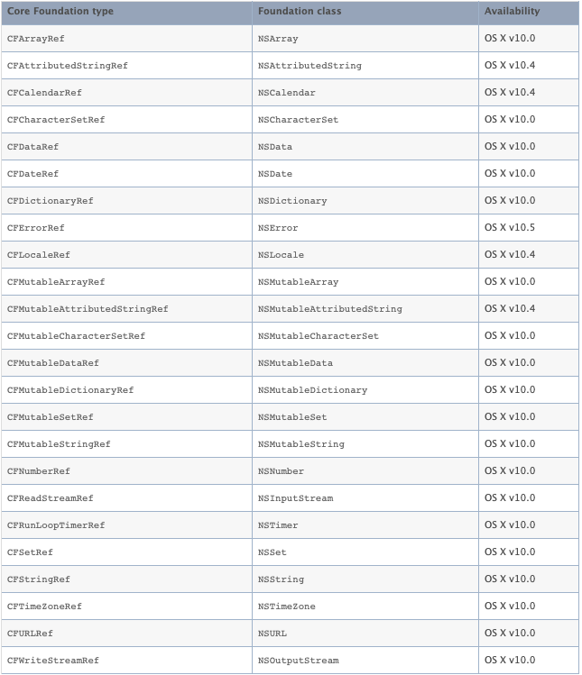

## 前言

`Core Foundation` 是一组 C 语言接口，`Foundation` 用 Objective-C 封装了 Core Foundation 的 C 组件，并实现了额外了组件供开发人员使用。而 Core Foundation 也有一些 Foundation 没能彻底封装的功能，这些功能是 Core Foundation 特有的，比如 CFDictionary 的 Key 元素无需实现 NSCoping 协议、CFArray 可以不进行对象引用计数等、CFRunloop 提供了比 NSRunloop 更加细致化的 Api、利用 CFStringTransform 将中文转为拼音。反过来，Foundation 也有 Core Foundation 无法胜任的工作，最大的来说就是自动引用计数功能，还有比如 NSBundle 在 Core Foundation 中也没有。

> 先说下出现这两个框架的历史原因，当年乔布斯被自己创办的公司驱逐后，成立了`NeXT Computer`公司，拥有`NeXTSTEP`操作系统，后来乔布斯回到苹果后，就出现了一个问题。如何让旧的系统（Mac OS 9）和 NeXTSTEP 合成为一个新系统，这就需要一个更为底层的核心库可以供 Mac Toolbox 和 OPENSTEP 双方调用。Core Foundation 就这么诞生了。其中 Foundation 对象是 NS 开头的原因也是由于 NeXTSTEP 系统。

## CF、NS 相互转换

Core Foundation 中的对象也是使用引用计数的方式管理内存，对应的方式为 `CFRetain`、`CFRelease`。但是不同的是，ARC 可以管理 NS 对象指针，但是无法管理 CF 对象指针，所以即使在 ARC 中，CF 对象也需要手动管理引用计数。当然因为 CF 和 Foundation 之间的友好关系，它们之间的管理权也是可以移交的，这种管理权移交的技术叫做 `Toll-Free Bridging`。

### Toll-Free Bridging 原理

每一个能够 bridge 的 ObjC 类，都是一个类簇（class cluster）。类簇是一个公开的抽象类，但其核心功能的是在不同的私有子类中实现的，公开类只暴露一致的接口和实现一些辅助的创建方法。而与该 ObjC 类相对应的 Core Foundation 类的内存结构，正好与类簇的其中一个私有子类相同。举个例子，NSString 是一个类簇，一个公开的抽象类，但每次创建一个 NSString 的实例时，实际上我们会获得其中一个私有子类的实例。

- 当 NSString 的其中一个私有子类实现即为 NSCFString，其内存的结构与 CFString 是相同的，CFString 的 isa 指针就指向 NSCFString 类，即，CFString 对象就是一个 NSCFString 类的实例。所以，当 NSString 的实现刚好是 NSCFString 的时候，他们两者之间的转换是相当容易而直接的，他们就是同一个类的实例。

- 当 NSString 的实现不是 NSCFString 的时候（比如我们自己 subclass 了 NSString），我们调用 CF 函数，就需要先检查对象的具体实现。如果发现其不是 NSCFString，我们不会调用 CF 函数的实现来获得结果，而是通过给对象发送与函数功能相对应的 ObjC 消息（调用相对应的 NSString 的接口）来获得其结果。例如 CFStringGetLength 函数，当收到一个作为参数传递进来的对象时，会先确认该对象到底是不是 NSCFString 实现。如果是的话，就会直接调用 CFStringGetLength 函数的实现来获得字符串的长度；如果不是的话，会给对象发送 length 消息（调用 NSString 的 - (NSUInteger)length 接口），来得到字符串的长度

> 先提前说明一下，可以在 XCode 中通过调整`Build Settings -> Objective-C Automatic Reference Counting`参数来控制内存管理是选用 ARC 还是 MRC，YES 为 ARC，反之则为 MRC。

### MRC 环境下

在 MRC 环境下，CF 对象与 NS 对象可以相互强制转换，内存所有权归各自所有，进行手动控制

```Objective-C
// 以下代码如果在ARC环境下会自动提示编译错误，并给出改正提示
- (void)testBridgeInMRC{
  // OC转CF
  NSString *originOCStr = [NSString stringWithFormat:@"OC"];
  CFStringRef cfStr = (CFStringRef)originOCStr;
  NSLog(@"%@ %@", originOCStr, cfStr);
  [originOCStr release];
  CFRelease(cfStr);

  // CF转OC
  CFStringRef originCFStr = CFStringCreateWithCString(CFAllocatorGetDefault(), "CF", kCFStringEncodingUTF8);
  NSString *ocStr = (NSString *)originCFStr;
  NSLog(@"%@ %@", ocStr, originCFStr);
  [ocStr release];
  CFRelease(originCFStr);
}
```

### ARC 环境下

在 ARC，CF 与 OC 之间的转化方式有三种。

- __bridge： 只做类型转换，不改变对象所有权，CF 对象与 NS 对象互相转换；
- __bridge_transfer：当 CF 对象转 OC 对象时，CF 对象将内存管理权交给了 ARC，ARC 会确保 OC 对象释放的同时也释放 CF 对象；
- __bridge_retained：将 OC 对象转 CF 对象时，OC 对象将内存管理权交给了 CF 对象，即使 OC 对象被 release 了，CF 对象仍然有效；

**__bridge**

```Objective-C
  // 当originOCStr被ARC释放后，cfStr指向的对象也是被释放了，如果继续使用cfStr则会引起程序崩溃。
  NSString *originOCStr = [[NSString alloc]initWithFormat:@"OC"];
  CFStringRef cfStr = (__bridge CFStringRef) originOCStr;

  CFStringRef originCFStr = CFStringCreateWithCString(NULL, "CF", kCFStringEncodingUTF8);
  NSString *ocStr = (__bridge NSString *)originCFStr;
  // 需要人工CFRelease，否则，OC对象的指针释放后，对象引用计数仍为1，不会被销毁
  CFRelease(originCFStr);
```

**__bridge_retained**

```Objective-C
// OC->CF __bridge_retained
NSString *originOCStr = [[NSString alloc]initWithFormat:@"OC"];
CFStringRef cfStr = (__bridge_retained CFStringRef) originOCStr;

//这时候，即使开启ARC，也需要手动执行CFRelease，因为此时对象管理已经交给CF管理了
CFRelease(cfStr);
```

**__bridge_transfer**

```Objective-C
// CF->OC __bridge_transfer
CFStringRef originCFStr = CFStringCreateWithCString(NULL, "CF", kCFStringEncodingUTF8);
NSString *ocStr = (__bridge_transfer NSString *)originCFStr;
```

### CF-NS 对照

并不是所有的 CF 对象都支持 `Toll-Free Bridging`，以下是支持的结构类型表。


