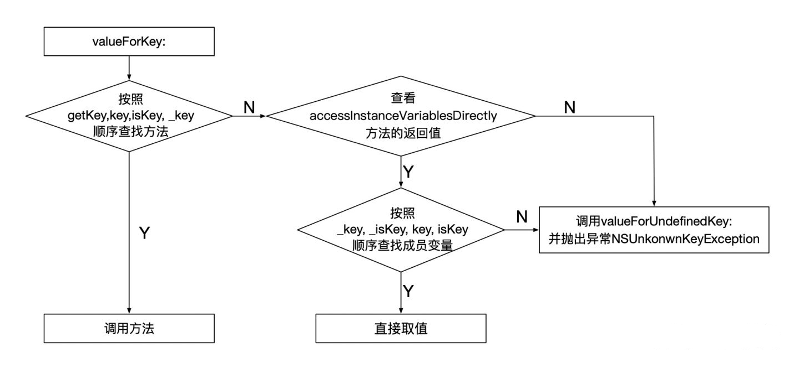

## KVC

KVC 是 Key-Value Coding 的简称，它是一种可以直接通过字符串的名字(key)来访问类属性的机制。而不是通过调用Setter、Getter方法访问。KVC 机制是由 NSKeyValueCoding 协议定义的。  


**赋值、取值流程**  
KVC取值


KVC赋值


**常用API**
```Swift

// 取值
open func value(forKey key: String) -> Any?
open func value(forKeyPath keyPath: String) -> Any?

// 赋值
open func setValue(_ value: Any?, forKey key: String)
open func setValue(_ value: Any?, forKeyPath keyPath: String)

// NSObject子类重写的方法
// 是否允许直接访问成员变量，默认返回值是YES
open class var accessInstanceVariablesDirectly: Bool { get }
open func value(forUndefinedKey key: String) -> Any?
open func setValue(_ value: Any?, forUndefinedKey key: String)
open func setNilValueForKey(_ key: String)

```

KVO赋值、取值各有两个方法，一个key，一个keyPath；其中keyPath方法集成了key的所有功能，也就是说对一个对象的一般属性进行赋值、取值，两个方法是通用的，都可以实现。但是对对象中的对象型属性进行赋值，只有keyPath能够实现.


**使用场景**

* 字典转模型 ，简化代码量
* 修改系统的只读变量
* 可以任意修改一个对象的属性和变量(包括私有变量)

通过KVC改变属性会触发KVO，是因为通过KVC赋值时内部会触发setter方法；

### 在Swift中使用KVC

1. 类继承自NSObject
2. 需要KVC的属性使用@objc进行修饰


## KVO

**原理**  
1. KVO是关于runtime机制实现的;
2. 当某个类的对象属性第一次被观察时，系统就会在运行期动态地创建该类的一个派生类，在这个派生类中重写基类中任何被观察属性的setter方法。派生类在被重写的setter方法内实现真正的通知机制;
3. 如果原类为Person，那么生成的派生类名为NSKVONotifying_Person;
4. 每个类对象中都有一个isa指针指向当前类，当一个类对象的第一次被观察，那么系统就会偷偷将isa指针指向动态生成的派生类，从而在给被监控属性赋值时执行的是派生类的setter方法;
5. 键值观察通知依赖于NSObject的两个方法：`willChangeValueForKey:`和`didChangeValueForKey:`,在一个被观察属性发生改变之前，willChangeValueForKey:一定会被调用，这就会记录旧的值。而当改变发生后，didChangeValueForKey:会被调用，继而observeValueForKey:ofObject:change:context:也会被调用

如果直接给属性赋值，不调用set方法赋值是不会触发KVO的。  
我们可以手动调用KVO，也就是在值改变之前手动调用willChangeValueForKey方法，在值改变之后手动调用didChangeValueForKey方法。

**使用场景**  
监听某个值的变化从而进行相应的操作，如更新UI等。


### 在Swift中使用KVO

1. 类继承自NSObject
2. 需要KVC的属性使用@objc和dynamic修饰

```Swift
// user为User对象实例
let observation = user.observe(\User.name, options: [.new]) { user, change in
    // user为修改值后的对象实例，
    // change为变化，包含oldValue、newValue两个参数
    // 但是经过测试，oldValue一直为空，不知道原因是什么
}

```

**实际Swift还可以使用`didSet`这种形式来实现属性值改变观察**