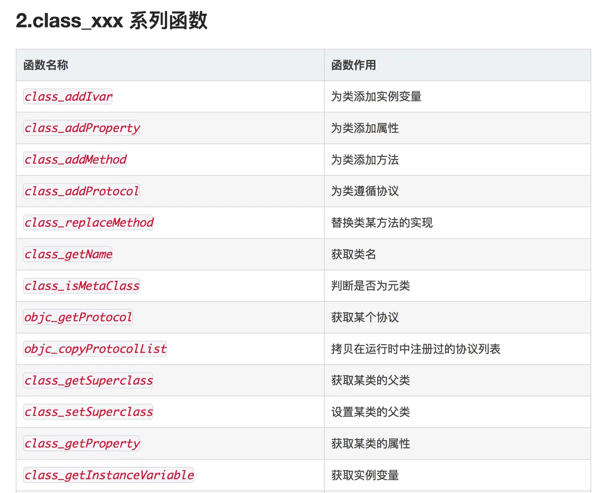
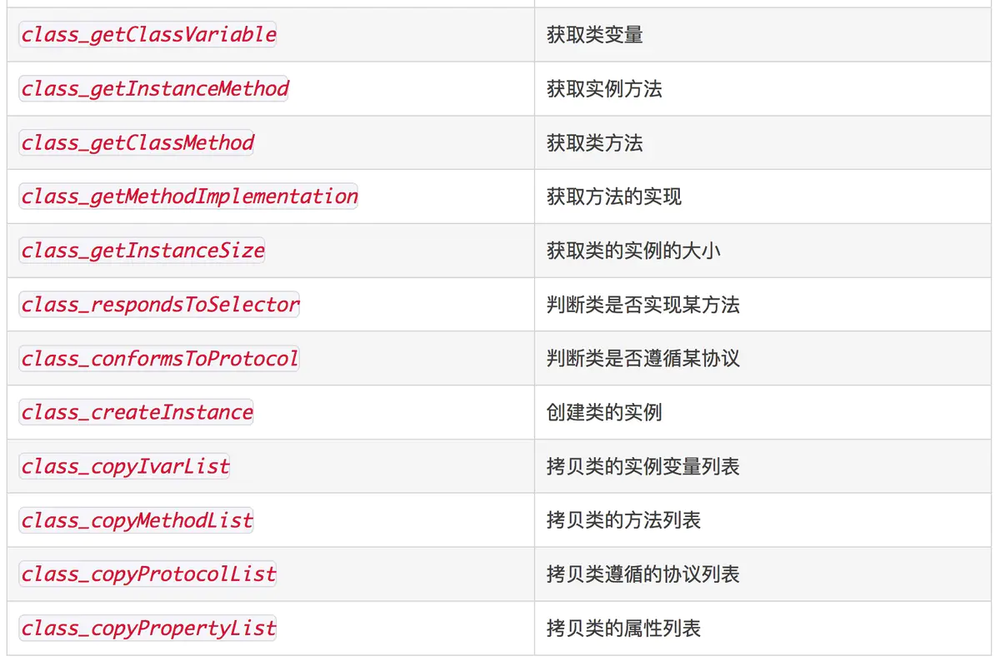
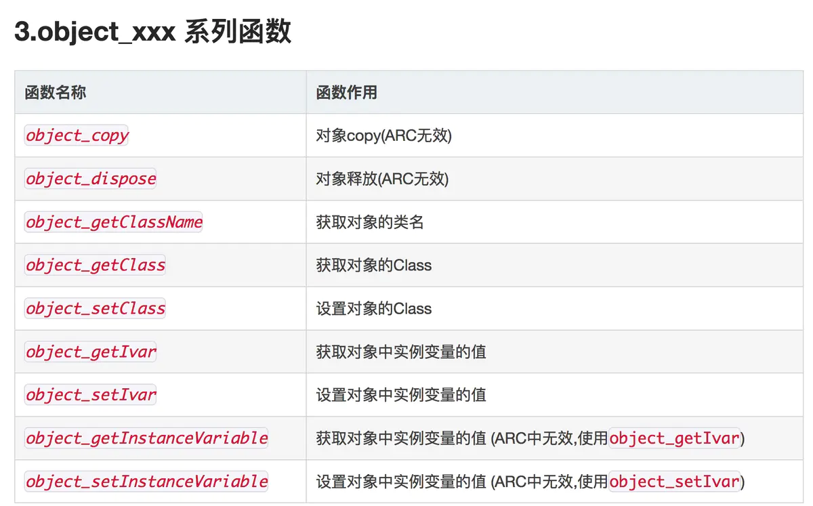
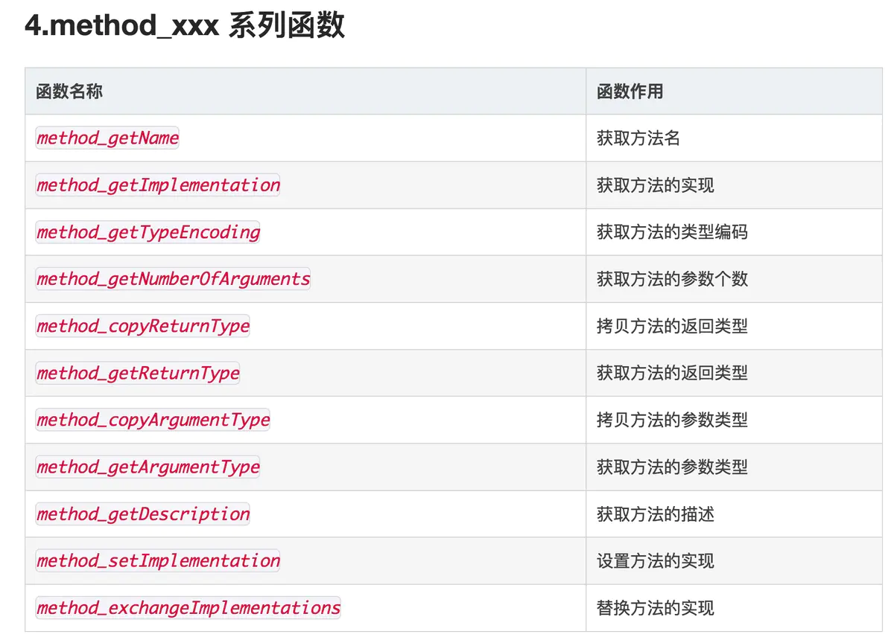
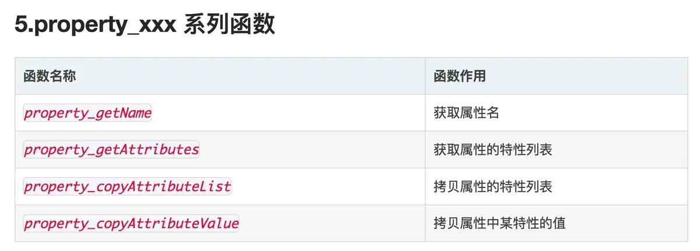
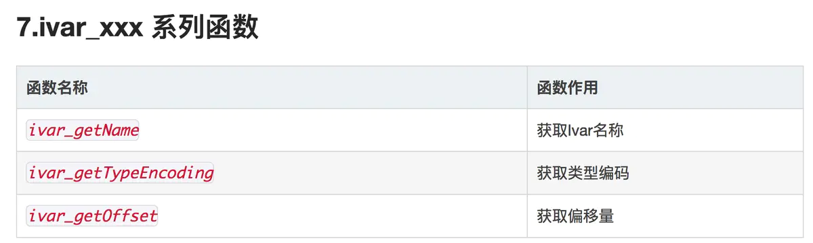
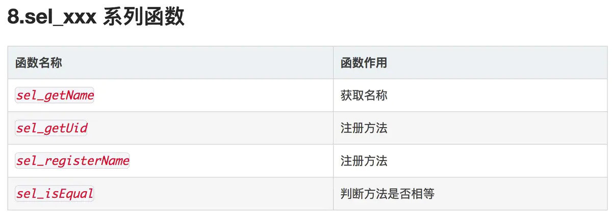

## runtime 使用场景

### SEL、IMP、Method

**SEL：方法的名称、标识**

- sel_registerName
- #selector 底层是 sel_registerName
- NSSelectorFromString() 底层是 sel_registerName
- method_getName 底层是 sel_registerName

**Method：方法体类定义中的方法**

1. class_getInstanceMethod() //获取 Method，传入 SEL

**IMP：函数指针，指向方法实现的地址**

1. method_getImplementation //获取 IMP，传入 Method

其实 SEL 和 IMP 都是 Method 结构体的属性。

方法交换(method-swizzling)，主要目的是替换两个 Method 的 IMP

```swift
// 获取SEL值
// 获取方式包括 1、#selector 2、NSSelectorFromString()
let originalSelector = #selector("老方法引用")
let swizzledSelector = #selector("新方法引用")

// 原有方法，通过方法编号找到方法
let originalMethod = class_getInstanceMethod(self, originalSelector)
let swizzledMethod = class_getInstanceMethod(self, swizzledSelector)
// 先尝试給原有SEL添加新IMP，这里是为了避免原有SEL没有实现IMP的情况
let didAddMethod = class_addMethod(self, originalSelector, method_getImplementation(swizzledMethod!), method_getTypeEncoding(swizzledMethod!))

if didAddMethod {
    // 添加成功，说明原SEL没有实现IMP，添加成功后将新的SEL的IMP替换成老IMP
    class_replaceMethod(self, swizzledSelector, method_getImplementation(originalMethod!), method_getTypeEncoding(originalMethod!))
} else {
    // 添加失败，说明原SEL已经实现了IMP，直接将两个SEL的IMP实现交换即可
    method_exchangeImplementations(originalMethod!, swizzledMethod!)
}
```

## runtime-API 收集











