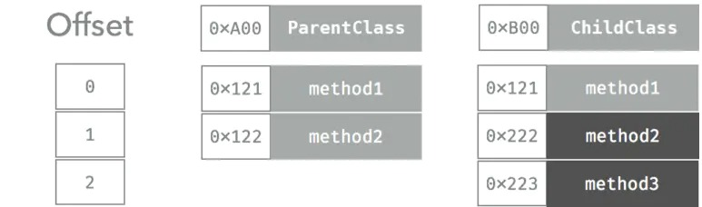

## 前言

对于编译型语言来看，有主要三种类型的函数派发方式，分别为：

* Direct Dispatch： 直接派发
* Table Dispatch： 函数表派发
* Message Dispatch： 消息派发

分析三种派发方式主要从**性能**及**动态性**两方面讨论，这两个特性相对而言是矛盾的，性能要求高，则动态性差，反之亦然，其中直接派发被又称为静态派发，函数表派发与消息派发称为动态派发，大多数语言都会支持上面派发方式的一种到多种。如

* C 使用直接派发；
* Java 默认使用函数表派发，可以通过 final 修饰符修改成直接派发；
* C++ 默认使用直接派发，但可以通过加上 virtual 修饰符来改成函数表派发；
* OC 使用直接派发、消息派发方式；（普通方法采用消息派发的方式，load 方法使用直接派发的方式）

## 直接派发

直接派发是三种形式里面最快速的，在编译时就确定了方法的调用地址，汇编代码中，直接跳到方法的地址执行，生成的汇编指令最少。
优点：编译器可以对这种派发方式进行更多优化，比如函数内联等。
缺点：缺乏动态性，无法实现继承等；

## 函数表派发

函数表是编译型语言常见的派发方式，函数表使用数组来存储类中声明的每个函数的指针。对于这个表，大部分语言叫 `Virtual table(虚函数表)` 。，根据 Swift 编译生成的 SIL 文件分析，Swift 中存在两种函数表，其中协议使用的是 `witness_table` (sil 文件中名为 sil_witness_table)，类使用的是 `virtual_table`（sil 文件中名为 sil_vtable）。

每一个类都会维护一个函数表，里面记录着类所有的函数，如果父类函数被 override，表里面只会保存被 override 之后的函数。 一个子类新添加的函数，都会被插入到这个数组的最后。运行时会根据这一个表去决定实际要被调用的函数；

一个函数被调用时会先去读取对象的函数表（读取第一次），再根据类的地址加上该的函数的偏移量得到函数地址（读取第二次），最后跳到那个地址上去（跳转一次）。 整个过程是两次读取一次跳转，比直接派发慢一些。



## 消息派发

消息派发是动态性最强的派发方式，也是性能最差的一种方式；方法调用包装成消息，发给运行时（相当于中间人），运行时会找到类对象，类对象会保存类的数据信息，或通过父类查找，直到命中执行，如果没找到方法，抛出异常，运行时提供了很多动态的方法用于改变消息派发的行为，相比函数表派发有很强的动态性，由于运行时支持的功能很多，方法查找的过程比较长，所以性能比较低；
OC 消息派发过程在这不展开说，后续有博文专门说这个。

## Swift 中的函数派发

分析SIL文件，我们可以分析出Swift中派发方式的规律，关于SIL相关知识，可以参照该文[iOS编译简析](../../进阶/iOS编译简析)，本文只给出关键命令 `swiftc main.swift -emit-sil | xcrun swift-demangle > main.sil` 。

派发方式与 SIL 文件中关键指令对应关系

直接派发：`function_ref`关键字（`sil_vtable`下不包含该方法）；
函数表派发： `class_method`关键字（`sil_vtable`也会包含该方法）；
消息机制派发：`objc_method`关键字（sil 中还会体现）

Swift 语言支持三种派发方式。采用何种方式跟以下四种因素相关：

* 声明的位置
* 引用类型
* 指定行为
* 显式地优化

|            |    **直接派发**  | **函数表派发** |    **消息派发**   |
| :--------: | :------------: | :-----------: | :------: |
|  NSObject  |   @nonobjc 或者 final 修饰的方法  |   声明作用域中方法   |         扩展方法及被 dynamic 修饰的方法          |
|   Class    |  不被 @objc 修饰的扩展方法及被 final 修饰的方法    |   声明作用域中方法  |   dynamic 修饰的方法或者被 @objc 修饰的扩展方法   |
|  Protocol  |  扩展方法   |   声明作用域中方法   | @objc 修饰的方法或者被 objc 修饰的协议中所有方法 |
| Value Type |   所有方法    |       无       |      无                        |
|    其他    | 全局方法，staic 修饰的方法；使用 final 声明的类里面的所有方法；使用 private 声明的方法和属性会隐式 final 声明； |    |  |

通过该表格你大概就可以理解一下 Swift 语言中的一些限制了：

extension 中定义的方法如果想 overrite，需要在方法上加上 @objc 修饰符；因为如果不加 @objc，走的是直接派发，无法重写方法，加了的话会走直接派发。

```swift
import Foundation

class Info {
}

extension Info {
    @objc
    func printInfo() {
        print(1)
    }
}

class SubInfo: Info {
    override func printInfo() {
        print(2)
    }
}
```

对应SIL文件中相关代码为
```swift
// @objc Info.printInfo()
sil hidden [thunk] @@objc main.Info.printInfo() -> () : $@convention(objc_method) (Info) -> () {
// %0                                             // users: %4, %3, %1
bb0(%0 : $Info):
  strong_retain %0 : $Info                        // id: %1
  // function_ref Info.printInfo()
  %2 = function_ref @main.Info.printInfo() -> () : $@convention(method) (@guaranteed Info) -> () // user: %3
  %3 = apply %2(%0) : $@convention(method) (@guaranteed Info) -> () // user: %5
  strong_release %0 : $Info                       // id: %4
  return %3 : $()                                 // id: %5
} // end sil function '@objc main.Info.printInfo() -> ()'

// @objc SubInfo.printInfo()
sil hidden [thunk] @@objc main.SubInfo.printInfo() -> () : $@convention(objc_method) (SubInfo) -> () {
// %0                                             // users: %4, %3, %1
bb0(%0 : $SubInfo):
  strong_retain %0 : $SubInfo                     // id: %1
  // function_ref SubInfo.printInfo()
  %2 = function_ref @main.SubInfo.printInfo() -> () : $@convention(method) (@guaranteed SubInfo) -> () // user: %3
  %3 = apply %2(%0) : $@convention(method) (@guaranteed SubInfo) -> () // user: %5
  strong_release %0 : $SubInfo                    // id: %4
  return %3 : $()                                 // id: %5
} // end sil function '@objc main.SubInfo.printInfo() -> ()'
```

## Swift 派发优化

### 内联优化

Swift 编译时在直接派发方式的基础上还可以进行优化，如函数内联。

内联主要原理是：将一些函数的实现直接编译入调用函数的位置中去，减少函数指针的栈调用，提高运行效率。
当开启编译优化 (Optimization Level) 时，编译器会在直接派发方式基础上根据函数实际情况进行内联优化。下列情况编译器默认不会进行内联优化：

* 函数体过长（无形中增加了包体积，重复代码）；
* 函数包含动态派发；
* 函数中包含递归调用；

**Swift 中显式内联优化修饰符**

* `@inline(never)` 声明这个函数 never 永远不被编译成 inline 的形式，即使开启了编译器优化；
* `@inline(__always)` 声明这个函数总是编译成 inline 的形式， 这个修饰符只对函数体过长这种不会被内联优化的情况生效，其他情况也不生效；

> 内联除了可以提高运行效率这个优点之外，还有另外一个好处，将部分关键函数进行内联优化，可以增大逆向难度。

### WHO优化

Swift 会尽可能的优化派发方式，一些函数表派发方法会优化成直接派发。编译器可以通过 `whole module optimization` 进行一些全局优化。比如：
- 对某些没有标记 final 的类通过计算，如果能在编译期确定执行的方法，则使用直接派发。比如一个函数没有 override，Swift 就可能会使用直接派发的方式。
- 泛型特化；
  其
  ```swift
  func min<T:Comparable>(x:T, y:T) -> T {
    return y < x ? y : x
  }

  // 泛型特化后
  func min<Int>(x:Int, y:Int) -> Int {
    return y < x ? y :x
  }
  ```
- 移除没有被使用的方法；
- 内联优化；

其实这其中泛型特化和方法内联等都属于SIL优化，这也是出现SIL中间语言的原因之一。

但需要注意是WHO需要依赖于全局的源码，所以很多二进制的库文件无法进行全局优化。