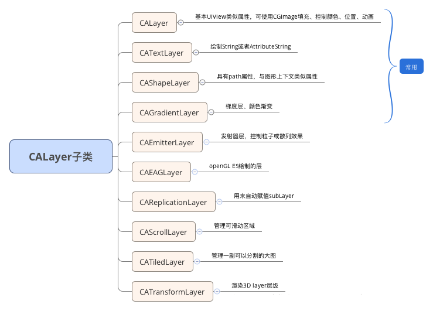
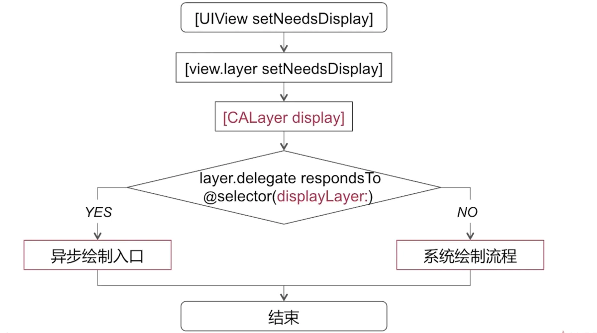
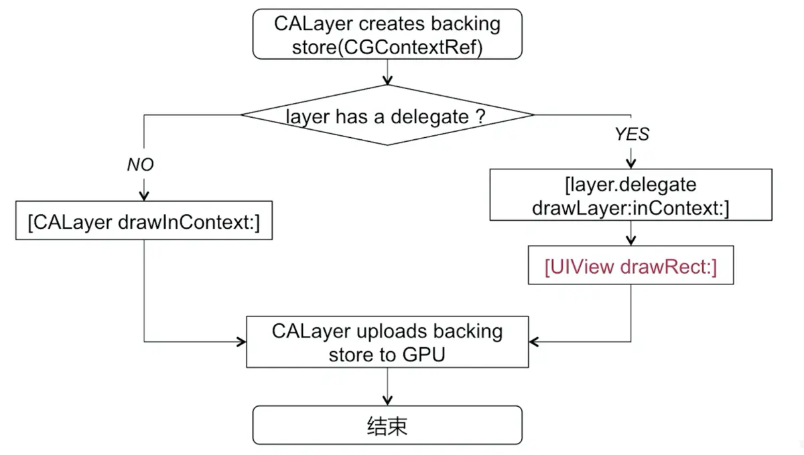
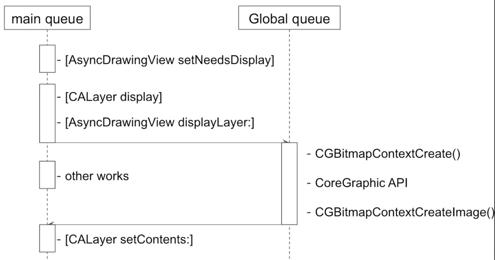
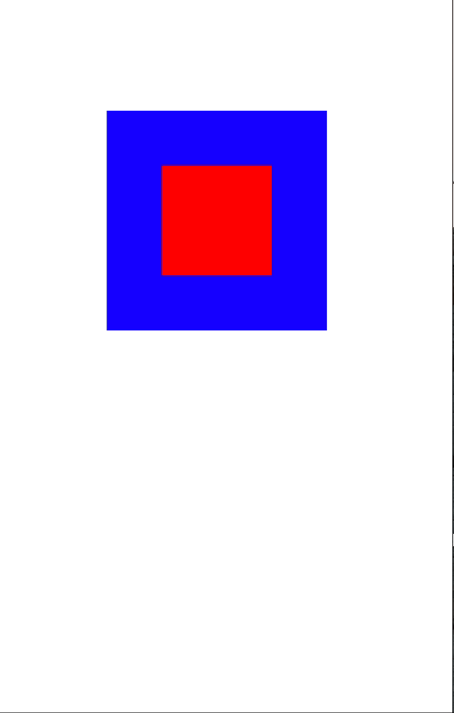

## 前言

Hi Coder，我是 CoderStar！

今天我们来聊一聊 `UIView` 与 `CALayer` 的相关知识以及它们之间的关系，其实这部分内容要是引申出来会比较多，今天我们先收敛一下，先讲一些基本的东西，后面还会有系列文章对其进行扩展。
关于iOS的UI渲染部分，还是建议大家看看Apple的官方文档[核心动画编程指南](https://developer.apple.com/library/archive/documentation/Cocoa/Conceptual/CoreAnimation_guide/CoreAnimationBasics/CoreAnimationBasics.html#//apple_ref/doc/uid/TP40004514-CH2-SW12)以及WWDC2011的session[Understanding UIKit Rendering](https://developer.apple.com/videos/play/wwdc2011/121/)。

## UIView 与 CALayer

### 概括

UIView 本身是不具备图像渲染能力的，拥有一个 `layer` 属性用来持有一个 CALayer 实例，我们平时操作的 UIView 的绝大部分绘图属性内部其实都是操作其拥有的 layer 属性，比如 `frame`、`hidden` 等。

先简单概括一下 UIView 与 CALayer 各自的作用。

* CALayer：继承自 `NSObject`, 负责图像渲染，属于 `QuartzCore` 框架；
* UIView：继承自 `UIResponder`, 主要负责事件响应，属于基于 `UIKit` 框架；

那看到这里可能会有读者有个疑问，为什么要将图像渲染和事件响应这两个功能分别去实现呢？为什么设计时不直接让 UIView 具有图像渲染的能力？

> 其实上面已经提到 CALayer 和 UIView 其实不属于同一个框架，CALayer 所属的 QuartzCore 框架是可以跨平台使用的，在 iOS 以及 macOS 中都可以使用，但是 UIKit 只在 iOS 中存在，在 macOS 中会有 Application Kit，在这两个系统里，页面绘图框架是可以公用的，但是两个系统的操作方式会有明显的差别，一个是通过触摸事件，另一个是通过鼠标和键盘，这些我想你应该很能明白为什么分为两个结构去实现了吧。这也算是程序设计原则中单一职责原则的体现了。

> 通过上述的描述，我们还可以得出一个结论，Layer 相对 View 来说是更加轻量的，所以当显示部分不需要事件响应时，我们可以优先考虑使用 layer。

> 还有一点需要注意的是 CALayer 虽然没有事件响应的能力，但它包含下列方法，我们可以判断出事件是不是落在 layer 上，从而从侧面为 Layer 添加点击事件。
> - `open func hitTest(_ p: CGPoint) -> CALayer?`
> - `open func convert(_ p: CGPoint, from l: CALayer?) -> CGPoint`

### UIView

```swift
open class UIView : UIResponder
  open var layer: CALayer { get }
  open class var layerClass: AnyClass { get }
}
```

如上代码所示，UIView 中有一个 `layer` 属性还有一个 `layerClass` 属性，均为只读属性，其中：
- `layer` 属性返回的是 UIView 所持有的主 Layer(RootLayer) 实例，我们可以通过其来设置 UIView 没有封装的一些 layer 属性；
- `layerClass` 则返回 RootLayer 所使用的类，我们可以通过重写该属性，来让 UIView 使用不同的 CALayer 来显示。如：

  ```swift
  class MyView: UIView {
      override class var layerClass: AnyClass {
          /// 使用GL来进行绘制
          return CAEAGLLayer.self
      }
  }
  ```

### CALayer

CALayer 视图结构类似 UIView 的子 View 树形结构，它们分别可以有自己的 SubView 和 SubLayer，可以向它的 RootLayer 上添加子 layer，来完成一些页面效果，比如说渐变等。

Layer 内部其实三份 layer tree，分别是：
* Layer Tree（模型图层）：此树中的对象是存储**任何动画的目标值**的模型对象, 比如常见的 `frame`, `affineTransform`, `backgroundColor` 等等，我们可以在开发中对属性进行设置。
* Presentation Tree（表现图层）：**表示动画过程中视图的实时属性值**，我们永远不应该去修改该对象，而是只读取相关属性值。
* Render Tree（渲染图层）：这是系统用来绘制的树，不对外提供属性给我们使用，对我们而言是透明的，可以不用 care。


> 其中 layer tree 对应的是 CALayer 的`model()`方法返回值，presentation tree 对应的是 CALayer 的`presentation()`方法返回值，两个方法的返回值类型还是 CALayer。
>
> 这部分容易考查一个面试题是 iOS 如何监听动画中 view 的 frame，可能有人会想着使用 KVO 方式进行监听，但尝试下就知道不可行，当我们改变一个图层的属性时，改变的是模型图层对象属性，属性值是立即更新的，但是屏幕上并不会马上发生改变，只是定义了图层动画结束后的值。
>
> 我们可以利用 `CADisplayLink` + `presentation()`去获取，大概过程就是在动画开始之前注册 CADisplayLink，然后在其回调里面使用`layer.presentation().frame`获取到 view 在动画中的 frame 了。

`CALayer` 是所有 layer 的基类，其派生类会有一些特定的功能，比如绘制文本的 `CATextLayer`、渐变效果的 `CAGradientLayer` 等等。种类如下图所示。



我们通常见到的 layer 都是依附于一个 UIView，但是也有一些单独的 layer 不需要附加到 UIView 上，就可以直接在屏幕上显示内容，如 `AVCaptureVideoPreviewLayer`、`CAShapeLayer` 等。当然附加在 UIView 上的 layer 和单独的 layer 在行为上还是会有不同的。

### 动画

基本上你改变一个单独的 layer 的任何属性的时候，都会触发一个从旧的值过渡到新值的简单动画，这就是所谓的隐式动画，其时长为 **0.25s**。然而，如果你改变的是 view 中 layer 的同一个属性，它只会从这一帧直接跳变到下一帧。尽管两种情况中都有 layer，但是当 layer 附加在 view 上时，它的默认的隐式动画的 layer 行为就不起作用了，那不显示动画的原因是什么呢？

无论何时一个可动画的 layer 属性改变时，layer 都会寻找并运行合适的 `action` 来实行这个改变，layer 通过向它的 `delegate` 发送 `actionForLayer:forKey:` 消息来询问提供一个对应属性变化的 `action`。`delegate` 可以通过返回以下三者之一来进行响应：

* 它可以返回一个动作对象，这种情况下 layer 将使用这个动作。
* 它可以返回一个 nil，这样 layer 就会到其他地方继续寻找。
* 它可以返回一个 NSNull 对象，告诉 layer 这里不需要执行一个动作，搜索也会就此停止。

**对于依附于 UIView 的 layer 而言，view 就是这个 layer 的 delegate，并且不可改变。**

属性改变时 layer 会向 view 请求一个动作，而一般情况下 view 将返回一个 NSNull，只有当属性改变发生在动画 block 中时，view 才会返回实际的动作。

> 这里说的 view 的 layer 是指 view 的 RootLayer，对于后添加上去的子 Layer 还是会有隐式动画的。

### 页面渲染流程

那么为什么 CALayer 可以呈现可视化内容呢？

因为 CALayer 基本等同于一个 **纹理**。纹理是 GPU 进行图像渲染的重要依据。纹理本质上就是一张图片，因此如下代码所示， CALayer 也包含一个 `contents` 属性，指向一块缓存区，称为 `backing store`，可以存放位图（bitmap）。iOS 中将该缓存区保存的图片称为 `寄宿图`。而当设备屏幕进行刷新时，会从 CALayer 中读取生成的 `bitmap`, 进而呈现到屏幕上。

```swift
/* An object providing the contents of the layer, typically a CGImageRef,
  * but may be something else. (For example, NSImage objects are
  * supported on Mac OS X 10.6 and later.) Default value is nil.
* Animatable. */

/** Layer content properties and methods. **/
open var contents: Any?
```

那么绘制页面也有两种方式：
- 一种是 手动绘制；
- 一种是 使用图片。

#### 使用图片

这种方式就是我们平时常见的 `UIImageView` 显示的形式，我们通过 CALayer 的 `contents` 属性来配置图片。然而，`contents` 属性的类型为 `id`。在这种情况下，可以给 contents 属性赋予任何值，项目仍可以编译通过。**但是在实践中，如果 content 的值不是 `CGImage` ，得到的图层将是空白的**。

既然如此，为什么要将 `contents` 的属性类型定义为 `id` 而非 `CGImage`。这是因为在 Mac OS 系统中，该属性对 `CGImage` 和 `NSImage` 类型的值都起作用，而在 iOS 系统中，该属性只对 `CGImage` 起作用。

其实我们平时使用的 UIImage 其实是 CGImage 的一个轻量级封装, 于是很自然的, 在 UIImageView 中的 UIImage 对象直接将自己的 CGImage 图片数据作为 CALayer 的 Content 即可。但是需要注意我们传给 UIImageView 的 UIImage 中的图片可能是没有解码的，我们渲染流程中会有解码的过程。

#### 手动绘制

先附上一份 `CALayerDelegate` 的定义的相关方法，后面会用到。

```swift
public protocol CALayerDelegate : NSObjectProtocol {

  optional func display(_ layer: CALayer)

  @available(iOS 2.0, *)
  optional func draw(_ layer: CALayer, in ctx: CGContext)

  optional func layerWillDraw(_ layer: CALayer)

  @available(iOS 2.0, *)
  optional func layoutSublayers(of layer: CALayer)

  optional func action(for layer: CALayer, forKey event: String) -> CAAction?
}
```



上图是 CALayer 在渲染之前的流程，我们可以稍微进行归纳一下：

- 当调用 `[UIView setNeedsDisplay]` 时，实际上会直接调用底层 layer 的同名方法 `[layer setNeedsDisplay]`；该方法相当于在当前 layer 上打上了一个脏标记，标识其发生了变化，需要重新进行渲染，但此时它还显示原来的内容，等到下一轮 RunLoop 修改才会生效。
- `[CALayer display]` 内部会先判断这个 layer 的 delegate 是否会响应 `displayLayer：`方法，如果不响应就会进入系统绘制流程中。如果能够响应，实际上是提供了异步绘制的入口，也就是给我们进行异步绘制留有余地。

> 补充一点，视图在初始化时会自动触发 `setNeedsDisplay`，添加到视图层级之后还会自动触发 `setNeedsLayout`；

下面我们再分别看下上图的系统绘制流程以及异步绘制展开后相关知识。

**系统绘制流程**



上图本质就是创建一个 `backing storage` 的流程，归纳一下：
- 系统绘制时, 会先创建 backing storage(CGContextRef)，我们可以理解为 `CGContextRef` 上下文；
- 判断 layer 是否有 delegate，然后进入到不同的渲染分支中去，但是最后无论哪两个分支, 都有 CAlayer 上传 backing store。
  - 如果有 delegate，则会执行 `[layer.delegate drawLayer:inContext]`，然后在这个方法中会调用 view 的 `drawRect:` 方法，也就是我们重写 view 的 `drawRect:` 方法才会被调用到；
  - 如果没有 delegate，会调用 layer 的 `drawInContext` 方法，也就是我们可以重写的 layer 的该方法，此刻会被调用到；

> 注意 drawRect 方法是在 CPU 执行的, 在它执行完之后, 通过 context 将数据 (通常情况下这里的最终结果会是一个 bitmap, 类型是 CGImageRef) 写入 backing store, 通过 rendserver 交给 GPU 去渲染，将 backing  store 中的 bitmap 数据显示在屏幕上。

**异步绘制**

上面已经提到如果成为 layer 的 delegate，然后实现 displayLayer 方法，便可以开始异步绘制了，在异步绘制过程中：

1. 由 delegete 去负责生成 bitmap 位图；
2. 切换到主线程，将生成的 bitmap 作为 layer.content 属性的值。

下图为异步绘制的时序图：


具体的异步绘制的代码示例可查看第三方库开源库[YYAsyncLayer](https://github.com/ibireme/YYAsyncLayer)。

## frame、bounds 等属性

先说几个我们常见的结构，方便后续理解。

- `CGPoint`：表示位置，其包含 x，y 两个属性；
- `CGSize`：表示尺寸，其包含 width、height 两个属性；
- `CGReact`：表示一个矩形区域，其内部包含 origin、size 两个属性，其中 origin (CGPoint 类型) 便是矩形左上角的位置，size (CGSize 类型) 为矩形的尺寸；

上节我们已经说到 UIView 的视图属性其实本质上就是对其持有的 CALayer 属性的封装而已，下面为几个视图属性的对应关系。

UIView | CALayer
---------|----------
 frame | frame
 center | position
 bounds | bounds
 transform | affineTransform

我们先简单看下上述属性的含义，以及还有 CALayer 一个独有的属性 --`anchorPoint`。

* `frame`：表示视图在父视图中显示出来的位置和大小，CGReact 类型，其显示位置是相对父视图坐标系而言的；
* `bounds`：表示视图相对于自身显示出来的位置与大小，CGReact 类型，其显示位置是相对自身视图坐标系而言的，属性 `size` 描述视图本身固有的尺寸，而属性 `origin` 描述是在自身视图坐标系中圆点的位置；
* `position`：表示视图的中心点在父视图的位置；
* `transform`：用来实现对视图进行仿射变换处理的。通过仿射变换我们可以很轻易的实现对视图的移动、缩放、旋转、倾斜等处理；
* `anchorPoint`：锚点，是一个相对坐标值，其左上角的位置是 (0,0) 而右下角的位置是 (1,1) 中心点的锚点值就是 (0.5,0.5) 了。其实可以这么说 position 是 layer 中的 anchorPoint 点在 superLayer 中的位置坐标，这也是当视图做 `transform` 变换的不动点。

> 顺便提一下，iOS 和 macOS 两个系统的参考坐标系不一致，对于 iOS 来说原点默认在视图的左上角位置，往右为 X 正方向，往下是 Y 正方向；而对于 macOS 来说原点默认是在视图的左下角位置，往右为 X 正方向，往上是 Y 正方向；

在上述的几个属性中，`bounds`、`position`、`transform`、`anchorPoint` 都是存储属性，**而 `frame` 是计算属性，其值是根据另外几个属性的值计算出来的**。那为什么要设置 frame 这样一个计算属性呢，其实本质上是为了简化操作。

**修改 bounds**

- 更改 bounds 的位置，也就是 origin 属性，对于当前视图没有影响，相当于更改了当前视图的坐标系，对于子视图来说当前视图的左上角已经不再是 (0,0), 而是改变后的坐标，坐标系改了，那么所有子视图的位置也会跟着改变。
- 更改 bounds 的大小，也就是 size 属性，修改长宽后，中心点继续保持不变, 长宽进行改变；通过 bounds 修改长宽看起来就像是以中心点为基准点对长宽两边同时进行缩放；

我们写个🌰子看一下修改 bounds 的结果。

修改之前，blueView 是 redLabel 的父视图
- blueView:
  - frame: (100.0, 100.0, 200.0, 200.0)
  - bounds: (0.0, 0.0, 200.0, 200.0)
- redLabel:
  - frame: (50.0, 50.0, 100.0, 100.0)
  - bounds: (0.0, 0.0, 100.0, 100.0)

将 blueView 的 bounds 修改为 (x: 50, y: 50, width: 300, height: 300)

修改之后结果：
- blueView:
  - frame: (50.0, 50.0, 300.0, 300.0)
  - bounds: (50.0, 50.0, 300.0, 300.0)
- redLabel:
  - frame: (50.0, 50.0, 100.0, 100.0)
  - bounds: (0.0, 0.0, 100.0, 100.0)

效果图如下：


简单对变化做个解释：

我们变化 bounds 的 origin 为 (x: 50, y: 50)，改变了 blueView 在自身坐标系下左上角的坐标，那么对 redLabel 来讲，其 frame 的 origin 也为 (x: 50, y: 50)，所以贴近父视图的左上角。
我们变化 bounds 的 size 为 (width: 300, height: 300)，其尺寸会按照中心点为基点向外扩张，尺寸放大 1.5 倍，所以 frame 会变为 (50.0, 50.0, 300.0, 300.0)。

剩余属性变化对其他属性的影响直接做个总结吧：
- frame 变化：bounds 变化、center 变化、transform 不会变化；
- bounds 变化：frame 变化、center 不会变化、transform 不会变化；
- center 变化：frame 变化、bounds 不会变化、transform 不会变化；
- transform 变化：frame 变化、bounds 不会变化、center 不会变化；
- anchorPoint 变化：frame 变化、bounds 不会变化、center 不会变化、transform 不会变化；

其实我们可以总结出 frame 与其他属性之间的关系，如下面伪代码所示。

```swift
var frame: CGReact: {
  get {
    return CGRect(
        x: center.x - bounds.size.width * layer.anchorPoint.x,
        y: center.y - bounds.size.height * self.layer.anchorPoint.y,
        width: bounds.size.width,
        height: bounds.size.height
      )
  }
  set {
    bounds.size = frame.size

    center.x = frame.origin.x + frame.size.width * layer.anchorPoint.x
    center.y = frame.origin.y + frame.size.height * layer.anchorPoint.x
  }
}
```

当然这个关系是发生在没有 transform 参与的情况下。如果有 transform 参与，情况就又不一样了。

> AutoLayout 在完成布局后，所计算出来的位置和尺寸内部修改的值是 center 和 bounds 两个属性，因此最终的展示效果不会因为仿射变换而产生异常。同时这也解释了为什么通过 AutoLayout 设置约束后修改 frame 属性来改变位置和尺寸不会起作用的原因。
> 解释一下就是：在iOS 8之前，AutoLayout完成布局后，直接修改的是frame的值，如果在AutoLayout设置约束后再设置transform，会造成视图异常，在iOS 8之后修复了这个问题，改用修改center 和 bounds 两个属性。

## 最后

说不引申，但是写起来篇幅还是挺多的，没办法，因为有些知识点是串在一起的，不展开的话可能不好理解的透彻，先说这么多吧，iOS 页面渲染这块还有很多东西，比如离屏渲染、渲染优化等，这些后面再单独说吧。

新的一周要更加努力呀！

Let's be CoderStar!

参考及相关链接

- [UIView中frame属性的内部实现](https://juejin.cn/post/6844903877582536718)
- [View-Layer 协作](https://objccn.io/issue-12-4/)
- [iOS界面渲染与优化(二) - UIView与渲染](https://juejin.cn/post/6982506050993782820)
