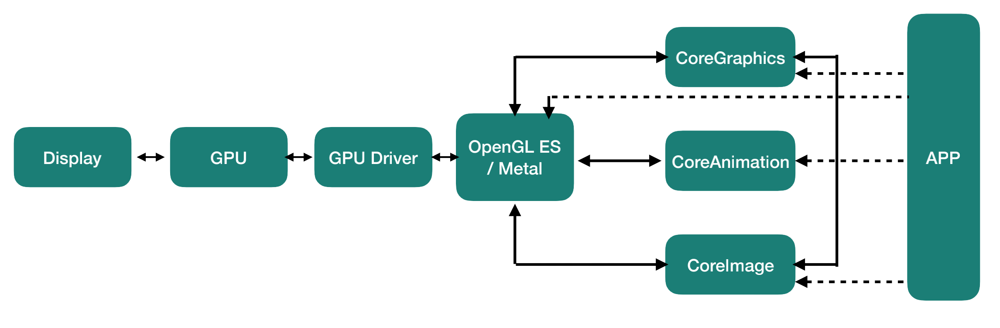
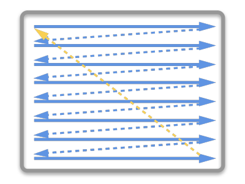
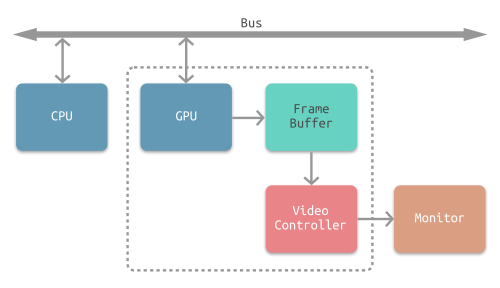
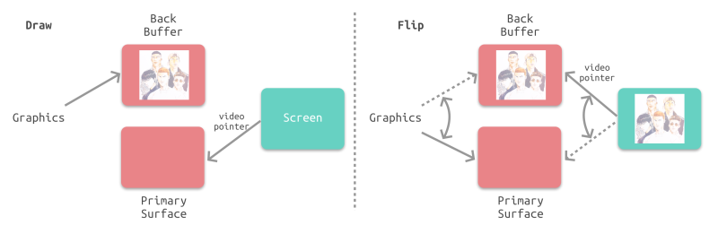
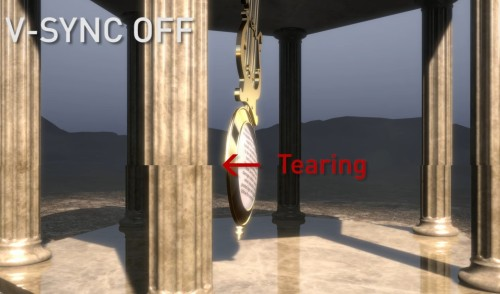
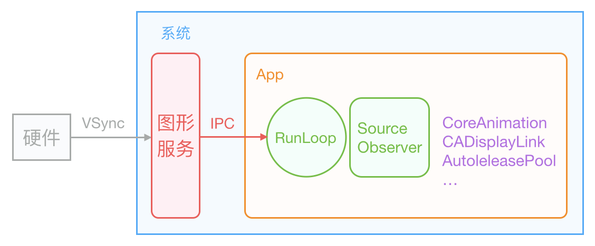

## 前言

Hi Coder，我是 CoderStar！

作为一名专业的 iOS 页面仔，画 UI 是我们的家常便饭，那不知道你在开发过程中有没有思考过这样一些问题：

- App 静止不动时，页面是否还进行刷新？
- 页面渲染和 RunLoop 是什么关系？
- 主 RunLoop 周期与屏幕刷新率（VSync）之间有关系吗？
- ...

不知道你有没有过这些疑问？如果有，请耐心看完本文，我们一起来逐步走进这些问题的答案，看看 UI 的渲染流程到底是什么样的。如果没有，那请联系我。（ 因为我有😂😂 ）

> 文章中有一些原理性文字描述来自于参考资料，站在巨人的肩膀上，对相关流程进行总结梳理。

## 图形渲染框架

我们先来了解一下 UI 渲染的框架，不能对一些名词傻傻分不清。

通过上图显示流程，我们整体了解一下 UI 渲染涉及的框架。

- `UIKit`：
  `UIKit` 自身并不具备在屏幕成像的能力，其主要负责对用户操作事件的响应（`UIView` 继承自 `UIResponder`），事件响应的传递大体是经过逐层的 视图树 遍历实现的。其中`iOS`上对应的是`UIKit`，`Mac OS`对应的是`AppKit`；

- `Core Animation`：
  `Core Animation` 其实是一个令人误解的命名。你可能认为它只是用来做动画的，但实际上它是从一个叫做 `Layer Kit` 这么一个不怎么和动画有关的名字演变而来的，所以做动画仅仅是 `Core Animation` 特性的冰山一角。提供强大的 2D 和 3D 动画效果。但对应到系统 Framework 中不是这个名字，而是`QuartzCore`，以 `CA` 开头的都是它所属的类。

- `Core Graphics`：
  `Core Graphics`主要用于**运行时绘制图像**，纯 C 的 API。`CoreGraphics` 的类名都是以 `CG` 开头的，平时所用的 `CGRect`、`CGPoint` 就在 `CGGeometry` 这个几何相关的类中定义，`CGFont` 类则被封装成了 `UIFont`，`CGImage` 构成了 `UIImage`，`CGContext` 是绘图的上下文等等。所以 `CoreGraphics` 是系统绘制界面、文字、图像等 UI 的基础。

- `Core Image`
   `Core Image` 是用来**处理运行前创建的图像** 的。`Core Image` 框架拥有一系列现成的图像过滤器，能对已存在的图像进行高效的处理。给图片提供各种滤镜处理，比如高斯模糊、锐化等。在没有这个官方库之前，一般使用的是`GNUImage`的三方库。
   大部分情况下，Core Image 会在 GPU 中完成工作，但如果 GPU 忙，会使用 CPU 进行处理。

- `OpenGL(ES)`：
  `OpenGL`不是常规意义上的 API，而是一个第三方标准（由 `khronos` 组织制定并维护），其严格定义了每个函数该如何执行，以及它们的输出值。至于每个函数内部具体是如何实现的，则由 `OpenGL` 库的开发者自行决定。实际 `OpenGL` 库的开发者通常是显卡的生产商。类似的标准还有`DirectX`，由`Microsoft`提供。

  OpenGL ES（OpenGL for Embedded Systems，简称 GLES），是 OpenGL 的子集。

- `Metal`：
  `Metal` 类似于`OpenGL`，也是一套标准，具体实现由苹果实现。`Core Animation`、`Core Image`、`SceneKit`、`SpriteKit` 等等渲染框架都是构建于 `Metal` 之上的。

## 图像显示原理

介绍屏幕图像显示的原理，需要先从 CRT 显示器原理说起，如下图所示。CRT 的电子枪从上到下逐行扫描，扫描完成后显示器就呈现一帧画面。然后电子枪回到初始位置进行下一次扫描。为了同步显示器的显示过程和系统的视频控制器，显示器会用**硬件时钟**产生一系列的定时信号。当电子枪换行进行扫描时，显示器会发出一个水平同步信号（horizonal synchronization），简称 `HSync`；而当一帧画面绘制完成后，电子枪回复到原位，准备画下一帧前，显示器会发出一个垂直同步信号（vertical synchronization），简称 `VSync`。**显示器通常以固定频率进行刷新，这个刷新率就是 `VSync` 信号产生的频率**。虽然现在的显示器基本都是液晶显示屏了，但其原理基本一致。

下图所示为常见的 CPU、GPU、显示器工作方式。CPU 计算好显示内容提交到 GPU，GPU 渲染完成后将渲染结果放入帧缓冲区，随后视频控制器会按照 VSync 信号逐行读取帧缓冲区的数据，经过可能的数模转换传递给显示器显示。

最简单的情况下，帧缓冲区只有一个。此时，帧缓冲区的读取和刷新都都会有比较大的效率问题。为了解决效率问题，GPU 通常会引入两个缓冲区，即 **双缓冲** 机制。**在这种情况下，GPU 会预先渲染一帧放入一个缓冲区中，用于视频控制器的读取。当下一帧渲染完毕后，GPU 会直接把视频控制器的指针指向第二个缓冲器。**

双缓冲虽然能解决效率问题，但会引入一个新的问题。当视频控制器还未读取完成时，即屏幕内容刚显示一半时，GPU 将新的一帧内容提交到帧缓冲区并把两个缓冲区进行交换后，视频控制器就会把新的一帧数据的下半段显示到屏幕上，造成画面撕裂现象，如下图：

为了解决这个问题，GPU 通常有一个机制叫做垂直同步（简写也是 `V-Sync`），当开启垂直同步后，GPU 会等待显示器的 `VSync` 信号发出后，才进行新的一帧渲染和缓冲区更新。这样能解决画面撕裂现象，也增加了画面流畅度，但需要消费更多的计算资源，也会带来部分延迟。

虽然`V-Sync`解决了画面撕裂问题，但是如果在一个 `VSync` 时间内，CPU 或者 GPU 没有完成内容提交，则那一帧就会被丢弃，等待下一次机会再显示，而这时显示屏会保留之前的内容不变。这就是界面卡顿的原因，也就是我们常说的掉帧。

## Core Animation Pipeline

同系列文章[iOS页面渲染-UIView & CALayer](../iOS页面渲染-UIView&CALayer)中已经介绍过iOS页面的渲染流程，我们知道最终显示的内容实际上是`CALayer`的`contents`属性设置的那张`寄宿图`。同系列文章还有[iOS页面渲染-UIView&CALayer](../iOS页面渲染-UIView&CALayer)。

我们知道了 CALayer 成像的本质， 那么它是如何调用 GPU 并显示可视化内容的呢？下面我们就需要看下 `Core Animation` 流水线的工作原理。

### Application

这个过程发生在 APP 自身的进程中，其过程包括包括视图的创建、布局计算、图片解码、文本绘制等等。

因为此阶段是我们开发过程中可以控制的阶段，所以 UI 优化的方向通常也是在该阶段，优化的措施可以查看

* [郭曜源的iOS 保持界面流畅的技巧](https://blog.ibireme.com/2015/11/12/smooth_user_interfaces_for_ios/)

从过程来看，App 调用 `Render Server` 前的最后一步 `Commit Transaction` 其实可以细分为 4 个步骤：

* Handle Events
* Layout
* Display
* Prepare
* Commit

#### Handle Events

这个过程中会先处理触摸事件，APP 启动之后，`Core Animation` 会在 `Runloop` 注册一个 `Observer`，监听了 `BeforeWaiting` 和 `Exit` 回调，优先级为 `2000000`，低于常见的其他 Observer。

> 这个`Observer`名字为`_ZN2CA11Transaction17observer_callbackEP19__CFRunLoopObservermPv`，其实 APP 启动之后还会有其他的`Observer`，详情后续会在 RunLoop 相关文章中展开。

当一个**触摸事件**到来时，RunLoop 被唤醒，App 中的代码会执行一些操作，比如创建和调整视图层级、设置 UIView 的 frame、修改 CALayer 的透明度、为视图添加一个动画；这些操作最终都会被 CALayer 标记，并通过 CATransaction 提交到一个中间状态去。当上面所有操作结束后，RunLoop 即将进入休眠（或者退出）时，关注该事件的 Observer 都会得到通知。这时 Core Animation 注册的那个 Observer 就会在回调中，把所有的中间状态合并提交到 GPU 去显示；

#### Layout

这个阶段主要处理视图的构建和布局，具体步骤包括：

* 调用重载的 `layoutSubviews` 方法
* 创建视图，并通过 `addSubview` 方法添加子视图
* 计算视图布局，即所有的 `Layout Constraint`

> 由于这个阶段是在 CPU 中进行，通常是 CPU 限制或者 IO 限制，所以我们应该尽量高效轻量地操作，减少这部分的时间，比如减少非必要的视图创建、简化布局计算、减少视图层级等。

#### Display

这个阶段主要是交给 `Core Graphics` 进行视图的绘制，注意不是真正的显示：

正常情况下 `Display` 阶段只会得到图元 `primitives`信息（通常是三角形、线段、顶点等），而位图 `bitmap` 是在 GPU 中根据图元信息绘制得到的。

**但是如果重写了 `drawRect:` 方法，这个方法会直接调用 `Core Graphics` 绘制方法得到 `bitmap` 数据，同时系统会额外申请一块内存，用于暂存绘制好的 `bitmap`。**
> 由于重写了  drawRect: 方法，导致绘制过程从 GPU 转移到了 CPU，这就导致了一定的效率损失。与此同时，这个过程会额外使用 CPU 和内存，因此需要高效绘制，否则容易造成 CPU 卡顿或者内存爆炸。

#### Prepare

`Prepare` 阶段属于附加步骤，一般处理图像的解码和转换等操作。

### Commit

这一步主要是：将图层打包并以 **IPC** 的形式发送到 `Render Server`。

> 注意 commit 操作是依赖图层树递归执行的，所以如果图层树过于复杂，commit 的开销就会很大。这也是我们希望减少视图层级，从而降低图层树复杂度的原因。

### Render Server

这个阶段发生在专门的**渲染进程**里。

> 在 iOS 5 以前这个进程叫 `SpringBoard`，在 iOS 6 之后叫 `BackBoard` 或者 `backboardd`；

通过上面章节我们已经知道`VSync` 信号由**硬件时钟**生成，每秒钟发出 60 次（这个值取决设备硬件，比如 iPhone 真机上通常是 59.97）。iOS 图形服务接收到 `VSync` 信号后，会通过 `IPC` 通知到 对应 App 内。

**APP 的`Render Server` 渲染进程会在启动后注册对应的 `CFRunLoopSource` 通过 `mach_port` 接收传过来的`VSync`信号通知来驱动图层的渲染，进而提交至 GPU。**

* `Decode`：打包好的图层被传输到 `Render Server` 之后，首先会进行解码。注意完成解码之后需要等待下一个 `RunLoop` 才会执行下一步 `Draw Calls`。
* `Draw Calls`：解码完成后，`Core Animation` 会调用下层渲染框架（比如 `OpenGL` 或者 `Metal`）的方法进行绘制，进而调用到 GPU。

<!-- > **动画是由 `Render Server Process` 处理计算插值然后计算每一帧**。但是 scrollview 实时滑动的时候就不是这么操作了，他的每一帧都是实时计算的，这个时候就需要 vsync 信号通知 runloop 去处理了，这也是为什么滑动时 mode 要切换为 tracking 的原因，因为实时计算太耗 cpu 只能尽量把其他任务停止。 -->

### GPU

这一阶段主要由 GPU 进行渲染，也就是上图中的下半部分，主要过程包括

* GPU 收到 `Command Buffer`，包含图元 `primitives` 信息；
* Tiler 开始工作：先通过顶点着色器 `Vertex Shader` 对顶点进行处理，更新图元信息；
* 平铺过程：平铺生成 `tile bucket` 的几何图形，这一步会将图元信息转化为像素，之后将结果写入 `Parameter Buffer` 中；
* Tiler 更新完所有的图元信息，或者 `Parameter Buffer` 已满，则会开始下一步；
* Renderer 工作：将像素信息进行处理得到 `bitmap`，之后存入 `Render Buffer`；
* `Render Buffer` 中存储有渲染好的 `bitmap`，供之后的 `Display` 操作使用；

## Display

显示阶段，需要等 `render` 结束的下一个 `RunLoop` 触发显示。

## 渲染过程梳理

CoreAnimation 会在 Runloop 注册一个 Observer 监听触摸事件，当点击事件到来的时候，Runloop 会被唤醒处理相关的业务逻辑（UIView 的创建，修改，添加动画等）

最终会在 CALayer 通过 CATransaction 提交到 RenderServer 中，RenderServer 会对图片进行解码，并等待下一个 VSync 的到来

VSync 信号到来后，RenderService 会通过 OpenGL/Metal 做一些绘制操作，然后把处理完的数据（纹理，顶点，着色器等）提交给 GPU

GPU 通过下面渲染流程程（顶点数据 ->顶点着⾊器 ->⽚元着⾊器），渲染到帧缓冲区，然后交换帧缓冲区（双缓冲区）

下一个 VSync 信号到来的时候，视频控制器读取帧缓冲区的数据显示到屏幕上

如果此处有动画，CoreAnimation 会通过 DisplayLink 等机制多次触发相关流程。

主 RunLoop 默认并没有接收外部屏幕刷新的 source，还是等到 CADisplayLink 加入后才会有相应 source。

## 疑问

- App 静止不动时，页面是否还进行刷新？
- 页面渲染和 RunLoop 是什么关系？
- 主 RunLoop 周期与屏幕刷新率（VSync）之间有关系吗？

- ...

##

## 最后

新的一周要更加努力呀！

Let's be CoderStar!

- [计算机那些事(8)——图形图像渲染原理](http://chuquan.me/2018/08/26/graphics-rending-principle-gpu/)
- [iOS开发-视图渲染与性能优化](https://www.jianshu.com/p/748f9abafff8)
- [iOS 图像渲染原理](http://chuquan.me/2018/09/25/ios-graphics-render-principle/)
- [iOS 保持界面流畅的技巧](https://blog.ibireme.com/2015/11/12/smooth_user_interfaces_for_ios/)
- [一文读懂iOS图像显示原理与优化](https://juejin.cn/post/6850418111976964109)
- [runloop与Vsync 信号](https://www.jianshu.com/p/d315b0a18e01)
- [深入理解 iOS Rendering Process](https://juejin.cn/post/6844903591510048775)
- [iOS Rendering 渲染全解析（长文干货）](https://www.jianshu.com/p/1172415850be)
- [iOS 事件处理机制与图像渲染过程](https://www.cnblogs.com/yulang314/p/5091894.html)
- [Core Animation Programming Guide](https://developer.apple.com/library/archive/documentation/Cocoa/Conceptual/CoreAnimation_guide/Introduction/Introduction.html)
- [iOS 渲染原理解析](https://mp.weixin.qq.com/s/6ckRnyAALbCsXfZu56kTDw)