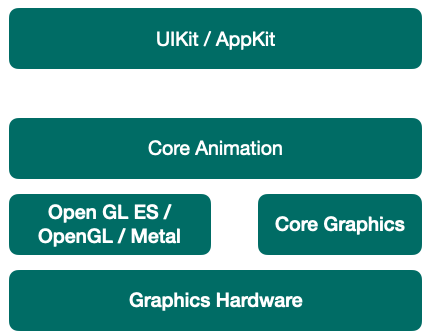

## 前言

Hi Coder，我是 CoderStar！

## 整体流程

通过上面两幅图，我们整体了解一下整体 UI 渲染的技术栈。

- `UIkit`：
  `UIKit` 自身并不具备在屏幕成像的能力，其主要负责对用户操作事件的响应（`UIView` 继承自 `UIResponder`），事件响应的传递大体是经过逐层的 视图树 遍历实现的。其中`iOS`上对应的是`UIKit`，`Mac OS`对应的是`AppKit`；

- `Core Animation`：
  `Core Animation`为**核心动画**，提供强大的 2D 和 3D 动画效果。但对应到系统中不是这个名字，而是`QuartzCore`，以 CA 开头的都是他的类，其中带 layer 的类是构成 UIView 的基石，用来呈现内容。

- `Core Graphics`：
  `Core Graphics`主要用于**运行时绘制图像**，纯 C 的 API。CoreGraphics 的类名都是以 CG 开头的，平时所用的 CGRect、CGPoint 就在 CGGeometry 这个几何相关的类中定义，CGFont 类则被封装成了 UIFont，CGImage 构成了 UIImage，CGContext 是绘图的上下文等等。所以 CoreGraphics 是系统绘制界面、文字、图像等 UI 的基础。

- `Core Image`
   `Core Image` 是用来**处理运行前创建的图像** 的。`Core Image` 框架拥有一系列现成的图像过滤器，能对已存在的图像进行高效的处理。给图片提供各种滤镜处理，比如高斯模糊、锐化等。在没有这个官方库之前，一般使用的是`GNUImage`的三方库。

- `OpenGL(ES)`：
  OpenGL ES（OpenGL for Embedded Systems，简称 GLES），是 OpenGL 的子集。它是一组调用`GPU`功能的 API 规范，具体由设备制造商实现。

- `Metal`：
  Metal 类似于 OpenGL ES，也是一套第三方标准，具体实现由苹果实现。

## Core Animation Pipeline

### App Process

这个过程是我们开发过程中可以控制的阶段，UI 优化也是在这一阶段去处理。这个阶段发生在 APP 自己的进程中。其中包括视图的创建、布局计算、图片解码、文本绘制等等。

此阶段渲染优化的措施可以查看[iOS开发-视图渲染与性能优化](https://www.jianshu.com/p/748f9abafff8)

**Layout：构建视图**
这个阶段主要处理视图的构建和布局，具体步骤包括：

调用重载的 `layoutSubviews` 方法
创建视图，并通过 `addSubview` 方法添加子视图
计算视图布局，即所有的 `Layout Constraint`

> 由于这个阶段是在 CPU 中进行，通常是 CPU 限制或者 IO 限制，所以我们应该尽量高效轻量地操作，减少这部分的时间，比如减少非必要的视图创建、简化布局计算、减少视图层级等。

**Display：绘制视图**
这个阶段主要是交给 Core Graphics 进行视图的绘制，注意不是真正的显示，而是得到前文所说的图元 primitives 数据：

1. 根据上一阶段 Layout 的结果创建得到图元信息。
2. 如果重写了 drawRect: 方法，那么会调用重载的 drawRect: 方法，在 drawRect: 方法中手动绘制得到 bitmap 数据，从而自定义视图的绘制。

注意正常情况下 Display 阶段只会得到图元 primitives 信息，而位图 bitmap 是在 GPU 中根据图元信息绘制得到的。但是如果重写了 drawRect: 方法，这个方法会直接调用 Core Graphics 绘制方法得到 bitmap 数据，同时系统会额外申请一块内存，用于暂存绘制好的 bitmap。
由于重写了  drawRect: 方法，导致绘制过程从 GPU 转移到了 CPU，这就导致了一定的效率损失。与此同时，这个过程会额外使用 CPU 和内存，因此需要高效绘制，否则容易造成 CPU 卡顿或者内存爆炸。

**Prepare：Core Animation 额外的工作**
这一步主要是：图片解码和转换

**Commit：打包并发送**
这一步主要是：图层打包并以**IPC**的形式发送到 Render Server。

> 注意 commit 操作是依赖图层树递归执行的，所以如果图层树过于复杂，commit 的开销就会很大。这也是我们希望减少视图层级，从而降低图层树复杂度的原因。

### Render Server Process

这个阶段发生在专门的**渲染进程**里。交给 GPU 去渲染。

> 在 iOS 5 以前这个进程叫 `SpringBoard`，在 iOS 6 之后叫 `BackBoard` 或者 `backboardd`；

Render Server 渲染进程注册 Source 监听 VSync 信号来驱动图层的渲染，进而提交至 GPU。

* Decode：打包好的图层被传输到 Render Server 之后，首先会进行解码。注意完成解码之后需要等待下一个 RunLoop 才会执行下一步 Draw Calls。
* Draw Calls：解码完成后，Core Animation 会调用下层渲染框架（比如 OpenGL 或者 Metal）的方法进行绘制，进而调用到 GPU。

> **动画是由 `Render Server Process` 处理计算插值然后计算每一帧**。但是 scrollview 实时滑动的时候就不是这么操作了，他的每一帧都是实时计算的，这个时候就需要 vsync 信号通知 runloop 去处理了，这也是为什么滑动时 mode 要切换为 tracking 的原因，因为实时计算太耗 cpu 只能尽量把其他任务停止。

### GPU & Display

* Render：这一阶段主要由 GPU 进行渲染。
* Display：显示阶段，需要等 render 结束的下一个 RunLoop 触发显示。

## Runloop 与渲染

iOS 的显示系统是由 VSync 信号驱动的，VSync 信号由硬件时钟生成，每秒钟发出 60 次（这个值取决设备硬件，比如 iPhone 真机上通常是 59.97）。iOS 图形服务接收到 VSync 信号后

主 RunLoop 默认并没有接收外部屏幕刷新的 source，还是等到 CADisplayLink 加入后才会有相应 source。

## 最后

新的一周要更加努力呀！

Let's be CoderStar!

- [计算机那些事(8)——图形图像渲染原理](http://chuquan.me/2018/08/26/graphics-rending-principle-gpu/)
- [iOS 保持界面流畅的技巧](https://blog.ibireme.com/2015/11/12/smooth_user_interfaces_for_ios/)
- [一文读懂iOS图像显示原理与优化](https://juejin.cn/post/6850418111976964109)
- [runloop与Vsync 信号](https://www.jianshu.com/p/d315b0a18e01)
- [深入理解 iOS Rendering Process](https://juejin.cn/post/6844903591510048775)
- [iOS Rendering 渲染全解析（长文干货）](https://www.jianshu.com/p/1172415850be)
- 
