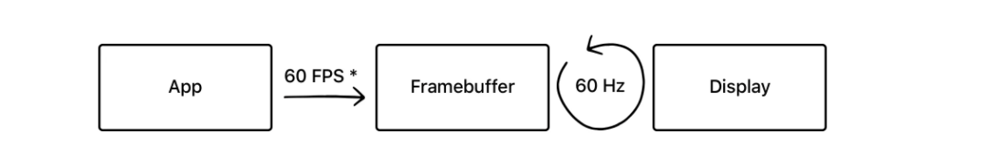
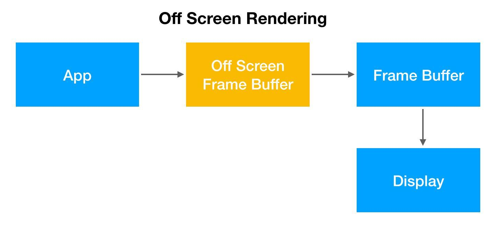
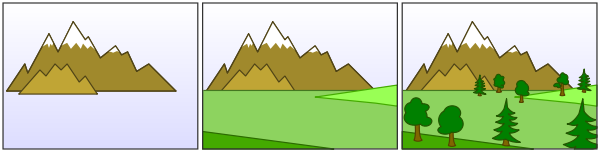

## 前言

Hi Coder，我是 CoderStar！

上周介绍了一下[iOS 页面渲染-UIView & CALayer](../iOS页面渲染-UIView%20&%20CALayer)，本周我们来聊一聊iOS页面渲染中的高频面试题--离屏渲染。

其实给大家先分享关于 iOS 页面渲染的相关知识有一个原因是为后续 iOS 优化系列中的 UI 渲染优化篇做铺垫，方便大家在后面阅读时能够清楚优化手段背后的原理以及有一个更深的理解。

在开始本文之前，我先谈谈上周我们《iOS 摸鱼周报》发起人 @zhangferry 访谈我的时候我对访谈问题给的一些答复吧。

- zhangferry：简单介绍下自己和自己的公众号吧。

> 自己：CoderStar，坐标北京，目前主要工作与 iOS 相关，对大前端、后端都有一定涉猎，喜欢分享干货博文。
>
> 公众号：CoderStar，分享大前端相关的技术知识，只聊技术干货，目前分享的内容主要是 iOS 相关的，后续还会分享一些 Flutter、Vue 前端等相关技术知识。目前公众号文章内容均是自己原创，很欢迎大家投稿一些好文章，大家一块进步。

- zhangferry：为什么有写公众号的打算？写公众号有带来什么好处吗？

> 最开始写公众号的原因其实比较简单：
> 1. 因为过去积累了一些笔记，比较零散，想整理一下；
> 2. 觉得工作经验已经到了一定的阶段，也是时候将知识梳理一遍，打造自己的知识体系了，融会贯通；
> 3. 是想把自己积累的一些技术知识分享出来，大家一起来交流，创造一个好的技术圈子，一个好的技术圈子实在是太重要了。

> 写公众号的好处：
> 1. 写文章不仅能让我对一个知识点理解的更透彻，也增强了我的写作能力，对于技术知识而言，自己理解是一个阶段，深入浅出的写出来又是一个更高的阶段；
> 2. 可以认识很多小伙伴，同行的路上不会孤单，比如和飞哥就是这样认识的。

- zhangferry：最近在研究什么有趣的东西？是否可以透露下未来几篇文章的规划？

> 最近在做优化方面的事情，未来几篇文章可能会偏向优化系列或者底层相关。

- zhangferry：如何让自己每周都能抽出时间写博客呢？有没有什么好的学习方法可以分享？

> 我目前更新的频率是一周一篇文章，一般工作日晚上会去看一些本期文章涉及的资料以及做一些代码实践，然后积累一些笔记，在周末时候将笔记进行整理聚合，形成文章，其实这个过程中还是比较累的，毕竟有的时候工作会忙，但是这个事情一定要坚持，给自己一个目标，不能随随便便就断更，毕竟有第一次断更就有第二次。
>
> 学习方法：说一点吧，我自己对于技术的态度是实践型 + 更优解，当看到一些好的文章的时候，会自己将文章里面的原理或者实现自己动手实践一下，考虑这个方法有什么缺点，并围绕这个技术点去思考有没有更好的解决方案，不断地去寻找更优解。

关于访谈部分就说这么多，希望我的一些心得能给大家提供一些借鉴。好了，我们接下来言归正传，技术干货开始了。

> 其实本周是准备分享我对某几个设计模式的心得体会给大家的，但后来考虑到内容的连贯性以及不确定大家对设计模式的感兴趣程度，就放弃了这个想法，如果大家对设计模式比较感兴趣，可以通过点赞来表达一下。

## 离屏渲染概念

先简单说下 iOS 页面渲染的正常流程。

如果要在显示屏上显示内容，我们至少需要一块与屏幕像素数据量一样大的 `Framebuffer`，作为像素数据存储区域，GPU 不停地将渲染完成后的内容放入 `Framebuffer` 帧缓冲器中，而显示屏幕不断地从 `Framebuffer` 中获取内容，显示实时的内容。

如果有时因为面临一些限制，无法把渲染结果直接写入 `Framebuffer`，我们就需要先额外创建离屏渲染缓冲区 `Offscreen Buffer`，将提前渲染好的内容放入其中，等到合适的时机再将 `Offscreen Buffer` 中的内容进一步叠加、渲染，完成后将结果切换到 `Framebuffer` 中，那么这个过程便被称之为**离屏渲染**。

> 对于上周文章所提到的利用 `Core Graphics` 的 API 进行页面绘制的方式有时候也会被称为`离屏渲染`（因为像素数据是暂时存入了CGContext，而不是直接到了frame buffer），但是按照[苹果工程师说法](https://lobste.rs/s/ckm4uw/performance_minded_take_on_ios_design#c_itdkfh)，这种绘制方式发生在CPU中，并非是真正意义上的离屏渲染，其实通过CPU渲染就是俗称的'软件渲染'，而真正的离屏渲染发生在GPU，我们这里研究的更多是 GPU 的离屏渲染。

## 离屏渲染的性能问题

通常情况下来说, 离屏渲染非常消耗性能, 主要体现在两个方面：
- 创建新缓冲区：要想进行离屏渲染，首先要创建一个新的缓冲区，需要增加额外的空间，大量的离屏渲染可能造成内存的过大压力，其中`Offscreen Buffer` 的总大小也有限，不能超过屏幕总像素的 2.5 倍；
- 渲染的上下文切换：离屏渲染的整个过程，需要进行两次上下文环境切换, 先切换到屏幕外环境, 离屏渲染完成后再切换到当前屏幕, 上下文的切换是很高昂的消耗，特别是滚动视图中，影响更为突出。

一旦需要离屏渲染的内容过多，很容易造成掉帧的问题。所以大部分情况下，我们都应该尽量避免离屏渲染。

## 离屏渲染存在的原因

既然离屏渲染对性能有损伤，那为什么还要使用离屏渲染呢？主要有两种原因：

1. 一些特殊效果需要使用额外的 `Offscreen Buffer` 来保存渲染的中间状态，所以不得不使用离屏渲染；
2. 处于效率目的，可以将内容提前渲染保存在 `Offscreen Buffer` 中，达到复用的目的。

对于第一种情况，也就是不得不使用离屏渲染的情况，一般都是系统自动触发的，比如`mask`、`UIBlurEffectView`等。下文会介绍具体哪些常见的场景会发生离屏渲染。

对于第二种情况，我们可以利用开启`CALayer`的`shouldRasterize`属性去触发离屏渲染。开启之后，`Render Server` 会强制将 `CALayer 的渲染位图结果 `bitmap` 保存下来，这样下次再需要渲染时就可以直接复用，从而提高效率。

保存的 `bitmap` 包含 `layer` 的 `subLayer`、圆角、阴影、组透明度 `group opacity` 等，所以如果 `layer` 的构成包含上述几种元素，结构复杂且需要反复利用，那么就可以考虑打开光栅化。**其主旨在于降低性能损失，但总是至少会触发一次离屏渲染。**

> 圆角、阴影、组透明度等会由系统自动触发离屏渲染，那么打开光栅化就可以节约第二次及以后的渲染时间。而多层 subLayer 的情况由于不会自动触发离屏渲染，所以相比之下会多花费第一次离屏渲染的时间，但是可以节约后续的重复渲染的开销。

不过使用光栅化的时候需要注意以下几点：
* 如果 `layer` 本来并不复杂，也没有圆角阴影等等，则没有必要打开光栅化；
* 如果 `layer` 不能被复用，则没有必要打开光栅化；
* `layer` 的内容（包括子 layer）必须是静态的，因为一旦发生变化（如 resize，动画），之前辛苦处理得到的缓存就失效了。所以如果`layer`不是静态，需要被频繁修改，比如处于动画之中，那么开启离屏渲染反而影响效率；
* 离屏渲染缓存内容有时间限制，缓存内容 `100ms` 内如果没有被使用，那么就会被丢弃，无法进行复用；
* 离屏渲染缓存空间有限，超过 `2.5` 倍屏幕像素大小的话也会失效，无法复用。

> 其实除了解决多次离屏渲染的开销，`shouldRasterize` 在另一个场景中也可以使用：如果 layer 的子结构非常复杂，渲染一次所需时间较长，同样可以打开这个开关，把 layer 绘制到一块缓存，然后在接下来复用这个结果，这样就不需要每次都重新绘制整个 layer 树了。

## 离屏渲染产生逻辑

图层的叠加绘制大概遵循**画家算法**，在这种算法下会按层绘制，首先绘制距离较远的场景，然后用绘制距离较近的场景覆盖较远的部分。

在普通的 layer 绘制中，上层的 sublayer 会覆盖下层的 sublayer，下层 sublayer 绘制完之后就可以抛弃了，从而节约空间提高效率。所有 sublayer 依次绘制完毕之后，整个绘制过程完成，就可以进行后续的呈现了。

而有些场景并没有那么简单。GPU 虽然可以一层一层往画布上进行输出，但是无法在某一层渲染完成之后，再回过头来擦除 / 改变其中的某个部分——因为在这一层之前的若干层 layer 像素数据，已经在渲染中被永久覆盖了。这就意味着，**对于每一层 layer，要么能找到一种通过单次遍历就能完成渲染的算法，要么就不得不另开一块内存，借助这个临时中转区域来完成一些更复杂的、多次的修改 / 剪裁操作。**

## 离屏渲染发生的场景

我们先打开模拟器 Debug 下的离屏渲染颜色标记，如左图所示，当出现离屏渲染时，相应控件会出现如右图所示的黄色。

通过我们上面离屏渲染发生的原因，其实我们可以很简单的归纳出离屏渲染出现的场景。

**只要裁剪的内容需要画家算法未完成之前的内容参与就会触发离屏渲染**。

总结一下，下面几种情况会触发离屏渲染：

- 使用了 mask 的 layer (layer.mask)；
- 添加了投影的 layer (layer.shadow*，表示相关的 shadow 开头的属性)
- 设置了组透明度为 YES，并且透明度不为 1 的 layer (layer.allowsGroupOpacity/layer.opacity)
- 采用了光栅化的 layer (layer.shouldRasterize)
- 绘制了文字的 layer (UILabel, CATextLayer, Core Text 等)
- 需要进行裁剪的 layer (layer.masksToBounds / view.clipsToBounds)

还有一个会触发离屏渲染的场景是我们非常常见的 -- 圆角，这个需要着重说明一下。

我们经常看到，圆角会触发离屏渲染。但其实这个说法是不准确的，因为圆角触发离屏渲染也是有条件的！

我们先看一下苹果官方文档对于`cornerRadius`的描述：

> Discussion
> Setting the radius to a value greater than 0.0 causes the layer to begin drawing rounded corners on its background. By default, the corner radius does not apply to the image in the layer’s contents property; it applies only to the background color and border of the layer. However, setting the masksToBounds property to true causes the content to be clipped to the rounded corners.
> The default value of this property is 0.0.

设置 `cornerRadius` 大于 0 时，只为 layer 的 `backgroundColor` 和 `border` 设置圆角；而不会对 `layer` 的 `contents` 设置圆角，除非同时设置了 `layer.masksToBounds` 为 `true`（对应 `UIView` 的 `clipsToBounds` 属性）。

但是当`layer.masksToBounds`或者`clipsToBounds`设置为 true，也不一定会触发离屏渲染。

**当我们设置了圆角 + 裁剪之后，还需要我们为 contents 设置了内容才会触发离屏渲染，其中为 contents 设置了内容的方式不一定是直接为 layer 的 contents 属性赋值，还包括添加有图像信息的子视图等方式。**

关于圆角，iOS 9 及之后的系统版本，苹果进行了一些优化。
我们只设置 `layer` 的 `contents` 或者 `UIImageView` 的 `image`，并加上圆角 + 裁剪，是不会产生离屏渲染的。但如果加上了背景色、边框或其他有图像内容的图层，还是会产生离屏渲染。

总结一下，iOS 9 之后圆角造成离屏渲染的条件包括：
- 圆角
- 裁剪
- layer 的 contents 不为 nil
- 设置了背景色 / 边框 / 其他有图像内容的图层

> 有些结论一定要自己去试一下，就比如说我上面的结论也不一定是对的，因为可能还有我没注意到的 case。

既然圆角 + 裁剪在一定情况下会产生离屏渲染，那么有什么方式可以帮助我们在不产生离屏渲染绘制圆角效果呢？如下：

* 【换资源】直接使用带圆角的图片，或者替换背景色为带圆角的纯色背景图，从而避免使用圆角裁剪。不过这种方法需要依赖具体情况，并不通用；
* 【UIBezierPath】用贝塞尔曲线绘制闭合带圆角的矩形，在上下文中设置只有内部可见，再将不带圆角的 layer 渲染成图片，添加到贝塞尔矩形中。这种方法效率更高，但是 layer 的布局一旦改变，贝塞尔曲线都需要手动地重新绘制，所以需要对 frame、color 等进行手动地监听并重绘；
* 【CoreGraphics】重写 drawRect:，用 CoreGraphics 相关方法，在需要应用圆角时进行手动绘制。不过 CoreGraphics 效率也很有限，如果需要多次调用也会有效率问题；
* 【mask】再增加一个和背景色相同的遮罩 mask 覆盖在最上层，盖住四个角，营造出圆角的形状。但这种方式难以解决背景色为图片或渐变色的情况。

## 最后

新的一周要更加努力呀！

Let's be CoderStar!

参考链接
- [iOS Rendering 渲染全解析（长文干货）](https://juejin.cn/post/6844904162765832206#heading-17)
- [关于iOS离屏渲染的深入研究](https://zhuanlan.zhihu.com/p/72653360)
- [iOS界面渲染与优化(四) - 离屏渲染与优化总结](https://juejin.cn/post/6982909100275269662)
- [iOS圆角的离屏渲染，你真的弄明白了吗](https://juejin.cn/post/6846687603316490254#heading-2)
- [iOS性能优化——离屏渲染的分析探究](https://mp.weixin.qq.com/s/grfRkNI90bUUCWR0l7TjNw)

> 为什么圆角和裁剪后iOS绘制会触发离屏渲染?

> 答:默认情况下每个视图都是完全独立绘制渲染的。而当某个父视图设置了圆角和裁剪并且又有子视图时，父视图只会对自身进行裁剪绘制和渲染。

> 当子视图绘制时就要考虑被父视图裁剪部分的绘制渲染处理，因此需要反复递归回溯和拷贝父视图的渲染上下文和裁剪信息，再和子视图做合并处理，以便完成最终的裁剪效果。这样势必产生大量的时间和内存的开销。

> 解决的方法是当父视图被裁剪和有圆角并且有子视图时，就单独的开辟一块绘制上下文，把自身和所有子视图的内容都统一绘制在这个上下文中，这样子视图也不需要再单独绘制了，所有裁剪都会统一处理。当父视图绘制完成时再将开辟的缓冲上下文拷贝到屏幕上下文中去。这个过程就是离屏渲染!!

> 所以离屏渲染其实和我们先将内容绘制在位图内存上下文然后再统一拷贝到屏幕上下文中的双缓存技术是非常相似的。使用离屏渲染主要因为ios内部的视图独立绘制技术所导致的一些缺陷而不得不才用的技术。