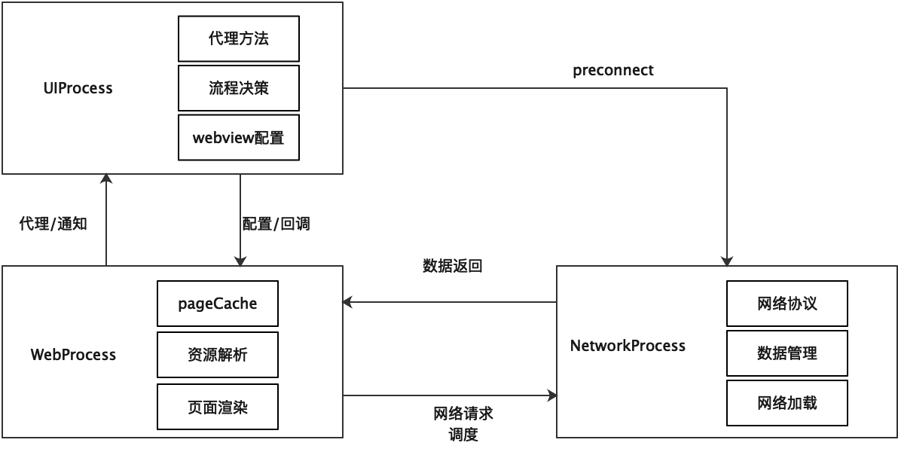

## WebKit 进程

在 iOS 系统中，通常一个应用对应一个进程，但是在 WebKit 的发展过程中，基于稳定性与安全性考虑，引入了多进程的概念，避免单一页面的异常影响整体 app 运行，首先本文简单介绍下几个常见的 WebKit 进程，如下所示。

### UIProcess

APP 所在进程，WKWebView 代码和 WebKit 框架已加载到你的进程空间中；主要负责与 WebContent 进行交互，与 APP 在同一进程中，可以进行 WebView 的功能配置，并接收来自 WebContent 进程的各类消息，配合业务代码执行任务的决策，例如是否发起请求，是否接受响应等。

### WebContent

又称 WebProcess，JS 和 DOM 内存分配所在的位置，即网页内容渲染与 js 执行所处进程；该进程对应的是每一个新开的网页，该进程视内存情况可进行复用，某一 WebContent 进程的异常并不会影响到主 app 进程，常见的异常现象为白屏。

配置同一 WKProcessPool 的多个 WKWebView 共享的是同一 WebContent 进程池，该配置未限制 WebContent 进程数量，而是共享进程池。

主要负责页面资源的管理，包含前进后退历史，pageCache，页面资源的解析、渲染。并把该进程中的各类事件通过代理方式通知给 UIProcess。

### Network Process

负责发出与 Web 请求关联的基础网络请求；无论多 WKWebView 还是单 WKWebView 场景，都只有唯一的 NetWorking 进程，这种设计主要便于网络请求管理以及保证网络缓存、cookie 等管理的一致性。

NetworkProcess 也是通过封装的 NSURLSession 发起并管理网络请求的。但不同的是，这一过程中有较多的网络进度的回调工作以及各类网络协议管理，比如资源缓存协议、HSTS 协议、cookie 管理协议等。

### Storage Process

用于数据库和服务工作者的存储。



## 与 Native 通信

### Swift 调用 Native

`evaluateJavaScript`方式，使用这种方式去执行 js 时，为了保证调用时 js 已经加载完成，我们一般是在`didFinish`时机后进行调用。

```swift
webView.evaluateJavaScript("showJSInfo('\(info)')") { result, error in
  /// result是调用showJSInfo()这个js方法的返回值
  Log.d(result)

  // 如果调用方法出现错误，error会显示出来
   Log.d(error)
}
```

使用WKUserScript这种方式我们可以控制注入时机。
```swift
let source = "function captureLog(msg) { window.webkit.messageHandlers.logHandler.postMessage(msg); } window.console.log = captureLog;"
// injectionTime参数还可以设置为 atDocumentStart
let script = WKUserScript(source: source, injectionTime: .atDocumentEnd, forMainFrameOnly: false)
// 执行自定义js
webView.configuration.userContentController.addUserScript(script)
```

### JS 调用 Native

在 WKWebView 中，一般使用的通信方式为`postMessage`。在iOS14之前，JS调用Native获得返回值这么一个流程：
1. js使用`postMessage`函数传递信息到Native，并附带后续Native调用js的方法或标识
2. Native收到消息后，再调用`evaluateJavaScript`方式去将返回值传给js
```swift
/// 这种方式会循环引用，所以需要进行及时移除
webView.configuration.userContentController.add(self, name: "showInfoFromNative")

webView.configuration.userContentController.removeScriptMessageHandler(forName: "showInfoFromNative")

extension WkWebViewController: WKScriptMessageHandler {
    final func userContentController(_ userContentController: WKUserContentController, didReceive message: WKScriptMessage) {
         // 函数名称
         let name = message.name
         // 函数传递过来内容
         let body = message.body
    }
}
```

```js
window.webkit.messageHandlers.showInfoFromNative.postMessage("我是js通过messageHandlers传递过来的数据")
```

其实`postMessage`返回的是一个Promise，但是在iOS 14之前，其结果是没法进行`resolve`的，但这里注意一下的是，其结果then会等到Native端代理方法执行完毕（不可异步）之后才会执行。所以我们可以将代理方法体中将js侧一个全局变量设值，然后在then内部获取，间接实现直接通信。

在iOS 14之后，出现了一个WKScriptMessageHandlerWithReply代理，我们便可以直接在代理回调里面设置返回值，然后js侧直接在代理中获取到返回值。

```swift
if #available(iOS 14.0, *) {
  webView.configuration.userContentController.addScriptMessageHandler(self, contentWorld: .page, name: "showInfoFromNativeWithReply")
}


if #available(iOS 14.0, *) {
  webView.configuration.userContentController.removeScriptMessageHandler(forName: "showInfoFromNativeWithReply", contentWorld: .page)
}

extension WkWebViewController: WKScriptMessageHandlerWithReply {
    func userContentController(_ userContentController: WKUserContentController, didReceive message: WKScriptMessage, replyHandler: @escaping (Any?, String?) -> Void) {
        if message.name == "showInfoFromNativeWithReply" {
            Log.d(message.body)
            DispatchQueue.global().asyncAfter(deadline: 2) {
                // 第一个参数为resolve值，第二个为reject值
                replyHandler("123", nil)
            }
        }
    }
}

```

```js
window.webkit.messageHandlers.showInfoFromNativeWithReply.postMessage("我是js通过messageHandlers传递过来的数据")
.then((result) => {
  console.log("result:");
  console.log(result);
}).catch((error) => {
  console.log("error:");
  console.log(error);
})
```

## 代理方法

WKWebview 代理主要是 WKUIDelegate 以及 WKNavigationDelegate 两部分。

### WKNavigationDelegate

WKNavigationDelegate 可以分为页面请求以及页面渲染两部分。

```swift
//页面请求部分

//发送请求前执行，决定是否允许发送请求
optional public func webView(_ webView: WKWebView, decidePolicyFor navigationAction: WKNavigationAction, decisionHandler: @escaping (WKNavigationActionPolicy) -> Void)

//如果需要证书验证，进行验证
optional public func webView(_ webView: WKWebView, didReceive challenge: URLAuthenticationChallenge, completionHandler: @escaping (URLSession.AuthChallengeDisposition, URLCredential?) -> Void)

//收到回应，决定是否允许载入
optional public func webView(_ webView: WKWebView, decidePolicyFor navigationResponse: WKNavigationResponse, decisionHandler: @escaping (WKNavigationResponsePolicy) -> Void)

//后台重定向
optional public func webView(_ webView: WKWebView, didReceiveServerRedirectForProvisionalNavigation navigation: WKNavigation!)

//失败，一般是网络错误
optional public func webView(_ webView: WKWebView, didFailProvisionalNavigation navigation: WKNavigation!, withError error: Error)

//页面渲染

//网页开始加载时调用
optional public func webView(_ webView: WKWebView, didStartProvisionalNavigation navigation: WKNavigation!)

//网页正在加载
optional public func webView(_ webView: WKWebView, didCommit navigation: WKNavigation!)

//网页加载完成
optional public func webView(_ webView: WKWebView, didFinish navigation: WKNavigation!)

//网页加载失败
optional public func webView(_ webView: WKWebView, didFail navigation: WKNavigation!, withError error: Error)

//关闭
optional public func webViewWebContentProcessDidTerminate(_ webView: WKWebView)
```

## 其他

### js 注入相关

```swift
//注入宽度自适应标签
 let js = "var oMeta = document.createElement('meta');oMeta.content = 'initial-scale=0.6,minimum-scale=0.5';oMeta.name = 'viewport';document.getElementsByTagName('head')[0].appendChild(oMeta);"
webView.evaluateJavaScript(js, completionHandler: nil)

//body滚动到顶部
webView.evaluateJavaScript("document.body.scrollTop = document.documentElement.scrollTop = 0;", completionHandler: nil)

//禁止长按出现菜单
webView.evaluateJavaScript("document.documentElement.style.webkitUserSelect='none';", completionHandler: nil)
webView.evaluateJavaScript("document.documentElement.style.webkitTouchCallout='none';", completionHandler: nil)

//放大文字
webView.evaluateJavaScript("document.getElementsByTagName('body')[0].style.webkitTextSizeAdjust= '266%'",completionHandler: nil)
```
