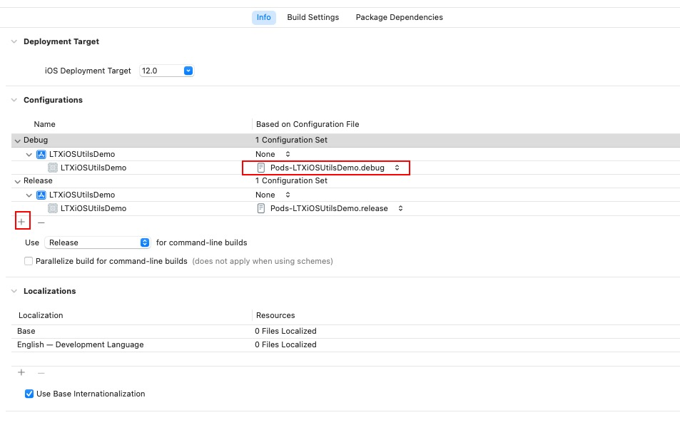

## 前言

Hi Coder，我是 CoderStar！

不知道大家会不会思考这样的问题？

- `xcodebuild`命令的几个参数怎么填，到底是填`scheme`，还是填`target`，亦或是其他的？
- `CocoaPods`是如何将库与工程组合到一起的？
- 多环境配置出包的是选择多`target`方案还是多`configuration`方案？
- ...

带着这些问题我们走进今天的文章，了解`Xcode`的各种`Concepts`。

Xcode 有比较多的概念，如下有：

* Workspace
* Project
* Target
* Scheme
* Build Setting（Xcconfig）
* Configurations
* Product

是不是有一种感觉：看着就很熟悉，但细细去解释又感觉有点吃力。接下来我们就一起来沿着我的思路回顾一下这些概念。

> 概念之间是相辅相成的，需要带着整体的思路去理解这些概念，不同章节之间记得联系起来看。

官方对这些概念的解释可以看这篇文档：[Xcode Concepts](https://developer.apple.com/library/archive/featuredarticles/XcodeConcepts/Concept-Targets.html)

## Product

`Product` 顾名思议就是 **产物**，这也是我们使用 Xcode 最终想要生成的东西，这些产物按照 `Mach-O Type` 来划分包括：

- Executable
- Dynamic Library
- Static Library
- Bundle
- ...

这个产物便是我们最终想通过`Xcode`得到的目标产物，那我们需要怎么得到这个产物呢，那就涉及到下方的概念了。

## Target

一个`Target`来描述（或者叫做生产）一个`Product`，那它是怎么描述这个产物呢？

>也可以把`Target`理解成一个最小的编译单元；


如上图所示，`Target`的设置主要包含七个部分，就不一一列举了，挑几个我觉得需要注意的几个聊一聊吧。

### `Build Settings`

我们对`Build Settings`应该是比较熟悉的，会经常在里面配置一些参数，其本质就是`Target`所依赖的环境参数。具体的参数列举以及说明可以参照 [xcodebuildsettings](https://xcodebuildsettings.com/)。

配置界面如下图所示，完整的 `Build Settings` 共有将近 40 项配置内容。从配置界面上看，每一项的配置都有五列（因为项目是`CocoaPods`管理的，所以会有`Project Config`文件配置列），可以看到，从左至右的顺序分别是：`Resolved` 列、`Target` 列、`Project Config`列、`Project` 列、`iOS Default` 列，每一列所代表的意义如下。


* `Resolved` 列：最终确定的编译方式，无法自己设定。其结果是根据其右边四栏的选择结果以及优先级顺序来确定最后编译时采用的编译方式。在图的第二行选项卡中选择 `combined` 选项，可以直接地看到只有该栏的最后结果；
* `Target` 列：`Target` 的 `Build Settings` 配置的编译选项。可自定义，其优先级最高；
* `Project Config` 列：`Project`对应配置的`Config`文件配置的编译选项，如果没有配置，则没有该列。（该列文件会在下文给出）
* `Project` 列：`Project` 的 `Build Settings` 配置的编译选项；
* `iOS Default` 列：在创建项目时系统自带的默认编译选项，无法修改。优先级最低，只有当其他两栏都没有设置选项时，最后的编译方式才会以该栏为准；

整个配置是有优先级的，**从左到右优先级依次降低**，其中绿色背景就是最终生效的配置，与`Resolved`列完全对应上。

> 选中某个配置，前面会出现一个指向右侧的箭头，点击可以展开不同环境的配置选中，这跟`Project`里面配置的 `Configuations`是对应上的，具体在`Project`章节详细介绍；

在平时我们配置`Build Settings`会碰到一些环境变量，这里也稍微列举一下。

- `$(PROJECT_DIR)` 代表的是整个项目，一般是`.xcodeproj`文件所在目录；
- `${SRCROOT}` 包含定义 `Target` 的 `Project` 的路径，一般情况下和`$(PROJECT_DIR)`是等价的；
- `${PROJECT_FILE_PATH}`表示 `Project` 的当前路径，相当于`$(PROJECT_DIR)/$(PROJECT_NAME).xcodeproj`；
- `${PODS_ROOT}` 代表的是 `Pods` 目录，是 `CocoaPods` 通过 `UserDefine` 自定义的；
- `$(inherited)` 继承上一级（Project）或依赖项的配置。通过 CocoaPods 集成的项目，$(inherited) 将会包含 Pods_xxxx.xcconfig 中的配置

在设置路径时还有下面两个选项，表示是否递归寻找子目录
- `non-recursive`：非递归
- `recursive`：递归

### Info

这里提一下查询`Info.plist`文件相关键值的文档：[AboutInformationPropertyListFiles](https://developer.apple.com/library/archive/documentation/General/Reference/InfoPlistKeyReference/Articles/AboutInformationPropertyListFiles.html#//apple_ref/doc/uid/TP40009254-SW5)。

### `Build Phases`

我们可以看到该部分主要方面四方面的类型，当然也可以手动添加一些脚本在构建过程中运行，如使用`Cocoapods`管理的项目这里就会增加一些自定义的脚本。

#### `Dependenices`

`Target` 对象依赖阶段：设置该`Target`依赖的其他`Target`，即该`Target`的构建必须等到其依赖的`Target`构建输出之后才可构建。注意这里`Target`的范围必须是同一`Project`里面的；

有一些对应的使用场景：
  * 宿主程序依赖扩展程序；
  * `Pod Target`依赖三方库`Target`；
  * 单元测试 `Target`依赖`App Target`
  * ...

#### `Compile Sources`

源文件阶段：是指将有哪些源代码被编译，可以通过对应的【+】【-】按钮进行添加或删除资源来控制编译的代码文件。并且可以通过修改此阶段的 `Compiler Flags`（编译器标识）来为每个单独文件设置其编译器标示，比如设置是否支持 ARC，是否显示`Warning`等；

#### `Link Binary With Libraries`

链接二进制库阶段：是指编译过程中会引用哪些库文件，我们同样可以通过【+】【-】按钮进行添加或删除编译所引用的库文件。

这里就不受同一个`Project`的限制；

#### `Copy Bundle Resources`

拷贝 `Bundle` 资源阶段：是指生成的 product 的 .app 内将包含哪些资源文件，同样可以通过红框中的【+】【-】按钮进行添加或删除资源来控制编译的资源文件。该阶段定义了对象中的资源文件，包括图片，`xib`文件等等。

## Project

那上面聊了`Target`这一概念，我们再聊聊他的上一级 --`Project`。

一个`Project`可以包含一个或多个`Target`，并且为它们提供所需的源文件、资源等等，即所有`Target`可以共享其所在`Project`的所有物料，包括源文件、资源文件以及`Build Settings`等等。



根据上图，我们可以发现其涉及三个`Tab`：
- Info：基本信息；
- Build Settings：配置；
- Package Dependencies：`Package`依赖项，也就是我们常说的 SPM；

这里我们只关注一下 `Info` 所在 `Tab` 部分信息；

### Configurations

用来配置 iOS 项目的 `xcconfig` 文件，主要用于在几套不同的开发环境编译。
`xcconfig` 文件其实就是 `Xcode` 里的 `config` 文件，本质是一个用来保存 `Build Settings` 键值对的纯文本文件。形式如下：

```txt
ALWAYS_EMBED_SWIFT_STANDARD_LIBRARIES = YES
CLANG_WARN_QUOTED_INCLUDE_IN_FRAMEWORK_HEADER = NO
```

我们一般见到`xcconfig`文件，都是因为`CocoaPods`的缘故，这里就稍微扩展一下：假如我们自定义了`xcconfig`文件，又使用了`CocoaPods`管理项目，那如何管理自定义的`xcconfig`文件和`CocoaPods`自动生成的`xcconfig`文件；


这个[issues](https://github.com/CocoaPods/CocoaPods/issues/1736)提供了解决办法，即：

在自定义的`xcconfig`文件中使用如下形式来引入`CocoaPods`自动生成的`xcconfig`文件

`#include "Pods/Target Support Files/XXXXXX.xcconfig"`

然后使用如下
`pod install --no-integrate`

曾经有一个选项 --no-integrate 可以避免将相应的 pod config 文件附加到我们现在不再存在的配置集中。
如果我们想要它，我们会在 Podfile 中添加:integrate_targets => false 作为选项。


### .xcodeproj


上图我们可以看到`.xcodeproj`的文件结构：
- `project.pbxproj`：想必大家都知道，我们平时在合并分支时经常会解决这个文件的冲突，也是最复杂的一个文件，里面记录代码的结构等信息。
- `project.xcworkspace`：这个位置的`.workspace`就不多介绍了，下面统一介绍。
- `xcshareddata`：主要包括 shared 出去的 scheme；
- `xcuserdata`：断点数据 (如果未打过断点，则不会有该文件，如果打过全取消了，该文件也不会被删除，只是内容发生变化)，未 `shared` 的 `scheme`。该文件夹一般是需要被 git 进行忽略的；

## scheme

Xcode Scheme 定义一组操作，默认有：Build、Test、Launch、Profile、Analyze、Archive。每一种操作定义了一系列的指令，包括：target、build configuration、arguments、options 等等，这些参数、指令共同构成一个构建方案，从而用于构建一个或多个 target。

我们可以拥有任意数量的 scheme，但一次只能激活一个 scheme，对应在 Xcode 的右上角我们每次只能选中一个 scheme。

### 多环境打包

多环境打包主要分成三种方式

- 多 target
- 多 configuration
- 多 xconfig

不管是多 target 还是多 configuration，我们都需要新建 scheme，只不过前者建立一个 scheme，然后选择一个新的 target、旧的 configuration，而后者是选择一个已有的 target，一个新的 configuration。

#### 多 Target

这种方式如果项目中有扩展程序，就满足不了需求，因为 App 宿主程序与扩展程序均为一个 target。

## workspace, project, target, build configuration, scheme

想 build 出一个 product，需要知道有哪些文件需要 build，build 的时候需要哪些构建参数。

target 指定了需要哪些文件，build configuration 指定了使用哪些构建参数。所以我们 build 的时候就需要一个特定的 target 和一个特定的 build configuration，这时候 scheme 就起作用了，scheme 可以理解为工程编译运行时的配置文件, 它可以指定 build 的时候用哪个 target 和 build configuration，project 里可以有多个 target 和多个 build configuration，同时 workspace 里可以有多个 project，这些 project 的编译输出文件同在一个编译输出目录下，即整个 workspace 维度的。

所以如果需要编译不同的文件，那么需要不同的 target；如果编译的文件都相同，只是配置文件不同，如 plist、entitlements 文件等，那么只需不同的 build configuration 即可。如果既要编译不同的文件，又要不同的配置文件及编译参数，那么需要 target 和 build configuration 混合使用。所有 build 设置相关的都可以在 build configuration 中单独设置。

## Workspace

### .xcworkspace


- `contents.xcworkspacedata`：拥有的 project 等配置；
- `xcshareddata`：里面会包含对 IDE 的版本检查，以及 SPM 保存的数据。
- `xcuserdata`：断点数据 (如果未打过断点，则不会有该文件，如果打过全取消了，该文件也不会被删除，只是内容发生变化)，窗口设置数据；（UserInterfaceState.xcuserstate，二进制类型），该文件夹一般是需要被 git 进行忽略的；

> 看到这里想必大家就能明白为什么 Xcode 重新打开项目时，断点以及窗口还会保持原样。

## 最后

要更加努力呀！

Let's be CoderStar!

* [Xcode Concept 学习笔记](https://sketchk.xyz/2020/05/14/Xcode-Concept/)
* [理解 Xcode 中的各种概念](http://chuquan.me/2021/12/03/understand-concepts-in-xcode/#more)
* [理解 Xcode 中的各种文件](http://chuquan.me/2021/12/14/understand-files-in-xcode/#more)
* [Xcode 工程文件解析](https://looseyi.github.io/post/sourcecode-cocoapods/08-cocoapods-xcodeproj/)
* [iOS项目Project和Target配置详解](http://www.liugangqiang.com/2018/03/22/iOS%E9%A1%B9%E7%9B%AEProject%E5%92%8CTarget%E9%85%8D%E7%BD%AE%E8%AF%A6%E8%A7%A3/)
