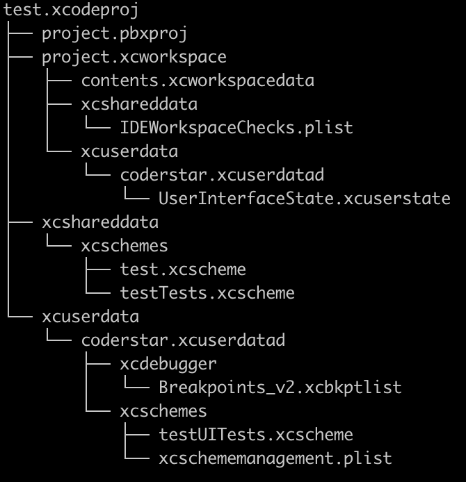
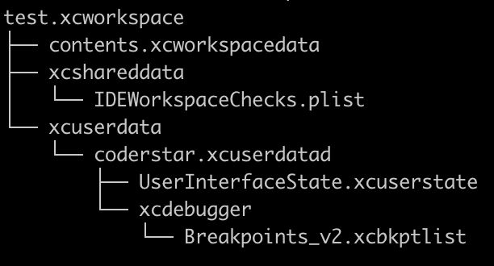

## 前言

Hi Coder，我是 CoderStar！

Xcode 有非常多的概念，比如：workspace、project、target、scheme 等，这些概念之间都存在一定的依赖关系，了解这些关系有利于我们对 Xcode 工程体系的一个理解，后续使用`xcodebuild`命令进行操作时也能对参数的使用一清二楚。

## workspace

## project

## target

## build configuration

属于 project 范围

## scheme

Xcode Scheme 定义一组操作，默认有：Build、Test、Launch、Profile、Analyze、Archive。每一种操作定义了一系列的指令，包括：target、build configuration、arguments、options 等等，这些参数、指令共同构成一个构建方案，从而用于构建一个或多个 target。

我们可以拥有任意数量的 scheme，但一次只能激活一个 scheme，对应在 Xcode 的右上角我们每次只能选中一个 scheme。

## 多环境打包

多环境打包主要分成三种方式

- 多 target
- 多 configuration
- 多 xconfig

不管是多 target 还是多 configuration，我们都需要新建 scheme，只不过前者建立一个 scheme，然后选择一个新的 target、旧的 configuration，而后者是选择一个已有的 target，一个新的 configuration。

### 多 Target

这种方式如果项目中有扩展程序，就满足不了需求，因为 App 宿主程序与扩展程序均为一个 target。

## workspace, project, target, build configuration, scheme

想 build 出一个 product，需要知道有哪些文件需要 build，build 的时候需要哪些构建参数。

target 指定了需要哪些文件，build configuration 指定了使用哪些构建参数。所以我们 build 的时候就需要一个特定的 target 和一个特定的 build configuration，这时候 scheme 就起作用了，scheme 可以理解为工程编译运行时的配置文件, 它可以指定 build 的时候用哪个 target 和 build configuration，project 里可以有多个 target 和多个 build configuration，同时 workspace 里可以有多个 project，这些 project 的编译输出文件同在一个编译输出目录下，即整个 workspace 维度的。

所以如果需要编译不同的文件，那么需要不同的 target；如果编译的文件都相同，只是配置文件不同，如 plist、entitlements 文件等，那么只需不同的 build configuration 即可。如果既要编译不同的文件，又要不同的配置文件及编译参数，那么需要 target 和 build configuration 混合使用。所有 build 设置相关的都可以在 build configuration 中单独设置。

## 文件

### .xcodeproj

上图我们可以看到`.xcodeproj`的文件结构，
- `project.pbxproj`：想必大家都知道，我们平时在合并分支时经常会解决这个文件的冲突，也是最复杂的一个文件，里面记录代码的结构等信息。
- `project.xcworkspace`：这个位置的`.workspace`就不多介绍了，下面统一介绍。
- `xcshareddata`：主要包括shared出去的scheme；
- `xcuserdata`：断点数据(如果未打过断点，则不会有该文件，如果打过全取消了，该文件也不会被删除，只是内容发生变化)，未shared的scheme。该文件夹一般是需要被git进行忽略的；

### .xcworkspace

- `contents.xcworkspacedata`：拥有的project等配置；
- `xcshareddata`：里面会包含对IDE的版本检查，以及SPM保存的数据。
- `xcuserdata`：断点数据(如果未打过断点，则不会有该文件，如果打过全取消了，该文件也不会被删除，只是内容发生变化)，窗口设置数据；（UserInterfaceState.xcuserstate，二进制类型），该文件夹一般是需要被git进行忽略的；

## 最后

要更加努力呀！

Let's be CoderStar!

[Xcode Concepts](https://developer.apple.com/library/archive/featuredarticles/XcodeConcepts/Concept-Projects.html)
[Xcode Concept 学习笔记](https://sketchk.xyz/2020/05/14/Xcode-Concept/)
[理解 Xcode 中的各种概念](http://chuquan.me/2021/12/03/understand-concepts-in-xcode/#more)
[理解 Xcode 中的各种文件](http://chuquan.me/2021/12/14/understand-files-in-xcode/#more)
[https://looseyi.github.io/post/sourcecode-cocoapods/08-cocoapods-xcodeproj/](https://looseyi.github.io/post/sourcecode-cocoapods/08-cocoapods-xcodeproj/)
