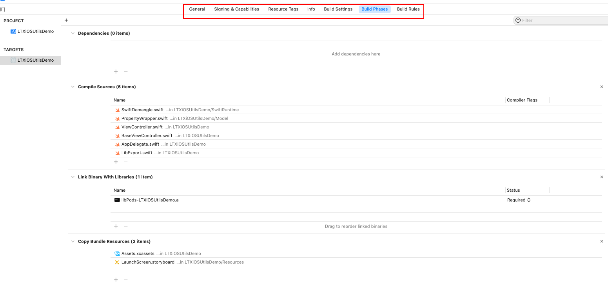
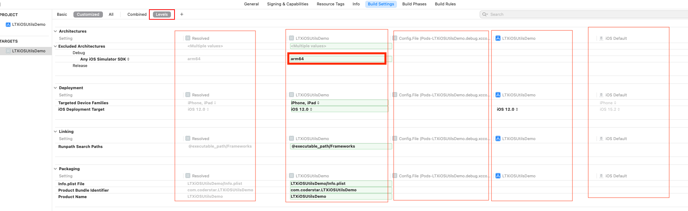

## 前言

Hi Coder，我是 CoderStar！

不知道大家会不会思考这样的问题？

- `xcodebuild`命令的几个参数怎么填，到底是填`scheme`，还是填`target`，亦或是其他的？
- `CocoaPods`是如何将库与工程组合到一起的？
- 多环境配置出包的是选择多`target`方案还是多`configuration`方案？
- ...

带着这些问题我们走进今天的文章，了解`Xcode`的各种`Concepts`。

Xcode 有比较多的概念，如下有：

* Workspace
* Project
* Target
* Scheme
* Build Setting（Xcconfig）
* Configurations
* Product

是不是有一种感觉：看着就很熟悉，但细细去解释又感觉有点吃力。接下来我们就一起来沿着我的思路回顾一下这些概念。

> 概念之间是相辅相成的，需要带着整体的思路去理解这些概念，不同章节之间记得联系起来看。

官方对这些概念的解释可以看这篇文档：[Xcode Concepts](https://developer.apple.com/library/archive/featuredarticles/XcodeConcepts/Concept-Targets.html)

## Product

`Product` 顾名思议就是 **产物**，这也是我们使用 Xcode 最终想要生成的东西，这些产物按照 `Mach-O Type` 来划分包括：

- Executable
- Dynamic Library
- Static Library
- Bundle
- ...

这个产物便是我们最终想通过`Xcode`得到的目标产物，那我们需要怎么得到这个产物呢，那就涉及到下方的概念了。

## Target

一个`Target`来描述（或者叫做生产）一个`Product`，那它是怎么描述这个产物呢？

>也可以把`Target`理解成一个最小的编译单元；

如下图所示，涉及到的东西比较多，包含签名、基本信息等等，就不一一详解了，这里主要说一下`Build Setting`以及`Build Phases`两个 Tab。

### `Build Setting`

我们对`Build Setting`应该是比较熟悉的，会经常在里面配置一些参数，其本质就是`Target`所依赖的环境参数。

这里主要说一下

Target 级 > xcconfig 文件 > Project 级 > iOS 默认配置

这个设置是一级一级的

https://xcodebuildsettings.com/

### `Build Phases`

我们可以看到该部分包含：

* `Dependenices`：设置该`Target`依赖的其他`Target`，注意这里`Target`的范围必须是同一`Project`里面的；有一些对应的使用场景：
  * 宿主程序依赖扩展程序；
  * `Pod Target`依赖三方库`Target`；
* `Compile Sources`：设置参与编译的源文件；
* `Link Binary With Libraries`：设置链接的库，这里就不受同一个`Project`的限制；
* `Copy Bundle Resources`：设置依赖的资源文件；

###

## Project

同一个 Project 的 Target 可以利用 Dependencies 建立依赖关系；  Build Setting 是在 `Project` 级别的。

### Build Configuration

属于 project 范围

## Workspace

## scheme

Xcode Scheme 定义一组操作，默认有：Build、Test、Launch、Profile、Analyze、Archive。每一种操作定义了一系列的指令，包括：target、build configuration、arguments、options 等等，这些参数、指令共同构成一个构建方案，从而用于构建一个或多个 target。

我们可以拥有任意数量的 scheme，但一次只能激活一个 scheme，对应在 Xcode 的右上角我们每次只能选中一个 scheme。

## xcconfig

https://github.com/CocoaPods/CocoaPods/issues/1736

单独定义时，并且使用 cocoapods 需要注意在自定义的文件中导入

pod install --no-integrate

曾经有一个选项 --no-integrate 可以避免将相应的 pod config 文件附加到我们现在不再存在的配置集中。
如果我们想要它，我们会在 Podfile 中添加:integrate_targets => false 作为选项。

# include "Pods/Target Support Files/XXXXXX.xcconfig"

## 多环境打包

多环境打包主要分成三种方式

- 多 target
- 多 configuration
- 多 xconfig

不管是多 target 还是多 configuration，我们都需要新建 scheme，只不过前者建立一个 scheme，然后选择一个新的 target、旧的 configuration，而后者是选择一个已有的 target，一个新的 configuration。

### 多 Target

这种方式如果项目中有扩展程序，就满足不了需求，因为 App 宿主程序与扩展程序均为一个 target。

## workspace, project, target, build configuration, scheme

想 build 出一个 product，需要知道有哪些文件需要 build，build 的时候需要哪些构建参数。

target 指定了需要哪些文件，build configuration 指定了使用哪些构建参数。所以我们 build 的时候就需要一个特定的 target 和一个特定的 build configuration，这时候 scheme 就起作用了，scheme 可以理解为工程编译运行时的配置文件, 它可以指定 build 的时候用哪个 target 和 build configuration，project 里可以有多个 target 和多个 build configuration，同时 workspace 里可以有多个 project，这些 project 的编译输出文件同在一个编译输出目录下，即整个 workspace 维度的。

所以如果需要编译不同的文件，那么需要不同的 target；如果编译的文件都相同，只是配置文件不同，如 plist、entitlements 文件等，那么只需不同的 build configuration 即可。如果既要编译不同的文件，又要不同的配置文件及编译参数，那么需要 target 和 build configuration 混合使用。所有 build 设置相关的都可以在 build configuration 中单独设置。

## 文件

### .xcodeproj

上图我们可以看到`.xcodeproj`的文件结构，
- `project.pbxproj`：想必大家都知道，我们平时在合并分支时经常会解决这个文件的冲突，也是最复杂的一个文件，里面记录代码的结构等信息。
- `project.xcworkspace`：这个位置的`.workspace`就不多介绍了，下面统一介绍。
- `xcshareddata`：主要包括 shared 出去的 scheme；
- `xcuserdata`：断点数据 (如果未打过断点，则不会有该文件，如果打过全取消了，该文件也不会被删除，只是内容发生变化)，未 shared 的 scheme。该文件夹一般是需要被 git 进行忽略的；

### .xcworkspace

- `contents.xcworkspacedata`：拥有的 project 等配置；
- `xcshareddata`：里面会包含对 IDE 的版本检查，以及 SPM 保存的数据。
- `xcuserdata`：断点数据 (如果未打过断点，则不会有该文件，如果打过全取消了，该文件也不会被删除，只是内容发生变化)，窗口设置数据；（UserInterfaceState.xcuserstate，二进制类型），该文件夹一般是需要被 git 进行忽略的；

> 看到这里想必大家就能明白为什么 Xcode 重新打开项目时，断点以及窗口还会保持原样。

## 路径

- `$(PROJECT_DIR)` 代表的是整个项目，一般是`.xcodeproj`文件所在目录
- `${SRCROOT}` 包含定义 Target 的 Project 的路径，一般情况下和`$(PROJECT_DIR)`是等价的
- `${PROJECT_FILE_PATH}`表示 project 的当前路径，相当于`$(PROJECT_DIR)/$(PROJECT_NAME).xcodeproj`，见下图：
- `${PODS_ROOT}` 代表的是 pod 目录，是 cocoapods 通过 UserDefine 自定义的

- `$(inherited)` 继承上一级（Project）或依赖项的配置。通过 CocoaPods 集成的项目，$(inherited) 将会包含 Pods_xxxx.xcconfig 中的配置

在设置路径时还有下面两个选项，表示是否递归寻找子目录

- non-recursive：非递归
- recursive：递归

### 相对路径

- @executable_path，这始终指向产品可执行二进制文件路径，AppName.app/Contents/MacOS/AppName.
- @loader_path，这取决于哪个是加载器。例如，我的 Vivi.app 加载 ViviSwiften.framework，然后由 ViviSwiften.framework 链接的 dylib 可以获得两个变量 @loader_path=/path/to/ViviSwiften.framework/Versions/A/，以及 @executable_path=/path/to/Vivi.app/Contents/MacOS/.
- @rpath，这只是一个存储一些预定义路径的路径。可以在 Xcode target > Build Setting > Runpath Search Path 它。通常包括 @executable_path/../Frameworks，@executable_path/../Frameworks and @loader_path/Frameworks，@executable_path/../Frameworks 和 @loader_path/../Frameworks 测试目标的框架。

## 最后

要更加努力呀！

Let's be CoderStar!

[Xcode Concept 学习笔记](https://sketchk.xyz/2020/05/14/Xcode-Concept/)
[理解 Xcode 中的各种概念](http://chuquan.me/2021/12/03/understand-concepts-in-xcode/#more)
[理解 Xcode 中的各种文件](http://chuquan.me/2021/12/14/understand-files-in-xcode/#more)
[Xcode 工程文件解析](https://looseyi.github.io/post/sourcecode-cocoapods/08-cocoapods-xcodeproj/)
