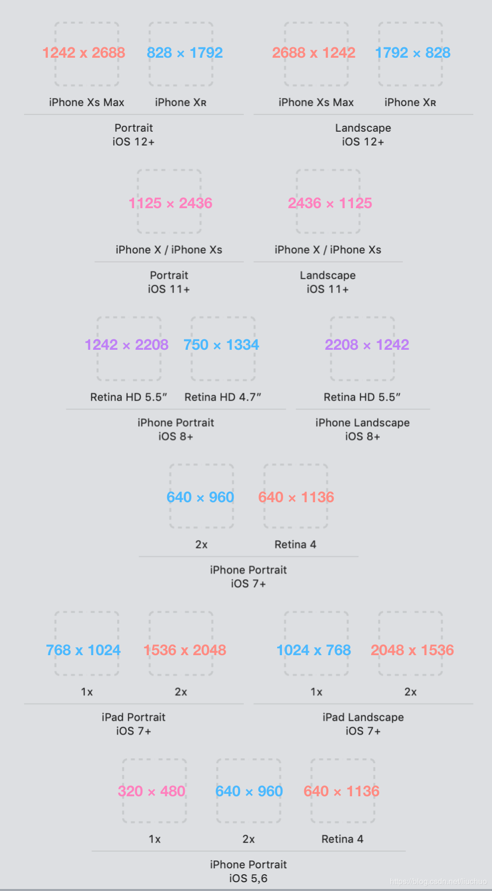

## 1、UITapGestureRecognizer 相关

- **一个手势添加到多个 view 上，只有最后一个 view 添加的有效**

> 每一个 Gesture Recognizer 关联一个 View，但是一个 View 可以关联多个 Gesture Recognizer,一个 View 可以响应多种触控操作方式。当一个触控事件发生时，Gesture Recognizer 接收一个动作消息要先于 View 本身，结果就是 Gesture Recognizer 作为 View 处理触控事件的代理。当 Gesture Recognizer 接收到指定的事件时，它就会发送一条动作消息(action message)给 ViewController 并处理。

```swift
//labelOne点击事件会失效
let singleTapGesture = UITapGestureRecognizer(target: self, action: #selector(changeAgreeState))

labelOne.addGestureRecognizer(singleTapGesture)
labelOne.isUserInteractionEnabled = true

labelTwo.addGestureRecognizer(singleTapGesture)
labelTwo.isUserInteractionEnabled = true
```

## 2、元素被导航栏遮挡

```swift
self.edgesForExtendedLayout =  UIRectEdge.init(rawValue: 0)
//设置edgesForExtendedLayout后会导致导航栏颜色变灰，需要人工改变导航栏颜色
self.navigationController?.navigationBar.backgroundColor = .white
```

## 3、页面向下偏移

当 view 的第一个页面是 scrollView 或者 tableView 时，页面会自动向下偏移 64pt，如果已经设置了 top 约束，则页面就会错位，使用下面代码使 scrollView 或者 tableView 不要自动向下偏移。

```swift
if #available(iOS 11.0, *) {
   scrollView.contentInsetAdjustmentBehavior = UIScrollView.ContentInsetAdjustmentBehavior.never
  //tableView.contentInsetAdjustmentBehavior = UIScrollView.ContentInsetAdjustmentBehavior.never
}else{
   self.automaticallyAdjustsScrollViewInsets = false
}
```

## 4、控制页面 view 在安全区域内

```swift
baseScrollView.snp.makeConstraints{(make) in
      make.left.right.equalToSuperview()
      make.width.equalTo(ConstantsHelp.SCREENWITH)
      if #available(iOS 11.0, *) {
         make.top.equalTo(view.safeAreaLayoutGuide.snp.top)
         make.bottom.equalTo(view.safeAreaLayoutGuide.snp.bottom)
      } else {
         make.top.equalTo(topLayoutGuide.snp.bottom)
         make.bottom.equalTo(bottomLayoutGuide.snp.bottom)
      }
}
```

## 5、启动图配置方法说明

[启动图配置](https://www.jianshu.com/p/05b31f29b135)

## 6、ViewController 的生命周期

```swift
initWithCoder：         通过 nib 文件初始化时触发。
awakeFromNib：          nib 文件被加载的时候，会发生一个 awakeFromNib 的消息到 nib 文件中的每个对象。
loadView：              开始加载视图控制器自带的 view。
viewDidLoad：           视图控制器的 view 被加载完成。
viewWillAppear：        视图控制器的 view 将要显示在 window 上。
updateViewConstraints： 视图控制器的 view 开始更新 AutoLayout 约束。
viewWillLayoutSubviews：视图控制器的 view 将要更新内容视图的位置。
viewDidLayoutSubviews： 视图控制器的 view 已经更新视图的位置。
viewDidAppear：         视图控制器的 view 已经展示到 window 上。
viewWillDisappear：     视图控制器的 view 将要从 window 上消失。
viewDidDisappear：      视图控制器的 view 已经从 window 上消失。
```

## 7、启动图所有尺寸




## 8、view 添加阴影

这种方式是使用离屏渲染的方式，性能会有很大的损耗

```swift
view.backgroundColor = .white //设置view背景色，如果不设置，会导致阴影显示不出来或者阴影加在子view上
view.layer.masksToBounds = false //设置子view允许超出父view
view.layer.shadowColor = UIColor.black.cgColor //设置阴影颜色
view.layer.shadowOffset = CGSize.init(width: 0, height: 1) //设置阴影偏移量
view.layer.shadowOpacity = 0.15 //设置阴影透明度
view.layer.shadowRadius = 3 //设置阴影半径
```

## 9、alpha、hidden、opaque、opacity 以及 isUserInteractionEnabled 等属性的解析

### 1、isUserInteractionEnabled

用于控制 view 及其子 view 是否可以接收响应事件；当设为 false 时，该视图对象会从响应链中被移除，响应事件会传递到 view 的父视图。

- UIImageView 的 isUserInteractionEnabled 默认为 false;

- UILabel 的 isUserInteractionEnabled 默认为 false;

- UIView 的 isUserInteractionEnabled 默认为 true;

### 2、hidden

控制 view 是否隐藏，当设置为 true 时，自身以及子 view 均会被隐藏，不管 subView 的 hideen 是否为 true，并且当前 view 以及子 view 会从响应链中移除；

### 3、alpha

控制 view 的透明度，是一个浮点值，取值范围 0~1.0,表示从完全透明到完全不透明；会影响自己的透明度，也会影响 subView 的透明度，当 alpha 为 0，当前 view 以及子 view 会从响应链中移除；更改 alpha 默认是有动画效果的。当使用 alpha 属性来隐藏 view，使用 hidden 比使用 alpha 性能好。

### 4、opacity

opacity 是 CALayer 的属性，对应的是 UIView 的 alpha。

### 5、opaque

表示 view 的不透明度，设为 true 表示不透明。但是它决定不了当前 view 是否不透明，只是为绘图系统提供一个性能优化开关（GPU 就不会再利用图层颜色合成真正的色值），当设为 true 时，绘图系统在绘制该视图时会将整个视图当做不透明来对待。能将 opaque 设为 true 的尽量将 opaque 设为 true。UIView 的默认值是 true，但 UIButton 等子类的默认值都是 false。  
如果你加载一个没有 alpha 通道（图片的属性）的图片，并且将它显示在 UIImageView 上，会自动设置 opaque 为 YES。  
如果 opaque 被设置成 YES，而对应 UIView 的 alpha 属性不为 1.0 的时候，就会有不可预料的情况发生。所以当 UIView 具有透明度的时候，应该将 opaque 设置为 fasle。

### 6、其他补充

#### 1、实现 view 透明度，并不影响 subView 的方法

```swift
// 第一种
view.backgroundColor = UIColor(white: 1, alpha: 0.5) //只可以在黑白之间调节
view.backgroundColor = UIColor(red: 10, green: 10, blue: 10, alpha: 0.5) // 可以在各种颜色之间进行调节

// 第二种
 view.backgroundColor = UIColor.black.withAlphaComponent(0.5) // 某一个颜色进行透明度设置

```

## 10、Swift 项目导入三方库的方法

### 1、直接在文件头部使用 import 导入，这种适合不常用的三方库

```swift
import Foundation
```

### 2、在导入的库上面再封装一层，这样可以启动库隔离的作用，后续可以很容易切换底层库

```swift
import Foundation
import MBProgressHUD

///弹窗加载提示
class func show() {
   MBProgressHUD.showAdded(to: viewToShow(), animated: true)
}

///隐藏所有弹窗
class func hide() {
   MBProgressHUD.hide(for: viewToShow(), animated: true)
}
```

### 3、`@_exported import`关键字导入，在某个文件以内引入该文件，可以在全局进行使用

```swift
@_exported import Alamofire
```

## 11、关于时间 Date 相关概念的理解

### 1、calendar

消除日历差异，iphone 里面自带公历、日本日历以及佛历等日历，以及时制（24 小时还是 12 小时）

### 2、timeZone

消除时区差异，使用不同时区，获得的时间也不同

### 3、locale

消除地区差异，会影响时间选择时显示的语言

## 12、layoutSubviews、setNeedsLayout、setNeedsDisplay、layoutIfNeeded 等相关

### 1、layoutSubviews

不要直接调用该方法，而是重写该方法等待触发时机自动被调用，并且这个方法的触发时机比较多，调用比较频繁，所以没有特殊需求或者必要性，不需重写该方法。一般重写该方法对子 View 的 frame 进行修改。

**触发时机**

- init()不会触发，init(frame: CGRect)，当 frame 不为 0 时会触发
- addSubview 会触发
- 设置 view 的 frame 时，当 frame 设置前后发生了变化会触发，不变化不触发
- 滚动 UIScrollView 会多次触发
- 旋转 Screen 会触发父 UIView 上的 layoutSubviews 事件
- 改变一个 UIView 大小时会触发父 View 上的 layoutSubviews

### 2、setNeedsLayout

该方法异步执行；该方法是将指定 view 打上一个需要更新的标记，等待下一个 view 绘制周期的时候会更新该 view。默认会调用 layoutSubviews 方法。这种方法会将所有布局更新合并到一个更新周期，这通常对性能更好。  
当我们修改视图的约束时，实际上会自动执行相当于 setNeedsLayout 的操作；  
Tips：下一次更新周期就是 runloop 的循环周期。

### 3、setNeedsDisplay、setNeedsDisplayInRect

该方法异步执行；该方法默认会自动调用 drawRect 方法，这样可以拿到 UIGraphicsGetCurrentContext，进行绘图。

### 4、layoutIfNeeded

该方法会在当前 runloop 周期（刷新频率 60HZ）内立即更新带有需要刷新标记的视图，所以我们如果想要当前 runloop 理解刷新视图，调用顺序应该是

```
self.view.setNeedsLayout()
self.view.layoutIfNeeded()
```

如果有需要刷新的标记，就会立即调用 layoutSubviews，如果没有，则不调用。
Tips：在视图第一次显示之前，相关 view 肯定带有刷新标记的，所有直接调用 layoutIfNeeded 就会立即进行更新。

### 5、drawRect

调用时机

- drawRect 是在 Controller->loadView, Controller->viewDidLoad 之后会自动调用
- setNeedsDisplay、setNeedsDisplayInRect 调用时
- sizeToFit 调用时
- 当 contentMode 为 redraw 时，当 frame 发生变化时将自动调用

以上时机均要求 view 的 frame 不为空

不要手动调用，通过调用 setNeedsDisplay、setNeedsDisplayInRect 等方式给 view 打上标记，然后系统自动调用 drawRect 方法；

### 6、sizeThatFits、sizeToFit

一般在使用 UILabel 的时候会用到，使用这两个方法之前，必须要给 label 赋值，否则不会显示内容的。

- sizeToFit 会自动调用 sizeThatFits 方法；
- sizeToFit 不应该在子类中被重写，应该重写 sizeThatFits；
- sizeThatFits 传入的参数是 receiver 当前的 size，返回一个适合的 size；
- sizeToFit 可以被手动直接调用；
- sizeToFit 和 sizeThatFits 方法都没有递归，对 subviews 也不负责，只负责自己；

## 13、自定义 View 的注意事项

注:**createUI 为设置 view 私有方法**

### 1、创建时机

自定义 view 继承自 UIView 时，一般都会重写 UIView 的 initWithFrame，如果调用者在使用时，没有调用你写的 initWithFrame，而是直接 init，系统也会在 super init(即 UIView init)之后，调用 UIView 的 initWithFrame，然后因为你重写了，所以会调用你写的。
顺序就是
`customView init -> UiView init -> UIView initWithFrame -> CustomView initWithFrame`。

所以 createUI 方法最好在 initWithFrame 中调用。不要在自定义 View 中同时重写 init 与 initWithFrame 并执行相同视图布局代码。会导致布局代码(createUI)执行多次；

### 2、view 重复创建

如果 view 重复添加同一个 view 并不会出现多层级的问题。苹果自身会判断 view 新旧父视图是否一致，若一致，不做任何操作(可通过调试 layoutSubviews 的被调用次数进行验证)。注意，这时候的同一个 view 是指指向同一个引用，如果自定义 view 的子视图最好以懒加载的形式加载，可避免因某种书写不当导致的异常，如果在 createUI 方法直接使用 `let view = UIView()`的形式创建，就会出现多层级的问题；

## 15、扩展程序与主程序之间的通信方式

扩展程序一般是指 APP Extension，扩展程序一般都不是脱离宿主程序单独运行的，难免需要和宿主程序进行数据交互。  
由于拓展与宿主应用是两个完全独立的 App，并且 iOS 应用基于沙盒的形式限制，所以一般的共享数据方法都是实现不了数据共享，这里就需要使用 App Groups（App Groups 这是 iOS8 新开放的功能，在 OS X 上早就可用了。它主要用于同一 Group 下的 App 共享同一份读写空间，以实现数据共享）。  
通过 App Groups 提供的同一 group 内 app 共同读写区域，可以用 UserDefaults 和 FileManager 两种方式实现 extension 和 主 app 之间的数据共享。

```Swift
/// UserDefaults
/// suitename传入group id
@available(iOS 7.0, *)
public init?(suiteName suitename: String?)

/// FileManager
let groupURL = FileManager.default.containerURL(forSecurityApplicationGroupIdentifier: "groupID")
let fileURL = groupURL.appendingPathComponent("fileName")

// 这样就可以利用NSArray等这种数据结构读写文件了


```
