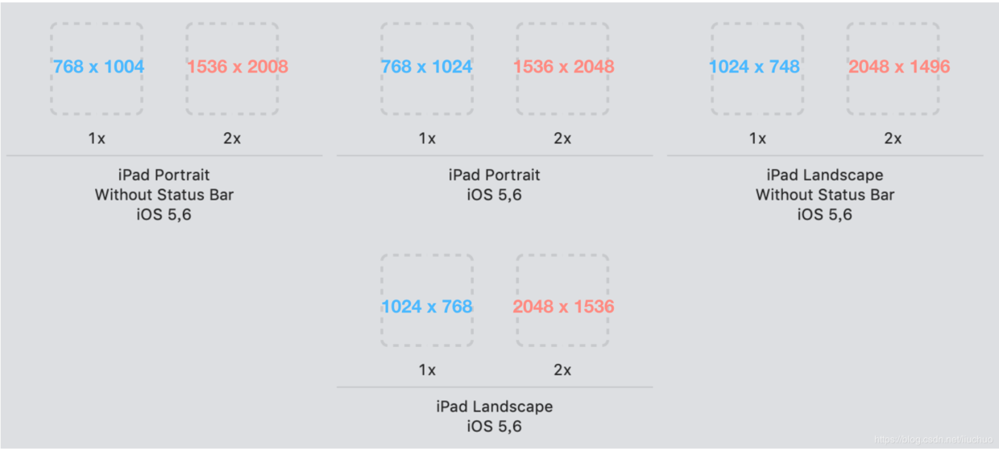

## 1、UITapGestureRecognizer相关

* **一个手势添加到多个view上，只有最后一个view添加的有效**

>每一个Gesture Recognizer关联一个View，但是一个View可以关联多个Gesture Recognizer,一个View可以响应多种触控操作方式。当一个触控事件发生时，Gesture Recognizer接收一个动作消息要先于View本身，结果就是Gesture Recognizer作为View处理触控事件的代理。当Gesture Recognizer接收到指定的事件时，它就会发送一条动作消息(action message)给ViewController并处理。

```swift
//labelOne点击事件会失效
let singleTapGesture = UITapGestureRecognizer(target: self, action: #selector(changeAgreeState))

labelOne.addGestureRecognizer(singleTapGesture)
labelOne.isUserInteractionEnabled = true

labelTwo.addGestureRecognizer(singleTapGesture)
labelTwo.isUserInteractionEnabled = true
```

## 2、元素被导航栏遮挡

```swift
self.edgesForExtendedLayout =  UIRectEdge.init(rawValue: 0)
//设置edgesForExtendedLayout后会导致导航栏颜色变灰，需要人工改变导航栏颜色
self.navigationController?.navigationBar.backgroundColor = .white
```

## 3、页面向下偏移

当view的第一个页面是scrollView或者tableView时，页面会自动向下偏移64pt，如果已经设置了top约束，则页面就会错位，使用下面代码使scrollView或者tableView不要自动向下偏移。

```swift
if #available(iOS 11.0, *) {
   scrollView.contentInsetAdjustmentBehavior = UIScrollView.ContentInsetAdjustmentBehavior.never
  //tableView.contentInsetAdjustmentBehavior = UIScrollView.ContentInsetAdjustmentBehavior.never
}else{
   self.automaticallyAdjustsScrollViewInsets = false
}
```

## 4、控制页面view在安全区域内

```swift
baseScrollView.snp.makeConstraints{(make) in
      make.left.right.equalToSuperview()
      make.width.equalTo(ConstantsHelp.SCREENWITH)
      if #available(iOS 11.0, *) {
         make.top.equalTo(view.safeAreaLayoutGuide.snp.top)
         make.bottom.equalTo(view.safeAreaLayoutGuide.snp.bottom)
      } else {
         make.top.equalTo(topLayoutGuide.snp.bottom)
         make.bottom.equalTo(bottomLayoutGuide.snp.bottom)
      }
}
```

## 5、启动图配置方法说明

[启动图配置](https://www.jianshu.com/p/05b31f29b135)

## 6、ViewController的生命周期

```swift
initWithCoder：         通过 nib 文件初始化时触发。
awakeFromNib：          nib 文件被加载的时候，会发生一个 awakeFromNib 的消息到 nib 文件中的每个对象。
loadView：              开始加载视图控制器自带的 view。
viewDidLoad：           视图控制器的 view 被加载完成。  
viewWillAppear：        视图控制器的 view 将要显示在 window 上。
updateViewConstraints： 视图控制器的 view 开始更新 AutoLayout 约束。
viewWillLayoutSubviews：视图控制器的 view 将要更新内容视图的位置。
viewDidLayoutSubviews： 视图控制器的 view 已经更新视图的位置。
viewDidAppear：         视图控制器的 view 已经展示到 window 上。 
viewWillDisappear：     视图控制器的 view 将要从 window 上消失。
viewDidDisappear：      视图控制器的 view 已经从 window 上消失。
```

## 7、启动图所有尺寸




## 8、view添加阴影

这种方式是使用离屏渲染的方式，性能会有很大的损耗

```swift
view.backgroundColor = .white //设置view背景色，如果不设置，会导致阴影显示不出来或者阴影加在子view上
view.layer.masksToBounds = false //设置子view允许超出父view
view.layer.shadowColor = UIColor.black.cgColor //设置阴影颜色
view.layer.shadowOffset = CGSize.init(width: 0, height: 1) //设置阴影偏移量
view.layer.shadowOpacity = 0.15 //设置阴影透明度
view.layer.shadowRadius = 3 //设置阴影半径
```
  
## 9、alpha、hidden、opaque、opacity以及isUserInteractionEnabled等属性的解析

### 1、isUserInteractionEnabled

用于控制view及其子view是否可以接收响应事件；当设为false时，该视图对象会从响应链中被移除，响应事件会传递到view的父视图。  

* UIImageView的isUserInteractionEnabled默认为false;

* UILabel的isUserInteractionEnabled默认为false;

* UIView的isUserInteractionEnabled默认为true;

### 2、hidden

控制view是否隐藏，当设置为true时，自身以及子view均会被隐藏，不管subView的hideen是否为true，并且当前view以及子view会从响应链中移除；

### 3、alpha

控制view的透明度，是一个浮点值，取值范围0~1.0,表示从完全透明到完全不透明；会影响自己的透明度，也会影响subView的透明度，当alpha为0，当前view以及子view会从响应链中移除；更改alpha默认是有动画效果的。当使用alpha属性来隐藏view，使用hidden比使用alpha性能好。

### 4、opacity

opacity是CALayer的属性，对应的是UIView的alpha。

### 5、opaque

表示view的不透明度，设为true表示不透明。但是它决定不了当前view是否不透明，只是为绘图系统提供一个性能优化开关（GPU就不会再利用图层颜色合成真正的色值），当设为true时，绘图系统在绘制该视图时会将整个视图当做不透明来对待。能将opaque设为true的尽量将opaque设为true。UIView的默认值是true，但UIButton等子类的默认值都是false。  
如果你加载一个没有alpha通道（图片的属性）的图片，并且将它显示在 UIImageView 上，会自动设置opaque 为 YES。  
如果opaque被设置成YES，而对应UIView的alpha属性不为1.0的时候，就会有不可预料的情况发生。所以当UIView具有透明度的时候，应该将opaque设置为fasle。

### 6、其他补充

#### 1、实现view透明度，并不影响subView的方法

```swift
// 第一种
view.backgroundColor = UIColor(white: 1, alpha: 0.5) //只可以在黑白之间调节
view.backgroundColor = UIColor(red: 10, green: 10, blue: 10, alpha: 0.5) // 可以在各种颜色之间进行调节

// 第二种
 view.backgroundColor = UIColor.black.withAlphaComponent(0.5) // 某一个颜色进行透明度设置

```

## 10、Swift项目导入三方库的方法

### 1、直接在文件头部使用import导入，这种适合不常用的三方库

```swift
import Foundation
```

### 2、在导入的库上面再封装一层，这样可以启动库隔离的作用，后续可以很容易切换底层库

```swift
import Foundation
import MBProgressHUD

///弹窗加载提示
class func show() {
   MBProgressHUD.showAdded(to: viewToShow(), animated: true)
}

///隐藏所有弹窗
class func hide() {
   MBProgressHUD.hide(for: viewToShow(), animated: true)
}
```

### 3、`@_exported import`关键字导入，在某个文件以内引入该文件，可以在全局进行使用

```swift
@_exported import Alamofire
```

## 11、关于时间Date相关概念的理解

### 1、calendar

消除日历差异，iphone里面自带公历、日本日历以及佛历等日历，以及时制（24小时还是12小时）

### 2、timeZone

消除时区差异，使用不同时区，获得的时间也不同

### 3、locale

消除地区差异，会影响时间选择时显示的语言

## 12、layoutSubviews、setNeedsLayout、setNeedsDisplay、layoutIfNeeded等相关

### 1、layoutSubviews

不要直接调用该方法，而是重写该方法等待触发时机自动被调用，并且这个方法的触发时机比较多，调用比较频繁，所以没有特殊需求或者必要性，不需重写该方法。一般重写该方法对子View的frame进行修改。

**触发时机**
* init()不会触发，init(frame: CGRect)，当frame不为0时会触发
* addSubview会触发
* 设置view的frame时，当frame设置前后发生了变化会触发，不变化不触发
* 滚动UIScrollView会多次触发
* 旋转Screen会触发父UIView上的layoutSubviews事件
* 改变一个UIView大小时会触发父View上的layoutSubviews

### 2、setNeedsLayout

该方法异步执行；该方法是将指定view打上一个需要更新的标记，等待下一个view绘制周期的时候会更新该view。默认会调用layoutSubviews方法。这种方法会将所有布局更新合并到一个更新周期，这通常对性能更好。  
当我们修改视图的约束时，实际上会自动执行相当于setNeedsLayout的操作；  
Tips：下一次更新周期就是runloop的循环周期。

### 3、setNeedsDisplay

该方法异步执行；该方法默认会自动调用drawRect方法，这样可以拿到UIGraphicsGetCurrentContext，进行绘图。

### 4、layoutIfNeeded

该方法会在当前runloop周期（刷新频率60HZ）内立即更新带有需要刷新标记的视图，所以我们如果想要当前runloop理解刷新视图，调用顺序应该是
```
self.view.setNeedsLayout()
self.view.layoutIfNeeded()
```
如果有需要刷新的标记，就会立即调用layoutSubviews，如果没有，则不调用。
Tips：在视图第一次显示之前，相关view肯定带有刷新标记的，所有直接调用layoutIfNeeded就会立即进行更新。

### 5、drawRect


### 6、sizeThatFits、sizeToFit

一般在使用UILabel的时候会用到，使用这两个方法之前，必须要给label赋值，否则不会显示内容的。
* sizeToFit会自动调用sizeThatFits方法；
* sizeToFit不应该在子类中被重写，应该重写sizeThatFits；
* sizeThatFits传入的参数是receiver当前的size，返回一个适合的size；
* sizeToFit可以被手动直接调用；
* sizeToFit和sizeThatFits方法都没有递归，对subviews也不负责，只负责自己；

## 13、自定义View的注意事项

注:**createUI为设置view私有方法**

### 1、创建时机
自定义view继承自UIView时，一般都会重写UIView的initWithFrame，如果调用者在使用时，没有调用你写的initWithFrame，而是直接init，系统也会在super init(即UIView init)之后，调用UIView的initWithFrame，然后因为你重写了，所以会调用你写的。
顺序就是
`customView init -> UiView init -> UIView initWithFrame -> CustomView initWithFrame`。

所以createUI方法最好在initWithFrame中调用。不要在自定义View中同时重写init与initWithFrame并执行相同视图布局代码。会导致布局代码(createUI)执行多次；

### 2、view重复创建

如果view重复添加同一个view并不会出现多层级的问题。苹果自身会判断view新旧父视图是否一致，若一致，不做任何操作(可通过调试layoutSubviews的被调用次数进行验证)。注意，这时候的同一个view是指指向同一个引用，如果自定义view的子视图最好以懒加载的形式加载，可避免因某种书写不当导致的异常，如果在createUI方法直接使用 `let view = UIView()`的形式创建，就会出现多层级的问题；