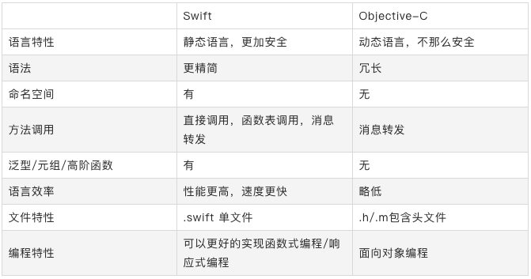

## Swif与OC对比




## UIImageView 加载图片相关

**过程**

- 从磁盘拷贝数据到内核缓冲区域；
- 从内核缓存区域复制数据到用户内存；
- UIImage 赋值给 UIImageView 的 image 时，图像数据会被解码，变成位图数，内存大小为 width height 4bytes （4bytes:每个像素点的大小)；
- CTTransaction 捕捉到 UIImageView layer 树的变化；
- 主线程 runloop 提交 CTTransaction，开始图像渲染。（如果数据没有字节对齐，Core Animation 会再拷贝一份数据，进行字节对齐，GPU 处理位图数据，进行渲染）；

**加载方式**

- imageNamed：在图片第一次渲染到屏幕的时候触发解码，缓存解码之后的数据，缓存在全局内存中，不会随着 UIImage 的释放而释放。适合加载一些经常显示、比较小的图片，如 QQ 列表缩略图等；
- imageWithContentsOfFile: 或 imageWithData: 与 imageNamed 不同的是会随着 UIImage 的释放而释放。适合加载不常显示而且比较大的图片。

**优化**

- 减少加载 UIImage 内存的大小,根据 imageview 实际 size 来加载，可以减少内存占用。解码后生成 CGImage 缩略图，再转化为 UIImage,然后传给 UIImgaeView 渲染展示。
- 解码的操作在主线程，比较耗费 CPU 的资源。可以把耗时的解码操作放入子线程，解码完成之后再回调到主线程刷新，例如 SDWebImage。还有更加极限的优化是在子线程解码之后，将解码之后的图片存在磁盘之中，例如 FastImageCache。

## UIView 与 CALayer

CALayer 主要负责显示内容，继承自 NSObject，基于 QuartzCore 框架。
UIView 主要对 CALayer 做了简单的封装（UIView 类中有个成员变量 layer 就是 CALayer 类型）。另外，UIView 继承自 UIResponder 类，负责处理触摸事件的响应，基于 UIKit 框架。

其中 QuartzCore 框架是可以跨平台使用的，在 iOS 以及 MAC OS X 中都可以使用，但是 UIKit 只在 iOS 中存在，其中这部分我们可以体现出设计的重要性，因为在 mac 和 iphone 上绘图部分可以共用，但是交互方式上有区别，所以才会 UIView 和 CALayer 的拆分；

当对一个视图进行绘制的时候，绘图单元会向 CALayer 索取要显示元素的相关数据，此时，CALayer 会通过 delegate 通知到 UIView，其中通过 UIView 创建的 layer，layer 会自动将 UIView 设置为 layer 的 delegate，看看 UIView 是否有提供需要绘制的元素。如果 UIView 什么都不需要提供的话，就当作无视。

UIView 会有一个主 layer，主 layer 可以在其上面添加子 Layer。

在 iOS 中也有一些单独的 layer，比如 AVCaptureVideoPreviewLayer 和 CAShapeLayer，它们不需要附加到 view 上就可以在屏幕上显示内容。

基本上你改变一个单独的 layer 的任何属性的时候，都会触发一个从旧的值过渡到新值的简单动画（这就是所谓的可动画 animatable）。但是当 layer 附加在 view 上时，它的默认的隐式动画的 layer 行为就被禁止了，但是会在 animation block 中重新启用了它们。

## 循环引用

循环引用就是两个及以上的对象出现了引用环，导致对象都无法得到释放，典型场景一般包括 timer，block 以及 delegate；

**block、delegate**

一般使用 Weak、unowned 修饰可以解决问题，unowned 要比 weak 少一些性能消耗。
block 产生循环引用的原因是闭包表达式对用到的外层对象产生额外的强引用。

```
[weak self]  =>   __weak typeof(self) weakSelf;
[unowned self] =>  __unsafe_unretained typeof(self) weakSelf;
```

## iOS 自身的设计模式

- 代理模式：tableview 的 delegate、datasource
- 观察者模式：KVO，Notification
- 单例模式：UserDefault，UIApplication，FileManager，NotificationCenter，URLCache，HTTPCookieStorage
- 装饰模式：OC的category
