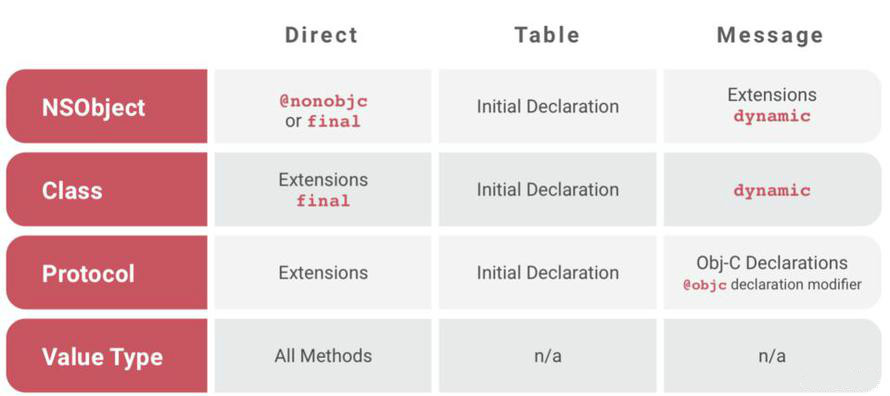

## Class 与 Struct 之间的区别

- **Class 是引用类型，Struct 是值类型;**

这里引申一下，引用类型与值类型区别其实可以与深拷贝与浅拷贝\*\*\*\*对应起来，值类型在赋给另一个变量时会对值进行一次拷贝，而引用类型赋给另一个变量是将引用地址赋给它。值类型如果每次赋值时候都进行拷贝的话会增大内存开销，实际上只有值类型发生改变的时候才会进行真正的拷贝--“写时复制（Copy-On-Write）”的特性，当没有改变时，两者共享同一个内存地址。

- **Struct 不能继承，Class 可以继承**
- **Class 需要自己定义构造器，而 Struct 不需要；**(Struct 默认生成的构造器必须包括所有成员参数，只有当所有参数都为可选型时，可直接不用传入参数直接简单构造) 举一反三：Class 中的属性必须都有默认值，否则编译错误,可以通过声明时赋值或者构造器赋值两种方式给属性设置默认值
- **Struct 改变其属性受修饰符 let 影响，不可改变，Class 不受影响；**
- **struct 方法中需要修改自身 property 时(非 init 方法)，方法需要前缀修饰符 mutating**

## iOS 中数据持久化相关


- UserDefaults  
  这种方式本质上还是 plist 文件存储，只不过对操作数据进行了封装，使用上更加方便，其生成的 plist 文件放置在 Library/Preference，生成的 plist 文件为 包名.plist。存储的类型是有限制的，如果想存储自定义类型，如果转换成可存储的类型，可以被获取到，不安全，写入时最好进行加密；
- plist 文件  
  plist 文件是将某些特定的类，通过 XML 文件的方式保存在目录中，其中还包括 NSArray、NSMutableArray、NSDictionary、NSMutableDictionary、NSData、NSMutableData、NSString、NSMutableString; 可以利用其读写文件方法。(writeToFile 、 WithContentsOfFile)
- keychain 钥匙串
  此种方式存储的信息不会随着 APP 的卸载还删除。很安全。
- 归档
  数据对象需要遵守 NSCoding 协议。缺点：只能一次性归档保存或者一次性解压。所以只能针对小量数据，对数据操作比较笨拙，如果想改动数据的某一个小部分，需要解压或者归档整个数据；（NSKeyedArchiver、NSKeyedUnarchiver）
- 沙盒文件（Sandbox）
  应用沙盒机制：每个 iOS 应用都有自己的应用沙盒（文件系统目录），与其他文件系统隔离。每个应用必须在自己的沙盒里运行，其他应用不能访问该沙盒。

  Sandbox 分成三部分

  - Bundle Container
    - MyApp.app
  - Data Container
    - Documents
    - Library
      - Application Support
      - Caches
      - Preference
    - SystemData
    - tmp
  - iCloud Container

  ```
  Application: 包含了所有的资源文件和和可执行文件，上架前经过数字签名，上架后不可修改。

  Documents: 保存应运行时生成的需要持久化的、重要的数据（比如用户下载的歌曲）。iTunes、iCloud会备份该目录。在此目录下不要保存从网络上下载的文件，否则app无法上架。用户可以通过文件分享分享该目录下的文件,建议保存你希望用户看得见的文件。
  Tip: 在iOS11 以后新增了一个“文件”APP，集中管理iOS上应用内创建的文件，以及各个云盘服务中保存的文件。在iOS工程info.plist中设置Application supports iTunes file sharing 和 Supports opening documents in place这两个选项为YES（默认为NO），就可以将该应用的沙盒路径Documents文件暴露在“文件”APP中。


  Library/Application Support: 建议用来存储除用户数据相关以外的所有文件，如游戏的新关卡。在iTunes和iCloud备份时会备份该目录。

  Library/Caches: 保存应用运行时生成的需要持久化的数据，一般存储体积大、不需要备份的非重要数据（例如，网络请求的音视频与图片等的缓存）。需要程序员手动清除。iTunes、iCloud不会备份该目录；

  Library/Preference: 保存应用的所有偏好设置，iOS的Settings(设置)应用会在该目录中查找应用的设置信息。iTunes、iCloud会备份该目录。通过UserDefaults生成的plist文件也会存储在该目录下，我们不应该直接在这里创建文件，而是只通过UserDefaults。

  tmp: 保存应用运行时产生的一些临时数据；应用程序退出、系统空间不够、手机重启等情况下都会自动清除该目录的数据。无需程序员手动清除。iTunes不会备份该目录。比如相机拍摄完成时的照片视频都会被暂时保存到这个路径。
  ```

- 数据库
  - SQLite
  - CoreData
  - Realm


## UIImageView 加载图片相关

**过程**

- 从磁盘拷贝数据到内核缓冲区域；
- 从内核缓存区域复制数据到用户内存；
- UIImage 赋值给 UIImageView 的 image 时，图像数据会被解码，变成位图数，内存大小为 width height 4bytes （4bytes:每个像素点的大小)；
- CTTransaction 捕捉到 UIImageView layer 树的变化；
- 主线程 runloop 提交 CTTransaction，开始图像渲染。（如果数据没有字节对齐，Core Animation 会再拷贝一份数据，进行字节对齐，GPU 处理位图数据，进行渲染）；

**加载方式**

- imageNamed：在图片第一次渲染到屏幕的时候触发解码，缓存解码之后的数据，缓存在全局内存中，不会随着 UIImage 的释放而释放。适合加载一些经常显示、比较小的图片，如 QQ 列表缩略图等；
- imageWithContentsOfFile: 或 imageWithData: 与 imageNamed 不同的是会随着 UIImage 的释放而释放。适合加载不常显示而且比较大的图片。

**优化**

- 减少加载 UIImage 内存的大小,根据 imageview 实际 size 来加载，可以减少内存占用。解码后生成 CGImage 缩略图，再转化为 UIImage,然后传给 UIImgaeView 渲染展示。
- 解码的操作在主线程，比较耗费 CPU 的资源。可以把耗时的解码操作放入子线程，解码完成之后再回调到主线程刷新，例如 SDWebImage。还有更加极限的优化是在子线程解码之后，将解码之后的图片存在磁盘之中，例如 FastImageCache。

## UIView 与 CALayer

CALayer 主要负责显示内容，继承自 NSObject，基于 QuartzCore 框架。
UIView 主要对 CALayer 做了简单的封装（UIView 类中有个成员变量 layer 就是 CALayer 类型）。另外，UIView 继承自 UIResponder 类，负责处理触摸事件的响应，基于 UIKit 框架。

其中 QuartzCore 框架是可以跨平台使用的，在 iOS 以及 MAC OS X 中都可以使用，但是 UIKit 只在 iOS 中存在，其中这部分我们可以体现出设计的重要性，因为在 mac 和 iphone 上绘图部分可以共用，但是交互方式上有区别，所以才会 UIView 和 CALayer 的拆分；

当对一个视图进行绘制的时候，绘图单元会向 CALayer 索取要显示元素的相关数据，此时，CALayer 会通过 delegate 通知到 UIView，其中通过 UIView 创建的 layer，layer 会自动将自己设置为 layer 的 delegate，看看 UIView 是否有提供需要绘制的元素。如果 UIView 什么都不需要提供的话，就当作无视。

在 iOS 中也有一些单独的 layer，比如 AVCaptureVideoPreviewLayer 和 CAShapeLayer，它们不需要附加到 view 上就可以在屏幕上显示内容。

基本上你改变一个单独的 layer 的任何属性的时候，都会触发一个从旧的值过渡到新值的简单动画（这就是所谓的可动画 animatable）。但是当 layer 附加在 view 上时，它的默认的隐式动画的 layer 行为就被禁止了，但是会在 animation block 中重新启用了它们。

## RunLoop

- RunLoop 本质上是一个对象,这个对象可以保持程序的持续运行并且处理程序中的各种事件(如触摸事件,定时器时间,selector 事件).
- RunLoop 没有事情处理时就会使线程进入睡眠状态.这样可以节省 CPU 资源,提高程序性能.

**模式**

1. kCFRunLoopDefaultMode：App 的默认 Mode，通常主线程是在这个 Mode 下运行
2. UITrackingRunLoopMode：界面跟踪 Mode，用于 ScrollView 追踪触摸滑动，保证界面滑动时不受其他 Mode 影响
3. UIInitializationRunLoopMode: 在刚启动 App 时第进入的第一个 Mode，启动完成后就不再使用，会切换到 kCFRunLoopDefaultMode
4. GSEventReceiveRunLoopMode: 接受系统事件的内部 Mode，通常用不到
5. kCFRunLoopCommonModes: 这是一个占位用的 Mode，作为标记 kCFRunLoopDefaultMode 和 UITrackingRunLoopMode 用，并不是一种真正的 Mode

RunLoop 只会运行在一个模式下，要切换模式，就要暂停当前模式，重新启动一个运行模式

**作用**

- 保持程序持续运行
- 处理 App 中各类事件
- 节省 CPU 资源，提高程序性能

**实际应用**

- 控制线程生命周期（线程保活、线程永驻）
- TableView 延迟加载图片  
  把 setImage 放到 NSDefaultRunLoopMode 去做，也就是在滑动的时候并不会去调用赋值图片的方法，而是会等到滑动完毕切换到 NSDefaultRunLoopMode 下面才会调用 `imageView.perform(#selector(setImage), with: nil, afterDelay: 0, inModes: [.default])`
- 解决 NSTimer 在滑动时停止工作的问题  
  将 Timer 添加到 CommonMode 里面即可，`RunLoop.current.add(timer, forMode: .common)`
- 监测 RunLoop 的状态监测应用卡顿  
  根据 //TODO

* 每一条线程都有一个 Runloop 对应；
* 主线程的 Runloop 的对象系统已经自动帮我们创建好了,并且只有主线程结束时即程序结束时才会销毁；
* 子线程的 Runloop 对象需要我们主动创建并维护,子线程的 Runloop 对象在第一次获取时就会创建,销毁则是在子线程结束时. 并且创建出来的 runLoop 对象默认是不开启的,必须手动开启 RunLoop；
* Runloop 并不保证线程安全,我们只能在当前线程内部操作当前线程的 Runloop 对象,而不能在当前线程中去操作其他线程的 RunLoop 对象；

```swift
//获取当前线程的RunLoop对象,在子线程中调用时如果是第一次获取内部会帮我们创建RunLoop对象
let runloop = RunLoop.current
// 运行runloop
runloop.run()
```

配合 CADisplayLink 监听 FPS，基本原理就是统计每一秒中 CADisplayLink 执行的次数就 OK 啦

```
let displayLink = CADisplayLink(target: self, selector: #selector(displayLinkAction(displayLink:)))
displayLink.add(to: .current, forMode: .common)
```

## 线程安全

```
// 使用信号量
let lock = DispatchSemaphore(value: 1)
//
func operation() {
  lock.wait()
  // 方法体
  lock.signal()
}
```

## 循环引用

循环引用就是两个及以上的对象出现了引用环，导致对象都无法得到释放，典型场景一般包括 timer，block 以及 delegate；

**block、delegate**

一般使用 Weak 修饰可以解决问题

**timer**

```

```

timer 循环引用出现的原因很多人会说是 timer 所在的类与类之间存在循环引用，但是如果将 timer 不设置为类的一个属性，而是在一个方法里面定义，这样类便不会持有 timer，但是你你发现 timer 和类还是不能被释放，其实主要原因是 timer 在创建时需要加入到 Runloop 中，Runloop 不退出一直持有 timer，timer 又以 target 的形式强引用类，则导致都不销毁的问题。

解决方法：

- 使用 iOS 10 以上的 API，使用 Block 的形式创建定时器，使 timer 不再强引用所在类；

```
_ = Timer.scheduledTimer(withTimeInterval: 1, repeats: true) { [weak self] _ in
    self?.fireTimer()
}
```

- 使用中间类来解决类与 timer 之间的强应用，timer 强引用中间类，中间类弱引用 timer 所在类，可以使用 NSProxy；
- 如果类是 ViewController，可以在页面出现时启动定时器，消失时关闭定时器，前提是你的需求可以允许这么做；

## Swift 派发

swift 会使用三种派发方式，一般编译型语言也会有这几种基础性的派发方式。

- 直接派发
- 函数表派发
- 消息派发

在不同的情况下会使用不同的派发方式



## iOS 自身的设计模式

- 代理模式：tableview 的 delegate、datasource
- 观察者模式：KVO，Notification
- 单例模式：UserDefault，UIApplication，FileManager，NotificationCenter，URLCache，HTTPCookieStorage
-
