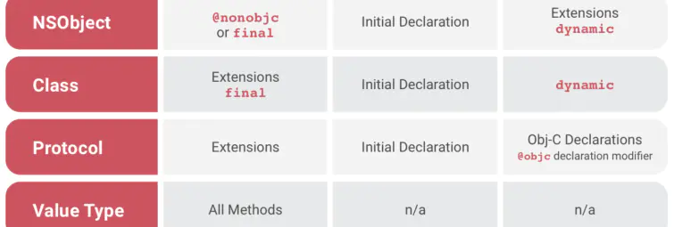

## 1、Class与Struct之间的区别

* **Class是引用类型，Struct是值类型;**

这里引申一下，引用类型与值类型区别其实可以与深拷贝与浅拷贝****对应起来，值类型在赋给另一个变量时会对值进行一次拷贝，而引用类型赋给另一个变量是将引用地址赋给它。值类型如果每次赋值时候都进行拷贝的话会增大内存开销，实际上只有值类型发生改变的时候才会进行真正的拷贝--“写时复制（Copy-On-Write）”的特性，当没有改变时，两者共享同一个内存地址。

* **Struct不能继承，Class可以继承**
* **Class需要自己定义构造器，而Struct不需要；**(Struct默认生成的构造器必须包括所有成员参数，只有当所有参数都为可选型时，可直接不用传入参数直接简单构造) 举一反三：Class中的属性必须都有默认值，否则编译错误,可以通过声明时赋值或者构造器赋值两种方式给属性设置默认值
* **Struct改变其属性受修饰符let影响，不可改变，Class不受影响；**
* **struct方法中需要修改自身property时(非init方法)，方法需要前缀修饰符 mutating**


## 2、iOS中数据持久化相关


* UserDefaults  
  这种方式本质上还是plist文件存储，只不过对操作数据进行了封装，使用上更加方便，其生成的plist文件放置在Library/Preference，生成的plist文件为 包名.plist。存储的类型是有限制的，如果想存储自定义类型，如果转换成可存储的类型，可以被获取到，不安全，写入时最好进行加密；
* plist文件  
  可以利用NSArray以及NSDictionary两种结构的读写文件方法。
* keychain钥匙串
  此种方式存储的信息不会随着APP的卸载还删除。很安全。
* 归档
  数据对象需要遵守NSCoding协议。缺点：只能一次性归档保存或者一次性解压。所以只能针对小量数据，对数据操作比较笨拙，如果想改动数据的某一个小部分，需要解压或者归档整个数据；
* 沙盒文件  
  应用沙盒机制：每个iOS应用都有自己的应用沙盒（文件系统目录），与其他文件系统隔离。每个应用必须在自己的沙盒里运行，其他应用不能访问该沙盒。  
  ```
  Documents: 保存应运行时生成的需要持久化的、重要的数据（比如用户下载的歌曲等）。iTunes会备份该目录。

  Library/Caches: 保存应用运行时生成的需要持久化的数据，一般存储体积大、不需要备份的非重要数据（例如，网络请求的音视频与图片等的缓存）。需要程序员手动清除。iTunes不会备份该目录；

  Library/Preference: 保存应用的所有偏好设置，iOS的Settings(设置)应用会在该目录中查找应用的设置信息。iTunes会备份该目录。通过UserDefaults生成的plist文件也会存储在该目录下

  tmp: 保存应用运行时产生的一些临时数据；应用程序退出、系统空间不够、手机重启等情况下都会自动清除该目录的数据。无需程序员手动清除。iTunes不会备份该目录。
  ```

* 数据库
  * SQLite
  * CoreData
  * Realm

## 3、iOS事件分发及响应链机制

### 寻找最合适的View

```swift
/// 寻找顺序
touch(UIEvent)->UIApplication事件队列->UIWindow->UIView->UIView的子view->...->view
```

在寻找最合适View过程中会用到UIView的下列两个方法；（注意一下，在寻找最合适View过程中UIViewController并没有参与进来)
```swift
override func hitTest(_ point: CGPoint, with event: UIEvent?) -> UIView? {
}

override func point(inside point: CGPoint, with event: UIEvent?) -> Bool {
}

```
当一个视图View收到hitTest消息时，先会检查自己是否可以响应事件，如果 View 的 userInteractionEnabled = NO，enabled = NO（UIControl），或者 alpha <= 0.01， hidden = YES 等情况的时候，直接返回 nil，然后调用自己的poinInside方法；如果返回false表示点击区域不在自己视图范围内，直接返回nil。  
返回nil表示此View已经不是合适View了，如果不返回nil会遍历自己的子视图，所有子视图的遍历顺序是从最顶层视图一直到到最底层视图，即从subviews数组的末尾向前遍历，即后加入的子view会先遍历，子视图就会调用自己的hitTest方法；逐级进行进去，找到最小的那个UIview。

tips  
在测试过程中，发现hitTest方法会执行两遍，point值一致，根据stackoverflow上面的描述，苹果回复意思就是说hitTest是一个没有副作用的纯函数，进行多次调用也不会对外产生影响，因此系统可以多次调整调用之间被测试的点。

### 事件分发

在找到最合适的View后会进行事件分发。
UIApplication sendEvent: → UIWindow sendEvent: → 最合适的view开始响应

### 事件响应

事件响应的方式可以分别三种：UIResponder、UIGestureRecognizer、UIControl

#### UIResponder

子类包括：UIViewController、UIView、UIApplication

UIResponder类中包含以下几个方法，用来响应事件，采用响应链进行传递。
```
– touchesBegan:withEvent:
– touchesMoved:withEvent:
– touchesEnded:withEvent:
– touchesCancelled:withEvent:
```

响应链是在事件分发寻找View中产生的响应链，最合适的View便是第一响应者，如果第一响应者不响应事件，便把这事件交由下一个响应者进行处理；  
```swift
/// 根据事件类型调用对应方法，以touchBegan为例：  
最合适的view touchesBegan: withEvent: → 所在ViewController touchesBegan: withEvent:→ parentViewViewController touchesBegan: withEvent: → ... → UIWindow touchesBegan: withEvent: → UIAplication touchesBegan: withEvent: → AppDelegate touchesBegan: withEvent: → 结束  
/// 如果某个View或ViewController未调用super touchesBegan: withEvent:则响应结束
```


#### UIGestureRecognizer

手势识别器同样有touch的四个函数，但是手势识别器本身并不继承自UIResponder，本身并不在响应链里，只有手势识别器对应的view在响应链中的时候手势识别器才会监听touch事件，并根据自己的touch函数识别手势，然后触发相应的回调函数。  
本质来说，hit-test view触摸事件的回调跟手势识别器是两个独立的过程，互不干涉，手势识别器先开始接收touch事件。  
一般来说手势识别器的回调函数会比hit-test view的触摸事件的晚一些，因为手势识别器只有在手势识别出来之后才会触发回调函数（默认情况下只有一个手势识别器能够响应）.但是手势识别器接收touch事件的时机比hit-test view早。  
但是手势识别中定义了三个属性，能够影响hit-test view触摸事件的调用过程，这三个属性如下所示：
```swift
// 当值为YES时（默认值），表示手势识别成功后触摸事件取消掉，即识别成功后hitTest-View会调用touchesCancelled函数。
// 当值为NO时，触摸事件会正常起作用，会正常收到touchesEnded消息。
cancelsTouchesInView

// 当值为NO时（默认值），触摸事件和手势识别的过程同时进行，当然先会发送触摸事件，然后当手势识别成功时，触摸事件会被取消掉，即识别成功后hitTest-View会调用touchesCancelled函数。
// 当值为YES时，手势识别器先接收touch事件进行手势识别，识别过程中hit-test view的触摸事件会先被UIWindow hold住，当手势识别成功时hit-test view的触摸事件不会调用，当手势识别失败时才开始调用touchesBegan函数。
delaysTouchesBegan

// 当值为YES时（默认值），当手势识别失败时会延迟（约0.15ms）调用touchesEnded函数。
// 当值为NO时，当手势识别失败时会立即调用touchesEnded函数。
delaysTouchesEnded
```

### 3、UIControl

UIControl会有自己的四个Tracking系列方法对应touch的四个方法，事实上，UIControl的 Tracking 系列方法是在touch系列方法内部调用的。比如 beginTrackingWithTouch 是在 touchesBegan方法内部调用的， 因此它虽然也是UIResponder，但touches 系列方法的默认实现和UIResponder本类还是有区别的。  
UIControl同时添加action以及绑定手势识别器后，手势识别器会响应，action不响应，从结果来看，手势识别器具有更高的优先级；

## 4、tableview的性能优化

### 1、cell复用

cell复用时需要注意在cell上添加子视图导致重叠的问题；

为了使cell可以尽可能进行复用，需要尽量减少tableview的cell种类，可以将几种cell集中在一个cell上，然后通过控制子视图的显示与隐藏起到展示不同cell的效果；同理，尽量少用addView给Cell动态添加View，可以初始化时就添加，然后通过hide来控制是否显示；
### 2、高度缓存

* 对于固定高度的cell，我们可以直接给定cell高度；
* 对于高度不固定的cell，我们需要将计算后的高度缓存下来，下次展示这个cell时，直接使用缓存的高度，减少高度计算

### 3、渲染优化（不止TableView）

渲染优化目的就是减少GPU的运行压力。

#### 1、减少subviews的个数和层级

子控件的层级越深，渲染到屏幕上所需要的计算量就越大；如多用drawRect绘制元素，替代用view显示

#### 2、少用subviews的透明图层

对于不透明的View，设置opaque为YES，这样在绘制该View时，就不需要考虑被View覆盖的其他内容（尽量设置Cell的view为opaque，避免GPU对Cell下面的内容也进行绘制）,给view都设置一个背景色，避免使用默认的透明；如果想要透明的效果，可以将背景色设置与父View的背景色一致。

#### 3、尽量将图片大小设置的和UIImageView的大小一致。
当对一个UIImageView设置一个较大的image时，需要在主线程完成重采样的过程，耗时耗内存，所以尽量在设置图片时设置的和UIImageView的大小相近。

#### 4、避免离屏渲染

#### 其他

* GPU能处理的最大纹理尺寸是4096x4096，一旦超过这个尺寸，就会占用CPU资源进行处理，所以纹理尽量不要超过这个尺寸
* 尽量避免短时间内大量图片的显示，尽可能将多张图片合成一张进行显示

### 4、异步绘制

### 5、滑动时，按需加载


## 5、KVO、KVC的原理

### 1、KVO

**原理**  
1. KVO是关于runtime机制实现的;
2. 当某个类的对象属性第一次被观察时，系统就会在运行期动态地创建该类的一个派生类，在这个派生类中重写基类中任何被观察属性的setter方法。派生类在被重写的setter方法内实现真正的通知机制;
3. 如果原类为Person，那么生成的派生类名为NSKVONotifying_Person;
4. 每个类对象中都有一个isa指针指向当前类，当一个类对象的第一次被观察，那么系统就会偷偷讲isa指针指向动态生成的派生类，从而在给被监控属性复制是执行的是派生类的setter方法;
5. 键值观察通知依赖于NSObject的两个方法：willChangeValueForKey:和didChangeValueForKey:,在一个被观察属性发生改变之前，willChangeValueForkey:和didChangeValueForKey:；在一个被观察属性发生改变之前，willChangeValueForKey:一定会被调用，这就会记录旧的值。而当改变发生后，didChangeValueForKey:会被调用，继而observeValueForKey:ofObject:change:context:也会被调用

如果直接给属性赋值，不调用set方法赋值是不会触发KVO的。  
我们可以手动调用KVO，也就是在值改变之前手动调用willChangeValueForKey方法，在值改变之后手动调用didChangeValueForKey方法。

**使用场景**  
监听某个值的变化从而进行相应的操作，如更新UI等。

### 2、KVC

**原理**  
KVC取值（valueForKey:）


KVC赋值（setValue:forKey: ）


accessInstanceVariablesDirectly表示是否允许直接访问成员变量，默认返回值是YES。

**使用场景**

* 字典转模型 ,简化代码量
* 修改系统的只读变量
* 可以任意修改一个对象的属性和变量(包括私有变量)

通过KVC改变属性会触发KVO。


## 6、UIImageView加载图片相关

**过程**
* 从磁盘拷贝数据到内核缓冲区域；
* 从内核缓存区域复制数据到用户内存；
* UIImage赋值给UIImageView的image时，图像数据会被解码，变成位图数，内存大小为 width height 4bytes （4bytes:每个像素点的大小)；
* CTTransaction捕捉到UIImageView layer树的变化；
* 主线程 runloop提交CTTransaction，开始图像渲染。（如果数据没有字节对齐，Core Animation会再拷贝一份数据，进行字节对齐，GPU处理位图数据，进行渲染）；

**加载方式**
* imageNamed：在图片第一次渲染到屏幕的时候触发解码，缓存解码之后的数据，缓存在全局内存中，不会随着UIImage的释放而释放。适合加载一些经常显示、比较小的图片，如QQ列表缩略图等；
* imageWithContentsOfFile: 或 imageWithData: 与imageNamed不同的是会随着UIImage的释放而释放。适合加载不常显示而且比较大的图片。

**优化**
* 减少加载UIImage内存的大小,根据imageview实际size来加载，可以减少内存占用。解码后生成CGImage缩略图，再转化为UIImage,然后传给UIImgaeView渲染展示。
* 解码的操作在主线程，比较耗费CPU的资源。可以把耗时的解码操作放入子线程，解码完成之后再回调到主线程刷新，例如SDWebImage。还有更加极限的优化是在子线程解码之后，将解码之后的图片存在磁盘之中，例如FastImageCache。

## 7、UIView与CALayer

CALayer主要负责显示内容，继承自 NSObject，基于QuartzCore框架。
UIView主要对CALayer做了简单的封装（UIView 类中有个成员变量layer就是CALayer类型）。另外，UIView继承自UIResponder类，负责处理触摸事件的响应，基于UIKit框架。

其中QuartzCore框架是可以跨平台使用的，在iOS以及MAC OS X中都可以使用，但是UIKit只在iOS中存在，其中这部分我们可以体现出设计的重要性，因为在mac和iphone上绘图部分可以共用，但是交互方式上有区别，所以才会UIView和CALayer的拆分；

当对一个视图进行绘制的时候，绘图单元会向CALayer索取要显示元素的相关数据，此时，CALayer会通过 delegate通知到UIView，其中通过UIView创建的layer，layer会自动将自己设置为layer的delegate，看看UIView是否有提供需要绘制的元素。如果UIView什么都不需要提供的话，就当作无视。

在iOS中也有一些单独的layer，比如AVCaptureVideoPreviewLayer和CAShapeLayer，它们不需要附加到view上就可以在屏幕上显示内容。

基本上你改变一个单独的layer的任何属性的时候，都会触发一个从旧的值过渡到新值的简单动画（这就是所谓的可动画animatable）。但是当 layer 附加在 view 上时，它的默认的隐式动画的layer行为就被禁止了，但是会在animation block 中重新启用了它们。

## 8、RunLoop

**模式**
1. kCFRunLoopDefaultMode：App的默认Mode，通常主线程是在这个Mode下运行
2. UITrackingRunLoopMode：界面跟踪 Mode，用于 ScrollView 追踪触摸滑动，保证界面滑动时不受其他 Mode 影响
3. UIInitializationRunLoopMode: 在刚启动 App 时第进入的第一个 Mode，启动完成后就不再使用，会切换到kCFRunLoopDefaultMode
4. GSEventReceiveRunLoopMode: 接受系统事件的内部 Mode，通常用不到
5. kCFRunLoopCommonModes: 这是一个占位用的Mode，作为标记kCFRunLoopDefaultMode和UITrackingRunLoopMode用，并不是一种真正的Mode

 RunLoop只会运行在一个模式下，要切换模式，就要暂停当前模式，重新启动一个运行模式

**作用**
* 保持程序持续运行
* 处理App中各类事件
* 节省CPU资源，提高程序性能

**实际应用**                                                
* 控制线程生命周期（线程保活、线程永驻）
* TableView延迟加载图片  
  把setImage放到NSDefaultRunLoopMode去做，也就是在滑动的时候并不会去调用赋值图片的方法，而是会等到滑动完毕切换到NSDefaultRunLoopMode下面才会调用 `imageView.perform(#selector(setImage), with: nil, afterDelay: 0, inModes: [.default])`
* 解决NSTimer在滑动时停止工作的问题  
  将Timer添加到CommonMode里面即可，`RunLoop.current.add(timer, forMode: .common)`
* 监测RunLoop的状态监测应用卡顿   
  根据 //TODO

一个线程对应一个RunLoop，其中主线程的Runloop是默认开启的，子线程的线程默认关闭，我们需要手动进行开启，开启方式:`RunLoop.current.run()`


配合CADisplayLink监听FPS，基本原理就是统计每一秒中CADisplayLink执行的次数就OK啦
```
let displayLink = CADisplayLink(target: self, selector: #selector(displayLinkAction(displayLink:)))
displayLink.add(to: .current, forMode: .common)
```


## 9、Runtime

## 10、线程安全

```
// 使用信号量
let lock = DispatchSemaphore(value: 1)
//
func operation() {
  lock.wait()
  // 方法体
  lock.signal()
}
```

## 11、循环引用

循环引用就是两个及以上的对象出现了引用环，导致对象都无法得到释放，典型场景一般包括timer，block以及delegate；

**block、delegate**

一般使用Weak修饰可以解决问题

**timer**  
```

```
timer循环引用出现的原因很多人会说是timer所在的类与类之间存在循环引用，但是如果将timer不设置为类的一个属性，而是在一个方法里面定义，这样类便不会持有timer，但是你你发现timer和类还是不能被释放，其实主要原因是timer在创建时需要加入到Runloop中，Runloop不退出一直持有timer，timer又以target的形式强引用类，则导致都不销毁的问题。

解决方法：  
* 使用iOS 10以上的API，使用Block的形式创建定时器，使timer不再强引用所在类；
```
_ = Timer.scheduledTimer(withTimeInterval: 1, repeats: true) { [weak self] _ in
    self?.fireTimer()
}
```
* 使用中间类来解决类与timer之间的强应用，timer强引用中间类，中间类弱引用timer所在类，可以使用NSProxy；
* 如果类是ViewController，可以在页面出现时启动定时器，消失时关闭定时器，前提是你的需求可以允许这么做；

## 12、Swift派发

swift会使用三种派发方式，一般编译型语言也会有这几种基础性的派发方式。
* 直接派发
* 函数表派发
* 消息派发

在不同的情况下会使用不同的派发方式

