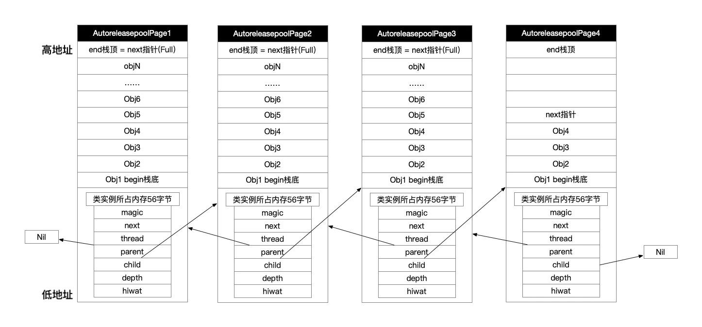

## 前言

Hi Coder，我是 CoderStar！

在 MRC 时代，我们可能会经常用到`AutoreleasePool`来帮助我们管理内存，在 ARC 时代，一些内存管理的操作被编译器替代了，不用再去手动的`release`以及`autorelease`等操作了，但是`AutoreleasePool`仍然在背后默默发挥着作用，并且有些场景下我们还是需要显式用到它，今天我们就来聊一聊`AutoreleasePool`。

> 下列源码为`Runtime objc`内代码，版本之间可能会有差异，但是大致原理应该是一致的。

## 使用形式

```swift
// OC
@autoreleasepool {
    // 生成自动释放对象
}

// swift
autoreleasepool {
    // 生成自动释放对象
}
```

## 基本原理

`@autoreleasepool` 包裹的相关代码在编译时，编译器会自动把它编译为如下形式。

```objective-c
// 这个poolSentinelObj其实就是哨兵对象
void *poolSentinelObj = objc_autoreleasePoolPush();

// 自动释放池作用域 {} 中的代码

objc_autoreleasepoolPop(poolSentinelObj);
```

> 其实如果研究的更细一点，其中还会有一个`__AtAutoreleasePool`的结构存在，其仅仅是对上述两个方法更高一层的封装而已；

继而查看`objc_autoreleasePoolPush`以及`objc_autoreleasepoolPop`这两个函数的源码实现，如下：

```objective-c
void *objc_autoreleasePoolPush(void) {
    return AutoreleasePoolPage::push();
}

void objc_autoreleasePoolPop(void *ctxt) {
    AutoreleasePoolPage::pop(ctxt);
}
```

上面我们可以看到一个核心类，`AutoreleasePoolPage`。

### `AutoreleasePoolPage`结构

`AutoreleasePoolPage` 是一个 C++ 中的类，在 `NSObject.mm` 中的定义是这样的：

```objective-c
class AutoreleasePoolPage {
    // 对当前AutoreleasePoolPage 完整性的校验
    magic_t const magic;

    // 指向下一个即将产生的autoreleased对象的存放位置（当next == begin()时，表示AutoreleasePoolPage为空；当next == end()时，表示AutoreleasePoolPage已满
    id *next;

    // 当前线程，表明与线程有对应关系
    pthread_t const thread;

    // 指向父节点，第一个节点的 parent 值为 nil；
    AutoreleasePoolPage * const parent;

    // 指向子节点，最后一个节点的 child 值为 nil；
    AutoreleasePoolPage *child;

    // 代表深度，第一个page的depth为0，往后每递增一个page，depth会加1；
    uint32_t const depth;

    // 表示high water mark（最高水位标记）
    uint32_t hiwat;
};
```

> 注意查看注释

从上述的结构可以知道，其实每一个`AutoreleasePool`都是以`AutoreleasePoolPage`为节点用双向链表的形式连接起来的。

每个 `AutoreleasePoolPage` 对象有 `4096` 字节的存储空间, 除了存放它自己的成员变量（56 个字节，每个占 8 个字节）外, 剩下的空间用来存储后面加入的 `autorelease` 对象。

> 为什么每个 AutoreleasePoolPage 的大小设置成 4096 个字节呢？ 内存管理、映射中的基本单位是页，一页的大小是 4kb（早期设备）或者 16kb（A7 芯片及以后）。



### 大致流程

- 当进入`@autoreleasepool`作用域时，`objc_autoreleasePoolPush` 方法被调用, `runtime` 会向当前的 `AutoreleasePoolPage` 中添加一个 nil 对象作为哨兵对象，并返回该哨兵对象的地址；
- 对象调用`autorelease`方法，会被加入到对应的的`AutoreleasePoolPage`中去，`next`指针类似一个游标，不断变化，记录位置。如果加入的对象超出一页的大小，便会自动加一个新页。
- 当离开`@autoreleasepool`作用域时，`objc_autoreleasePoolPop(哨兵对象地址)`方法被调用，其会从当前 page 的 next 指标的上一个元素开始查找, 直到最近一个哨兵对象, 依次向这个范围中的对象发送`release`消息；

> 因为哨兵对象的存在，自动释放池的嵌套也是满足的，不管是嵌套还是被嵌套的自动释放池，找自己对应的哨兵对象就行了。

下面看下具体源码流程分析。

### 源码流程分析

#### push 函数

```objective-c
// 哨兵对象定义
#define POOL_BOUNDARY nil

static inline void *push()
{
    id *dest;
    if (slowpath(DebugPoolAllocation)) {
        // Each autorelease pool starts on a new pool page.
        dest = autoreleaseNewPage(POOL_BOUNDARY);
    } else {
        // 添加一个哨兵对象到自动释放池
        dest = autoreleaseFast(POOL_BOUNDARY);
    }
    ...
    return dest;
}

//向自动释放池中添加对象
static inline id *autoreleaseFast(id obj)
{
    // 获取hotPage: 当前正在使用的Page
    AutoreleasePoolPage *page = hotPage();
    // 如果有page 并且 page没有被占满
    if (page && !page->full()) {
        // 添加一个对象
        return page->add(obj);
    } else if (page) {
        // 添加一个对象
        return autoreleaseFullPage(obj, page);
    } else {
        // 如果没有page,则创建一个page
        return autoreleaseNoPage(obj);
    }
}

// 创建一个新的page,并将当前page->child指向新的page,将对象添加进去
id *autoreleaseFullPage(id obj, AutoreleasePoolPage *page)
{
    ...
    do {
        if (page->child) page = page->child;
        else page = new AutoreleasePoolPage(page);
    } while (page->full());

    setHotPage(page);
    return page->add(obj);
}

// 创建一个新的page
id *autoreleaseNoPage(id obj)
{
    ...
    AutoreleasePoolPage *page = new AutoreleasePoolPage(nil);
    setHotPage(page);
    ...
    // Push the requested object or pool.
    return page->add(obj);
}
```

#### pop 函数

```objective-c
// 查看源码发现pop函数最终会调用 releaseUntil
// 调用顺序为pop->popPage->releaseUntil

popPage(void *token, AutoreleasePoolPage *page, id *stop)
{
    if (allowDebug && PrintPoolHiwat) printHiwat();

    page->releaseUntil(stop);

    // memory: delete empty children
    if (allowDebug && DebugPoolAllocation  &&  page->empty()) {
        // special case: delete everything during page-per-pool debugging
        AutoreleasePoolPage *parent = page->parent;
        page->kill();
        setHotPage(parent);
    } else if (allowDebug && DebugMissingPools  &&  page->empty()  &&  !page->parent) {
        // special case: delete everything for pop(top)
        // when debugging missing autorelease pools
        page->kill();
        setHotPage(nil);
    } else if (page->child) {
        // 如果当前页不满一半，则将所有子页也销毁
        if (page->lessThanHalfFull()) {
            page->child->kill();
        }
        // 如果超过一半，则留一个空子页，避免马上新建子页增加开销
        else if (page->child->child) {
            page->child->child->kill();
        }
    }
}

// stop 的值即为最初push时返回的哨兵对象的地址.
void releaseUntil(id *stop)
{
    // 循环依次向autorelease对象发送release消息
    while (this->next != stop) {
        // AutoreleasePoolPage 有cold和hot之分.hot是当前正在使用的,cold是没有使用的
        //获取当前正在使用的
        AutoreleasePoolPage *page = hotPage();

        // 如果为空,通过parent指针指向它的父节点,并将父节点置为当前使用的page
        while (page->empty()) {
            page = page->parent;
            setHotPage(page);
        }

        page->unprotect();
        // 获取当前Page next指针的上一个元素
        id obj = *--page->next;
        memset((void*)page->next, SCRIBBLE, sizeof(*page->next));
        page->protect();

        // 从next的上一个元素开始,向上查找只要不是哨兵对象,就向其发送release消息
        if (obj != POOL_BOUNDARY) {
            objc_release(obj);
        }
    }

    setHotPage(this);
}
```

在`Pop`函数中隐藏点一个知识点：

为什么各`AutoreleasePoolPage`之间使用双向链表进行链接呢？使用单链表为什么不行呢？

按照一般逻辑来看，我们可以只保留一个`parent`指针就可以，因为我们一般是从后到前释放对象的，即使在`push`操作时，也可以使用`parent`指针来链接，那我们为什么还需要一个`child`指针呢？

大家可以看到一个策略问题，也就是`popPage`函数中`page->releaseUntil(stop);`后面的逻辑，`releaseUntil`这个函数的作用只是将存放在`AutoreleasePoolPage`这个结点里面的`autorelease`对象进行销毁，但对`AutoreleasePoolPage`本身这个结点对象没有处理，那上面提到的逻辑便是对这些对象进行处理（策略可看注释）。

那回到刚才的问题，如果说我们使用单链表，那我们在处理`autorelease`对象时就得顺便将`AutoreleasePoolPage`对象也进行销毁，那这样我们可能就没法使用上述 **如果超过一半，则留一个空子页，避免马上新建子页增加开销** 这种策略了，你品品。

当然这可能只是用双向链表的某一个很小的原因而已，可能还有其他的代码细节要求使用双向链表。

#### autorelease 函数

```objective-c
static inline id autorelease(id obj)
{
    ASSERT(obj);
    ASSERT(!obj->isTaggedPointer());
    // 调用autoreleaseFast,添加到自动释放池中
    id *dest __unused = autoreleaseFast(obj);
    ASSERT(!dest  ||  dest == EMPTY_POOL_PLACEHOLDER  ||  *dest == obj);
    return obj;
}
```

## 执行类型

`AutoreleasePool`一般会包括两种执行类型：

- 主 `RunLoop` 自动加入的`AutoreleasePool`；
- 手动添加`AutoreleasePool`；

### 主 `Runloop` 自动加入

主线程 `Runloop` 中注册了两个 `Observer`，回调都是 `_wrapRunLoopWithAutoreleasePoolHandler()`。两个 `Observer` 如下：

- 监测 `Entry` 事件，回调里自动创建自动释放池，`order`为 `-214748364`， 优先级最高，保证创建释放池发生在其他所有回调之前；
- 监测 `BeforeWaiting` 及 `Exit` 事件；
  - `BeforeWaiting`时调用 `_objc_autoreleasePoolPop()` 和 `_objc_autoreleasePoolPush()` 释放旧的池并创建新池。
  - `Exit`时调用 `_objc_autoreleasePoolPop()` 来释放自动释放池。这个 Observer 的 `order` 是 `2147483647`，优先级最低，保证其释放池子发生在其他所有回调之后。

> 系统的自动释放池也并不总是在 `BeforeWaiting` 和 `Exit` 才释放，在处理完 `Timer` 和 `Source` 事件之后, 也可能会进行释放操作。

当然系统部分方法内部也自动添加了`AutoreleasePool`，比如：

- 使用容器的 `block` 版本的枚举器时，内部会自动添加一个 `AutoreleasePool`；

    ```objective-c
    [array enumerateObjectsUsingBlock:^(id obj, NSUInteger idx, BOOL *stop) {
        // 这里被一个局部 @autoreleasepool 包围着
    }];
    ```

- 使用 `NSThread` 的 `detachNewThreadSelector:toTarget:withObject:`方法创建新线程时，新线程自动带有 `AutoreleasePool`；
- ...

### 手动添加

如果手动加了`autoreleasepool`，则在作用域大括号结束时释放；

那我们一般会在什么场景下手动添加呢？

#### CLI 程序

因为 GUI 程序拥有 RunLoop 机制的原因，每个周期都会进行释放，我们可能不用太过关注`AutoreleasePool`的使用，但是 CLI 程序可能我们就需要对其更关注一些了。

#### 遍历中生成大量`Autorelease`局部变量

在遍历过程中生成大量`Autorelease`局部变量，会导致内存峰值比较高，我们手动加入`AutoreleasePool`可以降低内存使用峰值；

```swift
func loadBigData() {
    if let path = NSBundle.mainBundle().pathForResource("big", ofType: "jpg") {
        for i in 1...10000 {
            autoreleasepool {
                let data = NSData.dataWithContentsOfFile(path, options: nil, error: nil)
                NSThread.sleepForTimeInterval(0.5)
            }
        }
    }
}
```

这个地方稍微扩展一下，不是所有方式生成的对象都可以用这种方式去降低内存峰值，因为我们可以明确的是只有`Autorelease`类型的对象才会交给`AutoreleasePool`去管理，如果不是这类对象，则没有效果；

那什么样的对象才是`Autorelease`类型的呢？

- 编译器会检查方法名是否以`alloc`, `new`, `copy`, `mutableCopy` 开始，如果不是则自动将返回值的对象注册到 `AutoreleasePool` 中，比如一些类方法；
  > 这个地方会有个点，如果你自定义的方法是用这几个关键单词开头的，clang 在编译的时候就就不会走`release`逻辑，我们可以利用`clang attribute`去处理，示例：`- (id)allocObject __attribute__((objc_method_family(none)))`，其会将`allocObject`这个方法当做普通对象看待。
- iOS 5 及之前的编译器，关键字 `__weak` 修饰的对象，会自动加入`AutoreleasePool`。iOS 5 及之后的编译器，则直接调用的 `release`，不会加入 `AutoreleasePool`；
- id 指针 (`id *`) 和对象指针（`NSError *`），会自动加上关键字 `__autorealeasing`，加入 `AutoreleasePool`；

我们其实可以通过`objc_autoreleaseReturnValue`函数来标识一个对象是否加入到`AutoreleasePool`中去。同时该方法还附带了优化效果，`objc_autoreleaseReturnValue`函数会检查使用该函数的方法或函数调用方的执行命令列表，如果方法或函数的调用方在调用了方法或函数后紧接着调用`objc_retainAutoreleasedReturnValue()`函数，那么就不将返回的对象注册到`AutoreleasePool`，而是直接传递到方法或函数的调用方。

[arc-runtime-objc-autoreleasereturnvalue](https://clang.llvm.org/docs/AutomaticReferenceCounting.html#arc-runtime-objc-autoreleasereturnvalue)

#### 常驻线程

子线程默认不会开启 Runloop，可能这时候会有小伙伴有疑问，那还会自动创建`AutoreleasePool`吗？

答案当然是会，其实根据上面的源码分析，我们就可以知道，当子线程如果没有创建 `AutoreleasePool` ，但是产生了 `Autorelease` 对象，就会调用 `autoreleaseNoPage` 方法。在这个方法中，会自动帮你创建一个 `hotpage`，也就是默认生成一个 `AutoreleasePoolPage` 来添加 `Autorelease` 对象。`AutoreleasePool`中的对象会等到线程销毁后得到释放。说到这里，我们就需要注意常驻线程了。如果是常驻线程，就容易导致线程中所有的`Autorelease`对象都迟迟得不到释放，所以需要手动添加`AutoreleasePool`，让相关对象可以得到及时释放。

```swift
class KeepAliveThreadManager {
    private init() {}
    static let shared = KeepAliveThreadManager()

    private(set) var thread: Thread?

    /// 开启常驻线程
    public func start() {
        if thread != nil, thread!.isExecuting {
            return
        }
        thread = Thread {
            autoreleasepool {
                let currentRunLoop = RunLoop.current

                // 如果想要加对该RunLoop的状态观察，需要在获取后添加，而不是等到启动之后再添加，

                currentRunLoop.add(Port(), forMode: .common)
                currentRunLoop.run()
            }
        }
        thread?.start()
    }

    /// 关闭常驻线程
    public func end() {
        thread?.cancel()
        thread = nil
    }
}

class Test: NSObject {
    func test() {
        if let thread = KeepAliveThreadManager.shared.thread {
            perform(#selector(task), on: thread, with: nil, waitUntilDone: false)
        }
    }

    @objc
    func task() {
        /// 在任务外加一层 autoreleasepool
        autoreleasepool {

        }
    }
}

```

## `main.m` 文件中的`@autoreleasepool`

`main`函数中的 `@autoreleasepool` 只是负责管理它的作用域中的 `autorelease` 对象。

在 Xcode11 之前，是将整个应用程序运行放在 `@autoreleasepool` 内，由于 `RunLoop` 的存在，理论上这里的`@autoreleasepool`有点像摆设，根本没有发挥出作用。

**Xcode 11 前**

```objective-c
int main(int argc, char * argv[]) {
    @autoreleasepool {
        return UIApplicationMain(argc, argv, nil, NSStringFromClass([AppDelegate class]));
    }
}
```

**Xcode 11**

在 Xcode 11 后，触发主线程 `RunLoop` 的 `UIApplicationMain` 函数放在了 `@autoreleasepool` 外面，这可以保证 `@autoreleasepool` 中的 `autorelease` 对象在程序启动后立即释放。正如新版本的 `@autoreleasepool` 中的注释所写 "Setup code that might create autoreleased objects goes here."，这里的`autoreleasepool`是为了处理进入`UIApplicationMain`之前可能会产生的`autorelease`对象。

```objective-c
int main(int argc, char * argv[]) {
    NSString * appDelegateClassName;
    @autoreleasepool {
        // Setup code that might create autoreleased objects goes here.
        appDelegateClassName = NSStringFromClass([AppDelegate class]);
    }
    return UIApplicationMain(argc, argv, nil, appDelegateClassName);
}
```

## Swift 中的`AutoreleasePool`

如果是 Swift 纯对象，不考虑任何 OC 的因素在内，Swift 中其实是不存在`autorelease`这种内存释放方式的。

但是如果用一些 OC 对象，还是会存在需要调用`autorelease`方法。

## 最后

大致把`AutoreleasePool`涉及的点简单摸了一遍，希望小伙伴能对其有一个更全面的认识。

要更加努力呀！

Let's be CoderStar!

- [自动释放池的前世今生 ---- 深入解析 autoreleasepool](https://draveness.me/autoreleasepool/)
- [iOS autoreleasePool原理总结](https://www.jianshu.com/p/20496cbb6dc3)
- [黑幕背后的 Autorelease](https://blog.sunnyxx.com/2014/10/15/behind-autorelease/)
- [autoreleasepool 探究](https://github.com/Yuan91/autoreleasepool)
- [Transitioning to ARC Release Notes](https://developer.apple.com/library/archive/releasenotes/ObjectiveC/RN-TransitioningToARC/Introduction/Introduction.html#//apple_ref/doc/uid/TP40011226)
- [iOS - 聊聊 autorelease 和 @autoreleasepool](https://juejin.cn/post/6844904094503567368)
- [autoreleasepool uses in Swift](https://swiftrocks.com/autoreleasepool-in-swift)
