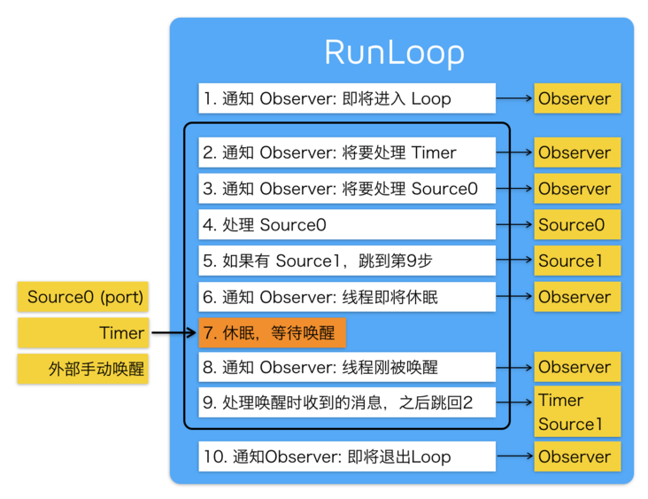
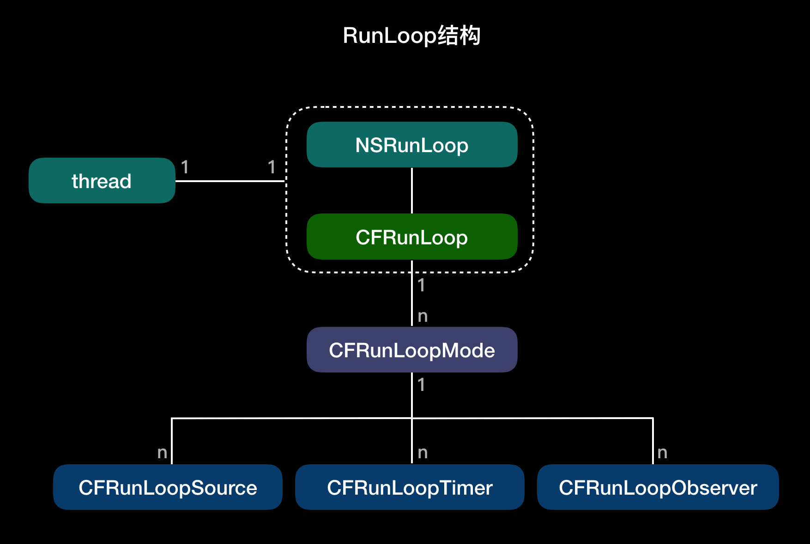

## 前言

Hi Coder，我是 CoderStar！

今天我们来看看`Runloop`，其实我们在实际开发过程中已经或多或少用到过这个了。

其实这个概念在不同的操作系统都会有相应的体现，比如 Node.js 的事件处理、Windows 程序的消息循环。核心在于如何管理事件 / 消息，如何让线程在没有处理消息时休眠以避免资源占用、在有消息到来时立刻被唤醒。

RunLoop 休眠的原理：通过`mach_msg()`让用户态跟内核态的切换，没有消息就切换到内核态休息，有消息就切换到用户态。如果你在模拟器里跑起一个 iOS 的 App，然后在 App 静止时点击暂停，你会看到主线程调用栈是停留在 `mach_msg_trap()` 这个地方。

## Runloop

- RunLoop 本质上是一个对象, 这个对象可以保持程序的持续运行并且处理程序中的各种事件 (如触摸事件, 定时器时间,selector 事件).
- RunLoop 没有事情处理时就会使线程进入睡眠状态. 这样可以节省 CPU 资源, 提高程序性能.





> 线程和 RunLoop 之间是一一对应的，其关系是保存在一个全局的 Dictionary 里。

RunLoop 处理六类事件

- Observer 事件，runloop 中状态变化时进行通知。
- Block 事件，非延迟的 NSObject PerformSelector 立即调用，dispatch_after 立即调用，block 回调。
- Main_Dispatch_Queue 事件：GCD 中 dispatch 到 main queue 的 block 会被 dispatch 到 main loop 执行。
- Timer：就是我们常用的`Timer`。
- Source0：处理如 UIEvent，CFSocket 这类事件，需要手动触发，一般是内部源。是经过 CFRunLoopSourceSignal 发送事件信号
- Source1：处理系统内核的 mach_msg 事件，一般是外部源，基于 Port(端口) 的线程间通信，比如 CFMachPort 和 CFMessagePort。

> Source0：source0 是 App 内部事件，由 App 自己管理的，像 UIEvent、CFSocket 都是 source0。source0 并不能主动触发事件，当一个 source0 事件准备处理时，要先调用 CFRunLoopSourceSignal(source)，将这个 Source 标记为待处理。然后手动调用 CFRunLoopWakeUp(runloop) 来唤醒 RunLoop，让其处理这个事件。框架已经帮我们做好了这些调用，比如网络请求的回调、滑动触摸的回调，我们不需要自己处理。
> Source1：由 RunLoop 和内核管理，Mach port 驱动，如 CFMachPort、CFMessagePort。source1 包含了一个 mach_port 和一个回调（函数指针），被用于通过内核和其他线程相互发送消息。这种 Source 能主动唤醒 RunLoop 的线程。

Runloop 可供 Observer 的阶段

- Entry 进入
- BeforeTimers
- BeforeSources
- BeforeWaiting 准备进入休眠
- AfterWaiting
- Exit 退出

**模式**

1. kCFRunLoopDefaultMode：App 的默认 Mode，通常主线程是在这个 Mode 下运行
2. UITrackingRunLoopMode：界面跟踪 Mode，用于 ScrollView 追踪触摸滑动，保证界面滑动时不受其他 Mode 影响
3. UIInitializationRunLoopMode: 在刚启动 App 时第进入的第一个 Mode，启动完成后就不再使用，会切换到 kCFRunLoopDefaultMode
4. GSEventReceiveRunLoopMode: 接受系统事件的内部 Mode，通常用不到
5. kCFRunLoopCommonModes: 这是一个占位用的 Mode，作为标记 kCFRunLoopDefaultMode 和 UITrackingRunLoopMode 用，并不是一种真正的 Mode

RunLoop 只会运行在一个模式下，要切换模式，就要暂停当前模式，重新启动一个运行模式

[Runloop 所有模式](https://iphonedev.wiki/index.php/CFRunLoop)

**作用**

- 保持程序持续运行
- 处理 App 中各类事件
- 节省 CPU 资源，提高程序性能

**实际应用**

- 控制线程生命周期（线程保活、线程永驻）
- TableView 延迟加载图片
  把 setImage 放到 NSDefaultRunLoopMode 去做，也就是在滑动的时候并不会去调用赋值图片的方法，而是会等到滑动完毕切换到 NSDefaultRunLoopMode 下面才会调用 `imageView.perform(#selector(setImage), with: nil, afterDelay: 0, inModes: [.default])`
- 解决 NSTimer 在滑动时停止工作的问题
  将 Timer 添加到 CommonMode 里面即可，`RunLoop.current.add(timer, forMode: .common)`
- 监测 RunLoop 的状态监测应用卡顿
  监控`BeforeSources`以及`BeforeWaiting`之间的执行时间来监控卡顿，

* 每一条线程都有一个 Runloop 对应；但 Runloop 可以嵌套子 Runloop。
* 主线程的 Runloop 的对象系统已经自动帮我们创建好了, 并且只有主线程结束时即程序结束时才会销毁；
* 子线程的 Runloop 对象需要我们主动创建并维护, 子线程的 Runloop 对象在第一次获取时就会创建, 销毁则是在子线程结束时. 并且创建出来的 runLoop 对象默认是不开启的, 必须手动开启 RunLoop；
* Runloop 并不保证线程安全, 我们只能在当前线程内部操作当前线程的 Runloop 对象, 而不能在当前线程中去操作其他线程的 RunLoop 对象；

```swift
//获取当前线程的RunLoop对象,在子线程中调用时如果是第一次获取内部会帮我们创建RunLoop对象
let runloop = RunLoop.current
// 运行runloop
runloop.run()
```

配合 CADisplayLink 监听 FPS，基本原理就是统计每一秒中 CADisplayLink 执行的次数就 OK 啦

```swift
let displayLink = CADisplayLink(target: self, selector: #selector(displayLinkAction(displayLink:)))
displayLink.add(to: .current, forMode: .common)
```

## 默认注册的 Observer

order 越小，优先级越高。

### AutoreleasePool

App 启动后，苹果在主线程 RunLoop 里注册了两个 Observer，其回调都是 `_wrapRunLoopWithAutoreleasePoolHandler()`。

第一个 Observer 监视的事件是 Entry(即将进入 Loop)，其回调内会调用 _objc_autoreleasePoolPush() 创建自动释放池。其 order 是 -2147483647，优先级最高，保证创建释放池发生在其他所有回调之前。

第二个 Observer 监视了两个事件： BeforeWaiting(准备进入休眠) 时调用_objc_autoreleasePoolPop() 和 _objc_autoreleasePoolPush() 释放旧的池并创建新池；Exit(即将退出 Loop) 时调用 _objc_autoreleasePoolPop() 来释放自动释放池。这个 Observer 的 order 是 2147483647，优先级最低，保证其释放池子发生在其他所有回调之后。


### UI 绘制

`_ZN2CA11Transaction17observer_callbackEP19__CFRunLoopObservermPv`

优先级为`2000000`

### 事件响应

苹果注册了一个 Source1 (基于 mach port 的) 用来接收系统事件，其回调函数为 __IOHIDEventSystemClientQueueCallback()。

用户交互事件首先 IOKit.framework 会产生一个 IOHIDEvent 事件，并由 springboard 接收，springboard 然后向事件处理线程的 Source1 的 mach port 发送 HIDEvent 消息，Source1 的回调函数将事件转化为 UIEvent 并筛选需要处理的事件推入待处理事件队列，向主线程的事件处理 Source0 发送信号，并唤醒主线程，主线程检查到事件处理 Source0 有待处理信号后，触发 Source0 的回调函数，从待处理事件队列中提取 UIEvent，最后进入 hit-test 等 UIEvent 事件响应流程。

### 手势识别

当上面的 _UIApplicationHandleEventQueue() 识别了一个手势时，其首先会调用 Cancel 将当前的 touchesBegin/Move/End 系列回调打断。随后系统将对应的 UIGestureRecognizer 标记为待处理。

苹果注册了一个 Observer 监测 BeforeWaiting (Loop 即将进入休眠) 事件，这个 Observer 的回调函数是 `_UIGestureRecognizerUpdateObserver()`，其内部会获取所有刚被标记为待处理的 GestureRecognizer，并执行 GestureRecognizer 的回调。

当有 UIGestureRecognizer 的变化 (创建 / 销毁 / 状态改变) 时，这个回调都会进行相应处理。

### 主 GCD

实际上 RunLoop 底层也会用到 GCD 的东西，比如 RunLoop 是用 dispatch_source_t 实现的 Timer。但同时 GCD 提供的某些接口也用到了 RunLoop， 例如 dispatch_async()。

当调用 dispatch_async(dispatch_get_main_queue(), block) 时，libDispatch 会向主线程的 RunLoop 发送消息，RunLoop 会被唤醒，并从消息中取得这个 block，并在回调 `__CFRUNLOOP_IS_SERVICING_THE_MAIN_DISPATCH_QUEUE__()` 里执行这个 block。但这个逻辑仅限于 dispatch 到主线程，dispatch 到其他线程仍然是由 libDispatch 处理的。

## 其他 Observer

当有了`CADisplayLink`之后，我们会发现 `RunLoop` 会多出一个 `Port` 转发过来处理的 `source1`。

> 至于怎么获取，可以直接打断点，可以直接使用`po RunLoop.main`命令打印出主 RunLoop 相关信息，对比一下就 ok 了。

```objective-c
<CFRunLoopSource 0x282dc8000 [0x1cadcf728]>{
    signalled = No, valid = Yes, order = -1,
    context = <CFMachPort 0x282fd8160 [0x1cadcf728]>{
        valid = Yes, port = 440b, source = 0x282dc8000,
        callout = _ZL22display_timer_callbackP12__CFMachPortPvlS1_ (0x187592b2c),
        context = <CFMachPort context 0x2823d0000>
    }
}
```

## 最后

要更加努力呀！

Let's be CoderStar!

- [深入理解RunLoop](https://blog.ibireme.com/2015/05/18/runloop)
- [iOS 事件处理机制与图像渲染过程](https://www.cnblogs.com/yulang314/p/5091894.html)
- [RunLoop与事件响应](https://juejin.cn/post/6844904105656188935)
- [一份走心的runloop源码分析](https://www.jianshu.com/p/aa0fae8c491b)
