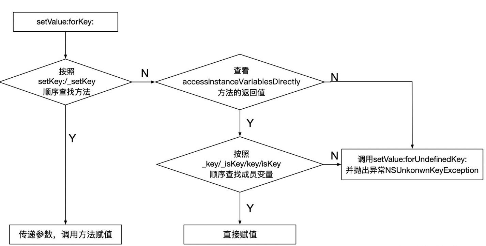

## KVC

`KVC` 是 `Key-Value Coding` 的简称，它是一种可以直接通过字符串的名字 (key) 来访问类属性的机制。而不是通过调用 `Setter`、`Getter` 方法访问。KVC 机制是由 `NSKeyValueCoding` 协议定义的。

### 取、赋值流程

- KVC 取值


- KVC 赋值


### 常用 API

```Swift

// 取值
open func value(forKey key: String) -> Any?
open func value(forKeyPath keyPath: String) -> Any?

// 赋值
open func setValue(_ value: Any?, forKey key: String)
open func setValue(_ value: Any?, forKeyPath keyPath: String)

// NSObject子类重写的方法
// 是否允许直接访问成员变量，默认返回值是YES，如果返回true，则起到类似禁止KVO的效果
open class var accessInstanceVariablesDirectly: Bool { get }

open func value(forUndefinedKey key: String) -> Any?
open func setValue(_ value: Any?, forUndefinedKey key: String)

open func setNilValueForKey(_ key: String)

```

> KVO 赋值、取值各有两个方法，一个 key，一个 keyPath；其中 keyPath 方法集成了 key 的所有功能，也就是说对一个对象的一般属性进行赋值、取值，两个方法是通用的，都可以实现。但是对对象中的对象型属性进行赋值，只有 keyPath 能够实现。

### 使用场景

- 字典转模型 ，简化代码量
- 修改系统的只读变量
- 可以任意修改一个对象的属性和变量 (包括私有变量)

通过 KVC 改变属性会触发 KVO，对于没有 setter 方法的合法属性，kvc 会自己给属性赋值，赋值的时候调用的是 _NSSetValueAndNotifyForKeyInIvar 看名字不难理解，边赋值边通知值的变化，方法里面调用了 willChangeValueForKey 和 didChangeValueForKey 这样 kvo 就接上了

### 在 Swift 中使用 KVC

1. 类继承自 NSObject
2. 需要 KVC 的属性使用 @objc 进行修饰

## KVO

### 原理

1. KVO 是关于 runtime 机制实现的;
2. 当某个类的对象属性第一次被观察时，系统就会在运行期动态地创建该类的一个派生类，在这个派生类中重写基类中任何被观察属性的 setter 方法。派生类在被重写的 setter 方法内实现真正的通知机制;
3. 如果原类为 Person，那么生成的派生类名为 `NSKVONotifying_Person`，但是在 Swift 工程中，因为命名空间的存在，生成的类名为 `NSKVONotifying_xxx.Person`（xxx 为命名空间名称）
4. 每个类对象中都有一个 isa 指针指向当前类，当一个类对象的第一次被观察，那么系统就会偷偷将 isa 指针指向动态生成的派生类，从而在给被监控属性赋值时执行的是派生类的 setter 方法;
5. 键值观察通知依赖于 NSObject 的两个方法：`willChangeValueForKey:`和`didChangeValueForKey:`, 在一个被观察属性发生改变之前，willChangeValueForKey: 一定会被调用，这就会记录旧的值。而当改变发生后，didChangeValueForKey: 会被调用，继而 observeValueForKey:ofObject:change:context: 也会被调用

### 方法重写

自动生成的子类会重写父类的 `setter`、`class`、`dealloc`、`_isKVOA` 方法。

* 重写 class 方法返回的不是子类，而是父类。（通过该情景，我们通过 isa 指针获取类的类型是不可靠的，通过 class 方法获取的才可靠）
* 重写 dealloc 方法当观察对象移除所有的监听后，会将观察对象的 isa 指向原来的类，但是动态生成的类不会注销，而是留在下次观察再使用，避免反馈创建中间子类。当观察者释放了，但是被观察者没有移除该观察者，isa 指针不会回归原类，这时候发送通知会发生野指针引起 Crash。
* 重写_isKVOA 方法，如果是动态生成的子类，返回 Yes，正常情况下返回 NO；

如果直接给属性赋值，不调用 set 方法赋值是不会触发 KVO 的。

我们可以手动调用 KVO，也就是在值改变之前手动调用 willChangeValueForKey 方法，在值改变之后手动调用 didChangeValueForKey 方法。

### 使用场景

监听某个值的变化从而进行相应的操作，如更新 UI 等。

### 手动 KVO

实现属性的 setter 方法，并在设置操作的前后分别调用 `willChangeValueForKey:` 和 `didChangeValueForKey 方法，这两个方法用于通知系统该 key 的属性值即将和已经变更了

### 禁止 KVO

类方法，`automaticallyNotifiesObserversForKey` 返回 `false`

### 在 Swift 中使用 KVO

1. 类继承自 NSObject
2. 需要 KVC 的属性使用 `@objc dynamic` 修饰
> 其中 @objc 是为了 OC 可以调用，dynamic 是允许动态派发，方便 setter，在 Swift4 之前，dynamic 默认带有 @objc 性质，之后就没有了。

```Swift
// user为User对象实例
let observation = user.observe(\User.name, options: [.new]) { user, change in
    // user为修改值后的对象实例，
    // options包含四个选项
    * new change字典包括改变后的值
    * old change字典包括改变前的值
    * initial 注册后立刻触发KVO通知
    * prior 值改变前是否也要通知（这个key决定了是否在改变前改变后通知两次）
}

```

**实际 Swift 还可以使用`didSet`这种形式来实现属性值改变观察**

-[KVO原理分析介绍](https://mp.weixin.qq.com/s/BeIQMwa28xX0MjZGk4fWYg)
