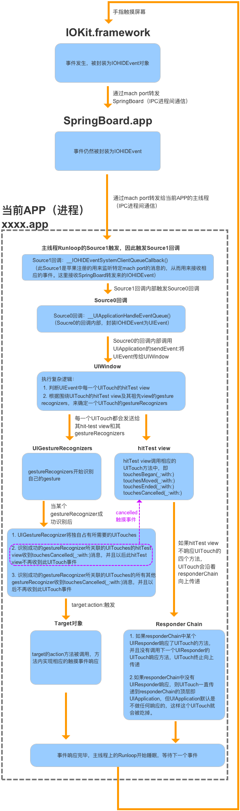
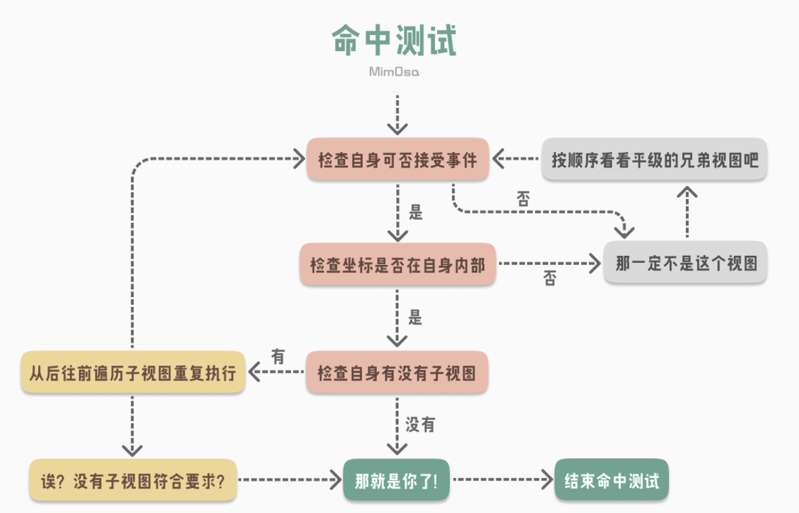
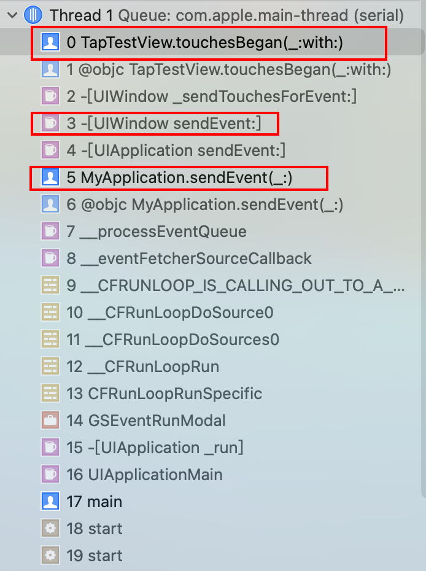
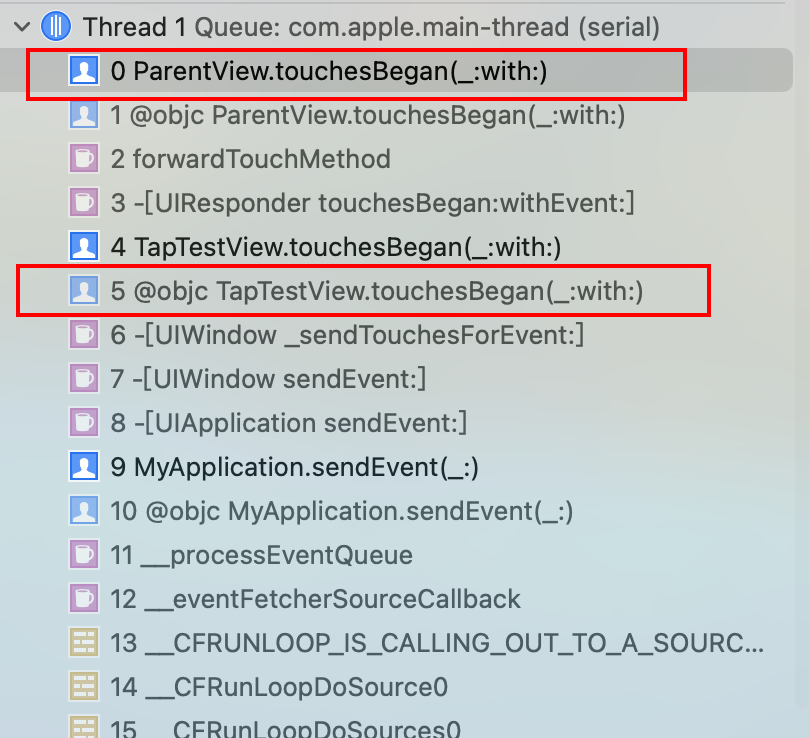
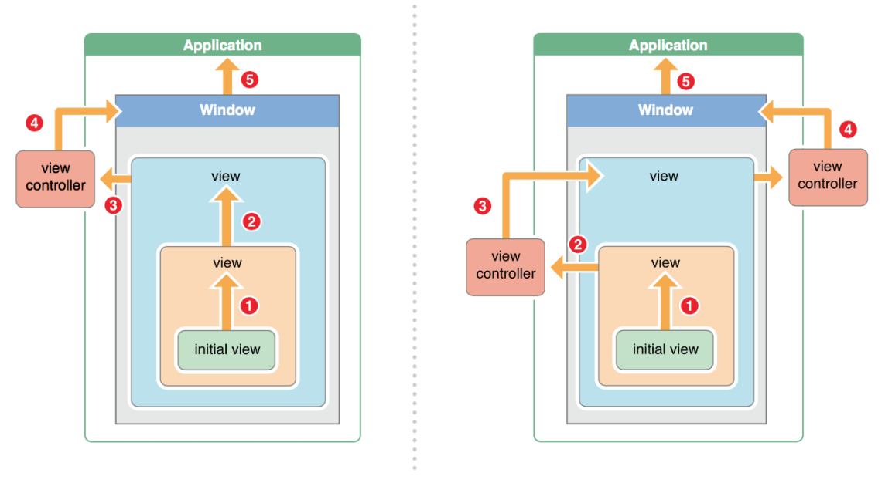
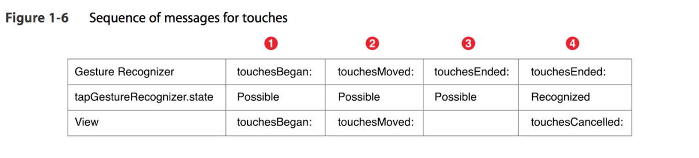
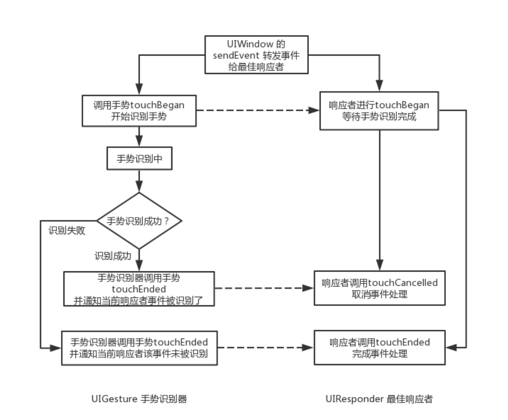
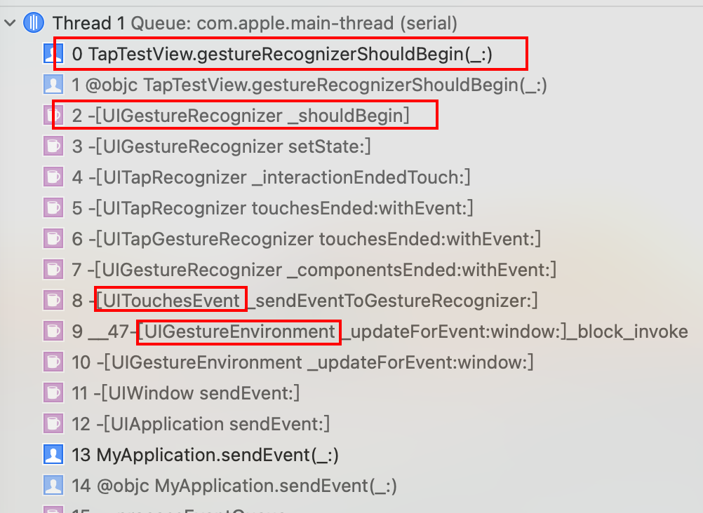
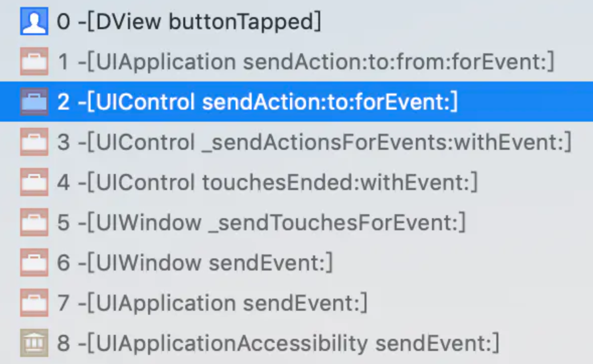

## 前言

Hi Coder，我是 CoderStar！

iOS 中的事件响应者主要分为两类，分别为`UIResponder`及`UIGestureRecognizer`，其中`UIControl`是一种比较特殊的`UIResponder`，所以本文将事件响应者分为以下三种类型进行讨论。

- `UIResponder`
- `UIGestureRecognizer`
- `UIControl`

> 下文中所涉及到的Apple官方描述可以通过[Event Handling Guide for iOS.pdf](https://gitee.com/CoderStar/pubilc-file/blob/master/iOS/Event%20Handling%20Guide%20for%20iOS/Event%20Handling%20Guide%20for%20iOS.pdf)
查阅到。

本文篇幅较长，如果大家不想细读，可以直接跳过细节展开看每个小节的结论部分。

## 事件来由：UITouch 触摸

**创建**

每个手指每一次触摸屏幕，对应生成一个 `UITouch` 对象。多个手指先后触摸，系统会根据触摸的位置判断是否更新同一个 `UITouch` 对象。
- 若两个手指一前一后触摸同一个位置 (即双击)，那么第一次触摸时生成一个 UITouch 对象，第二次触摸会更新这个 `UITouch` 对象，这是该 `UITouch` 对象的 `tapCount` 属性值从 1 变成 2；
- 若两个手指一前一后触摸的位置不同，将会生成两个 `UITouch` 对象，两者之间没有联系；

**销毁**

手指离开屏幕一段时间后，确定该 UITouch 对象不会再被更新，就释放。

列举 `UITouch` 对象一些关键属性及方法，可以留意一下，后文中的介绍会涉及到这些属性。

```swift
/// 触摸次数
var tapCount: Int

/// 触摸对象的手势识别
var gestureRecognizers: [UIGestureRecognizer]?

/// 正在触摸的对象对应的View
/// 在hit-testing过程时绑定上去
var view: UIView?

/// 正在触摸的对象对应的window
/// 在hit-testing过程时绑定上去
var window: UIWindow?

/// 最后一次触摸时间
var timestamp: TimeInterval

/// 触摸类型
/// 直接接触、间接接触、Apple Pencil触摸等
var type: UITouch.TouchType

/// 返回触摸对象指定视图中的坐标
func location(in: UIView?) -> CGPoint

/// 返回触摸对象指定视图中的上次坐标
func previousLocation(in: UIView?) -> CGPoint
```

## 事件本身：UIEvent 事件

列举一些核心属性

```swift
/// 事件关联的所有触摸
open var allTouches: Set<UITouch>? { get }

/// 事件发生的时间
var timestamp: TimeInterval { get }

/// 事件类型
/// 如触摸、运动（重力感应）、多媒体（蓝牙耳机）、物理按键
open var type: UIEvent.EventType { get }

/// 事件类型子类型
/// 如上述多媒体类型中又分为音频播放、音频暂停等子类型
open var subtype: UIEvent.EventSubtype { get }
```

从上述`type`属性我们可以看出，事件不仅仅单指本文主要讲的触摸事件，还有运动事件等。同时我们可以通过 `allTouches` 属性获取到该事件对应的所有触摸对象。

## 事件生命周期



通过上图我们对事件整个的生命周期其实有一个大致的了解。下文会分为几个小节对图中的流程的细节方面进行一个梳理。

## 普通事件响应者：UIResponder

每个响应者都是一个 `UIResponder` 对象，即所有派生自 `UIResponder` 的对象，本身都具备响应事件的能力。因此以下类作为 `UIResponder` 的派生类都可以是响应者：

* UIView
* UIViewController
* UIApplication
* AppDelegate

### Hit-Testing

从触摸事件发生后，iOS 系统便会根据 Hit-Testing 的过程来确定触摸事件发生在哪个视图对象上，其实 Hit-Testing 的过程本质就是找到**第一响应者**（或最佳响应者，后文统一称为第一响应者）。

其中查找的过程如下

`UIApplication ——> UIWindow ——> 子视图 ——> ... ——> 子视图`

> 可以注意下，其实 UIViewController 并没有参与查找的过程，如果想验证，可以在下文提到的 hitTest 函数中加入断点，看一下相关函数的调用情况。

Hit-Testing 的过程大概如下图：



该过程中会用到 UIView 提供的两个关键函数

```swift
/// 返回符合条件的UIView
func hitTest(_ point: CGPoint, with event: UIEvent?) -> UIView?

/// 检查坐标是否在自身内部
func point(inside point: CGPoint, with event: UIEvent?) -> Bool
```

- `检查自身可否接收事件`过程中，如果视图符合以下三个条件中的任一个，都会无法接收事件：
  * view.isUserInteractionEnabled = false
  * view.alpha <= 0.01
  * view.isHidden = true
- `检查坐标是否在自身内部`这个过程使用了上述的`point`方法来判断坐标是否在自身内部。
- `从后往前遍历子视图重复执行` 指的是按照 `FILO` 的原则，将其所有子视图按照「后添加的先遍历」的规则进行命中测试。该规则保证了系统会优先测试视图层级树中最后添加的视图，如果视图之间有重叠，该视图也是同级视图中展示最完整的视图，即用户最可能想要点的那个视图。

根据上述介绍，我们可以复原出`hitTest`的函数实现，如下所示。

```swift
override func hitTest(_ point: CGPoint, with event: UIEvent?) -> UIView? {
  // 视图无法接受事件
  if !isUserInteractionEnabled || isHidden || alpha <= 0.01 {
    return nil
  }

  // 判断触摸点是否在自身内部
  if self.point(inside: point, with: event) {
    // 按 FILO 遍历子视图
    for subview in subviews.reversed() {
        let convertedPoint = subview.convert(point, from: self)
        // 判断触摸点是否在子视图内部，在就返回视图，不在就返回nil
        let resultView = subview.hitTest(convertedPoint, with: event)
        if resultView != nil { return resultView }
      }

    // 该视图的所有子视图都不符合要求，而触摸点又在该视图自身内部
    return self
  }

  // 触摸点是否不在该视图内部
  return nil
}
```

> 在测试过程中，发现 hitTest 方法会执行两遍，point 值一致。苹果回复意思就是说： hitTest 是一个没有副作用的纯函数，进行多次调用也不会对外产生影响，因此系统可以多次调用调整 Point。[苹果回复](https://lists.apple.com/archives/cocoa-dev/2014/Feb/msg00118.html)

在`hitTest`函数中拿到的 `UIEvent` 对象，其`allTouches`属性为空，等到下文所提到的发送事件时，在`sendEvent`函数中拿到的 `UIEvent` 对象，其`allTouches`属性有了值，并且对应的`UITouch`对象的`view`、`window`及`gestureRecognizers`属性也有了对应的值。所以我们可以推断：

**系统通过 Hit-Testing 记录了适合响应触摸事件的 view、window 及 gestureRecognizers 等信息，在 Hit-Testing 完成之后，创建了 UITouch 并将其保存在 UIEvent 中进行发送。UIApplication 能够通过 sendEvent 方法发送事件给正确的 UIWindow 正是由于在 Hit-Testing 过程中系统记录了能够响应触摸事件的 Window。**

### 发送事件

在寻找到第一响应者之后，UIApplication 便会调用`sendEvent`函数发送事件到 UIWindow，然后 UIWindow 调用`sendEvent`函数发送事件到第一响应者进行响应，顺序如下：

`UIApplication -> UIWindow -> hit-tested view`

我们可以在`touchesBegan`函数中加入断点查看相关函数调用验证这一过程


### 事件响应 (Responder Chain)

UIResponder 响应事件的能力体现在下面四个可以处理触摸事件的方法，其传递事件的能力体现在它的`next`属性。

```swift
/// 触摸开始
open func touchesBegan(_ touches: Set<UITouch>, with event: UIEvent?)

/// 触摸移动
open func touchesMoved(_ touches: Set<UITouch>, with event: UIEvent?)

/// 触摸结束
open func touchesEnded(_ touches: Set<UITouch>, with event: UIEvent?)

/// 触摸停止
open func touchesCancelled(_ touches: Set<UITouch>, with event: UIEvent?)

/// 下一个响应者
/// 该值的绑定赋值发生addSubview等过程中
open var next: UIResponder? { get }
```

通过上述 Hit-Testing 的过程，我们实际上可以得到一条可以响应触摸事件的响应链。所谓响应链是由响应者组成的一个链表，链表的头是第一响应者，链表的每个结点的下一个结点都是该结点的 `next` 属性。如果第一响应者对事件不响应，则可以将事件传到`next`属性对应的下一个响应者。

响应者对于接收到的事件有下列操作：
  * 不拦截，默认操作，事件会自动沿着默认的响应链往下传递；
  * 拦截，不再往下分发事件，重写 `touchesBegan` 进行事件处理，不调用父类的 `touchesBegan`；
  * 拦截，继续往下分发事件，重写 `touchesBegan` 进行事件处理，同时调用父类的 `touchesBegan` 将事件往下传递；

如果最终没有响应者响应事件，则事件被丢弃。

> 需要注意，只有当`touchesEnded`函数被正常触发，才能说事件被响应了。



`ParentView`是`TapTestView`的父 View，`TapTestView`没有重写`touchesBegan` 方法，在`ParentView`的`touchesBegan` 方法中打上断点，点击`TapTestView`区域，相关函数调用如上图所示，可以看出先调用了`TapTestView`的`touchesBegan`方法，然后接着调用了`ParentView`的`touchesBegan` 方法。



如上图所示，关于`next`对象有下列原则。

* UIView：若视图是控制器的根视图，则其 nextResponder 为控制器对象；否则，其 nextResponder 为父视图；
* UIViewController：若控制器的视图是 window 的根视图，则其 nextResponder 为窗口对象；若控制器是从别的控制器 present 出来的，则其 nextResponder 为 presenting view controller；
* UIWindow：nextResponder 为 UIApplication 对象；
* UIApplication：若当前应用的 app delegate 是一个 UIResponder 对象，且不是 UIView、UIViewController 或 app 本身，则 UIApplication 的 nextResponder 为 app delegate；

通过上述响应链的介绍，我们是可以有一些相关的实际应用的。

**1. 利用重写`hitTest`或者`point`方法扩大 View 的点击范围。**

这种需求在一些图标的点击事件上非常常见，类似需求还包括：子 view 超出了父 view 的 bounds 响应事件等。

```swift
extension UIImageView {
    open override func hitTest(_ point: CGPoint, with event: UIEvent?) -> UIView? {
        if !self.isUserInteractionEnabled || self.alpha <= 0.01 || self.isHidden {
            return nil
        }
        /// checkEnlargeEdge函数用来判断点击的point是否在扩大后的范围内
        if let isEnlarge = checkEnlargeEdge(point) {
            if isEnlarge {
                return self
            } else {
                return nil
            }
        }
        return super.hitTest(point, with: event)
    }
}
```

**2. 利用响应链获取 view 所在的 UIViewController。**

```swift
extension UIView {
  public var firstViewController: UIViewController? {
    for view in sequence(first: superview, next: { $0?.superview }) {
      if let responder = view?.next, responder.isKind(of: UIViewController.self) {
          return responder as? UIViewController
      }
    }
    return nil
  }
}
```

上述代码示例的更详细版本可以访问 [LTXiOSUtils](https://github.com/Coder-Star/LTXiOSUtils)。

**小结**

**1. 系统通过`hitTest`方法沿视图层级树从底向上（从根视图开始），从后向前（从逻辑上更靠近屏幕的视图开始）进行遍历，最终返回一个适合响应触摸事件的 View，并在过程中为 UITouch 记录了 view、window 及 gestureRecognizers 等必要信息；**

**2. 原生触摸事件从 `Hit-Testing` 返回的 View 开始，沿着响应链从头到尾进行传递。**

> UITableView、UICollectionView 的 cell 点击也是通过响应链来实现的。

## 优先级更高事件响应者：UIGestureRecognizer

上节我们分析了当只有`UIResponder`参与事件响应时事件的传递是什么样的，那这节我们看一下当`UIGestureRecognizer`加入到响应时，事件的传递与响应会发生什么变化。

先列举重几个`UIGestureRecognizer`的关键属性

```swift
open var state: UIGestureRecognizer.State { get }
weak open var delegate: UIGestureRecognizerDelegate?
open var view: UIView? { get }

open var cancelsTouchesInView: Bool
open var delaysTouchesBegan: Bool
open var delaysTouchesEnded: Bool
```

其`state`属性，其有以下几种状态

- possible：手势识别器尚未识别其手势，但可能正在评估触摸事件，这是默认状态；
- began：手势识别器已接收到识别为连续手势的触摸对象；
- changed：手势识别器已接收到被识别为连续手势变化的触摸；
- ended：手势识别器已接收到被识别为连续手势结束的触摸；
- cancelled：手势识别器已接收到导致取消连续手势的触摸；
- failed：手势识别器收到了一个无法识别为手势的多点触控序列；
- recognized：手势识别器接收到一个多点触控序列，并将其识别为它的手势。

手势分为离散型手势和持续型手势两类，下面介绍一下两种类型，state 的变化情况。

- 离散型手势 (Discrete gestures)：点按 (Tap)、轻扫 (Swipe)
  * 识别成功：possible -> recognized
  * 识别失败：possible -> failed
- 持续型手势 (Continuous gesture)：滑动 (Pan)
  * 完整识别：possible -> began -> changed -> recognized
  * 不完整识别：possible -> began -> changed -> cancel
  * 识别失败：possible -> failed

`UIGestureRecognizer`同样有 `touch`系列 的四个函数。

### 优先级

当我们在一个添加了手势的`UIResponder`上执行**非连续的双击**操作，触发的回调消息如下表所示。



由此我们可以得出加入了手势后的事件处理流程图，如下图所示。



> 解释一下 **Window 怎么知道要把事件传递给哪些手势识别器？**
> 上文中已经提到： hit-test 过程中，UITouch 对象 gestureRecognizers 属性被赋了值，通过该属性便可以找到对应的手势识别器。

从上图中我们可以看出：Window 在将事件传递给最佳响应者的同时，也会将事件传递给相关的手势识别器**并由手势识别器优先识别**。若手势识别器成功识别了事件，就会取消最佳响应者对事件的响应；若手势识别器没能识别事件，最佳响应者才完全接手事件的响应权。

用一句话来总结就是：**手势识别器比 `UIResponder` 具有更高的事件响应优先级！！！**

我们可以通过修改`UIGestureRecognizer`的一些属性改变上述默认的事件处理流程。

- `cancelsTouchesInView`
  * 当值为 `YES` 时（默认值），表示手势识别成功后触摸事件取消掉，即识别成功后 hitTest-View 会调用 touchesCancelled 函数;
  * 当值为 `NO` 时，触摸事件会正常起作用，会正常收到 touchesEnded 消息。

- `delaysTouchesBegan`
  - 当值为 `NO` 时（默认值），触摸事件和手势识别的过程同时进行，先会发送触摸事件，然后当手势识别成功时，触摸事件会被取消掉，即识别成功后 hitTest-View 会调用 `touchesCancelled` 函数。
  - 当值为 `YES` 时，手势识别器先接收 touch 事件进行手势识别，识别过程中 hit-test view 的触摸事件会先被 UIWindow hold 住，当手势识别成功时 hit-test view 的触摸事件不会调用，当手势识别失败时才开始调用 `touchesBegan` 函数。

- `delaysTouchesEnded`
  * 当值为 `YES` 时（默认值），当手势识别失败时会延迟（约 0.15s）调用 touchesEnded 函数。
  * 当值为 `NO` 时，当手势识别失败时会立即调用 `touchesEnded` 函数。

我们也可以通过实现`UIGestureRecognizer`的相关代理方法，改变手势的处理方式，包含手势之间的依赖关系，及手势的禁止及允许等设置。

### 手势之间的依赖关系

当触摸事件发生时，哪个 `UIGestureRecognizer` 先收到这个事件并没有固定的顺序，我们可以使用`UIGestureRecognizer` 提供的方法来控制它们之间的顺序和相互关系。

```swift
/// UIGestureRecognizer 的方法
/**
调用这个方法将该手势置于另一手势的优先级之下，只有另一手势识别失败才会识别该手势；如果另一手势识别成功，则该手势的状态变为识别失败。
适用于同一个View中创建多个UIGestureRecognizer，要调整优先级的情况。
例：单击手势中调用此方法，参数是双击手势，判断双击失败后才会响应单击。
*/
open func require(toFail otherGestureRecognizer: UIGestureRecognizer)

/// UIGestureRecognizerDelegate 协议里的Optional方法
/**
返回YES能保证失效，但返回NO并不能保证生效（单一控制优先级）
适用于不同层级的手势优先级处理
*/

/// 返回YES第一个手势失效
@available(iOS 7.0, *)
optional func gestureRecognizer(_ gestureRecognizer: UIGestureRecognizer, shouldRequireFailureOf otherGestureRecognizer: UIGestureRecognizer) -> Bool
/// 返回YES第二个手势失效
@available(iOS 7.0, *)
optional func gestureRecognizer(_ gestureRecognizer: UIGestureRecognizer, shouldBeRequiredToFailBy otherGestureRecognizer: UIGestureRecognizer) -> Bool

/// UIGestureRecognizerDelegate 协议里的Optional方法
/**
控制两个 UIGestureRecognizer 之间是否可以同时异步进行
需要注意的是，假设存在两个可能会互相 block 的 UIGestureRecognizer，系统会分别对它们的 delegate 调用这个方法，只要有一个返回 YES，那么这两个 UIGestureRecognizer 就可以同时进行识别
*/

@available(iOS 3.2, *)
optional func gestureRecognizer(_ gestureRecognizer: UIGestureRecognizer, shouldRecognizeSimultaneouslyWith otherGestureRecognizer: UIGestureRecognizer) -> Bool
```

> 如果一个 View 上添加了两个相同的手势，如下代码所示，如果没有特殊指定，后添加的手势会响应，即会触发`gesTap2`。
> 可以使用`tap2.require(toFail: tap1)`的方式使先添加的`tap1`手势响应。
> 同时，从`UIGestureRecognizer`提供的`view`属性我们可以看出，一个手势可以添加给一个 View，如果添加给多个，只有最后一个 View 是可以识别手势的。

```swift
let tap1 = UITapGestureRecognizertarget: self, action: #selector(gesTap1))
view.addGestureRecognizer(tap1)

let tap2 = UITapGestureRecognizer(target: self, action: #selector(gesTap2))
view.addGestureRecognizer(tap2)
```

### 手势的禁止与允许

我们先看一下 Apple 官方的描述。

> When a touch begins, if you can immediately determine whether or not your gesture recognizer should consider that touch, use thegestureRecognizer:shouldReceiveTouch: method. This method is called every time there is a new touch. Returning NO prevents the gesture recognizer from being notified that a touch occurred. The default value is YES. This method does not alter the state of the gesture recognizer.
>
> If you need to wait as long as possible before deciding whether or not a gesture recognizer should analyze a touch, use thegestureRecognizerShouldBegin: delegate method. Generally, you use this method if you have a UIView or UIControl subclass with custom touch-event handling that competes with a gesture recognizer. Returning NO causes the gesture recognizer to immediately fail, which allows the other touch handling to proceed. This method is called when a gesture recognizer attempts to transition out of the Possible state, if the gesture recognition would prevent a view or control from receiving a touch.
>
> You can use the gestureRecognizerShouldBegin:UIView method if your view or view controller cannot be the gesture recognizer’s delegate. The method signature and implementation is the same.

- `optional func gestureRecognizerShouldBegin(_ gestureRecognizer: UIGestureRecognizer) -> Bool`
- `optional func gestureRecognizer(_ gestureRecognizer: UIGestureRecognizer, shouldReceive touch: UITouch) -> Bool`

上述两个方法都是用来决定是否允许 `UIGestureRecognizer` 响应触摸事件的，区别在于当触摸事件发生时，
- 使用第一个方法可以立即控制 `UIGestureRecognizer` 是否对其处理，且不会修改 `UIGestureRecognizer` 的状态机；（时机在手势`touchesBegan`前）
- 使用二个方法会等待一段时间，在 `UIGestureRecognizer` 识别手势转换状态时调用，返回 `NO` 会改变其状态机，使其 state 变为 `failed`。（时机在手势`touchesEnded`后）

UIView 自身也有一个 `gestureRecognizerShouldBegin`方法， 当 View 不是 `UIGestureRecognizer` 的 `delegate` 时，我们可以使用这个方法来使 UIGestureRecognizer 失效。**对于所有绑定到父 View 上的 `UIGestureRecognizer`，除了它们本身的 delegate 之外，第一响应者也会收到这个方法的调用**。

当 View 继承了`gestureRecognizerShouldBegin`方法并在此处打上断点，得到的方法调用如下图所示。


上图中我们还可以看到两个没有提到过的名词，一个是`UITouchesEvent`，另一个是`UIGestureEnvironment`。

**`UITouchesEvent`**

通过上文列举的`UIEvent`属性，我们发现其所有的属性都是只读以防止被修改，在事件响应的流程中，实际上传递的对象是`UIEvent`的子类`UITouchesEvent`。

**`UIGestureEnvironment`**

我们可以认为`UIGestureEnvironment`是管理所有手势的上下文环境，当调用 `addGestureRecognizer` 方法时会将 `UIGestureRecognizer` 加入到其中，UIWindow 通过 `sendEvent`发送事件之后，`UIGestureEnvironment`接收该事件并对相关的手势进行调用，起到对手势统一管理的作用。

**小结**

**1. `UIGestureRecognizer` 首先收到触摸事件，`Hit-Testing` 返回的 View 延迟收到；**

**2. 第一个 `UIGestureRecognizer` 识别成功后，`UIGestureEnvironment` 会发起响应链的 `cancel`；**

**3. 可以通过设置 `UIGestureRecognizer` 的 `Properties` 来控制对响应链的影响。**

### 特殊事件响应者： UIControl

#### 事件通知方式

`UIControl`作为`UIResponder`的派生类，其也具有`UIResponder` 的`touch`系列四个方法，但其内部对这四个方法进行了重写，在 `touchBegin`、`touchesMoved`、`touchesEnded`、`touchesCancelled` 中实际上分别调用了以下对应的四个方法。比如 `beginTracking` 是在 `touchesBegan` 方法内部调用的。

通过下述方法参数，我们可以注意到：UIControl 处理的不是 touch 数组而是单个 touch。 也就是说：UIControl 只能处理单点触控事件。

```swift
func beginTracking(_ touch: UITouch, with event: UIEvent?) -> Bool
func continueTracking(_ touch: UITouch, with event: UIEvent?) -> Bool
func endTracking(_ touch: UITouch?, with event: UIEvent?)
func cancelTracking(with event: UIEvent?)
```

`UIControl`在重写`touch`系列四个方法时，其方法内部不会调用父类的方法，**也就意味着`UIControl`对事件响应进行了阻断，使事件不会流向`nextResponder`**。

关于`UIControl`事件处理的流程如下：
1. 通过 `func addTarget(_ target: Any?, action: Selector, for controlEvents: UIControl.Event)`添加事件处理的`target`和`action`；
2. 当`UIControl`监听到需要处理的交互事件时，会调用 `func sendAction(_ action: Selector, to target: Any?, for event: UIEvent?)` 将`target`、`action`以及`event`对象发送给全局应用。
3. `Application`对象再通过 `func sendAction(_ action: Selector, to target: Any?, from sender: Any?, for event: UIEvent?) -> Bool` 向`target`发送`action`。

> 可以注意到`addTarget`时，`target`类型是一个可选值，如传入 nil 时，`Application`会自动在响应链上从上往下寻找能响应`action`的对象。



### 优先级

`UIControl`也是`UIResponder`的派生类，当其父 View 添加了手势事件，自身也添加了事件响应，按照上文描述来看，其结果应该是手势事件触发，自身的事件响应不会被触发。但是根据我们的开发经验可以知道，实际的结果是手势事件不触发，自身的事件响应正常触发。那其中的原理是什么呢？它与普通的`UIResponder`有何不同呢？我们先看一下 Apple 官方的一些介绍。

> In iOS 6.0 and later, default control actions prevent overlapping gesture recognizer behavior. For example, the default action for a button is a single tap. If you have a single tap gesture recognizer attached to a button’s parent view, and the user taps the button, then the button’s action method receives the touch event instead of the gesture recognizer. This applies only to gesture recognition that overlaps the default action for a control, which includes:
> * A single finger single tap on a UIButton, UISwitch, UIStepper, UISegmentedControl, and UIPageControl.
> * A single finger swipe on the knob of a UISlider, in a direction parallel to the slider.
> * A single finger pan gesture on the knob of a UISwitch, in a direction parallel to the switch.
>
> If you have a custom subclass of one of these controls and you want to change the default action, attach a gesture recognizer directly to the control instead of to the parent view. Then, the gesture recognizer receives the touch event first. As always, be sure to read the iOS Human Interface Guidelines to ensure that your app offers an intuitive user experience, especially when overriding the default behavior of a standard control.

通过上边的描述我们可以得出原因，**对于系统`UIControl`（除去开发者自定义的）来说，为了防止 `UIControl` 默认的手势与其父 View 上的 `UIGestureRecognizer` 的冲突，系统会默认设定，`UIControl` 来响应触摸事件。**

原因我们找到了，下面来介绍一下里面涉及到的原理。

上节`UIGestureRecognizer`中介绍过`gestureRecognizerShouldBegin`方法对手势有决定是否响应的作用，`UIControl`便是利用这一点达到了上述效果。
**`UIControl` 内部重写了 UIView 提供的的`gestureRecognizerShouldBegin`方法，返回 `false`，使父 View 上的手势不参与到事件响应中去，但是不会影响其自身的手势。**

**小结**

**1. UIButton 会截断响应链的事件传递，也可以利用响应链来寻找 Action Method。**

**2. UIGestureRecognizer 仍然会先于 UIControl 接收到触摸事件；**

**3. UIButton 等系统 UIControl 会拦截其父 View 上的 UIGestureRecognizer，但不会拦截自己和子 View 上的 UIGestureRecognizer；**

## 扩展

这里再介绍一下`UIScrollView`处理触摸事件的特殊之处及其原理。

当用户在 `UIScrollView` 的一个子视图上按下时，`UIScrollView`并不知道用户是想要滑动内容视图还是点击对应子视图，所以在按下的一瞬间， 事件 `UIEvent` 从 `UIApplication` 传递到 `UIScrollView` 后，**其会先将该事件拦截而不会立即传递给对应的子视图**， 同时开始一个 **150ms** 的倒计时，并监听用户接下来的行为。

* 当倒计时结束前，如果用户的手指发生了移动，直接滚动内容视图，不会将该事件传递给对应的子视图；
* 当倒计时结束时，如果用户的手指位置没有改变，则调用自身的 `-touchesShouldBegin:withEvent:inContentView:`方法询问是否将事件传递给对应的子视图 (如果返回 NO, 则该事件不会传递给对应的子视图，如果返回 YES，则该事件会传递给对应的子视图，默认为 YES)；
* 当事件被传递给子视图后, 如果手指位置又发生了移动, 则调用自身的 `-touchesShouldCancelInContentView:` 方法询问是否取消已经传递给子视图的事件。

```swift
// 是否延迟事件传递,默认为YES,如果设置为NO,scrollView会立即调用-touchesShouldBegin:withEvent:inContentView:方法以进行下一步操作
open var delaysContentTouches: Bool

// 是否可以取消内容视图被触摸,默认为YES,如果设置为NO,则一旦开始跟踪事件,即使手指进行移动也不会取消已经传递给子视图的事件，即滚动视图不会再滚动。
open var canCancelContentTouches: Bool

// 在UIScrollView的子类中重写该方法,用于返回是否将事件传递给对应的子视图,默认返回YES,如果返回NO,该事件不会传递给对应的子视图
open func touchesShouldBegin(_ touches: Set<UITouch>, with event: UIEvent?, in view: UIView) -> Bool

// 在UIScrollView的子类中重写该方法,用于返回是否取消已经传递给子视图的事件,默认当子视图是UIControl时返回NO,否则返回YES(注: 该方法被调用的前提是canCancelContentTouches = YES)
open func touchesShouldCancel(in view: UIView) -> Bool
```

## 相关问题

通过阅读本文，我想你对下面的问题出现的原因及解决办法应该有了比较深刻的认识。

**UICollectionView 父 view 添加手势，其内部代理 `didSelectItemAt` 不触发**

```swift
tapViewGesture.delegate = self

override func gestureRecognizerShouldBegin(_ gestureRecognizer: UIGestureRecognizer) -> Bool {
  let p = gestureRecognizer.location(in: superview)
  let v = superview.hitTest(p, with: nil)
  /// gestureRecognizer.view为父View。
  /// hitTest返回为父View，则返回true,手势生效；
  /// 如果返回为UICollectionView，则返回false，手势不生效，UICollectionView的didSelectItemAt可以正常触发。
  return v == gestureRecognizer.view
}
```

## 最后

最后，附上戴铭老师本周博文《我写技术文章的一点心得》中的一段话，我觉得很有共鸣。

> 写文章并不是最终的目的，写作是你对自己思想的研究和开发。文章的上限是你的技术能力，文章只是让人了解你技术一种手段。因此更重要的是你做的技术是否有突破有演进，获得应用，并在产品中取得了好的效果。还有那些孤独着研究技术的时光，经历着一直努力着奋斗着却一直不被看见，得不到认同，也没有结果的岁月，还能够一直被自己的热情感动而不放弃去取得一点点进步带来的满足感。

新的一周要更加努力呀！

Let's be CoderStar!

相关链接

- [由手势与 UIControl 冲突引发的「事件处理全家桶」探索](https://juejin.cn/post/6908553699732226061)
- [iOS 事件(UITouch、UIControl、UIGestureRecognizer)传递机制](https://www.jianshu.com/p/df86508e2811)
- [iOS | 事件传递及响应链](https://juejin.cn/post/6894518925514997767)
- [iOS触摸事件全家桶](https://www.jianshu.com/p/c294d1bd963d)
