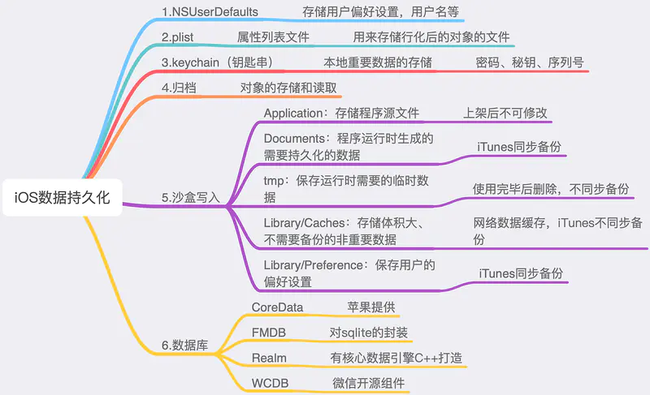

## 总览

- UserDefaults  
  这种方式本质上还是 plist 文件存储，只不过对操作数据进行了封装，使用上更加方便，其生成的 plist 文件放置在 Library/Preference，生成的 plist 文件为 包名.plist。存储的类型是有限制的，如果想存储自定义类型，如果转换成可存储的类型，可以被获取到，不安全，写入时最好进行加密；
- keychain 钥匙串
  此种方式存储的信息不会随着 APP 的卸载还删除。很安全。
- 归档
  数据对象需要遵守 NSCoding 协议。缺点：只能一次性归档保存或者一次性解压。所以只能针对小量数据，对数据操作比较笨拙，如果想改动数据的某一个小部分，需要解压或者归档整个数据；（NSKeyedArchiver、NSKeyedUnarchiver）。这种方式可以存储自定义对象，如用户 Model 等。相对 UserDefaults 以及 plist 文件来说更安全一些，因为数据归档时候是进行加密的。
- 沙盒文件（Sandbox）
  应用沙盒机制：每个 iOS 应用都有自己的应用沙盒（文件系统目录），与其他文件系统隔离。每个应用必须在自己的沙盒里运行，其他应用不能访问该沙盒。
- plist 文件  
  plist 文件是将某些特定的类，通过 XML 文件的方式保存在目录中，其中还包括 NSArray、NSMutableArray、NSDictionary、NSMutableDictionary、NSData、NSMutableData、NSString、NSMutableString; 可以利用其读写文件方法。(writeToFile 、 WithContentsOfFile)。这种方式不可以保存自定义对象，除非先序列化成 json 文件，再存入。这种方式就是沙盒文件的一种。
- 数据库
  - SQLite
  - CoreData
  - Realm

