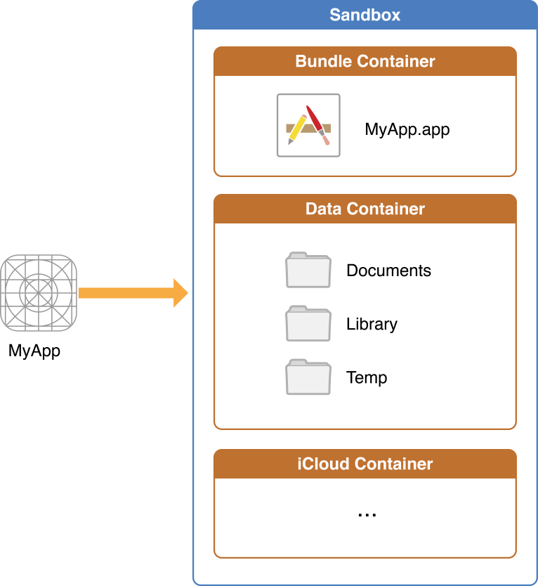

## 前言

Hi Coder，我是 CoderStar！

该篇文章是iOS持久化方系列的第二篇文章，第一篇请见[UserDefaults浅析及其使用管理](../UserDefaults浅析及其使用管理)。

> 驾驶证快到期了，这个周末出去换了个证，花了一些时间，回来整理文章的时间比较少，就挑了一个篇幅相对比较少的知识点整理分享给大家咯。对了，如果大家对于在北京期满换证的流程有疑问的话，也可以私聊我，毕竟走了一遍流程，相对还是有些经验的。

## 整体目录结构

先看一下整体的目录结构。请注意该目录不是某一个 APP 的沙盒目录，而是所有 APP 在系统中整体的一个目录结构。

> 真机环境下，该目录路径为`/private/var/mobile/Containers`，如果在模拟器中，该目录路径便实际为 Mac 下的文件路径，举某一个模拟器下的路径为例：`/Users/coderstar/Library/Developer/CoreSimulator/Devices/1328FF08-D6CB-4EFE-B936-5E1CB5D03D75/data/Containers`。

- /Application
  - app 的 md5 标识为名的文件夹
    - MyApp.app
    - BundleMetadata.plist
- /private/var/mobile/Containers/Data
  - Application
    - app 的 md5 标识为名的文件夹
      - Documents
      - Library
        - Application Support
        - Caches
        - Cookies
        - Preferences
        - Saved Application State
        - SplashBoard
        - WebKit
      - SystemData
      - tmp
  - InternalDaemon
  - PluginKitPlugin
  - System
- Shared
  - AppGroup：
    - app 的 md5 标识为名的文件夹
      - Library
        - Caches
        - Preferences
  - SystemGroup
- Staging
- Temp

> 上述所列目录不一定完全，其中还有部分目录会在相关文件第一次生成时自动创建。

从以上目录结构，我们基本上可以得到 APP 的沙盒结构，如下图所示。



> [XSimulatorMngr](https://github.com/xndrs/XSimulatorMngr)工具可以帮助我们更方便的查看模拟器下`Sandbox`中的文件，更多工具可见[Mac效率软件](../../../../杂项/装机必备/Mac效率软件)。

## 关键目录解读

虽然上述目录结构下的子目录比较多，但是有很大一部分是供系统使用，下面我们了解一下几个比较关键的目录。

### `Bundle/Application`

包含了所有的资源文件和和可执行文件，上架前经过数字签名，上架后不可修改。

### Documents

该目录的内容可以通过文件共享提供给用户，因此，该目录应仅包含您可能希望向用户公开的文件。
使用此目录来存储用户生成的内容，如用户自己创建的文件或者下载的音视频等数据文件。
iTunes、iCloud 会备份该目录。
  > 在 iOS11 以后新增了一个 **文件** APP，集中管理 iOS 上应用内创建的文件，以及各个云盘服务中保存的文件。在 iOS 工程 `info.plist` 中设置 `Application supports iTunes file sharing` 和 `Supports opening documents in place` 这两个选项为 `YES`（默认为 `NO`），就可以将该应用的沙盒 `Documents`路径下的文件暴露在**文件** APP 中。

### Library/Application Support

此目录包含应用程序用来运行但应对用户隐藏的文件，如游戏的新关卡等文件。
iTunes、iCloud 会备份该目录。

### Library/Caches

保存应用运行时生成的需要持久化的数据，一般存储体积大、不需要备份的非重要数据，如网络请求的音视频与图片等的缓存。
在 iOS 5.0 及以后版本中，Caches 当系统磁盘空间非常低时，系统可能会在极少数情况下该删除目录（APP 正在运行时不会发生），所以尽量保证该路径的文件在 APP 在重新运行时可以得到重新创建。
iTunes、iCloud 不会备份该目录。

### Library/Preference

保存应用的所有偏好设置。如果看过上篇文章，应该就会记得`UserDefaults`生成的`plist`文件就会保存该目录下。
iTunes、iCloud 会备份该目录。

### Library/SplashBoard

存储启动屏缓存，缓存文件格式为 `ktx`，本质上就是图片，如果启动屏不生效的问题可以考虑从删除该路径下相关缓存文件这个角度解决；

### Library/WebKit

存储 `WKWebView` 相关的一些数据，如 `IndexDB`、`LocalStorage`、`WebSQL` 等；

### Library/Cookie

存储 Cookie，本地文件存储在 沙箱文件夹`/Library/Cookies/Cookies.binarycookies`；需要特别注意的是：持久化 Cookie 并非在产生之后立即同步到 Cookies.binarycookies，根据经验会有一个 300ms ~ 3s 的延迟。

### tmp

保存应用运行时产生的一些临时数据；应用程序退出、系统空间不够、手机重启等情况下系统都会自动清除该目录的数据。
iTunes、iCloud 不会备份该目录。

### AppGroup

宿主程序与扩展程序数据共享区域。

子目录`Library/Preferences`，默认没有该目录，当创建 `group` 的 `UserDefaults` 时会创建该目录，`UserDefaults` 对应 `plist` 的名称为 `group` 名称；

## 操作方式

### 获取路径地址

```swift
/// 沙盒主目录
let path = NSHomeDirectory()

/// Documtents目录
let documtentsPath = NSSearchPathForDirectoriesInDomains(.documentDirectory, .userDomainMask, true).first!

/// Library目录
let libraryPath = NSSearchPathForDirectoriesInDomains(.libraryDirectory, .userDomainMask, true).first!

/// Application Support目录
let applicationSupportPath = NSSearchPathForDirectoriesInDomains(.applicationSupportDirectory, .userDomainMask, true).first!

 /// Caches目录
let cachesPath = NSSearchPathForDirectoriesInDomains(.cachesDirectory, .userDomainMask, true).first!

/// tmp目录
let tmpPath = NSTemporaryDirectory()

/**
--------------------------------------------------------
上面形式获取路径返回值为 String 形式，下面形式返回值为 URL 形式
可根据实际情况选择合适的方式
--------------------------------------------------------
*/

let dataURL = FileManager.default.urls(for: .documentDirectory, in: .userDomainMask).first?.appendingPathComponent("sqliteName").appendingPathExtension("sqlite")


/// AppGroup目录路径
let appGroupIdentifier = "group.com.star.LTXiOSUtils.extension"
let groupURL = FileManager.default.containerURL(forSecurityApplicationGroupIdentifier: appgroupIdentifier)
```

> 请注意 `NSSearchPathForDirectoriesInDomains(.preferencePanesDirectory, .userDomainMask, true).first!` 获取的路径并不是 iOS 系统下的`Preference`路径，而是 Mac 系统下的偏好设置路径，枚举中并没有提供`Preference`路径，我猜想不提供的主要原因也是 Apple 官方并不想开发者直接去操作该路径下的文件，而是使用`UserDefaults`等形式进行操作。

### 数据存取

获取到路径后就可以对数据进行存取了，可以直接进行存取操作的数据结构有：

- `NSMutableArray`、`NSArray`
- `NSData`、`Data`、`NSMutableData`
- `String`、`NSString`
- `NSDictionary`、`NSMutableDictionary`

以 `NSDictionary` 举例，其余类似

```swift
let dicPath = FileManager.default.urls(for: .documentDirectory, in: .userDomainMask).first!.appendingPathComponent("dic").appendingPathExtension("plist")

let dic: [String: Any] = ["姓名": "张三", "年龄": 24]

/// 写入
NSDictionary(dictionary: dic).write(to: dicPath, atomically: true)

/// 读取
let data = NSDictionary(contentsOf: dicPath)
```

## 最后

新的一周要更加努力呀！

Let's be CoderStar!

相关链接

[File System Programming Guide](https://developer.apple.com/library/archive/documentation/FileManagement/Conceptual/FileSystemProgrammingGuide/FileSystemOverview/FileSystemOverview.html)
