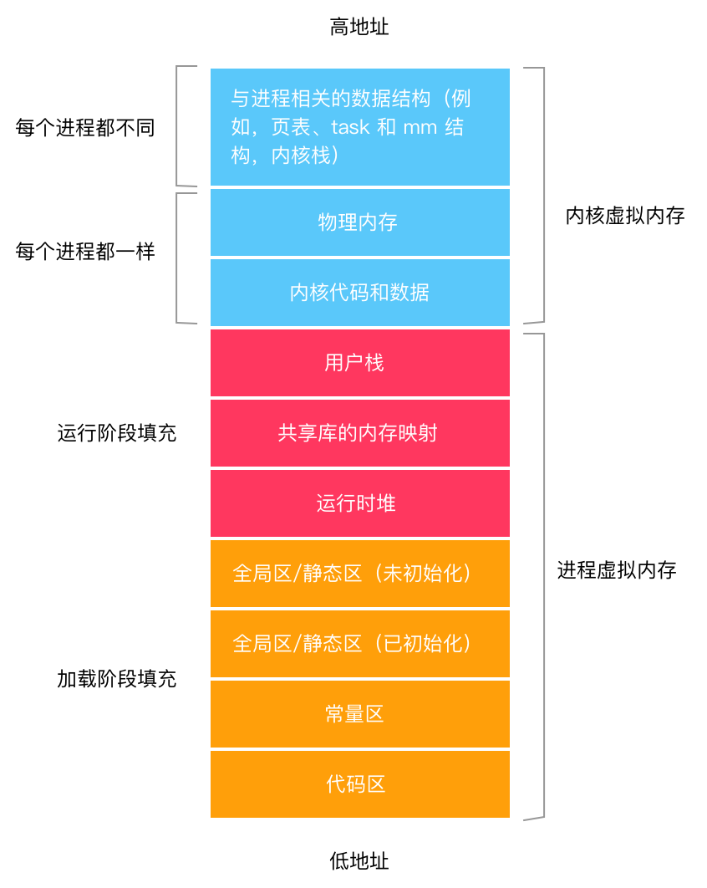

## 前言

Hi Coder，我是 CoderStar！

iOS 内存管理分为 MRC、ARC 两个方式，核心原理都是利用对象的引用计数来实现。MRC 是需要开发者自己手动去管理的对象的 retain 及 release，控制引用计数的变化。ARC 是编译时自动在程序对应的位置加上 retain 及 release。

当每个 runloo 完成一个循环后，都会检查对象的引用计数（retainCount），如果 retainCount 为 0，则释放该对象。

引用计数这种方式只面向 class 这类引用类型，不适用于值类型。

其中 Swift 固定使用 ARC，而 OC 可以自己设置是否 ARC，通过设置 Xcode 的`Build Settings`中的`将Objective-C Automatic  Counting`来控制 OC 是否开启 ARC。

## 内存管理区

iOS 内存管理区分为栈、堆、全局区、常量区、代码区。这几个区内存地址由高到低。其中栈、堆在运行过程中会动态增长，其他在编译器确定。

- 栈区地址从高到低分配。
- 堆区的地址是从低到高分配。

- 系统部分：命令行参数，环境变量；
- 栈：存储非对象类型；存放函数的参数值、局部变量值；对象指针也属于局部变量。存储空间有限（512k），地址连续，运行时分配，编译器自动分配释放，访问速度快。内存地址一般以0x7开头。
- 共享库：
- 堆： 存储对象；开发者自己去分配及释放，地址不连续，速度没有栈快。内存地址一般以0x6开头。
- 全局区：内存地址一般以0x1开头。
  - 全局 / 静态区（.bss，对应macho文件_common区）：编译时分配，存储未初始化的全局变量和静态变量
  - 全局 / 静态区（.data，对应macho文件_data区）：编译时分配，存储初始化的全局变量与静态变量
- 常量区（_Data）：只读，编译时分配，存储常量字符串；程序结束后系统释放。
- 代码区（_Text）：只读，编译时分配，二进制文件。程序结束后系统释放。
- 系统部分：不可访问；

## 最后

要更加努力呀！

Let's be CoderStar!
