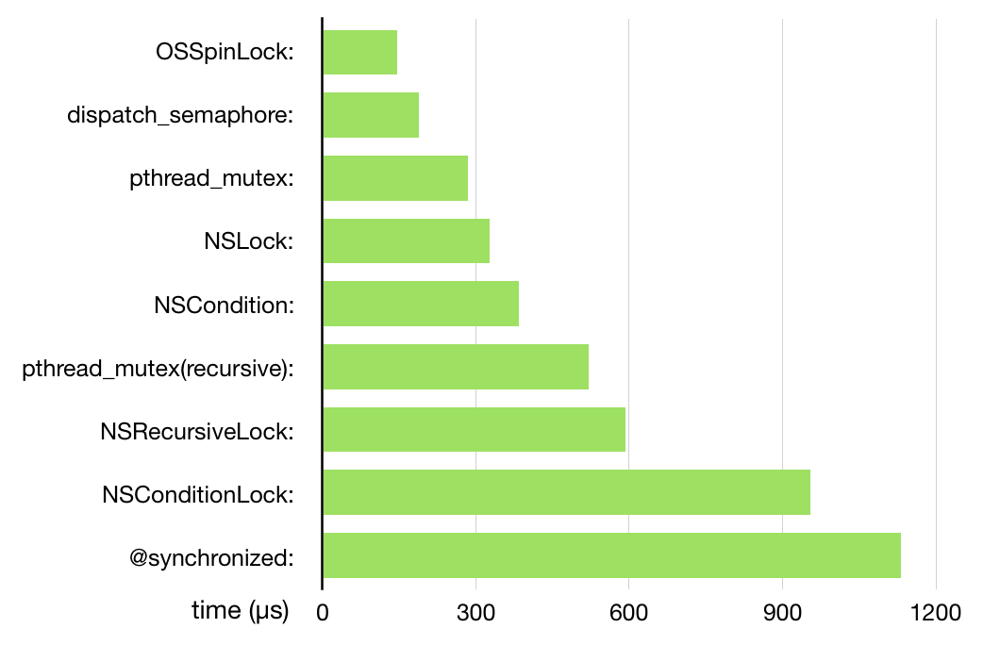

## iOS 中锁分析

### 互斥锁

- pthread_mutex（支持递归）
- NSLock
- @synchronized（支持递归）（objc_sync_enter/objc_sync_exit）

```
// pthread_mutex形式
var mutex = pthread_mutex_t()
func initLock() {
  pthread_mutex_init(&mutex, nil)
}
pthread_mutex_lock(&mutex)
// 执行内容
pthread_mutex_unlock(&mutex)
```

```swift
// NSLock形式
let lock = NSLock()
lock.lock()
// 执行内容
lock.unlock()
```

```swift
// 两本质相同，其中

// oc
// 这种方式使用简单，支持多线程递归嵌套
// 需要注意使用期间self这个参数不可为nil，其底层会执行objc_sync_enter及objc_sync_exit这两个函数，其最终底层是依靠recursive_mutex_t锁来进行加锁的。这也是synchronized可以支持递归调用的原因。
// 当传入的self对象是nil的时候，线程安全就会失效。
// 为什么  @synchronized 是性能最差的呢？因为其包含的操作极为复杂，除了常规的加锁解锁操作以外，还需要考虑哈希表寻址，缓存获取/创建缓存等，最差情况下即 N 个 不同的 obj 创建多个不同的  SyncData，并且会调用命名为自旋锁的互斥锁 os_unfair_lock 来实现缓存.

/// 括号内内容不可为nil
@synchronized (self) {
    // 执行内容
}

// swift
objc_sync_enter(self)
// 执行内容
objc_sync_exit(self)
```

### 自旋锁

**OSSpinLock**，已废弃，编译会报警告，大家已经不再使用它了，因为它在一些场景下已经不安全了。**os_unfair_lock** 是苹果官方推荐的替换 OSSpinLock 的方案，但是它在 iOS10.0 以上的系统才可以调用。os_unfair_lock 是一种互斥锁，它不会向自旋锁那样忙等，而是等待线程会休眠。

优先级反转问题：

会出现优先级翻转的情况. 比如线程 1 优先级比较高，线程 2 优先级比较低，然后在某一时刻是线程 2 先获取到锁，所以先是线程 2 加锁，这时候，线程 1 就在 while（目标锁还未释放），这个状态，但因为线程 1 优先级比较高，所以系统分配的时间比较多，有可能会没有分配时间给线程 2 执行后续的操作（需要做的任务和解锁）了，这时候就会造成死锁。

自旋锁不会使线程状态发生切换，不会使线程进入阻塞状态，减少了不必要的上下文切换，执行速度快，比较适用于锁使用者保持锁时间比较短的情况。如果不能在很短的时间内获得锁，CPU 效率降低。

> 线程之间的切换也是非常耗性能的，大概需要 20 毫秒的时间。

> 自旋锁与互斥锁的区别？

自旋锁与互斥锁类似，它们都是为了解决对某项资源的互斥使用，在任何时刻最多只能有一个线程获得锁；
对于互斥锁，如果资源已经被占用，调用者将进入睡眠状态；
对于自旋锁，如果资源已经被占用，调用者就一直循环在那里，看是否自旋锁的保持者已经释放了锁；

### 条件锁

- NSCondition
- NSContionLock(基于 NSCondition 实现，只不过比 NSCondition 少了一些繁琐的操作)

### 读写锁

一般使用多读单写的场景

- 使用栅栏函数。
- pthread_rwlock

**栅栏函数**
使用一个并行队列，读使用异步任务，写使用栅栏函数。这里使用并行队列的原因是因为如果串行队列，多读的时候就是串行的，影响效率

```swift
let concurrentQueue = DispatchQueue(label: "concurrentQueue", attributes: .concurrent)

/**
  使用栅栏函数使用多读单写
 */
func readFile() -> String {
  // 这里使用同步任务，阻塞进入的线程，保证即读即得
  concurrentQueue.sync {
    // 读写文件
  }
}

func writeFile() {
    // 这里使用异步任务，因为存入后不需要及时得到反馈结果
    concurrentQueue.async(flags: [.barrier]) {
    }
}
```

**pthread_rwlock**

```swift
class FileTest: XCTestCase {

  // 文件读写锁
  var pthreadRwlock = pthread_rwlock_t()


  func initRwlock() {
    pthread_rwlock_init(&pthreadRwlock, nil)
  }

  func readFile() -> String {
    pthread_rwlock_rdlock(&pthreadRwlock)
    defer {
      pthread_rwlock_unlock(&pthreadRwlock)
    }
    // 读文件
    return ""
  }

  func writeFile() {
    pthread_rwlock_wrlock(&pthreadRwlock)
    defer {
      pthread_rwlock_unlock(&pthreadRwlock)
    }
    // 写文件
  }

  deinit {
    pthread_rwlock_destroy(&pthreadRwlock)
  }
}

```

### 其他类型

我们可以借助一些其他的数据结果来实现锁；

如`DispatchSemaphore`、串行队列、OperationQueue 将最大操作数设置为 1。

```swift
let lock = DispatchSemaphore(value: 1)
// 进入锁
lock.wait()
// 释放锁
lock.signal()
```

### 递归锁/可重入锁

- NSRecursiveLock
- pthread_mutex(recursive)

```
pthread_mutex_t lock;
pthread_mutexattr_t attr;
pthread_mutexattr_init(&attr);
pthread_mutexattr_settype(&attr, PTHREAD_MUTEX_RECURSIVE);
pthread_mutex_init(&lock, &attr);
pthread_mutexattr_destroy(&attr);
pthread_mutex_lock(&lock);
pthread_mutex_unlock(&lock);
```

## 死锁

死锁产生的四个条件，当四个条件均满足时，必然造成死锁。

- 互斥
- 占有且等待
- 不可抢占
- 循环等待

避免死锁的办法

- 死锁预防 ----- 确保系统永远不会进入死锁状态
- 避免死锁 ----- 在使用前进行判断，只允许不会产生死锁的进程申请资源
- 死锁检测与解除 ----- 在检测到运行系统进入死锁，进行恢复

- [Threading Programming Guide](https://developer.apple.com/library/archive/documentation/Cocoa/Conceptual/Multithreading/Introduction/Introduction.html#//apple_ref/doc/uid/10000057i)
