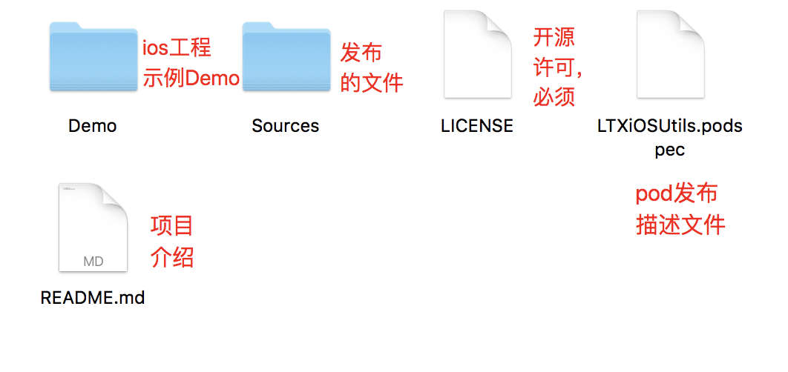

## 准备自己的 Pod 库

布一个共享库一般包含三部分

- **库源码及资源文件** 你想要发布出去的相关资源文件
- **LICENSE 文件** 默认一般选择 MIT
- **podspec 文件** 本库的各项信息描述, 需要提交给 CocoaPods, pod 通过这个文件查找到你共享的库

目录如下


生成这样的目录结构可以利用 CocoaPods 的命令自动生成

```
- **pod lib create XXX**
  创建 pod 库的基本结构，在创建过程中会给出选项让你做选择，包括是否需要 Example 工程等等

- **pod spec create XXX**
  创建库的描述文件，XXX 为依赖库的名字，使用这种方式创建不要添加.podspec 扩展名，这种方式只会创建描述文件
```

**podspec 文件格式**

全部配置请见 [官方文档](https://guides.cocoapods.org/syntax/podspec.html#specification)

```Ruby
Pod::Spec.new do |s|
  s.name         = "LTXiOSUtils"        #名称
  s.version      = "0.0.1"              #版本号
  s.summary      = "Just testing"       #简短介绍
  s.homepage     = "http://aoto.io/"     #主页地址，可以是github主页
  # s.screenshots  = "www.example.com/screenshots_1.gif" //快照
  s.license      = { :type => "MIT", :file => "LICENSE" } #开源协议
  s.author       = { "linyi31" => "linyi@jd.com" }
  s.source       = { :git => "https://github.com/Coder-Star/LTXiOSUtils.git", :tag => s.version } #共享库源代码地址
  # s.source     = { :git => 'local', :tag => s.version} #当在开发阶段，使用本地代码时，可以使用这种写法，实际上参数不重要，只有给予s.source 参数就行，后面的是为了避免警告
  s.platform     = :ios, "9.0" # 支持的平台及最低版本
  # s.ios.deployment_target = '7.0' # 或者这种写法，这种写法可以设置多平台
  s.requires_arc  = true # arc和mrc选项，true一定不要加单引号
  s.swift_version = "4.2"  #设置swift版本
  s.static_framework  =  true # 设置库为静态库，mach-o type会是static，设置之后即使项目的 Podfile 中使用了 use_frameworks! ，使用 该pod 也会以静态库使用

  s.source_files = "LTXiOSUtils/Classes/**/*.swift"   #OC可以使用类似这样"Source/Classes/**/*.{h,m}",**/*是一个正则，表示下面所有swift文件，这个路径是相对于podspec文件而言
  # s.exclude_files = "LTXiOSUtils/Classes/Exclude" #忽略提交的文件


  s.dependency "Alamofire", "~> 4.7"    #依赖关系，该项目所依赖的其他库，如果有多个可以写多个 s.dependency
  s.dependency 'SwiftyJSON', '~> 4.0'


  # resources及resource_bundle都是设置资源的方式

  s.resources     = 'LTXiOSUtils/Resource/*.png'  #资源文件路径
  # cocoapods 官方推荐使用 resource_bundles，因为 resources  指定的资源会被直接拷贝到目标应用中，因此不会被 Xcode 优化，在编译生成 product 时，与目标应用的图片资源以及其他同样使用 resources 的 Pod 的图片一起打包为一个 Assets.car 文件。这样全部混杂在一起，就使得资源文件容易产生命名冲突。而 resource_bundles 指定的资源，会被编译到独立的 bundle 中，bundle 名就是你的 pod 名，这样就很大程度上减小了资源名冲突问题，并且 Xcode 会对 bundle 进行优化。一个 bundle 包含一个 Assets.car，获取图片的时候要严格指定 bundle 的位置，很好的隔离了各个库或者一个库下的资源文件。
  resources.resource_bundle = { "LTXiOSUtils" => "LTXiOSUtils/Resources/Resource/*" } # LTXiOSUtil是bundle的名称。

  s.vendored_libraries = 'YJDemoSDK/Classes/libWeChatSDK.a' # 表示依赖第三方/自己的 .a / 静态库，依赖的第三方的或者自己的静态库文件必须以lib为前缀进行命名，否则会出现找不到的情况，这一点非常重要
  s.public_header_files = 'YJDemoSDK/Classes/YJDemoSDK.h'   #需要对外开放的头文件，如果在swift工程中，这个头文件会被放置到umbrella-header中
  s.module_map = 'source/module.modulemap' # 自定义modulemap

  s.private_header_files = 'xxxx.h' #私有h文件，该文件放置库中使用的第三方的头文件

  s.vendored_frameworks = "frameworks/Test.framework" # 第三方framework目录，当库不想公布源码时可以使用这种方式
  s.frameworks = "UIKit","Foundation" #需要引入的系统frameworks
  s.libraries  = 'z', 'sqlite3' #表示依赖的系统类库，比如libz.dylib等

# 模块化，假如项目中有OC代码，需要模块化，就需要进行开启，并且配合public_header_files使用
#  s.pod_target_xcconfig = {
#    'DEFINES_MODULE' => 'YES'
#  }

  s.default_subspec = "Utils"

  #文件分层，如果Classes下面只有子目录，没有文件，则上述的s.source_files可以不用写
  s.subspec 'Utils' do |ss1|
      ss1.source_files = 'LTXiOSUtils/Classes/Utils/*.swift'
  end

  s.subspec 'View' do |ss2|
      ss2.dependency 'LTXiOSUtils/Utils'
      ss2.source_files = 'LTXiOSUtils/Classes/View/*.swift'
      ss2.subspec 'Button' do |sss1|
        sss1.source_files = 'LTXiOSUtils/Classes/View/Button/*.swift'
      end
      ss2.subspec 'TextView' do |sss2|
        sss2.source_files = 'LTXiOSUtils/Classes/View/TextView/*.swift'
      end
  end

end
```

**小 Tips**

- 代码开发过程中，需要注意将暴露出的方法以及类的访问显示符调整为 open 或者是 public，使代码可以被外部正常访问到
- 本地库调试时，Demo 工程 Podfile 文件引用本地库的方式使用`pod 'LTXiOSUtils',:path => '../'`这种形式，如果调试过程中出现修改不生效的问题，请及时 clean。

## 发布 Pod 库

### 正式发布前准备

podspec 文件关联的源代码地址是以 tag 为准，所以发布 pod 库之前还要保证远程仓库中已经存在本地发布依赖的 tag，tag 设置相关命令如下：

```git
git tag -m '描述' '1.0.0'

// 推送所有tag，也可以使用  git push origin '1.0.0' 推送指定tag到远程
git push --tags
```

库发布之前需要使用命令验证库的格式及代码是否有问题，命令如下：

```
// 验证 本地podspec，验证过程中可能会出现警告造成验证不成功（The spec did not pass validation）,可以使用pod lib lint --allow-warnings忽略警告完成验证
// 也可以添加 `--skip-import-validation` 忽略导入验证
pod lib lint

// 验证本地podspec及远程podspec文件
pod spec lint
```

在发布 Pod 之前需要先进行注册 CocoaPods 账号，注册命令如下：

```
// pod 注册,包括邮箱以及用户名，会让邮箱发送一个链接，点击链接完成注册
pod trunk register xxxx@qq.com 'name'
```

### 发布

发布 Pod 库有两种方式，一种方式是发布到 CocoaPods 的中心仓库，这样是开源出去的，另外一种是发布到私有索引库，用于不开源，公司内部使用。

#### 公有索引库

```
// 发布到公有库
pod trunk push XXX.podspec

// 删除pod库的的某一个版本
pod trunk delete XXX 版本号

// 放弃整个 pod 库(会弹出确认框提示确认)
pod trunk deprecate XXX
```

#### 私有索引库

```
// 添加私有索引库地址到本地 repo，地址可以是 gitee、gitlab、github 等 git 地址
pod repo add 私有库名称 私有库地址

// 删除某一个私有 Spec Repo
pod repo remove xxxx

// 将描述文件上传到私有索引库，这时私有索引库中就会多出提交的podspec文件
// 其实就是将库发布到私有源
pod repo push 私有索引库名称 xxxx.podspec
```

外部使用私有索引库里面的 pod 库时需要在 Podfile 文件中加上私有源，最好放在其他源的前面

```
source 'https://github.com/Coder-Star/LTXSpecs.git'
```

将共享库上传到仓库地址后，一般使用`pod setup`以及`pod search` 查看自己的库，如果遇到上传很长时间还是无法查询到自己库的时候，可以先将`pod setup`成功后生成的~/Library/Caches/CocoaPods/search_index（`rm ~/Library/Caches/CocoaPods/search_index.json`），json 文件删除后再进行`pod search`。

如果还不成功，还可以使用`pod search xxx --simple`进行搜索。

## 其他

```
// 查看自己的 pod 相关信息，包括发布过的库
pod trunk me

```
