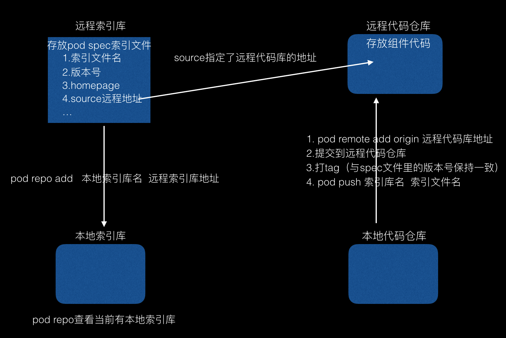
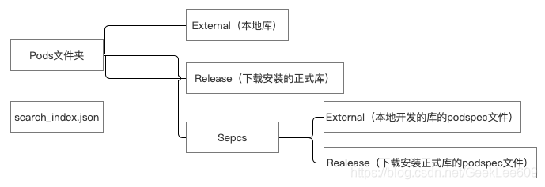

**CocoaPods 系列博客**

* [CocoaPods-总览](../CocoaPods-总览)
* [CocoaPods-项目使用](../CocoaPods-项目使用)
* [CocoaPods-封装自己的 Pod 库](../CocoaPods-封装自己的Pod库)

## 基本概念

CocoaPods 是一个 ruby 工具，Mac 下优秀的第三方包管理工具, 帮助管理和集成, 自动更新网络上的第三方类库. 方便了配置。CocoaPods 默认只能管理基于 git 管理的代码，如果要使用 svn 或者 mercurial 管理代码，则需要安装一些插件 (cocoapods-repo-svn). 我们通过 git 上的插件把私有代码通过 svn 下载到本地的私有仓库. 这样委托 pod 来管理.

远程索引库，本地索引库，远程代码库、本地代码库相关概念如下：


远程索引库地址为`https://github.com/CocoaPods/Specs.git`

本地索引库存储位置 `~/.cocoapods`，缓存存储位置：`~/Library/Caches/CocoaPods`

缓存存储目录结构如下：


**搜索并安装 Cocoapods 上的某一个库，大致执行流程为：**

- 从 search_index.json 中找到该库对应版本的 podspec 文件并将其下载到 Specs/Release 文件夹中
- 根据该库的 podspec 文件中的 source 中的 git 地址，将对应版本的库下载到 Pods/Release 文件夹中

**将本地自己开发的库推送到 Cocoapods 仓库时，大致执行流程为：**

- 执行 pod spec lint XXX.podspec 时，如果没有依赖其他库时，会在 Specs/External 文件中该库生成对应版本的 podsepc 文件，并对其文件名进行 hash
- 将该 podspec 文件中对应的库下载到 Pods/External 文件夹中
- 如果发布的库依赖其他 Cocoapods 上发布的库时，会将依赖库的 podspec 文件下载到 Specs/Release 文件夹中，依赖的库下载到 Pods/Release 文件夹中

Cocoapods 1.7.2 就可以使用 CDN 的方式下载索引库，需要在 Podfile 文件里加上`source 'https://cdn.cocoapods.org/'`，而到 Cocoapods 1.8.0 时，直接将 CDN 作为默认仓库来源。使用 CDN 分发，直接找到第三方库的 spec 地址，直接下载，不需要全量下载远程索引库到本地。

## 原理

当所有的依赖库都下载完后，Cocoapods 会将所有的依赖库都放到另一个名为 Pods 的项目中，然后让主项目依赖 Pods 项目。这样，源码管理工作都从主目录移到了 Pods 项目中。

动态库形式，工程变动如下：

- 在 General -> Linked Frameworks and Libraries 中添加了 Pods_test.framework 的依赖
- Build Settings -> Other Linker Flags 中添加了 -framework "AFNetworking"
- Build Settings -> RunPath Search Paths 中添加了 @executable_path/Frameworks
- Build Settings -> Other C Flags 添加 -iquote "$CONFIGURATION_BUILD_DIR/AFNetworking.framework/Headers" 和 Other C++ Flags 添加 $(OTHER_CFLAGS)，也就是说，跟随 Other C Flags 配置
- Build Settings -> Preprocessor Macros 添加 COCOAPODS=1
- Build Settings -> User-Defined -> MTL_ENABLE_DEBUG_INFO PODS_FRAMEWORK_BUILD_PATH PODS_ROOT 三个变量
- Build Phases -> Embed Pods Frameworks 添加 "${SRCROOT}/Pods/Target Support Files/Pods-test/Pods-test-frameworks.sh" // 静态库不会生成该文件
- Build Phases -> Copy Pods Resources 添加 "${SRCROOT}/Pods/Target Support Files/Pods-test/Pods-test-resources.sh" // 如果三方库中没有资源文件，则不会生成该文件

两个 sh 文件实际上就是将封装通用架构动态库文件和将动态库复制到 bundle 指定目录下。

如果是静态库方式引入，Pods 项目最终会编译成为一个名为 libPods- 项目名称.a 的文件，主项目只要依赖这个.a 文件即可；

如果是以动态库形式引入三方库，项目会依赖一个名为 Pods\_项目名称.framework 的文件，该文件是一个静态库，只是起到一个集合的作用，实际的二进制代码还是放置在各个动态库之中。

## 安装及使用

CocoaPods 是用 ruby 语言写的，可以使用 ruby 语言的包管理器 gem 进行安装，如果没有 gem 环境，还需先安装 gem 环境。

```shell
sudo gem install cocoapods
```

1. 进入到项目根目录，执行`pod init`命令，该命令会生成 Podfile 文件，开发者就可以编辑该文件内容了
2. 编辑 Podfile 文件后执行`pod install`命令，命令执行完成后，会生成 ProjectName.xcworkspace、Podfile.lock、Pods 等文件。
3. 不再通过 ProjectName.xcodeproj 打开工程，而是使用 ProjectName.xcworkspace

## pod 命令集锦

```shell
// 查看本地索引库列表
pod repo

// 搜索pod库
pod search XXX

// 查询Podfile依赖的三方库是否有更新
pod outdated

// 安装跳过更新podspec索引，如果指定版本了，会安装指定版本，如果没有指定版本，则不会更新；pod install --verbose --no-repo-update 查看详细更新信息
pod install --no-repo-update

// 更新跳过更新podspec索引，不指定版本，会将版本更新到最新版； pod update --verbose --no-repo-update 查看更新过程中的详细信息
pod update --no-repo-update

// 生成本地spec仓库，本质就是将远程索引库下载到本地，该过程很慢，所以耐心等待
pod setup

// 如果你的pod是多人维护的，可以使用该命令添加协作者
pod trunk add-owner 名称

// 清理pod缓存，实际会清除Pods文件夹
pod cache clean --all #清理

// 移除项目的pod依赖，不再使用pod管理
pod deintegrate

```

pod 命令选项

```shell
// 跳过更新podspec索引
--no-repo-update

// pod命令执行过程中详细信息
--verbose

// 忽略pod命令执行过程中提示的警告信息
--allow-warnings
```

## 工具链

ruby：`brew install rbenv`
rvm/rbenv：使用这个安装指定 ruby 版本。`rbenv install 2.7.0`
gem：ruby 环境下的包
Bundler：gem 包管理器，`bundle init`生成一个`Gemfile`文件，描述 gem 及其版本，`Cocoapods`就是其下一个普通的 gem。写完之后使用`bundle install`
Cocoapods：不再使用`pod install`，而是使用`bundle exec pod install`

推荐阅读冬瓜写的[Cocoapods历险记](https://mp.weixin.qq.com/mp/appmsgalbum?action=getalbum&album_id=1477103239887142918&__biz=MzA5MTM1NTc2Ng==#wechat_redirect)
