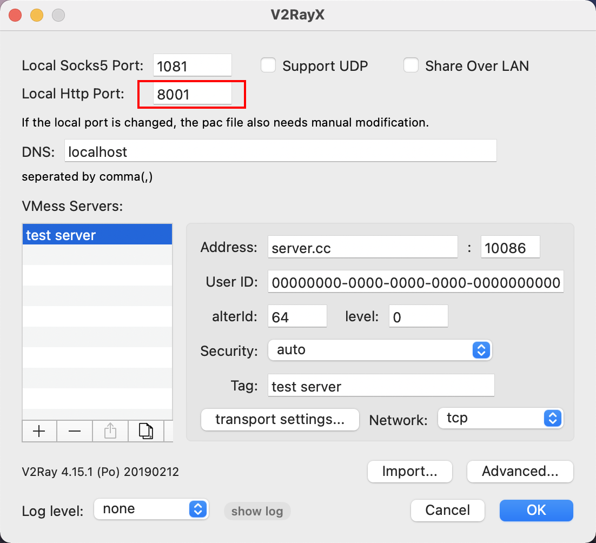
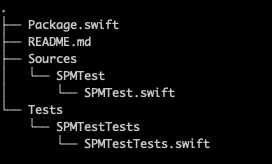

## 前言

Hi Coder，我是 CoderStar！

## SPM 太卡顿

首先你得有一个翻墙工具，我用的是`V2RayX`，端口为`8001`。



我们使用下列命令将终端代理指向翻墙工具。

`export https_proxy=http://127.0.0.1:8001 http_proxy=http://127.0.0.1:8001  all_proxy=socks5://127.0.0.1:8001`

然后使用下列命令使 SPM 下载时走终端的 git，这时就会开始 reslove。
`xcodebuild -resolvePackageDependencies -scmProvider system`
> 执行过程中可能会出现找不到对应版本的情况，这时候可以先用 Xcode 打开项目，再执行这些命令。

## 创建

我们可以先创建一个文件夹，然后进入文件夹后，执行`swift package init`命令，这时就会创建相应的 package，相关的名称也会自动以**目录名**为准。

目录结构如下:


接下来我们打开`Package.swift`，其会打开整个package，包含其他的文件，而不只是打开这个单文件

## 格式

我们需要使用一个`Package.swift`这个文件去描述一个 Swift Package。

每次修改之后，保存一下，Xcode就会自动去检查相关错误。

```swift
// swift-tools-version:5.5

// 上面这个描述并不是简单的注释，而是在编译过程中起到声明的作用，比较重要

/// 导入描述库，在描述过程中相关会有代码提示
/// 所以看这个源码也能最大程度了解相关的规则
import PackageDescription

let package = Package(
    name: "SPMTest",

    /// 支持的平台
    platforms: [
        .macOS(.v10_12),
        .iOS(.v10),
    ],

    /// 供外界使用的包装
    products: [
        .library(
            name: "SPMTest",
            /// type包含 static（默认）、dynamic、executable（编译测试用二进制和 macOS 命令行工具）
            type: .static,
            targets: [
                "SPMTestSubOne",
                "SPMTestSubTwo"
            ]
        ),
        .library(
            name: "SPMTestSubOne",
            targets: ["SPMTestSubOne"]
        ),
        .library(
            name: "SPMTestSubTwo",
            targets: ["SPMTestSubTwo"]
        ),
    ],

    /// 依赖库
    dependencies: [
        /// 远程，这里还有很多方式去设置依赖，可以根据提示自己研究
        .package(name: "Alamofire", url: "https://github.com/Alamofire/Alamofire.git", .exact("5.4.3")),
        /// 本地
        .package(name: "SPMTestLocal", path: "../SPMTestLocal"),

    ],

    /// 原料库
    targets: [
        /// Target总参数包括 name、dependencies、path、exclude、sources、publicHeadersPath
        /// publicHeadersPath一般不需要自定义，默认是在 include文件夹下
        .target(
            name: "SPMTestSubOne",
            dependencies: [
                "Alamofire",
                "SPMTestLocal"
            ],
            path: "Sources/SPMTest/SubOne"
        ),
        .target(
            name: "SPMTestSubTwo",
            path: "Sources/SPMTest/SubTwo",
            /// 资源有两种形式，copy、process
            /// copy：直接拷贝，保存目录结构,可直接copy文件夹
            /// process：推荐方式，它所配置的文件会根据具体使用的平台和内置规则进行适当的优化；Swift Package 会为每一个 Package 生成一个 module 扩展，以便直接调用，使用该形式会在 Bundle 类内生成 .module 属性专门用于获取 Particles 文件夹内的资源。
            resources: [.copy("CopyResources"), .process("ProcessResources")]
        ),

        .testTarget(
            name: "SPMTestTests",
            dependencies: ["SPMTestSubOne"]
        ),
    ]
)

```

## 其他

目前一个 package 可以支持 OC、Swift

## 工具链

根据 `package.swift` 文件打包成xcframework
- [swift-create-xcframework](https://github.com/unsignedapps/swift-create-xcframework)

## 最后

要更加努力呀！

Let's be CoderStar!
