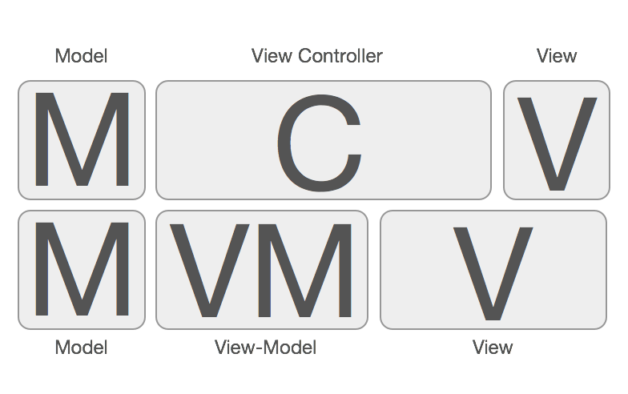

## 一、相关规范

1、ViewController 结构
viewDidload 里面只做 addSubview 的事情；然后在 viewWillAppear 里面做布局的事情；最后在 viewDidAppear 里面做 Notification 的监听之类的事情；
顺序：

- life cycle
- Delegate 方法实现
- event response (按钮以及手势的事件响应)
- 一些私有方法

## 二、架构设计

### 1、MVVM

