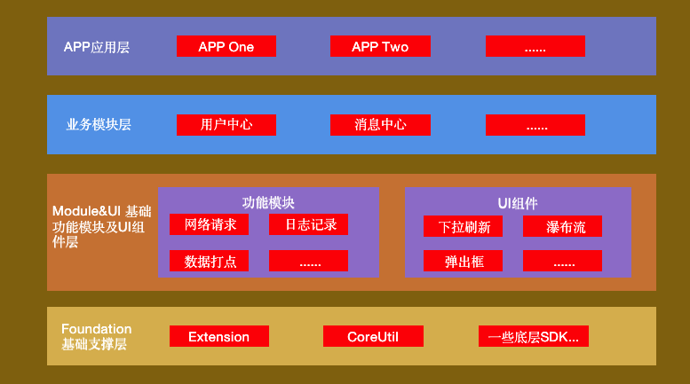

### 前言

APP 组件化的过程我觉得主要分为下面几个部分。

- **APP 架构设计**  
   我们在将 APP 进行组件化搭建之前，我们首先得有一个整体的架构设计，哪些功能下沉，哪些功能归为一块，功能的颗粒度怎么设计，这都是我们需要考虑的问题。当然，架构肯定需要根据我们的业务来设计，脱离业务需求的架构肯定不是好架构。
- **APP 组件之间的通信**  
   将 APP 拆分成组件之后，我们就要考虑组件之间的通信问题。其实组件之间的通信问题说到底就是 APP 中的路由方案设计问题。

### 架构设计



[抖音 iOS 工程架构演进](https://mp.weixin.qq.com/s/HHH5_IEbsR8iSmXSIdeutw)

#### 基础支撑层

#### 基础模块及 UI 组件层

#### 业务模块层

#### APP 应用层

如果项目业务不涉及到系列 APP，这一层可以忽略；

### 组件拆分

#### 自定义pod
#### pod二进制化
[cocoapods-imy-bin](https://github.com/MeetYouDevs/cocoapods-imy-bin)

- 二进制污染
- 源码/二进制化切换
- 二进制CI
- modular化
  


### 组件间通信(路由方案)

目前存在的组件间路由方案大概有四种，分别是

- URL/Protocol 方案
- Target-Action 方案
- protocol 与 class 映射方案
- 基于通知的方案

#### URL/Protocol 方案

URL/Protocol 方案

#### 相关库

**OC 库**

- [JLRoutes](https://github.com/joeldev/JLRoutes)：现在 github 上 star 数最高的是 JLRoutes，但是其用不到的功能比较多，而且基于遍历查找 URL 效率比较低下；
- [HHRouter](https://github.com/lightory/HHRouter)：布丁动画的方案，对 URL 的查找方式不再使用遍历，还是使用匹配的方式，效率较高，但是 HHRouter 耦合程序比较高，过度依赖 ViewController;
- [MGJRouter](https://github.com/meili/MGJRouter)：蘑菇街的设计方案，根据 HHRouter 方案进行改写，MGJRouter 的功能比较简单，但是查找 URL 的效率比较高，也解决了 HHRouter 过度依赖 ViewController 的问题；
- [LDBusMediator](https://github.com/Lede-Inc/LDBusMediator)：网易的设计方案，其逻辑跟 MGJRouter 类似，区别在于 MGJRouter 使用的是先注册的方式，而 LDBusMediator 使用的是后查询的方式。
- [routable-ios](https://github.com/clayallsopp/routable-ios)：in-app 的方案；

**swift 库**

- [URLNavigator](https://github.com/devxoul/URLNavigator)

#### MGJRouter 及 ModuleManager

MGJRouter 本身是一个单例模式，其实是在路由中心中维护了一张路由表（字典），其中 url 为 key，value 为 Block；注册时，将 key 以及 value 保存到路由表中，使用时，根据 Url 拿到对应的 Block 进行执行。

**优点**

- 项目简洁，就两个文件；
- 可以协调本地调用、远程推送调用，甚至可以达到同一个 url 管理三端的效果；（iOS，Android）

**缺点**

- 传值比较麻烦；传值一般有两种方式，一种是直接在 url 上拼接，一种是通过提供的字典进行传值，对于普通的数据类型还可以接受，但是想要传递类似 UIImage 以及 Data 这种对象就比较难了。
- 参数传递以及接收解析时存在 hardcode 的问题；

为了解决 MGJRouter 本身的传值麻烦问题以及部分不适合用 URL 传值的方式，就可以通过注册 protocol 的方式来实现。核心代码如下。

```swift
ModuleManager.register(className: AnyObject, forProtocol: Protocol)
```

**记录在使用 MGJRouter 过程中遇到的问题**

- 如果 url 中含有中文，想要使用 canOpenURL 这个方法，需要对 url 进行编码，否则会引起代码 Crash，因为其函数实现未对 url 进行编码；这一点已经在 MGJRouter 提交了 pr，不过根据上次 pr 还没有处理的情况来看，这个库很有可能不再进行维护了；网上也有很多这个库的 swift 翻译版本；

#### Target-Action 方案

**[CTMediator](https://github.com/casatwy/CTMediator)**

CTMediator 是 casatwy 提出的 Target-Action（如果不知道什么意思的自行 google）方案的实现。其与 url 方法相比最大的特点就在于不需要去维护路由表以及路由方案存在的 hard code 问题；

大致思想如下：（假定 B 模块需要与 A 模块通信）

A 模块在开发完成之后需要对外提供基于 Target-Action 的调用方式，根据框架源码的阅读，需要给我们提供的类以及方法加上指定前缀，其中，类名前面需要加上 Target*，方法名前面需要加上 Action*。这部分代码我们可以封装成一个单独的 pod（起名为 A)。理论上我们做完这部分工作后就可以通过 CTMediator 调用模块，但是调用模块时需要进行一定的硬编码，如类名、方法名以及方法参数等等，这样在程序编译时进行检查；于是我们可以进行下一步操作；

```swift
// Target对象必须要继承自NSObject，因为框架中生成的类实例是以NSObject接收的
// Action方法必须带@objc前缀
class Target_A: NSObject {
    // 方法参数只允许有一个，并且类型为NSDictionary，Action方法第一个参数不能有Argument Label
    @objc func Action_Extension_ViewController(_ params: NSDictionary) -> UIViewController {
        if let callback = params["callback"] as? (String) -> Void {
            callback("success")
        }

        let aViewController = ViewController()
        return aViewController
    }
}
```

我们可以通过给 CTMediator 类（单例）提供扩展的方式，将硬编码的部分写入这部分中，这样外部调用时就可以知道我们需要什么参数了，这部分工作也是由编码 A 模块的人提供；可以也将该部分单独作为一个 pod（起名 A_Extension），这里解释下这部分代码不与之前 A 模块的业务代码放入一个 pod 的好处：

- A 模块业务代码不需要集成 CTMediator；
- 团队合作的时候 A 模块的开发方早期不用提供 A 模块代码，先只提供 A_Extension 这个 pod 包即可，类似先定义接口，后期进行实现；

```swift
public extension CTMediator {
    @objc func A_showSwift(callback:@escaping (String) -> Void) -> UIViewController? {
        let params = [
            "callback":callback,
            kCTMediatorParamsKeySwiftTargetModuleName:"A_swift"
            ] as [AnyHashable : Any]
        if let viewController = self.performTarget("A", action: "Extension_ViewController", params: params, shouldCacheTarget: false) as? UIViewController {
            return viewController
        }
        return nil
    }
}
```

#### 完整的组件解耦以及通信方案

**[BeeHive](https://github.com/alibaba/BeeHive)**

BeeHive 是阿里开源的一个 APP 模块化编程框架的实现方案，其吸收了 Spring 框架 Service 的理念来实现模块间的 API 解构，路由方面，本质上与蘑菇街后来推出的 Protocol 方案类似，也加入了 url Router 的方式，不过 readme.md 没有对这种方式进行体现，但是在源码中可以看出；其中这种 Protocol 方法在思想上跟 spring 的 service 注入类似；

**这种方式决定了业务模块需要引入公共的协议；**

在这个框架中，使用了注解方式进行注册的设计很有意思；

**提供的主要功能**

- 模块解耦：通过提前注册（注册方式多种），解决不同模块监听声明周期的问题；
- 模块间调用解耦：通过提前注册的方式（注册方式多种），将协议与协议的实现类绑定起来，解决模块间的耦合问题，提供更加清晰的调用方案。
- 其他开发支持功能

### 四、总结

### 相关资料整理

- [蘑菇街 App 的组件化之路](https://www.tuicool.com/articles/vyeUf2J)
- [蘑菇街 App 的组件化之路·续](https://www.tuicool.com/articles/QneYvmi)
- [iOS 应用架构谈组件化方案](https://casatwy.com/iOS-Modulization.html)
- [iOS 组件化方案探索](http://blog.cnbang.net/tech/3080/)
- [BeeHive，一次 iOS 模块化解耦实践](https://mp.weixin.qq.com/s?__biz=MzUxMzcxMzE5Ng==&mid=2247488305&idx=1&sn=0f0a2e4d5febe3024adf0578f092b020&source=41#wechat_redirect)
- [BeeHive 框架全面解析——iOS 开发主流方案比较](https://xiaozhuanlan.com/topic/4052613897)
- [BeeHive —— 一个优雅但还在完善中的解耦框架](https://www.jianshu.com/p/24f6299ebe82)
