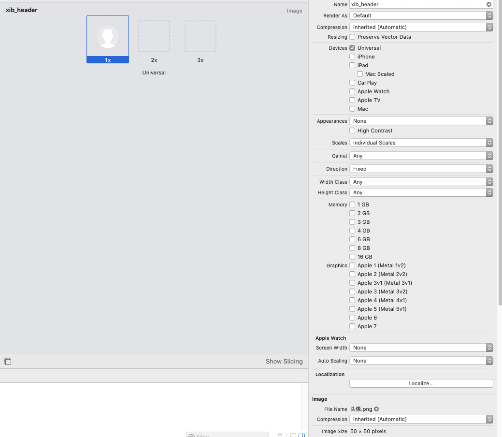

除了图片资源外，Asset Catalogs 也可以存储文本、Data 甚至 AR、apple TV 相关的资源，非常全能。

先放置一个 Assets.xcassets 中图片的操作选项

## Render As (渲染模式)

包含三个选项，分别为

- Default  
  默认值，基于上下文决定具体的渲染模式. 如果是在 navigation bars, tab bars, toolbars, 和 segmented controls 中则为 Template, 其余上下文则为 Original
- Original Image  
  按照原图渲染
- Template Image  
  模板渲染，系统会忽略图像的颜色信息，并根据图像中的 alpha 值创建图像模板，图像中 alpha 值 < 1.0 的部分被视为完全透明，alpha 值 = 1.0 的部分为 Image Tint 的颜色，默认 Default 为蓝色。

## 放置矢量图

将 Scales 设置为 Single Scale

苹果在 Xcode6 中便允许我们在项目中利用 Assets.xcassets 使用矢量图来代替传统的位图，但是实际上 Xcode 在编译时候会根据根据矢量图来自动生成对应的@1x、@2x 和@3x 格式的位图。这种方式并不能减小包的体积；

勾选 Preserve Vector Data 选项时，会在编译期间将矢量图文件拷贝到二进制文件中，以便我们可以在运行时任意缩放图片而不会失真
