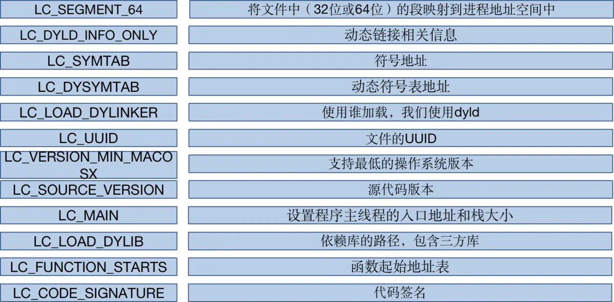

## 前言

Hi Coder，我是 CoderStar！

## 类型

Mach-O（Mach object） 其实是 Mach Object 文件格式的缩写，是 macOS 以及 iOS 上可执行文件的格式，类似于 Windows 上的 PE 格式（Portable Executable），Linux 上的 ELF 格式（Executable and Linking Format）。

常见的 Mach-O 包括以下几种：

* MH_OBJECT 目标文件
  * .o：**可重定向的目标文件**
  * .a/ .framework 静态库 （静态库即多个.o 文件存放在一起实现特定的功能）
* MH_EXECUTE 可执行文件
  * .app/MyApp
  * .out
* MH_DYLIB 动态库
  * .framework/xxx
  * /dylib
* MH_DYLINKER 动态链接器
  * usr/lib/dyld
* MH_DSYM 存储二进制文件符号信息的文件
  * .dYSM/Contents/Resources/DWARF/MyApp

### Framework 组成

- Mach-O
  - 1.O
  - 2.O
  - ...
  - XXX_Vers.O：版本文件
  - __.SYMDEF：符号信息
- Modules/
  - module.modulemap
  - XXX.swiftmodule
- Headers/
- Info.plist

## 组成

Mach-O 文件由三部分组成：

* Header
* Load Commands
* 各种 Segment


大小端

大端：高字节存放在低地址，符合书写顺序；
小端：高字节存放在地址

大小端一般由 CPU 架构决定。arm64 架构默认是小端，但是支持大端。
小端模式 ：强制转换数据不需要调整字节内容，1、2、4 字节的存储方式一样。
大端模式 ：符号位的判定固定为第一个字节，容易判断正负。

主机基本上使用的都是小端模式，但是在网络传输的时候使用的却是大端模式。java 虚拟机里面的字节序是大端

### Header

`otool -h XXX`

[](https://opensource.apple.com/source/xnu/xnu-792/EXTERNAL_HEADERS/mach-o/loader.h.auto.html)

```objective-c
struct mach_header_64 {
	uint32_t	magic;		/* mach magic number identifier */  4个字节
	cpu_type_t	cputype;	/* cpu specifier */ 4个字节
	cpu_subtype_t	cpusubtype;	/* machine specifier */
	uint32_t	filetype;	/* type of file */
	uint32_t	ncmds;		/* number of load commands */
	uint32_t	sizeofcmds;	/* the size of all the load commands */
	uint32_t	flags;		/* flags */
	uint32_t	reserved;	/* reserved */  64位相比于32位多出的字段
};
```

#### magic

区分 36 位还是 64 位

- 0xfeedfacf MH_MAGIC_64
- 0xfeedface MH_MAGIC
- 0xbebafeca FAT_CIGAM

#### cputype

CPU 类型，比如 ARM

#### cpusubtype

CPU 的具体类型，arm64、armv7

#### filetype

文件类型，例如：可执行文件

#### ncmds

LoadCommands 的条数

#### sizeofcmds

LoadCommands 的大小

#### flags

标志位，标识二进制文件支持的功能。主要是和系统加载、链接有关

#### reserved

占位符

### Load Commands

Load Commands 存储 Mach-O 的布局信息，比如 Segment command 和 Data 中的 Segment/Section 是一一对应的。除了布局信息之外，还包含了依赖的动态库等启动 App 需要的信息。

* VM Address：虚拟内存地址
* VM Size：虚拟内存大小
* File Offset：数据在文件中偏移量
* File Size：数据在文件中的大小



### Data(各种 `Segment`)

每个 Segment 又被划分成很多个 Section，分别存放不同类型的数据。

标准的三个 Segment 是 `TEXT`，`DATA`，`LINKEDIT`，也支持自定义：

#### `__TEXT段`

代码段，只读可执行。

##### `__text`

二进制代码

##### `__cstring`

常量字符串

##### `__stubs`

##### `__stub_helper`

#### `__DATA`

数据段，读写。包含`__got`、`__nl_symbol_ptr`、`__la_symbol_ptr`等 section。

##### __objc_const

OC 类信息、方法列表、属性列表、变量列表

###### Objc2 Method List

方法列表

###### Objc2 Class Info

###### Objc2 Caterory

存放分类方法列表相关信息，

##### __objc_catlist

存储分类方法列表地址，实际会指向 Objc2 Caterory

##### __objc_nlcatlist

当分类中有 `+load` 方法，全部分类方法列表不仅会在`__objc_catlist`存下，还会在`__objc_nlcatlist`存下。

该位置主要目的是让 App 启动时可以方便调用 `+load` 方法。

#### `__LINKEDIT`

启动 App 需要的信息，如 bind & rebase 的地址，其中包含需要被动态链接器使用的信息，包括符号表、字符串表、重定位项表、签名等。

* Dynamic Loader Info
* Function Starts
* Symbol Table
* Data in Code Entries
* Dynamic Symbol Table
* String Table

## 符号

编译与链接：
当我们写的代码进行编译的时候会生成一个个.o 文件，也就是 MachO 文件，这个过程就是将代码放到对应的配置中，将各种类型的符号进行归类存放。

而链接的本质就是把多个目标 (.o) 文件组合成一个可执行文件。把多个目标文件合并到一起，在合并的时候可以对其内部符号对外暴露的属性进行修改。静态链接器 (ld) 和动态链接器 (dyld) 在链接的过程中都会读取符号表，另外调试器也会用符号表来把符号映射到源文件。

## 最后

要更加努力呀！

Let's be CoderStar!

https://www.jianshu.com/p/9f961b71911c
