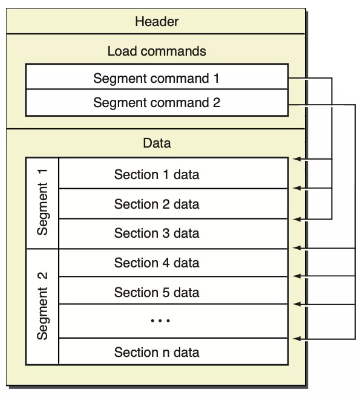

## 前言

Hi Coder，我是 CoderStar！

## 1

Mach-O 文件由三部分组成：

* Header
* Load Commands
* Data

Header 的最开始是 Magic Number，表示这是一个 Mach-O 文件，除此之外还包含一些 Flags，这些 flags 会影响 Mach-O 的解析。

Load Commands 存储 Mach-O 的布局信息，比如 Segment command 和 Data 中的 Segment/Section 是一一对应的。除了布局信息之外，还包含了依赖的动态库等启动 App 需要的信息。

Data 部分包含了实际的代码和数据，Data 被分割成很多个 Segment，每个 Segment 又被划分成很多个 Section，分别存放不同类型的数据。

标准的三个 Segment 是 TEXT，DATA，LINKEDIT，也支持自定义：

* TEXT，代码段，只读可执行，存储函数的二进制代码 (__text)，常量字符串 (__cstring)，Objective C 的类 / 方法名等信息
* DATA，数据段，读写，存储 Objective C 的字符串 (__cfstring)，以及运行时的元数据：class/protocol/method…
* LINKEDIT，启动 App 需要的信息，如 bind & rebase 的地址，代码签名，符号表…

## 符号

编译与链接：
当我们写的代码进行编译的时候会生成一个个.o 文件，也就是 MachO 文件，这个过程就是将代码放到对应的配置中，将各种类型的符号进行归类存放。

而链接的本质就是把多个目标 (.o) 文件组合成一个可执行文件。把多个目标文件合并到一起，在合并的时候可以对其内部符号对外暴露的属性进行修改。静态链接器 (ld) 和动态链接器 (dyld) 在链接的过程中都会读取符号表，另外调试器也会用符号表来把符号映射到源文件。

## 最后

要更加努力呀！

Let's be CoderStar!
