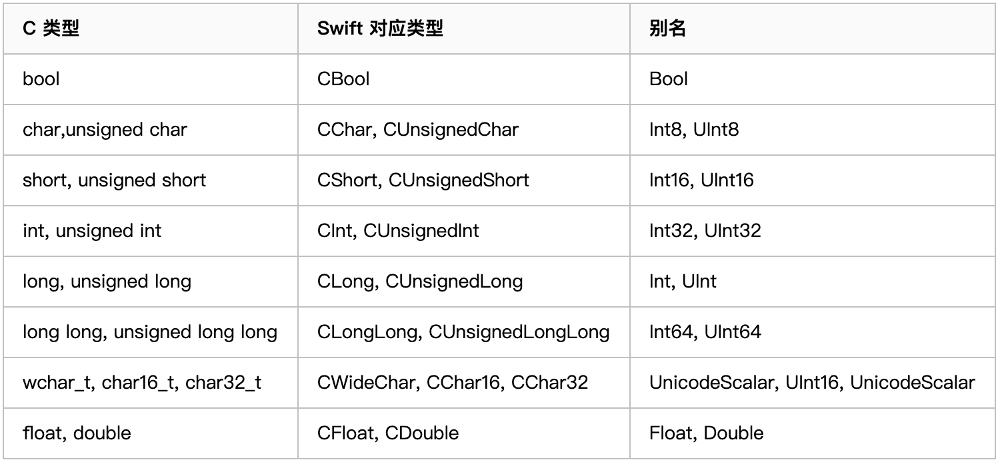

## 相互调用

### Swift反射

我们一般是通过`NSClassFromString`函数来对类进行反射，在Swift中因为命名空间的缘故在Macho中的类名实际上是混淆的，混淆规则具体函数见：[copySwiftV1MangledName函数](https://github.com/opensource-apple/objc4/blob/cd5e62a5597ea7a31dccef089317abb3a661c154/runtime/objc-runtime-new.mm#L859)，反混淆函数[copySwiftV1DemangledName](https://github.com/opensource-apple/objc4/blob/cd5e62a5597ea7a31dccef089317abb3a661c154/runtime/objc-runtime-new.mm#L813)可以通过桥接文件看下Swift类对应生成的类名，如果在类上加上@objc(className)，可以使生成的类名与className一致，也就是不会再有混淆了
但这样处理命名空间也就失去了意义，不同Module之间类名不能重复了。

### 主工程

在主工程中，我们可以利用桥接文件实现 OC、swift 代码的混编。

**Swift 调用 OC**
Swift 调用 OC 需要借助桥接文件，将 OC 的.h 文件在桥接文件中引入，然后 swift 就可以直接使用在.h 文件中定义的接口以及属性了；可以通过`Build Settings` 中的 `Objective-C Bridging Header` 设置桥接文件地址

**OC 调用 Swift**
OC 调用 swift 时，需要在调用的的 OC 文件中引入一个.h 头文件，其格式为 `#import "ProductModuleName-Swift.h"`。引入后需要重新编译一下。（实际编译会将工程的所有.swift 文件中涉及到的接口以及属性转化成 oc 代码全都整合到这个.h 文件中，进入该文件中就能明白了）。可以通过`Build Settings` 中的 `Objective-C Generated Interface Header Name` 自定义头文件名称。

- 当 class 是 NSObject 的子类时，这个类便可以在 "ProductModuleName-Swift.h"中 找到，默认携带 init 构造方法，也就是说类必须继承 NSObject；
- 当类中的非 private 以及非 fileprivate 方法以及变量被 @objc 修饰时，该变量或者方法便可以在 "Product Name-Swift.h"中 找到；
- 当在类上添加 @objcMembers 修饰时，该类中所有的 非 private 以及非 fileprivate 方法以及变量 都可以在 "Product Name-Swift.h"中 找到；
- 如果需要 OC 与 Swift 中类、方法以及属性的名字不一致，可以在 @objc(OCName) 这种形式为 OC 单独定义名称，比如当 swift 中的类为中文时；

- 在 swift 4 之前，如果类继承了 NSObject，编译器就会默认给这个类中的所有函数都标记为 @objc，支持 OC 调用。苹果在 Swift4 中，修改了自动添加 @objc 的逻辑：一个继承 NSObject 的 Swift 类不在默认给所有函数添加 @objc。只在实现 OC 接口和重写 OC 方法时，才自动给函数添加 @objc 标识。

### Framework 内部

在 Framework 中，不允许使用桥接文件，所以我们不能使用桥接文件的形式进行混编。

**Swift 调用 OC**

需要将 OC 头文件放置到 Umbrella Header 文件中去

## OC 针对 Swift 的更新

### NS_SWIFT 系列宏

#### NS_SWIFT_NAME(_name)

#### NS_SWIFT_ASYNC(COMPLETION_BLOCK_INDEX)

#### NS_SWIFT_NOTHROW

#### NS_SWIFT_UNAVAILABLE(_msg)

#### NS_SWIFT_UI_ACTOR

#### NS_SWIFT_ASYNC_NAME(NAME)

#### NS_SWIFT_ASYNC_NOTHROW

#### NS_SWIFT_DISABLE_ASYNC

#### NS_SWIFT_BRIDGED_TYPEDEF

保证 OC 在转成 Swift 对应 API 时被自动转换，比如将 OC 的 NSString 到 Swift，自动变成 String，这个宏在以下情况下会有作用，如

**使用`NS_SWIFT_BRIDGED_TYPEDEF`之前**

```Objective-C
typedef NSString * ObjcNSString;

@interface ObjC : NSObject
  + (void)doThingsWithString:(nullable ObjcNSString)mid;
@end
```

转换成 Swift 之后会变成

```swift
public typealias ObjcNSString = NSString
open class ObjC : NSObject {
  open class func doThings(with mid: String?)
}

let str: ObjcNSString? = nil
ObjC.doThings(with: str)
/// 会出现错误 Cannot convert value of type 'ObjcNSString?' (aka 'Optional<NSString>') to expected argument type 'String?'
```

**使用`NS_SWIFT_BRIDGED_TYPEDEF`之后**

```Objective-C
typedef NSString * ObjcNSString NS_SWIFT_BRIDGED_TYPEDEF;
@interface ObjC : NSObject
  + (void)doThingsWithString:(nullable ObjcNSString)mid;
@end
```

转换成 Swift 之后会变成

```swift
public typealias ObjcNSString = String

open class ObjC : NSObject {
  open class func doThings(with mid: ObjcNSString?)
}
```

#### NS_SWIFT_ASYNC_THROWS_ON_TRUE

#### NS_SWIFT_ASYNC_THROWS_ON_FALSE


## Swift调用其他语言

* Swift调用OC或者Swift调用C的方式都是通过桥接文件的形式（如果oc库添加了modulemap文件，则可以在swift中直接使用import的方式导入）。
* Swift调用C++是无法直接调用的，需要依赖于C或者OC语言中转一下

当依赖OC语言来中转调用C++，则OC的.m文件后缀需要改为.mm文件，显式告诉编译器文件内部会包含C++代码。并且需要注意是.mm文件中不允许引入Swift生成的"Product Name-Swift.h"文件，如果引入，该.h文件会报错。


**Swift-C 数据类型对应**



- [京东App Swift 混编及组件化落地](https://juejin.cn/post/6926720202457497613)
