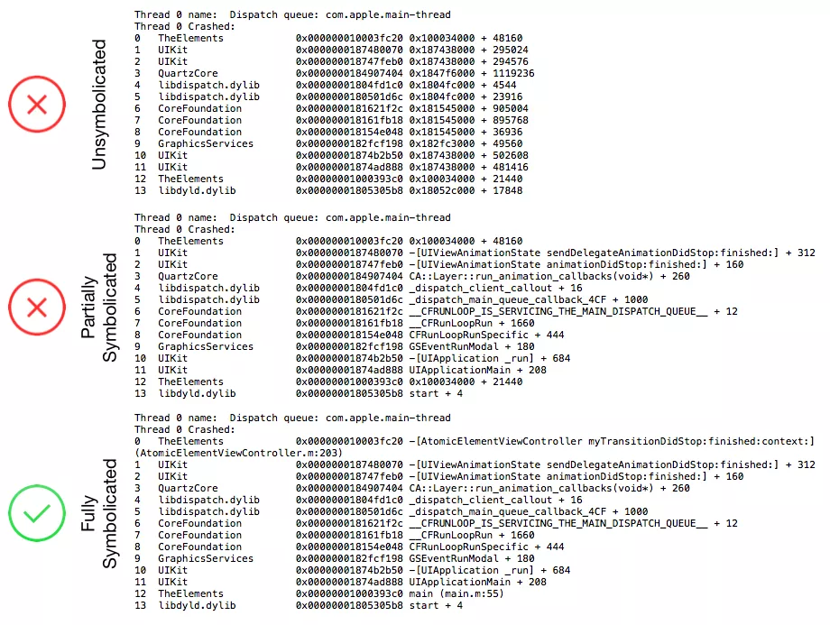
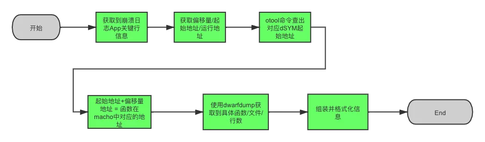
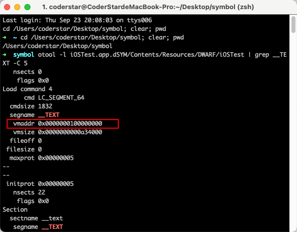
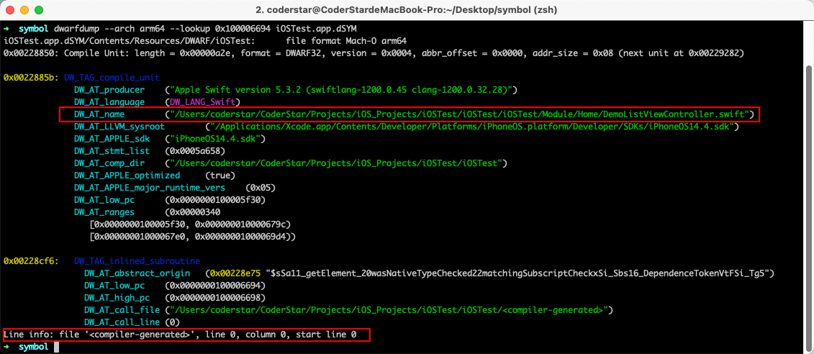
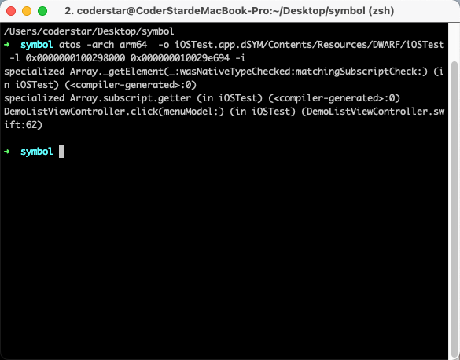
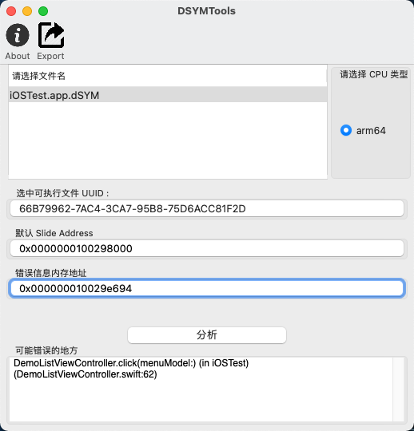
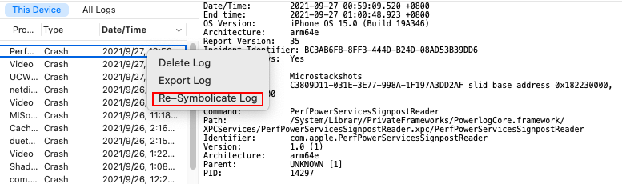

## 前言

Hi Coder，我是 CoderStar！

之前对于符号化的相关知识总是零零碎碎的，不成体系，刚好最近看到很多位同学发了一些关于 iOS 符号化的文章，整理这篇文章梳理一下 iOS 符号化的相关知识。我对符号化还处于初级阶段，文中很多知识来源于下面的参考资料，感谢各位同学的分享。

符号化从通俗意义上讲就是把一些机器语言可以转化成人类可读的符号，而在这里的环境下就是指 iOS 或者 Mac OS 下的一些异常信息（十六进制符号表示）通过某些手段转化成开发人员可读的高级代码片段，从而进一步定位异常的来源，迅速修复。

符号化程度一般会分为三种：

- 未符号化
- 部分符号化
- 完全符号化



符号化一般情况会需要下面三个部分

- 崩溃日志
- dSYM 文件
- 符号化工具

## 崩溃日志

崩溃日志的获取有多种来源，包括以下几种：

- 通过`设置-隐私-分析与改进-分析数据`导出，这个区域可以获取到整部手机的一些异常信息，是`Jetsam`机制产生的，格式为`.ips`，需要注意该位置不一定能拿到所有 APP 的异常日志（起码我测试时没拿到）；
- 测试机直接导出，`Xcode -> Window-Devices and simulators -> View Device Logs`(左侧工具栏选中你要导出的目的设备)，导出文件格式为`.crash`，其实这种方式读取到的日志文件来源还是来自上面第一条的；
- 通过`Xcode-Organizer-Crashes`获取崩溃日志，格式为`.xccrashpoint`，打开其包内容，其实内部还是文件格式为`.crash`的日志文件；
- 代码中捕获异常并进行存储上报，可借助三方工具或者自研，常见三方工具包括 Bugly、友盟等。

其实上述几种方式大致可以分为两种

- Crash Log：完整的崩溃日志文件；
- 异常信息：只上报关键的错误信息，包含堆栈等；

上面不管是哪种方式，对我们最重要的信息还是错误堆栈。对于我们需要在代码中去捕获异常这种情况，收集的实现思路会包括下列方式，常用的 Crash 收集框架会将下列方式进行组合使用。

- Mach 异常方式：`mach_port_allocate` -> `mach_port_insert_right` -> `task_set_exception_ports` -> 循环等待消息
- Unix 信号方式：`signal`
- 应用级异常 NSException：`NSSetUncaughtExceptionHandler`

> 其实 Unix 信号本身也是 Mach 异常传递到上层进行转换得到的。

其中`NSSetUncaughtExceptionHandler`值可以捕获到 OC 的异常，Swift 的异常是捕获不到的，一般情况下在捕获 NSException 异常后同时也会捕获到一个对应的 signal 异常，当然，这也是一般情况，特殊情况下是有可能没有的。

下列给出简易的异常捕获代码示例，实际的异常捕获要比这个复杂很多，包含获取`Slide Address`，异常捕获的传递、`Mach Exception`等等。

详细的 Crash 收集代码可以看下列开源的异常捕获工具：

- [KSCrash](https://github.com/kstenerud/KSCrash) （建议阅读源码）
- [plcrashreporter](https://github.com/microsoft/plcrashreporter)
- [CrashKit](https://github.com/kaler/CrashKit)

### NSSetUncaughtExceptionHandler

```swift
NSSetUncaughtExceptionHandler(CrashHandler.exceptionHandler)

private static let exceptionHandler: @convention(c) (NSException) -> Void = { exception in
   /// 异常堆栈
  let arr = exception.callStackSymbols
  /// 异常原因
  let reason = exception.reason
  /// 异常名称
  let name = exception.name.rawValue
}
```

**异常类型：**

* NSInvalidArgumentException： 非法参数异常，如 NSDictionary 不能添加 nil 的对象
* NSRangeException：越界异常
* NSGenericException：数组遍历中进行修改异常
* NSInternalInconsistencyException：不一致导致出现的异常，比如 NSDictionary 当做 NSMutableDictionary 来使用
* NSFileHandleOperationException：处理文件时的一些异常，最常见的还是存储空间不足的问题，比如应用频繁的保存文档，缓存资料或者处理比较大的数据:
* NSMallocException：内存不足的问题
* KVO Crash：重复移除观察者
* unrecognized selector send to instance

针对上述异常，网易17年提出过一套大白健康系统--[大白健康系统--iOS APP运行时Crash自动修复系统](https://neyoufan.github.io/2017/01/13/ios/BayMax_HTSafetyGuard/)，也有一个对应开源框架[JJException](https://github.com/jezzmemo/JJException)，也就是我们常说的安全气垫。

### signal

```swift
// 大部分异常就是 SIGTRAP ，OC中的NSException异常对应的也是这个信号。
signal(SIGTRAP, CrashHandler.signalHandler)
signal(SIGABRT, CrashHandler.signalHandler)
signal(SIGSEGV, CrashHandler.signalHandler)
signal(SIGBUS, CrashHandler.signalHandler)
signal(SIGILL, CrashHandler.signalHandler)

private static let signalHandler: @convention(c) (Int32) -> Void = { signal in
  /// 异常堆栈
  for symbol in Thread.callStackSymbols {

  }
  exit(signal)
}
```

### SDK 异常传递

一般情况下，我们不会在自己的应用中集成多个 Crash 日志收集服务，但是总有一些情况我们会接入多个，这个时候，我们就非常希望接入的 SDK 是一位`友好型选手`，不会直接吃掉崩溃而不传递了。

如果同时有多方通过 NSSetUncaughtExceptionHandler 注册异常处理程序，和平的做法是：后注册者通过 NSGetUncaughtExceptionHandler 将先前别人注册的 handler 取出并备份，在自己 handler 处理完后自觉把别人的 handler 注册回去，规规矩矩的传递。不传递强行覆盖的后果是，在其之前注册过的日志收集服务写出的 Crash 日志就会因为取不到 NSException 而丢失 Last Exception Backtrace 等信息。（P.S. iOS 系统自带的 Crash Reporter 不受影响）

详细代码请见[KSCrashMonitor_NSException](https://github.com/kstenerud/KSCrash/blob/master/Source/KSCrash/Recording/Monitors/KSCrashMonitor_NSException.m)，有一个`g_previousUncaughtExceptionHandler`属性。

signal也是类似，详细代码请见[KSCrashMonitor_Signal](https://github.com/kstenerud/KSCrash/blob/master/Source/KSCrash/Recording/Monitors/KSCrashMonitor_Signal.c)，有一个`g_previousSignalHandlers`属性。

## dSYM 文件

**DWARF**

`DWARF(Debuging With Arbitrary Record Format)` 是 `ELF` 和 `Mach-O` 等文件格式中用来存储和处理调试信息的标准格式。其内部数据是高度压缩的，可以通过 `dwarfdump`、`otool` 等命令提取其中的可读信息。通过 `MachOView` 打开 `DWARF` 后会发现其外层依旧是 `Mach-O` 格式。其中 `debug_info`、`debug_line`这两个 `section` 中存储了主要的调试信息。

> ELF、Mach-O 分别是 Linux 和 Mac OS 平台用于存储二进制文件、可执行文件、目标代码和共享库的文件名称。

**dSYM**

iOS 平台中， `dSYM` 文件是指具有调试信息的目标文件，dSYM 中存储着文件名、方法名、行号等信息，是和可执行文件的 16 进制函数地址一一对应的，通过分析崩溃的崩溃文件可以准确知道具体的崩溃信息。

`Build Settings` -> `Debug Information Format`中可以设置调试信息的形式，其有两个选项，

- `DWARF`
- `DWARF DWARF With dSYM File`

一般情况下我们`Debug环境下`使用`DWARF`方式，方便我们进行调试，那对于`Release`环境我们使用第二种方式，选择第二种方式便可以将符号表从二进制文件中进行剥离，改为使用 dSYM 文件进行存储。开启之后我们就可以在 Xcode 打包出来的文件 xcarchive 里面看到它。另外，如果开启了 bitcode 优化的话，苹果会做二次编译优化，所以最终的 dSYM 就需要在 Apple Connect 手动下载了。

dSYM 文件对于符号化过程非常重要，所以我们每次发版之后对 dSYM 文件的备份保存是非常必要的。

> 虽然没有dSYM 文件时也有其他办法（可见[详解没有dSYM文件 如何解析iOS崩溃日志](https://www.cnblogs.com/ciml/p/7422872.html)）可以帮助我们将Crash抓出来，但是还是不如有dSYM文件时来的简单快捷。

## 符号化流程



### 获取到崩溃日志 App 关键行信息

不管是完整的崩溃文件还是堆栈信息，我们最终需要的其实是关键的崩溃行信息，长下面这样：

```txt
// 没有显示的堆栈信息
3 iOSTest  0x000000010029e694 iOSTest + 26260

// 显示偏移量的堆栈信息
3 iOSTest 0x000000010029e694 0x0000000100298000 + 26260
```

> 当然对于完整的 Crash 日志文件，我们可以利用`symbolicatecrash`工具比较方便的将整份日志文件进行符号化，这节暂时不对其进行介绍，详情请见下节。

### 获取到偏移量、运行时堆栈地址、运行时 APP 起始地址

我们拿显示偏移量的堆栈信息举例，

- 3：信息位于堆栈索引
- iOSTest：包名
- 0x000000010029e694：运行时堆栈地址（stack address），16 进制
- 0x0000000100298000：应用堆栈在操作系统堆栈中的起点（load address），16 进制
- +26260：以 load address 为起点算起的偏移量（symbol address），10 进制

上述三个地址之间的关系为 **symbol_address = stack_address - load_address**

>  iOS 加载 Mach-O 文件时为了安全使用了 ASLR(Address Space Layout Randomization) 机制，导致二进制 Mach-O 文件每次加载到内存的首地址都会不一样，但是计算规则是一致的，如上图所示。

### 获取 dSYM 起始地址

`otool -l iOSTest.app.dSYM/Contents/Resources/DWARF/iOSTest | grep __TEXT -C 5`

执行命令后，结果如下，可以看到 dSYM 中代码段起始地址为 `0x0000000100000000`，一般情况下都为这个值。



### 计算崩溃地址对应 dSYM 符号表中的地址

- dSYM 起止地址：0x0000000100000000，16 进制
- 函数偏移量：26260，10 进制

所以我们可以拿到 stack address（0x000000010029e694） 在 dSYM 中对应的地址为 **0x0000000100000000 + 26260 = 0x100006694**

### 获取到具体的函数 / 行数 / 文件

**使用 dwarfdump**

```shell
dwarfdump --arch arm64 --lookup 0x100006694 iOSTest.app.dSYM

或者

dwarfdump iOSTest.app.dSYM --lookup 0x100006694
```



从上图中我们看到崩溃出现的文件，但是获取到 `line info` 却都是 0，主要原因该崩溃处出现了函数内联，但是 `dwarfdump` 没有很好兼容到多级内联这种场景，实际上`dwarfdump`这种方式相对还是受限，所以一般情况下使用下列方式`atos`居多。

**使用 atos**

使用这种方式，我们不需在手动计算崩溃地址对应 dSYM 符号表中的地址，

```shell
## 0x0000000100298000为 load address
## 0x000000010029e694为 symbol address
atos -arch arm64  -o iOSTest.app.dSYM/Contents/Resources/DWARF/iOSTest -l 0x0000000100298000 0x000000010029e694 -i
```

命令后跟的 `-i`目的就是显示内联相关信息。



**使用 DSYMTools**

我们还可以使用开源的[DSYMTools](https://github.com/answer-huang/dSYMTools)，其内部也是使用了`atos`，图形化页面更方便操作。



### 组装并格式化

根据上面的流程，我们基本上可以将堆栈信息映射成对应的文件、函数、行号等信息，形成常见的这种形式：

```text
3 iOSTest 0x000000010029e694 DemoListViewController.click(menuModel:) 0x0000000100298000 + 26260 (DemoListViewController.swift:62)
```

## 符号化方式

通过上面的符号化流程，我们可以对符号化的原理及过程有个大致了解，并且从中我们也了解到了不同的符号化方式，比如`dwarfdump`以及`atos`等。

下面我们来看堆栈符号化有哪几种方式：

- symbolicatecrash：可以符号化整个 Crash 文件，线上用的比较少，更多是线下使用，或者使用 Xcode 内置的 Crash -> `Xcode-Organizer-Crashes`；
- mac 下的 `atos` 工具：单行堆栈符号化；
- linux 下的 atos 的替代品：如 [atosl](https://github.com/facebookarchive/atosl)、[llvm-atosl](https://github.com/llvm/llvm-project/blob/main/llvm/include/llvm/DebugInfo/DWARF/DWARFContext.h)
- 通过 dSYM 文件提取地址和符号的对应关系，进行符号还原；

`atos`方式在一般情况下还比较适用，但是一旦量级上来，其符号化速度便无法满足需要了。目前主流的线上 APM 大部分都是第四种方案，比如 Bugly 以及字节的 APM 等。本节先不做展开，后面章节单独介绍。

## 符号化相关工具

根据上面的符号化流程，我们用到了下列工具。

### dwarfdump

Crash Log 中会携带一个 UUID（由 32 个字符组成），位置位于`Binary Images`处，APP 二进制内部也会有一个 UUID，dSYM 也会有一个 UUID，三个对应起来才可以正常解析，否则会解析失败，所以当解析失败时应首先利用 dwarfdump 检查三者的 UUID 是否一致。

```shell
# 使用示例
dwarfdump -h

# 查看 xx.app 文件的 UUID
dwarfdump --uuid xx.app/xx

# 查看 xx.app.dSYM 文件的 UUID
dwarfdump --uuid xx.app.dSYM

# 导出debug_info 的信息到文件 debug_line.txt 中
dwarfdump --debug-info xx.app.dSYM > debug_info.txt

#  出debug_line 的信息到文件 debug_line.txt 中
dwarfdump --debug-line xx.app.dSYM > debug_line.txt

# 查找指定地址的相关信息
dwarfdump --arch arm64 --lookup 0x100006694 iOSTest.app.dSYM

# 校验DWARF的有效性
dwarfdump --verify iOSTest.app.dSYM
```

如果设备上 dSYM 文件很多，可以通过下列命令查找指定 UUID 对应 dSYM 位置

```shell
# UUID改为实际的UUID，并且UUID需要格式转换（增加'-')
mdfind "com_apple_xcode_dsym_uuids == UUID"
```

通过 symbols -uuid 来查看 dSYM 文件的 UUID;
```shell
symbols -uuid iOSTest.app.dSYM
```

### symbolicatecrash

Xcode 提供的 `symbolicatecrash`。该命令位于：`/Applications/Xcode.app/Contents/SharedFrameworks/DVTFoundation.framework/Versions/A/Resources/symbolicatecrash`，是一个`perl`脚本，里面整合了逐步解析的操作（可以将命令拷贝出来，直接进行调用）。

使用方式为

```shell
# 需要先运行该命令，不然下面 symbolicatecrash命令会出现
# Error: "DEVELOPER_DIR" is not defined at ./symbolicatecrash line 69.
export DEVELOPER_DIR="/Applications/XCode.App/Contents/Developer"

# 运行命令前需要将崩溃日志、 dSYM 以及 symbolicatecrash 复制到同一个目录下
symbolicatecrash log.crash -d xxx.app.dSYM > symbol.log
```

优点：能非常方便的符号化整份 crash 日志。
缺点：
- 耗时比较久。
- 粒度比较粗，无法符号化特定的某一行。

其实在该方式的基础上，Xcode 可以可视化的进行崩溃文件符号化，将崩溃日志、 dSYM 文件和可执行文件放在同一目录下，然后将崩溃日志拖拽至 Devicelog 中，右键 `symbolicate Log` 或者 `Re-symbolicate Log `就能符号化。



### atos

atos 命令将十六进制地址转换为源代码中可识别的函数名称和行号。
优点：速度快，可以符号化特定的某一行，方便上层做缓存。

```shell
# load adress:可执行指令部分相对镜像文件中的起始加载地址
# address to symbolicate：调用函数的地址
atos -arch <Binary Architecture> -o <Path to dSYM file>/Contents/Resources/DWARF/<binary image name> -l <load address> <address to symbolicate>

atos -arch arm64  -o iOSTest.app.dSYM/Contents/Resources/DWARF/iOSTest -l 0x0000000100298000 0x000000010029e694 -i
```

## 系统日志符号化

符号化自己 App 的方法名，需要编译生成的 dSYM 文件。而要将系统库的符号化为完整的方法名，也需要 iOS 各系统库的符号文件。

系统库符号的文件不是通用的，需要对应崩溃所在设备的**系统版本**和 **CPU 型号**。所以说为了符号化所有的符号，我们需要尽可能收集不同版本的系统符号文件。

下列为我从 Xcode 导出的 Crash Log 顶部信息，从中我们可以拿到产生 Crash 的设备相关信息。

```txt
OS Version:       iPhone OS 15.0 (Build 19A346)
Architecture:     arm64e
...
```

取到的对应版本的符号文件放到 Mac OS 的 `~/Library/Developer/Xcode/iOS DeviceSupport` 目录下，就可以使用 Xcode 自带的符号化工具 symbolicatecrash 进行符号化了。这个工具会自动根据崩溃日志中系统库的 UUID 搜索本机系统库的符号文件。

**获取系统符号文件的几个方法**

1. 从真机上获取
当你用 Xcode 第一次连接某台设备进行真机调试时，会看到 Xcode 显示 `Processing symbol files`，这时候就是在拷贝真机上的符号文件到 Mac 系统的 `/Users/xxx/Library/Developer/Xcode/iOS DeviceSupport` 目录下。

2. 从已解密的固件中提取符号文件
  已经有很多同学给出了方式，如参考资料中`聊聊从iOS固件提取系统库符号`，不再赘述。给出过程中需要用到的地址。[theiphonewiki](https://www.theiphonewiki.com/wiki/Firmware)：固件下载站点，同时也维护固件解密的key--[Firmware_Keys](https://www.theiphonewiki.com/wiki/Firmware_Keys)。

3. 已经收集好的开源项目，如[iOS-System-Symbols](https://github.com/Zuikyo/iOS-System-Symbols)...

## 在线符号化

在线符号化其实就是上文中提到的符号化最后一种方式，其核心在于使用工具提取地址与符号的对应关系，这需要我们对 DWARF 文件结构有所了解，找到其对应关系所在位置，核心是`debug_line`及`debug_info`两段的内容。

相关细节可查看下面《iOS 符号解析重构之路》以及《iOS 符号化：基础与进阶》。

在解析 DWARF 过程中我们可以根据自己的情况选用一些工具。

- [gimli](https://docs.rs/gimli/0.25.0/gimli/)：基于rust的读写 DWARF 调试格式的库
- `debug/dwarf`：基于 golang 原生的系统库 debug/dwarf，可以实现对 DWARF 文件的解析，将地址解析为符号。

当然我们也可以不使用一些现成的库，自己使用文件读取的方式进行解析，如 bugly 的`buglySymboliOS.jar`。

## 最后

要更加努力呀！

Let's be CoderStar!

参考 & 建议资料

- [你真的了解符号化么？](https://mp.weixin.qq.com/s/6Odq8JTYXL0bA8xyWEO1Og)
- [iOS 符号解析重构之路](https://mp.weixin.qq.com/s/TVRYXhiOXIsMmXZo9GmEVA)
- [iOS 符号化：基础与进阶](https://mp.weixin.qq.com/s/iRxvrOsEdW1wPZ3tSPKeIg)
- [iOS 崩溃日志在线符号化实践](https://mp.weixin.qq.com/s/MIun-eV4_J1hXGDRjGoLaw)
- [漫谈iOS Crash收集框架](http://www.cocoachina.com/articles/12301)
- [iOS Crash分析：符号化系统库方法](https://zhuanlan.zhihu.com/p/142322138)
- [聊聊从iOS固件提取系统库符号](http://crash.163.com/#news/!newsId=31)
