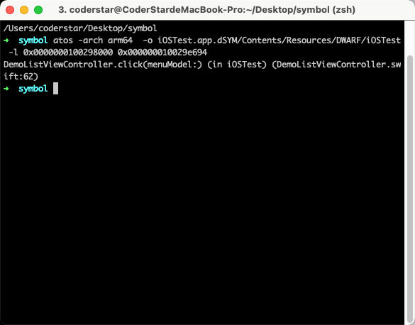

## 前言

Hi Coder，我是 CoderStar！

之前对于符号化的相关知识总是零零碎碎的，不成体系，刚好最近看到很多位同学发了一些关于 iOS 符号化的文章，整理这篇文章梳理一下 iOS 符号化的相关知识。我对符号化还处于初级阶段，文中很多知识来源于下面的参考资料，感谢各位同学的分享。

符号化从通俗意义上讲就是把一些机器语言可以转化成人类可读的符号，而在这里的环境下就是指 iOS 或者 Mac OS 下的一些异常信息（十六进制符号表示）通过某些手段转化成开发人员可读的高级代码片段，从而进一步定位异常的来源，迅速修复。

符号化程度一般会分为三种：

- 未符号化
- 部分符号化
- 完全符号化


符号化一般情况会需要下面三个部分

- 崩溃日志
- dSYM 文件
- 符号化工具

## 崩溃日志

崩溃日志的获取有多种来源，包括以下几种：

- 通过`设置-隐私-分析与改进-分析数据`导出，这个区域可以获取到整部手机的一些异常信息，是`Jetsam`机制产生的，格式为`.ips`，需要注意该位置不一定能拿到所有 APP 的异常日志；
- 测试机直接导出，`Xcode -> Window-Devices and simulators -> View Device Logs`(左侧工具栏选中你要导出的目的设备)，导出文件格式为`.crash`，其实这种方式读取到的日志文件来源还是来自上面第一条的；
- 通过`Xcode-Organizer-Crashes`获取崩溃日志，格式为`.xccrashpoint`，打开其包内容，其实内部还是文件格式为`.crash`的日志文件；
- 代码中捕获异常并进行存储上报，可借助三方工具或者自研，常见三方工具包括 Bugly、友盟等。

其实上述几种方式大致可以分为两种

- Crash Log：完整的崩溃日志文件；
- 异常信息：只上报关键的错误信息，包含堆栈等；

对于第二种方式，我们一般是需要在代码中自己去捕获异常的，捕获的方式一般包含两种，其中不管是哪种方式，对我们最重要的信息还是错误堆栈。

* `NSSetUncaughtExceptionHandler`
* `signal`

其中`NSSetUncaughtExceptionHandler`值可以捕获到 OC 的异常，Swift 的异常是捕获不到的，一般情况下在捕获 NSException 异常后同时也会捕获到一个对应的 signal 异常，当然，这也是一般情况，特殊情况下是有可能没有的。

下列给出简单的代码示例，实际的使用要比这个复杂很多，包含获取`Slide Address`，异常捕获的传递等等。

### NSSetUncaughtExceptionHandler

```swift
NSSetUncaughtExceptionHandler(CrashHandler.exceptionHandler)

private static let exceptionHandler: @convention(c) (NSException) -> Void = { exception in
   /// 异常堆栈
  let arr = exception.callStackSymbols
  /// 异常原因
  let reason = exception.reason
  /// 异常名称
  let name = exception.name.rawValue
}
```

### signal

```swift
signal(SIGTRAP, CrashHandler.signalHandler)
signal(SIGABRT, CrashHandler.signalHandler)
signal(SIGSEGV, CrashHandler.signalHandler)
signal(SIGBUS, CrashHandler.signalHandler)
signal(SIGILL, CrashHandler.signalHandler)

private static let signalHandler: @convention(c) (Int32) -> Void = { signal in
  /// 异常堆栈
  for symbol in Thread.callStackSymbols {

  }
  exit(signal)
}
```

介绍几个开源的异常捕获工具：

- [KSCrash](https://github.com/kstenerud/KSCrash)
- [plcrashreporter](https://github.com/microsoft/plcrashreporter)
- [CrashKit](https://github.com/kaler/CrashKit)

## dSYM 文件

**DWARF**

`DWARF(Debuging With Arbitrary Record Format)` 是 `ELF` 和 `Mach-O` 等文件格式中用来存储和处理调试信息的标准格式。其内部数据是高度压缩的，可以通过 `dwarfdump`、`otool` 等命令提取其中的可读信息。通过 `MachOView` 打开 `DWARF` 后会发现其外层依旧是 `Mach-O` 格式。其中 `debug_info`、`debug_line`这两个 `section` 中存储了主要的调试信息。

> ELF、Mach-O 分别是 Linux 和 Mac OS 平台用于存储二进制文件、可执行文件、目标代码和共享库的文件名称。

**dSYM**

iOS 平台中， `dSYM` 文件是指具有调试信息的目标文件，dSYM 中存储着文件名、方法名、行号等信息，是和可执行文件的 16 进制函数地址一一对应的，通过分析崩溃的崩溃文件可以准确知道具体的崩溃信息。

`Build Settings` -> `Debug Information Format`中可以设置调试信息的形式，其有两个选项，

- `DWARF`
- `DWARF DWARF With dSYM File`

一般情况下我们`Debug环境下`使用`DWARF`方式，方便我们进行调试，那对于`Release`环境我们使用第二种方式，选择第二种方式便可以将符号表从二进制文件中进行剥离，改为使用 dSYM 文件进行存储。开启之后我们就可以在 Xcode 打包出来的文件 xcarchive 里面看到它。另外，如果开启了 bitcode 优化的话，苹果会做二次编译优化，所以最终的 dSYM 就需要在 Apple Connect 手动下载了。

dSYM 文件对于符号化过程非常重要，所以我们每次发版之后应该尽量将 dSYM 文件进行备份保存。

## 符号化流程

在介绍符号化工具之前，我们先简单了解一下符号化的一个大致原理。


### 获取到崩溃日志 App 关键行信息

不管是完整的崩溃文件还是堆栈信息，我们最终需要的其实是关键的崩溃行信息，长下面这样

```txt
// 没有显示的堆栈信息
3 iOSTest  0x000000010029e694 iOSTest + 26260

// 显示偏移量的堆栈信息
3 iOSTest 0x000000010029e694 0x0000000100298000 + 26260
```

### 获取到偏移量、运行时堆栈地址、运行时 APP 起始地址

我们拿显示偏移量的堆栈信息举例，

- 3：信息位于堆栈索引
- iOSTest：包名
- 0x000000010029e694：运行时堆栈地址（stack address），16 进制
- 0x0000000100298000：应用堆栈在操作系统堆栈中的起点（load address），16 进制
- +26260：以 load address 为起点算起的偏移量（symbol address），10 进制

上述三个地址之间的关系为 **symbol_address = stack_address - load_address**

>  iOS 加载 Mach-O 文件时为了安全使用了 ASLR(Address Space Layout Randomization) 机制，导致二进制 Mach-O 文件每次加载到内存的首地址都会不一样，但是计算规则是一致的，如上图所示。

### 获取 dSYM 起始地址

`otool -l iOSTest.app.dSYM/Contents/Resources/DWARF/iOSTest | grep __TEXT -C 5`

执行命令后，结果如下，可以看到 dSYM 中代码段起始地址为 0x0000000100000000，一般情况下都为这个值。


### 计算崩溃地址对应 dSYM 符号表中的地址

- dSYM 起止地址：0x0000000100000000，16 进制
- 函数偏移量：26260，10 进制

所以我们可以拿到 stack address（0x000000010029e694） 在 dSYM 中对应的地址为 **0x0000000100000000 + 26260 = 0x100006694**

### 获取到具体的函数 / 行数 / 文件

**使用 dwarfdump**

```shell
dwarfdump --arch arm64 --lookup 0x100006694 iOSTest.app.dSYM

或者

dwarfdump iOSTest.app.dSYM --lookup 0x100006694
```

**使用 atos**

使用这种方式，我们不需在手动计算崩溃地址对应 dSYM 符号表中的地址，

```shell
## 0x0000000100298000为 load address
## 0x000000010029e694为 symbol address
atos -arch arm64  -o iOSTest.app.dSYM/Contents/Resources/DWARF/iOSTest -l 0x0000000100298000 0x000000010029e694
```



**使用 DSYMTools**

我们还可以使用开源的[DSYMTools](https://github.com/answer-huang/dSYMTools)，其内部也是使用了atos。


## 符号化相关工具

根据上面的符号化流程，我们用到了下列工具。

### dwarfdump

Crash Log 中会携带一个 UUID（由 32 个字符组成），位置位于`Binary Images`处，APP 二进制内部也会有一个 UUID，dSYM 也会有一个 UUID，三个对应起来才可以正常解析，否则会解析失败，所以当解析失败时应首先检查三者的 UUID 是否一致。

```shell
# 使用示例
dwarfdump -h

# 查看 xx.app 文件的 UUID
dwarfdump --uuid xx.app/xx

# 查看 xx.app.dSYM 文件的 UUID
dwarfdump --uuid xx.app.dSYM

# 导出debug_info 的信息到文件 debug_line.txt 中
dwarfdump --debug-info xx.app.dSYM > debug_info.txt

#  出debug_line 的信息到文件 debug_line.txt 中
dwarfdump --debug-line xx.app.dSYM > debug_line.txt

dwarfdump --arch arm64 --lookup 0x100006694 iOSTest.app.dSYM
```

如果设备上 dSYM 文件很多，可以通过下列命令查找指定 UUID 对应 dSYM 位置

```shell
# UUID改为实际的UUID，并且UUID需要格式转换（增加'-')
mdfind "com_apple_xcode_dsym_uuids == UUID"
```

### symbolicatecrash

Xcode 提供的 `symbolicatecrash`。该命令位于：`/Applications/Xcode.app/Contents/SharedFrameworks/DVTFoundation.framework/Versions/A/Resources/symbolicatecrash`，是一个`perl`脚本，里面整合了逐步解析的操作（也可以将命令拷贝出来，直接进行调用）。

使用方式为

```shell
export DEVELOPER_DIR="/Applications/XCode.App/Contents/Developer"
symbolicatecrash log.crash -d xxx.app.dSYM > symbol.log
```

优点：能非常方便的符号化整份 crash 日志。
缺点：
- 耗时比较久。
- 粒度比较粗，无法符号化特定的某一行。

### atos

atos 命令将十六进制地址转换为源代码中可识别的函数名称和行号

```shell
atos -arch <Binary Architecture> -o <Path to dSYM file>/Contents/Resources/DWARF/<binary image name> -l <load address> <address to symbolicate>

// explain parameters
load adress:可执行指令部分相对镜像文件中的起始加载地址
address to symbolicate：调用函数的地址


atos -o xxx.app.dSYM/Contents/Resources/DWARF/xxx -l 0x00000001c4fe7000 -arch arm64

atos -arch arm64 -o  xxx.app.dSYM/Contents/Resources/DWARF/xxx -l 0x00000001c4fe7000 0x00000001a2d6e29c
```

### 其他

不管是 symbolicatecrash 还是 atos 都有两个问题：

- 都仅仅是单机的工具，无法作为在线服务提供；
- 必须依赖 macOS 系统，这对于部署到 Linux 系统上的符号化服务很不友好；

[atosl](https://github.com/facebookarchive/atosl)

基于 golang 原生的系统库 debug/dwarf，可以实现对 DWARF 文件的解析，将地址解析为符号，可以替换 llvm-atosl 的实现，并且可以天然利用 golang 协程的特性实现高并发

## 其他

### 如何符号化系统库符号

符号化自己 App 的方法名，需要编译生成的 dSYM 文件。而要将系统库的符号化为完整的方法名，也需要 iOS 各系统库的符号文件。

## 在线符号化

## 最后

新的一周要更加努力呀！

Let's be CoderStar!

参考资料

- [你真的了解符号化么？](https://mp.weixin.qq.com/s/6Odq8JTYXL0bA8xyWEO1Og)
- [iOS 符号解析重构之路](https://mp.weixin.qq.com/s/TVRYXhiOXIsMmXZo9GmEVA)
- [iOS 符号化：基础与进阶](https://mp.weixin.qq.com/s/iRxvrOsEdW1wPZ3tSPKeIg)
- [iOS 崩溃日志在线符号化实践](https://mp.weixin.qq.com/s/MIun-eV4_J1hXGDRjGoLaw)
- [漫谈iOS Crash收集框架](http://www.cocoachina.com/articles/12301)
