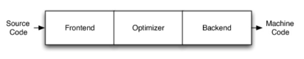
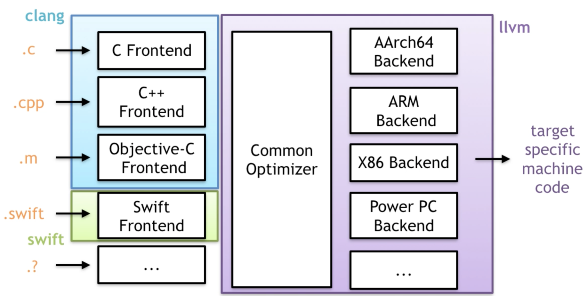
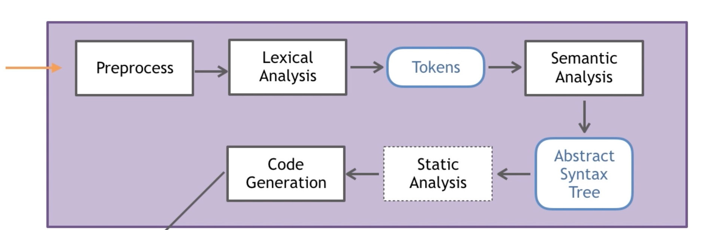
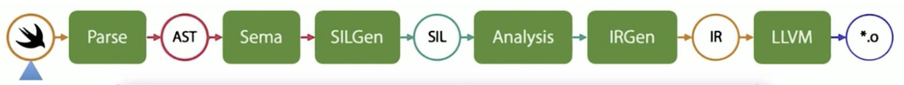
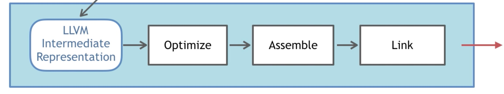

## 前言

一般的编译器都是由三部分构成，从源码到机器码基本上都要经过这三部分。

- 编译器前端 (FrontEnd): 词法分析，语法分析，语义分析，将源代码抽象为语法树 AST，继而生成中间代码 IR；
- 优化器 (Optimizer): 对得到的中间代码 IR 进行优化；
- 编译器后端 (BackEnd): 将得到的中间代码转化为各平台的机器码，如 x86，ARM 等。



从 GCC 到 LLVM 以及大部分编译器都是这种结构。

## LLVM 历史

早期 iOS 选用的是当时一家独大的 GCC 编译器作为 OC 语言的前端，但是随着时间的推移，Apple 为 OC 增加了很多特性，想要 GCC 给与实现，但是 GCC 却并没有支持，并且 GCC 本身代码耦合度较高，模块独立性比较差，并且《GCC 运行环境豁免条款》从根本上限制了 LLVM-GCC 的开发。这种背景下，Apple 就想找到一个高效、模块化的且开源的替换品，LLVM 进入了苹果的视线。

LLVM 最早来源于伊利诺伊大学厄巴纳 - 香槟分校维克拉姆·艾夫（Vikram Adve）与克里斯·拉特纳（Chris Lattner）的研究，本来目的是写一个底层的虚拟机，这也是 LLVM 名字的由来（Low Level Virtual Machine）。LLVM 是以 BSD 授权来发展的开源软件。在进入到苹果视线后，苹果公司并邀请 Chris Lattner 及其团队加入苹果，并为 LLVM 提供赞助支持。

> Chris Lattner 是一个名副其实的大神，LLVM 之父，Swift 之父，Clang 主要贡献者。2005-2017 年供职苹果，前开发部高级总监，架构师；2017.1-2017.6，担任特斯拉软件副总裁，负责自动驾驶。2017.8-2020.1，加入 Google Brain 团队，加入后编写了 Swift 版的 TensorFlow。目前加入芯片创业公司 SiFive 负责其平台工程。

iOS 在 Xcode 5 版本前使用的是 GCC ，在 Xcode 5 中将 GCC 彻底抛弃，替换为了 LLVM ，这期间也是慢慢过渡过来的，由开始使用 GCC 编译 ->GCC 与 LLVM 共存 ->LLVM 编译器。

## LLVM

LLVM 广义上是指整个 LLVM 架构，也就是整个编译器三部分，但是狭义上讲，是指 LLVM 后端。



如图所示，不同的前端后端使用统一的中间代码 LLVM Intermediate Representation (LLVM IR)，如果需要支持一种新的编程语言，那么只需要实现一个新的前端，如果需要支持一种新的硬件设备，那么只需要实现一个新的后端，优化阶段是一个通用的阶段，它针对的是统一的 LLVM IR，不论是支持新的编程语言，还是支持新的硬件设备，都不需要对优化阶段做修改。

主要子项目：

- LLVM 核心库
- 编译器前端 Clang
- LLDB
- libc ++ 和 libc++
- lld

### Clang

Clang 是 LLVM 项目的一个子项目，是 C 系列 (C、C++、OC) 的编译器前端。相对于 GCC，Clang 具有以下优点

- 编译速度快：在某些平台上，Clang 的编译速度显著的快过 GCC(Debug 模式下编译 OC 速度比 GGC 快 3 倍)
- 占用内存小：Clang 生成的 AST 所占用的内存是 GCC 的五分之一左右
- 模块化设计：Clang 采用基于库的模块化设计，易于 IDE 集成及其他用途的重用
- 诊断信息可读性强：在编译过程中，Clang 创建并保留了大量详细的元数据 (metadata)，有利于调试和错误报告
- 设计清晰简单，容易理解，易于扩展增强

**主要流程**


- 预处理（Pre-process）：include 扩展、标记化处理、去除注释、条件编译、宏删除、宏替换。 对`C`输出`.i`, 对`C++`输出 `.ii`, 对 OC 输出 `.mi`, 对`Objective-C++ `输出 `.mii`；
- 词法分析 （Lexical Analysis）：将代码切成一个个 token，比如大小括号，等于号还有字符串等，**输出 token 流**。是计算机科学中将字符序列转换为标记序列的过程；
- 语法分析（Semantic Analysis）：验证语法是否正确，然后将所有节点组成**抽象语法树 AST** 。由 Clang 中 Parser 和 Sema 配合完成；
- 静态分析 / 语义分析（Static Analysis）：使用它来表示用于分析源代码以便自动发现错误；
- 中间代码生成（Code Generation）：开始 IR 中间代码的生成了，CodeGen 会负责将语法树自顶向下遍历逐步翻译成 LLVM IR。

### SwiftC

SwiftC 是 Swift 语言的编译器前端。

**主要流程**



* Parse ：解析器是一个简易的递归下降解析器（在 lib/Parse 中实现），并带有完整手动编码的词法分析器。通过 parse 进行词法分析；
* Semantic Analysis：语义分析阶段（在 lib/Sema 中实现）负责获取已解析的 AST（抽象语法树）并将其转换为格式正确且类型检查完备的 AST，以及在源代码中提示出现语义问题的警告或错误。语义分析包含类型推断，如果可以成功推导出类型，则表明此时从已经经过类型检查的最终 AST 生成代码是安全的；
* Clang Importer:Clang 导入器（Clang Importer）：Clang 导入器（在 lib/ClangImporter 中实现）负责导入 Clang 模块，并将导出的 C 或 Objective-C API 映射到相应的 Swift API 中。最终导入的 AST 可以被语义分析引用。
* SIL 生成（SIL Generation）：Swift 中间语言（Swift Intermediate Language，SIL）是一门高级且专用于 Swift 的中间语言，适用于对 Swift 代码的进一步分析和优化。SIL 生成阶段（在 lib/SILGen 中实现）将经过类型检查的 AST 弱化为所谓的「原始」SIL（Raw SIL）。SIL 的设计在 docs/SIL.rst 有所描述。这个过程生成 RAW SIL（原生 SIL，代码量很大，不会进行类型检查，代码优化）
* SIL 保证转换（SIL Guaranteed Transformations）：SIL 保证转换阶段（在 lib/SILOptimizer/Mandatory 中实现）负责执行额外且影响程序正确性的数据流诊断（比如使用未初始化的变量）。这些转换的最终结果是「规范」SIL（Canonical SIL）。
* SIL 优化（SIL Optimizations）：SIL 优化阶段（在 lib/Analysis、lib/ARC、lib/LoopTransforms 以及 lib/Transforms 中实现）负责对程序执行额外的高级且专用于 Swift 的优化，包括（例如）自动引用计数优化、去虚拟化、以及通用的专业化。通过`-emit-sil`命令生成优化过后的 `SIL Opt Canonical SIL`。这个也是我们一般阅读的 SIL 代码；

Swift 引入 SIL 的目的是希望弥补一些 Clang 编译器的缺陷，如无法执行一些高级分析，可靠的诊断和优化。

Swift 编译过程引入 SIL 有几个优点：

- 完成的变数程序的语义 (Fully represents program semantics );
- 既能进行代码的生成，又能进行代码分析 (Designed for both code generation and analysis );
- 处在编译管线的主通道 (Sits on the hot path of the compiler pipeline );
- 架起桥梁连接源码与 LLVM，减少源码与 LLVM 之间的抽象鸿沟 (Bridges the abstraction gap between source and LLVM)

[swift-compiler](https://www.swift.org/swift-compiler/)

### IR

LLVM IR 有三种表示形式。

- text: 便于阅读的文本格式，类似于汇编语言，拓展名`.ll`；
- bitcode: 二进制格式，拓展名`.bc`；
- memory: 内存格式

### LLVM 后端

**主要流程**



- 优化（Optimize）：LLVM 会去做些优化工作；在 Xcode 的编译设置里也可以设置优化级别 -01，-03，-0s；优化级参数位于参数位于`Build Settings` -> `Apple Clang - Code Generation` ->`Optimization Level`。是利用 LLVM 的 Pass 去处理的，我们可以自己去自定义 Pass。
- 生成目标文件（Assemble）：生成 Target 相关 Object(Mach-o)；
- 链接（Link）：生成 Executable 可执行文件。

### 相关命令

**clang**

```shell
// 假设原始文件为LLVMOC.m

// 预编译命令
clang -E LLVMOC.m -o LLVMOC.mi

// 生成AST语法树
clang -Xclang -ast-dump -fsyntax-only LLVMOC.m

// 生成IR中间代码
clang -S -emit-llvm LLVMOC.m -o LLVMOC.ll

// 生成IR中间代码并优化，
clang -O3 -S -emit-llvm LLVMOC.m -o LLVMOC.ll

// 如果开启bitcode，生成.bc文件，这也是中间码的一种形式
clang -emit-llvm -c LLVMOC.m -o LLVMOC.bc

// 产生汇编命令
clang -S LLVMOC.m -o LLVMOC.s

// 生成目标.O文件
clang -c LLVMOC.m -o LLVMOC.o

```

**swiftc**

我们可以利用`swiftc -h`命令查看`swiftc`支持的一些命令，下面简单介绍一下支持的`Modes`。

```swift
// 假设原始文件为LLVMSwift.swift

// 对原始文件进行操作，xxx表示操作后缀
swiftc maLLVMSwiftin.swift xxx

// 解析文件
-parse

// 分析输出AST
-dump-parse

// 语法和类型检查，打印AST语法树
-dump-ast

// 转储有关预编译Clang模块的调试信息
-dump-pcm

// 解析文件并打印（漂亮/简洁的）语法树
-print-ast

// 解析import导入的文件
-resolve-imports

// 检查文件类型
-typecheck

// 输出一个.sib的原始SIL文件
-emit-sibgen

// 输出一个.sib的标准SIL文件
-emit-sib

// 生成中间体语言（SIL），未优化
-emit-silgen

// 生成中间体语言（SIL），优化后的
-emit-sil

// 生成LLVM中间体语言 （.ll文件）
-emit-ir

// 生成LLVM中间体语言 （.bc文件）
-emit-bc

// 生成汇编
-emit-assembly

// 输出一个可执行文件
-emit-executable

// 展示导入的模块列表
-emit-imported-modules

// 输出一个dylib动态库
-emit-library

//  输出一个.o机器文件
-emit-object

//  从模块映射中输出预编译Clang模块
-emit-pcm

// 为源文件生成索引数据
-index-file

// 生成优化后的中间体语言（SIL）,并将结果导入到LLVMSwift.sil文件中
swiftc LLVMSwift.swift -emit-sil  -o LLVMSwift.sil

// 生成优化后的中间体语言（SIL），并将sil文件中的乱码字符串进行还原，并将结果导入到LLVMSwift.sil文件中
swiftc LLVMSwift.swift -emit-sil | xcrun swift-demangle > LLVMSwift.sil

// 编译生成可执行.out文件
swiftc -o LLVMSwift.o LLVMSwift.swift

```

## 扩展一下

既然讲到了 LLVM，那就顺便讲一下 BitCode，上文也讲到了 BitCode 其实就是 IR 代码的一种编码形式。

需要说明的是 BitCode 是以 section 形式保存在可执行文件中。当我们把携带 BitCode 的 App 提交到 AppStore 后，苹果会提取出可执行文件中的 BitCode 段，然后针对不同的 CPU 架构编译和链接成不同的可执行文件变体 (Variant)，不同 CPU 架构的设备会自动选择合适的架构的变体进行下载。而在 BitCode 之前，我们都是把所有需要的 CPU 架构集合打包成一个 Fat Binary，结果就是用户最终下载的安装包之中有很多冗余的 CPU 架构支持代码。开启 BitCode 之后，编译器后端 (Backend) 的工作都由 Apple 接管。

BitCode 的一些具体说明及注意事项后面会在 iOS 瘦身优化中专门去讲解。
