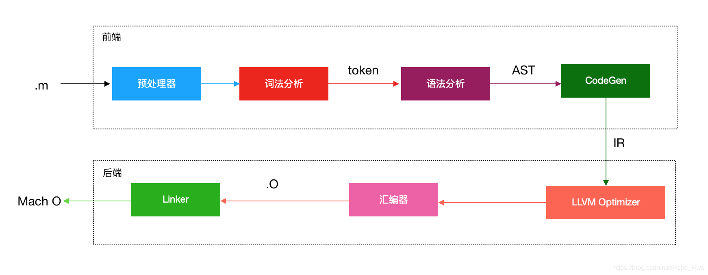

iOS 在 Xcode 5 版本前使用的是 GCC ，在 Xcode 5 中将 GCC 彻底抛弃，替换为了 LLVM 。
LLVM 包含了编译器前端、优化器和编译器后端三大模块。其中 Swift 除了在编译器前端和 Objective-C 稍有不同，其他模块都差不多。

除了 LLVM 之外类似的编译器：

- GCC
- Android NDK(Native Development Kit)。如 Dart 虚拟机，会在设备中生成 JIT 编译优化的本地代码。iOS 上，Dart 代码则由 LLVM 编译来成为本地可执行文件（AOT）

LLVM 是编译器工具链的集合。其中包括三部分

- 编译器前端：词法分析，语法分析，语义分析，生成中间代码。
- 优化器：中间代码（Intermediate Representation，简称IR）优化。
- 编译器后端：生成对应架构平台的机器码。如 x86，ARM 等。

整个流程如下

对于